# RedEye sip2api Gateway

### Code Blue / RRT Notification Gateway

**_SIP in. Page out. Every time._**

---

|  |  |
|---|---|
| **Product build** | v1.6.5+ (build `c23f3eb`, the v1.7 line) — current production |
| **Document version** | 2.0 |
| **Date** | July 07, 2026 |
| **Prepared by** | RedEye Network Solutions LLC, in conjunction with Claude Code |
| **Prepared for** | Tift Regional Medical Center **and** RedEye Support (shared) |
| **Classification** | Confidential — shared between RedEye and the named customer |

_This is a single, shared deliverable — the customer and RedEye support receive the same document in full._


\newpage

# Document Control

## About this document

This is the official product manual for the **RedEye sip2api Gateway** (Code Blue / RRT Notification Gateway). It is a **single, shared deliverable**: the customer (Tift Regional Medical Center) and the RedEye Network Solutions support team receive the **same** document, in full — no separate "internal" edition, nothing withheld between the parties.

| Field | Value |
|---|---|
| Product | RedEye sip2api Gateway |
| Product build described | **v1.6.5+ (build `c23f3eb`)** — the in-progress v1.7 line, current production |
| Document version | **2.0** |
| Date | July 07, 2026 |
| Prepared by | RedEye Network Solutions LLC, in conjunction with Claude Code |
| Prepared for | Tift Regional Medical Center **and** RedEye Support (shared) |
| Classification | Confidential — shared between RedEye and the named customer |

## Scope & version note

This edition documents the product **as currently deployed in production** — build `c23f3eb` (branch `main`), which is **v1.6.5 plus 6 commits** on the unreleased **v1.7** line. The As-Built section is a live inventory of the production host captured **2026-07-07**. Where features are still in development (High-Availability, zero-downtime restarts, remaining Dashboard-v2 and dedupe/logging items), they appear only in the **High-Availability Plan** and **Roadmap** sections, clearly marked as *planned*.

## Regeneration & cadence

This manual is produced by a repeatable, in-repository documentation pipeline (the `product-docs` skill) and is **regenerated on each release**. Each regeneration refreshes the modular source sections and the live host As-Built inventory, recompiles the `.md` and `.docx`, and appends a row to the revision history below. The compiled deliverable is published as a **versioned release asset**.

## Revision history

| Doc ver. | Product build | Date | Author | Summary of changes |
|---|---|---|---|---|
| 1.0 | v1.5.1 | 2026-07-02 | RedEye + Claude Code | Initial edition — documented the v1.5.1 single-service deployment. |
| **2.0** | **v1.6.5+ (`c23f3eb`)** | July 07, 2026 | RedEye + Claude Code | Regenerated against the current production build: two-service topology, durable delivery (outbox + retries + escalation), watchdog, real health + inbound-liveness, enforcing dedupe, RFC3339/UTC timestamps, Dashboard v2. Reliability content moved from "roadmap" to "current"; roadmap re-scoped to the open items (HA, zero-downtime restarts, etc.). As-Built refreshed from a live host inventory. |

## A note on safety-critical use

The RedEye sip2api Gateway participates in a **life-safety** notification path (Code Blue / RRT overhead paging). Operators and support staff should read the **Reliability, Delivery Guarantees & Known Limitations** section in full and understand the governing principle: *a duplicate overhead page is acceptable; a missed page is never.*


\newpage

# Glossary & Terminology

This glossary defines the SIP, networking, clinical, and platform terms used throughout the **RedEye sip2api Gateway** manual. It is written for a mixed audience — clinical/telecom staff and IT/network engineers at Tift Regional Medical Center, plus RedEye support — so every entry defines its jargon in plain language and, where useful, ties the term to how the gateway actually uses it.

Unless a term is explicitly labeled **(roadmap)** or **(planned)**, every definition below describes **current production behavior in product v1.5.1**. Terms that belong to the in-progress v1.6.0 reliability release or the future high-availability (HA) design are labeled as such and are **not** current behavior.

> **One-sentence orientation:** A Rauland nurse-call station places a **SIP INVITE** to the gateway; the gateway answers, reads the caller's area/room/bed and call purpose, builds a spoken (**TTS**) message, and triggers an **InformaCast Fusion** overhead page — "SIP in, page out."

---

## Conventions used in this glossary

- **(roadmap)** / **(planned)** — a v1.6.0 or HA capability that is designed or partially coded but **not** part of the deployed v1.5.1 behavior.
- `<CLIENT_ID>` / `<CLIENT_SECRET>` — placeholders. Real OAuth2 credential values never appear in this manual.
- **Northbound** — traffic from the gateway *up* to InformaCast Fusion (HTTPS/443). **Southbound** — traffic from Rauland *down* to the gateway (SIP/5060).

---

## A

**ACK**
: The third message of the SIP three-way INVITE handshake (INVITE → 200 OK → **ACK**). The caller sends ACK to confirm it received the gateway's `200 OK`, finalizing the dialog. In this gateway the ACK is effectively a formality: the gateway answers and immediately tears the call down (see **Immediate-BYE**).

**Allowlist (IP allowlist)**
: The set of source networks permitted to send SIP to the gateway, expressed in CIDR notation. In production the allowlist is `172.16.0.0/12`. Any SIP packet from outside the allowed networks is rejected with `403 Forbidden` and dropped before processing. This is the gateway's primary southbound access control.

**Area**
: The first numeric field parsed from the SIP caller username (`a{area}`), identifying the physical zone the alert came from (e.g. area `730` → "1st Floor. E.D."). Areas are translated to spoken location text via the `areas` table in **lookups**. Unknown areas fall back to `default_area` ("Unknown Area.").

**Area/room/bed**
: The three-part location identity encoded in the SIP caller username as `a{area}*r{room}*b{bed}` (bed optional). Parsed by the gateway into a `CallerInfo` record and turned into human-readable location text for the page. Example username `a730*r201` → area 730, room 201, no bed.

**Audience (OAuth2)**
: A parameter in the OAuth2 token request identifying the target API tenant — here, the Fusion **provider ID** (a customer-owned UUID from the Fusion admin console). It scopes the issued token to Tift's Fusion provider.

## B

**Bed**
: The optional third location field (`b{bed}`) in the SIP caller username, identifying a specific bed within a room. Omitted when the nurse-call station is not bed-specific.

**BYE**
: The SIP request that ends an established call/dialog; the receiver answers `200 OK`. The gateway sends a BYE almost immediately after answering (see **Immediate-BYE**) because it needs no live audio — it only needs the INVITE's caller data to fire a page.

## C

**Call-ID**
: A globally-unique SIP header identifying a single call/dialog; every message in one call (INVITE, ACK, BYE) carries the same Call-ID. The gateway uses it to correlate messages of one transaction in logs. *(roadmap: in the HA design, Call-ID is the persistence key that pins one call to one gateway node.)*

**CANCEL**
: A SIP request that aborts an INVITE **before** it has been answered. The gateway responds `200 OK` and cleans up any pending call state.

**Code Blue**
: The highest-acuity clinical alert this gateway carries — a patient in cardiopulmonary arrest requiring an immediate resuscitation response. Encoded in the SIP display name (keyword "Blue") and mapped to the spoken label "Code Blue." The gateway's core reliability principle exists for this event: **a duplicate page is acceptable; a missed page is never acceptable.**

**CSeq (Command Sequence)**
: A SIP header pairing a sequence number with a method name (e.g. `1 INVITE`, `2 BYE`); it orders requests within a dialog and matches responses to requests.

## D

**Dialog**
: A peer-to-peer SIP relationship between two endpoints, established by a successful INVITE/200 OK/ACK exchange and identified by the Call-ID plus the From and To tags. The gateway establishes a dialog only long enough to answer and immediately end it.

**Display name**
: The human-readable label in the SIP `From` header, before the `<sip:...>` URI (e.g. `"Code Blue Rm 201"`). The gateway substring-matches it against the **call_purposes** table to determine the alert type (Code Blue / RRT / Code Pink).

**Duplicate INVITE**
: A repeated INVITE for the same clinical event, commonly seen here because the Rauland source **double-emits** — roughly one-third or more of events arrive as duplicates. This is expected upstream behavior, **not** a gateway defect. Consistent with the at-least-once principle, the gateway currently delivers each INVITE it receives (a duplicate page is preferred over a missed one). *(roadmap: v1.6.0 adds shadow-only clinical de-duplication telemetry — see **Dedupe**.)*

**Dedupe (clinical de-duplication)** *(roadmap, v1.6.0)*
: A planned observe-only feature that fingerprints the clinical `(area, room, bed, purpose)` tuple to *measure* how often true duplicate pages arrive. It ships inert (never suppresses a page) and is explicitly out of scope for v1.5.1, where no de-duplication occurs.

## E

**Event-ID / event correlation**
: An identifier used to tie together the log lines, database row, and page for a single nurse-call event. In v1.5.1 correlation is done through the SIP **Call-ID** and the database record for the call. *(roadmap: v1.6.0 introduces an explicit, stable INVITE transaction fingerprint (`v1:<hex>`) derived from Call-ID / From / CSeq for tighter correlation.)*

**Egress (northbound egress)**
: The gateway's outbound HTTPS connection on **port 443** to `api.icmobile.singlewire.com`, used to fetch OAuth2 tokens and trigger Fusion scenarios.

## F

**Fusion** → see **InformaCast Fusion**.

**`fusion_status`**
: The field recorded per call capturing the outcome of the northbound Fusion delivery. A successful trigger records the HTTP status; a delivery exception records **`fusion_status = -1`** with no durable retry in v1.5.1. The 2026-06-12 lost Code Blue is an example: a transient connect-timeout during the inline token fetch produced `fusion_status = -1`.

## I

**Immediate-BYE**
: The gateway's defining call-handling behavior: it answers the INVITE with `200 OK` and then **immediately sends a BYE** (no media exchanged, roughly one second end-to-end). The gateway needs only the INVITE's headers to build a page, so it does not hold the call open. This mirrors the Rauland nurse-call receiver's own behavior; the `call_timeout` is 1 second.

**INVITE**
: The SIP request that initiates a call. The Rauland station sends an INVITE to the gateway carrying the caller username (area/room/bed) and display name (purpose). The INVITE is the trigger for the entire page pipeline.

**InformaCast Fusion (Singlewire)**
: The mass-notification / overhead-paging platform (from vendor **Singlewire**) that actually broadcasts the audible page. The gateway is a *client* of Fusion: it authenticates via OAuth2 and triggers a pre-built **scenario** whose spoken content is the gateway-composed TTS string. Fusion base URL: `https://api.icmobile.singlewire.com/api`.

**IP allowlist** → see **Allowlist**.

## L

**Lookups (`lookups.yaml`)**
: The customer-owned translation tables that turn coded SIP fields into spoken English. Three tables: **areas** (area ID → location text), **call_purposes** (display-name keyword → alert label, e.g. "Blue" → "Code Blue"), and **area_rooms** / **rooms** (specific room mappings), each with a default fallback. Editing this file changes what the overhead page says without a code change.

## O

**OAuth2 client-credentials flow**
: The machine-to-machine authentication the gateway uses against Fusion. It POSTs a `<CLIENT_ID>` / `<CLIENT_SECRET>` plus the **audience** (provider ID) to the token endpoint and receives a bearer access token, which it then presents on the scenario-trigger call. No user is involved — the gateway *is* the client. In v1.5.1 the token is fetched **inline** on the page path (and refreshed once on a `401`); this inline fetch is one source of occasional multi-second deliveries and was implicated in the 2026-06-12 incident. *(roadmap: v1.6.0 moves token refresh to a background loop off the hot path.)*

**Outbox** *(roadmap, v1.6.0)*
: A planned durable, record-first delivery store: every page would be written to the database as `pending` **before** any network send, then driven through a retry/backoff state machine (`pending → delivering → delivered | failed | expired`) by a background worker. **This does not exist in v1.5.1** — today's delivery is a single inline attempt with no durable retry. The outbox is the central fix for the missed-page failure mode.

## P

**Proxy (SIP proxy)**
: The intermediary that forwards Rauland's SIP toward the gateway. In the production path the Rauland **UAC** (`172.20.9.170`) sends to a proxy (`172.20.9.176`), which is the actual packet source and `Contact` seen by the gateway (`10.249.0.60`). Knowing the proxy is the packet source matters for reading SIP logs and for the allowlist.

**Purpose (call purpose)**
: The clinical alert type of the event (Code Blue, RRT, Code Pink), determined by keyword-matching the SIP display name against the **call_purposes** table. An unrecognized purpose falls back to `default_purpose`.

## R

**Room**
: The second numeric field parsed from the SIP caller username (`r{room}`), identifying the room within an area. Rendered in the page as a mapped room name if one exists in **lookups**, otherwise as `default_room_format` ("Room {room}.").

**RRT (Rapid Response Team)**
: A clinical alert requesting a rapid-response team for a patient who is deteriorating but not yet in full arrest — a step below Code Blue. Encoded via the display-name keyword "RRT" → spoken label "Rapid Response Team."

**RTP (Real-time Transport Protocol)**
: The protocol that carries live audio in a normal SIP call. This gateway exchanges **no** meaningful audio — it answers and immediately ends the call (see **Immediate-BYE**), so RTP is not a functional part of v1.5.1 paging. (Where a silence stream is referenced elsewhere, it exists only to satisfy media negotiation, not to carry a page; the page itself is spoken by Fusion, not over RTP.)

## S

**Scenario / scenario-notification**
: A pre-configured notification template inside InformaCast Fusion. The gateway does not build the page's routing or audio path itself — it **triggers** the customer's scenario (name "SIPtoTTSBridge", id `4cba52d8-0d50-11f1-aba0-913f93e445e2`) via the scenario-notification API, passing the composed announcement into the scenario's `customTTS` field variable. Fusion then speaks it (voice "Joanna") to the "Tifton/TRMC/Main Hospital" device group.

**SDP (Session Description Protocol)**
: The small text block carried inside SIP INVITE/200 OK messages that describes the proposed media session (codecs, IP, ports). Because the gateway does immediate-BYE, SDP is negotiated as a formality and no real media session is used.

**SIP (Session Initiation Protocol)**
: The signaling protocol (RFC 3261) used to set up, modify, and tear down real-time sessions such as calls. Rauland uses SIP to *signal* a nurse-call alert to the gateway. The gateway binds SIP on `0.0.0.0:5060` over **both UDP and TCP**.

**Singlewire** → see **InformaCast Fusion**.

**SQLite**
: The embedded, file-based database (`/var/lib/sipgw/calls.db`) where the gateway records every processed call — timestamp, caller info, parsed area/room, the TTS string, and the Fusion result. It backs the dashboard's call history.

**systemd**
: The Linux service manager that runs the gateway as a single unit, `sipgw.service` (Type=simple, `Restart=always`, `RestartSec=5`), under the unprivileged `sipgw` user with hardening (`NoNewPrivileges`, `ProtectSystem=strict`, `PrivateTmp`) and `CAP_NET_BIND_SERVICE` so it can bind port 5060. systemd restarts the service automatically if it exits.

## T

**481 "Call Leg/Transaction Does Not Exist"**
: A specific, harmless SIP error occasionally seen from a **BYE-before-ACK** race — the gateway's immediate-BYE arrives before the caller's ACK, so the peer replies `481 Call Leg/Transaction Does Not Exist`. The page is still delivered; no action is needed. (This exact reason phrase is used consistently across the manual.)

**TTS (text-to-speech)**
: The spoken announcement. The gateway *composes the text* (e.g. "Attention! Attention! Code Blue! 1st Floor. E.D. Room 201. …") by combining the parsed purpose, area, and room via **lookups**, with configurable preambles and repetition; **Fusion** performs the actual speech synthesis (voice "Joanna") and broadcast.

## U

**UAC (User Agent Client)**
: The SIP endpoint that *originates* a request. Here the Rauland nurse-call system (`172.20.9.170`) is the UAC that emits the INVITE; the gateway acts as the receiving user agent (server side) for that call.

**UTC (timestamps)**
: All log and record timestamps are currently in **UTC**. The `logging.timezone` config value is present but **not applied**; the host clock runs UTC, so timestamps are UTC in effect. This is a known item. *(roadmap: v1.6.0 issue #12 introduces canonical RFC3339-`Z` UTC timestamps with host-local display.)*

## W

**Watchdog / heartbeat / real `/health`** *(roadmap, v1.6.0)*
: Planned liveness machinery — a writer heartbeat row, a systemd `Type=notify` watchdog, and a `/health` endpoint backed by that heartbeat. **Not present in v1.5.1.** Today the service relies on systemd `Restart=always` for recovery.

**WAL (Write-Ahead Logging)** *(roadmap, v1.6.0)*
: A SQLite journaling mode planned alongside the **outbox** to let a read-only dashboard read consistently while the writer commits. v1.5.1 does not run the database in WAL mode.

---

## Related reading

- **Overview & Architecture** — how these pieces fit together end to end.
- **Call Flow** — the step-by-step lifecycle of one INVITE → page.
- **Lookup Tables Reference** — the full `areas`, `call_purposes`, and room tables.
- **Troubleshooting** — reading `481`, duplicate INVITEs, and `fusion_status = -1` in the logs.

> **Roadmap note:** Terms marked **(roadmap)** / **(planned)** — Outbox, Dedupe, Watchdog/heartbeat/`/health`, WAL, background token refresh, RFC3339-Z timestamps, and HA — describe the in-progress v1.6.0 reliability release and future high-availability design. They are documented here for orientation only and do **not** reflect current v1.5.1 production behavior.


\newpage

# Executive Summary

The **RedEye sip2api Gateway** is a life-safety integration appliance that turns a nurse-call event into an overhead page — automatically, and reliably enough to trust with a Code Blue. When a clinician at Tift Regional Medical Center pulls a Code Blue or presses a Rapid Response button, the Rauland nurse-call system emits a **SIP INVITE**. The gateway answers that call, reads who and where from the SIP headers, composes a spoken announcement, and fires an **InformaCast Fusion** scenario that broadcasts it to the overhead IP speakers. No human retypes a room number, and no page waits on someone to notice a screen.

> **SIP in. Page out. Every time.**

## Why this product exists

Overhead notification for a Code Blue or RRT has one job and no acceptable failure mode: **a real page must never be dropped, duplicated, delayed, or sent to the wrong place.** The Rauland nurse-call system and InformaCast Fusion do not speak a common language — one talks SIP, the other a REST API behind OAuth2. Before this gateway, bridging them meant a fragile, best-effort hop with no memory: if the single outbound call to Fusion timed out, the page was simply gone, with nothing to retry it and no one alerted that it had vanished. That is exactly what happened on **2026-06-12**, when a Code Blue was lost to a momentary network timeout during an inline token fetch. That incident is the reason the current release exists, and it is the class of failure the current release is built to make impossible.

## What it does

The gateway sits on host `sip2apibridge` on the clinical network and runs continuously as two independent services so that the paging path is never at the mercy of the reporting UI:

- **The call-path service** (`sipgw.service`) receives every SIP INVITE, validates its source against an IP allowlist, parses the caller's area, room, and bed, resolves them to human-readable names, assembles the text-to-speech announcement, and drives its **durable delivery** to Fusion.
- **The dashboard service** (`sipgw-dashboard.service`) is a separate, read-only web UI on port 8080. It shows the live call history, a 90-day chart of calls by type, per-call detail correlated across every log stream, a date-picker log viewer, and a real health signal — and it can be restarted at any time **without interrupting a single page.**

A typical announcement, for a Code Blue in Room 201 of the E.D., is spoken to every configured speaker as: *"Attention! Attention! Code Blue! 1st Floor. E.D. Room 201."* — repeated three times.

## The reliability principle

The design rule behind every feature is **record-first, then deliver.** The instant a call is answered, the page is written to a durable, crash-safe database **before any attempt is made to send it.** Only then does a background delivery worker take over, sending the page to Fusion with **bounded retries and exponential backoff**, surviving a Fusion outage or even a process crash mid-send. If a page still cannot be delivered, it is **escalated to a human channel** rather than silently lost. The OAuth token that authorizes each send is refreshed in the background, off the critical path, so a real page never waits on a token round-trip — closing the exact gap that lost the 2026-06-12 Code Blue.

Two further guarantees round out the current production build:

- **Duplicate suppression, clinically signed off.** Rauland emits two INVITEs for roughly a third of events; the gateway now collapses those true duplicates within a **2-second** window, keyed to the specific bed and call purpose. The window is deliberately narrow and bed-aware: two patients coding in one room are never merged, an RRT and a Code Blue are never merged, and a genuine re-page more than two seconds later is always delivered. Every race resolves toward **delivery, never a wrongful drop**, and even a suppressed page is still recorded as an audit row.
- **Honest liveness.** A watchdog restarts the call-path service if its event loop ever hangs, and `/health` reports the real freshness of the writer's heartbeat, Fusion reachability, and how long it has been since the last inbound SIP message from Rauland — so "quiet" and "broken" are never confused.

Under it all sit non-negotiable safety invariants: test and dry-run traffic can **never** fire a real page or touch the production database, SIP is accepted only from the allowlisted clinical networks, and every credential is masked in the logs.

## Who it is for

This manual is a single shared deliverable for two audiences at once:

- **Tift Regional Medical Center** — the IT, telecom, and clinical staff who own, operate, and depend on the system.
- **RedEye Network Solutions** support — the engineers who install, monitor, and maintain it.

Both receive the same document, in full, with nothing withheld. It documents the **current production build** (`c23f3eb`, the v1.7 line). Features still in development — the high-availability epic, zero-downtime restarts, and OS-patch coordination — appear only in the clearly labeled **HA Plan** and **Roadmap** sections.

## Authoring credit

The RedEye sip2api Gateway and this manual were produced by **RedEye Network Solutions LLC, in conjunction with Claude Code.**


\newpage

# Product Overview & Key Concepts

> **RedEye sip2api Gateway** — "SIP in. Page out. Every time."
> Code Blue / RRT Notification Gateway.
> Built by RedEye Network Solutions LLC, in conjunction with Claude Code.
> This section documents the **current production build (`c23f3eb`, the v1.7 line — v1.6.5 + 6 commits)** deployed at Tift Regional Medical Center on host `sip2apibridge`.

---

## 1. What it is, at a glance

The RedEye sip2api Gateway is a small, single-purpose, **life-safety** appliance. It sits between the hospital's **Rauland Responder nurse-call system** and **Singlewire InformaCast Fusion**, the overhead mass-notification platform. Its one job is to turn a nurse-call emergency into an audible overhead page — reliably, every time.

When a clinician triggers a **Code Blue**, **Rapid Response Team (RRT)**, or **Code Pink** at a nurse-call station, the Rauland system dials the gateway as if it were a phone. The gateway is not a phone: it answers the call, reads the *who / where / what* out of the SIP signaling, builds a spoken announcement ("Code Blue... 4th Floor... I.C.U... Room 12..."), and hands that announcement to InformaCast Fusion, which broadcasts it over the hospital's overhead speakers.

In plain terms:

> **A nurse presses a Code Blue button. Seconds later, the overhead speakers announce it — with the unit and room spoken aloud. The gateway is the box that makes that happen.**

The product is deliberately narrow. It is not a PBX, not a full SIP stack, and not a general integration bus. It does exactly one path — **SIP INVITE in, Fusion overhead page out** — and it does that path durably.

### At-a-glance facts

| | |
|---|---|
| **Product** | RedEye sip2api Gateway (a.k.a. `sipgw`) |
| **Purpose** | Convert Rauland nurse-call SIP INVITEs into InformaCast Fusion overhead pages |
| **Deployed build** | `c23f3eb` (branch `main`, v1.7 line) |
| **Host** | `sip2apibridge` — Ubuntu 24.04.4, Python 3.12.3 |
| **Listens for SIP** | `10.249.0.60:5060` (UDP **and** TCP) |
| **Web dashboard** | `http://10.249.0.60:8080` (read-only, internal network) |
| **Upstream (in)** | Rauland UAC `172.20.9.170` → proxy `172.20.9.176` → gateway |
| **Downstream (out)** | InformaCast Fusion REST API (`https://api.icmobile.singlewire.com/api`), scenario `SIPtoTTSBridge` |
| **Supported call types** | Code Blue, Rapid Response Team (RRT), Code Pink — extensible via lookup tables |
| **Core promise** | A real emergency page is **never dropped**. Delivery is durable and retried. |

---

## 2. End-to-end value: from button-press to overhead page

The whole system exists to close one gap: the Rauland nurse-call world speaks **SIP**, and the InformaCast overhead-paging world speaks a **REST API**. Nothing off the shelf bridges the two with the reliability a Code Blue demands. The gateway is that bridge.

```mermaid
flowchart LR
    A[Clinician triggers Code Blue at nurse-call station] --> B[Rauland Responder places a SIP call]
    B --> C[sip2api Gateway answers on 5060]
    C --> D[Parse SIP headers for area room bed purpose]
    D --> E[Build spoken TTS announcement]
    E --> F[Record page durably in database]
    F --> G[Deliver to InformaCast Fusion via REST]
    G --> H[Fusion broadcasts overhead page]
    H --> I[Care team responds]
```

Each hop adds value:

- **Rauland → SIP.** The nurse-call system already knows how to place a SIP call when an alert fires. The gateway meets it there, on the wire the hospital already runs.
- **SIP → meaning.** The emergency's identity is encoded in the SIP `From` header — the *purpose* in the display name (e.g. "Blue"), and the *location* in the username (e.g. `a731r1200` → area 731, room 1200). The gateway parses this into a structured `CallerInfo`.
- **Meaning → speech.** Using site-specific **lookup tables** (`lookups.yaml`), the gateway translates codes into words a responder actually hears: area `731` becomes "4th Floor... I.C.U...", the purpose "Blue" becomes "Code Blue". The result is a clear, repeated, speech-ready announcement.
- **Speech → Fusion.** The announcement is delivered to the InformaCast Fusion scenario `SIPtoTTSBridge` via its REST API. Fusion owns the actual audio broadcast to the overhead speakers and to any subscribed devices.
- **Durability wraps all of it.** The page is written to a durable store **before** any network call, so a Fusion hiccup, a token timeout, or a process crash cannot silently swallow it.

---

## 3. Key concept: the paging path — nurse-call → SIP → TTS → Fusion

The paging path is the heart of the product. It runs entirely inside the writer process (`sipgw.service`), and it is the path everything else is built to protect.

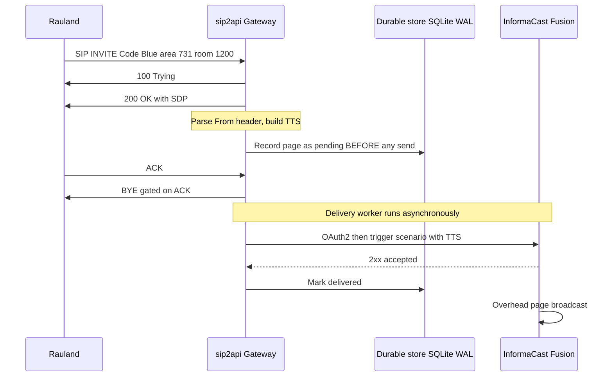

The stages, in order:

1. **Ingress (SIP).** Rauland sends a SIP `INVITE` to `10.249.0.60:5060` (UDP or TCP). The gateway runs a purpose-built, lightweight SIP handler (only `INVITE` / `ACK` / `BYE` / `CANCEL` / `OPTIONS`) — chosen over a full SIP stack for zero native dependencies and full behavioral control. The source IP is checked against the **SIP allowlist** (`172.16.0.0/12, 127.0.0.0/8, 10.0.0.0/8`) before anything else happens.
2. **Answer.** The gateway replies `100 Trying`, then `200 OK` with SDP (advertising PCMU/8000). The call is answered like a real endpoint would.
3. **Parse.** The `From` header is decoded into a `CallerInfo`: **purpose** from the display name, **area / room / (optional) bed** from the username pattern `a{area}r{room}[b{bed}]`.
4. **Compose TTS.** The lookup tables convert the codes into a speech-ready string, which is then wrapped with a preamble and repeated for clarity on a noisy overhead system.
5. **Record durably.** The page is written to the SQLite database (WAL mode) in state `pending` — **this happens before any attempt to reach Fusion.** This is the durability boundary (see §5).
6. **Deliver asynchronously.** A background **delivery worker** picks up the pending row and delivers it to Fusion — authenticating via OAuth2 and triggering the `SIPtoTTSBridge` scenario with the TTS string as the payload. Retries and escalation apply if the first attempt fails.
7. **Broadcast.** Fusion accepts the trigger (2xx) and performs the actual overhead broadcast. The gateway marks the row `delivered`.

Crucially, **delivery is fully decoupled from the SIP call.** The gateway does not hold the phone call open waiting for Fusion. It answers Rauland immediately, records the page, tears the call down cleanly, and lets the delivery worker do the network work on its own schedule. A Fusion outage never backs up onto the SIP side, and a slow SIP teardown never delays a page.

---

## 4. Key concept: the immediate-BYE model (ACK-gated teardown)

Because the gateway does not need to keep an audio channel open — Fusion, not the SIP call, carries the announcement — it uses an **immediate-BYE** model in production. As soon as it has answered (`200 OK`) and dispatched the page, it wants to hang up the SIP call and free the resource.

The subtlety is *when* it hangs up. Earlier behavior sent the gateway's `BYE` in the same instant as the `200 OK`, which could race ahead of the caller's `ACK` and reach the proxy before the three-way handshake finished — drawing a **`481 Call Leg/Transaction Does Not Exist`**. The current build fixes this by **gating teardown on the ACK**:

- After the `200 OK`, the gateway **keeps** the call and **fires the page immediately** (decoupled — the page never depends on the ACK, BYE, or any teardown outcome).
- The gateway's `BYE` is **deferred until the caller's `ACK`** confirms the handshake, guaranteeing correct `INVITE → 200 → ACK → BYE` ordering with no 481.
- A **lost-ACK fallback timer** (`immediate_bye_ack_timeout_seconds`, default 2.0s) tears the call down anyway if the ACK never arrives, so a dropped ACK cannot leave a call stuck.
- All teardown paths — **ACK arrives, fallback fires, peer BYE, or shutdown** — funnel through one idempotent teardown that sends the `BYE` exactly once and frees the RTP port exactly once. A duplicate ACK or an ACK/fallback race can never double-send.

The governing rule is *answer-SIP-first, deliver-async*: **the page is recorded and dispatched independently of the ACK/BYE/fallback outcome**, so no SIP teardown quirk can ever lose a Code Blue.

---

## 5. Key concept: durable, at-least-once delivery — "duplicate OK, missed never"

This is the single most important idea in the product, and the reason it exists in its current form.

### The principle

> **A real emergency page is never dropped, never silently lost, never gated behind some other machinery. If forced to choose, the gateway would rather send a page twice than miss one.**

That is the meaning of **at-least-once, "duplicate OK / missed never."** A dropped Code Blue is a potential death; a duplicated overhead page is a minor annoyance. The whole delivery design leans, at every branch point, toward the safe side of that trade.

### Why it matters — the incident that shaped it

On **2026-06-12**, a Code Blue was lost. The gateway tried to fetch an OAuth token inline, on the critical path, at the moment it needed to page. A transient `httpx.ConnectTimeout` during that fetch failed the send (`fusion_status=-1`), and because delivery was best-effort and single-shot, there was **no retry** — the page was simply gone. That must never happen again.

The current build **prevents that exact failure** with three changes working together:
- The page is **recorded before any network send**, so it survives a failure or crash.
- Delivery is **retried with backoff**, so a transient timeout is recovered from, not fatal.
- The OAuth token is **refreshed in the background**, off the critical path, so a page never blocks on a token round-trip in the first place.

### How durability works (the transactional outbox)

The gateway implements a **transactional outbox**. Every page moves through an explicit state machine backed by the SQLite database (WAL mode), tracked in the `calls.state` column:

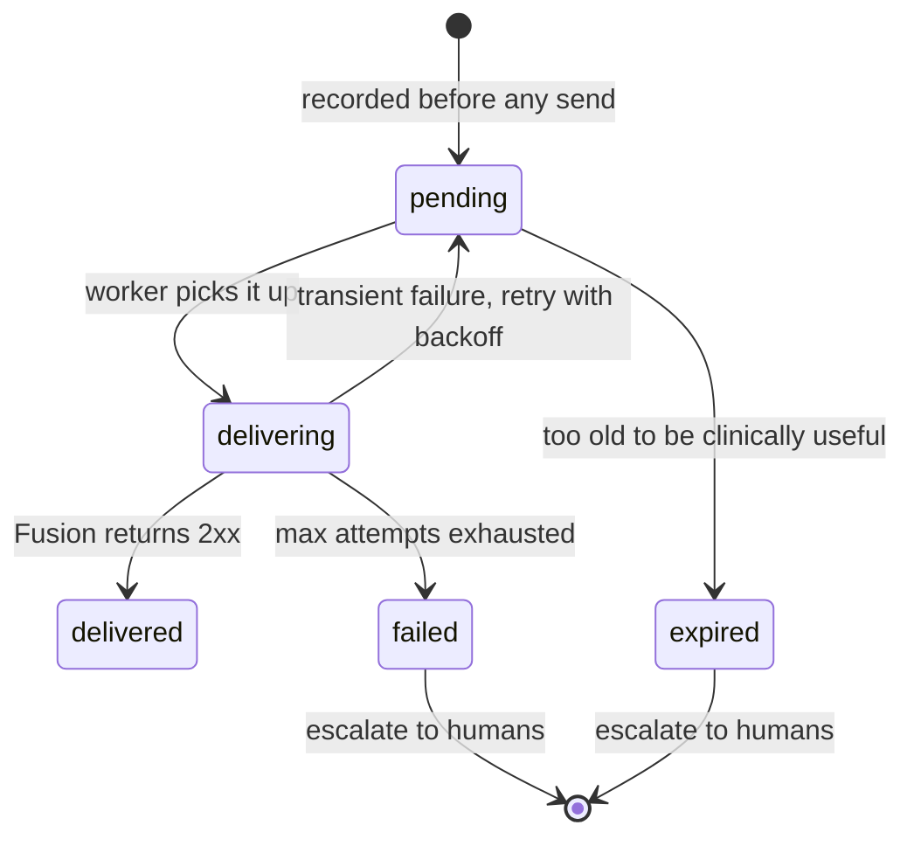

- **Record-first is sacred.** `create_pending_call()` inserts the `pending` row *before* the gateway even tries to reach Fusion. From that instant the page survives a Fusion outage, a network blip, or a process crash.
- **Bounded retries with backoff.** The delivery worker retries failed attempts with exponential backoff (honoring an upstream `Retry-After` when present), up to a bounded number of attempts.
- **Crash recovery.** On startup, any page left mid-flight by a crash is re-queued for redelivery — nothing in flight is lost across restarts. (This re-queue is exactly why the model is *at-least-once*: after a crash the gateway may resend rather than risk having missed one.)
- **Escalation.** A page that permanently fails or expires triggers an **escalation** to a human channel (a NOC/Teams/Slack/PagerDuty endpoint), so a delivery that truly cannot complete becomes a loud, visible alert rather than a silent loss.
- **Background OAuth refresh.** The Fusion access token is kept warm by a background refresh loop, so the first real Code Blue never pays a token-fetch latency — closing the 2026-06-12 failure mode at its root.

The states you will see in the `calls.state` column: `pending`, `delivering`, `delivered`, `retrying`, `failed`, `expired`, `duplicate`, and `legacy` (pre-outbox rows migrated losslessly).

---

## 6. Key concept: enforcing duplicate suppression

Rauland has a quirk: for roughly **one in three events it emits two INVITEs** for the same clinical emergency. Left alone, that means two identical overhead pages for one Code Blue — clinically confusing ("is there a second patient?") and noisy.

The current build **suppresses these duplicates** with an enforcing deduper. This was **enabled in this build after clinical sign-off** (it ships disabled-by-default in the reference config; the production `config.yaml` turns it on):

```yaml
dedupe:
  enforce: true
  window_seconds: 2
  match_bed: true
  match_purpose: true
```

How it works, and — more importantly — how it stays safe:

- **Keyed on the upstream `event_id`.** Rauland's double-emit carries the same upstream event identifier on both INVITEs, so the two are recognized as one clinical event and collapsed. The match also considers the clinical fingerprint (area, room, bed, purpose) within a short **2-second window**.
- **A genuine second emergency is always delivered.** Two *different* Code Blues for the same room, or a Code Blue and an RRT, are distinct clinical events and are **both paged** — the deduper only collapses the true same-event double-emit.
- **Suppression can never drop a real page — by construction.** The deduper runs **after** the record-first insert. It never gates or delays the insert or the delivery. When it does suppress, it transitions the *already-recorded* duplicate row to state `duplicate` — and that transition is **guarded on the row still being `pending`.** If the delivery worker has already picked the row up, the row is delivered anyway. This is the deliberate **fail-safe direction: deliver a duplicate rather than risk dropping a page.**

In short: dedupe makes the *nice-to-have* better (no double announcements) without ever compromising the *must-have* (no missed page). It is consistent with, not an exception to, the "duplicate OK / missed never" principle — the one duplicate it removes is a known upstream artifact, keyed on the upstream event id, and the safety fallback still favors delivery in every ambiguous case.

---

## 7. Key concept: the two-service topology

The gateway runs as **two independent systemd services**, deliberately split so that the read-only web UI can never interfere with the life-safety paging path.

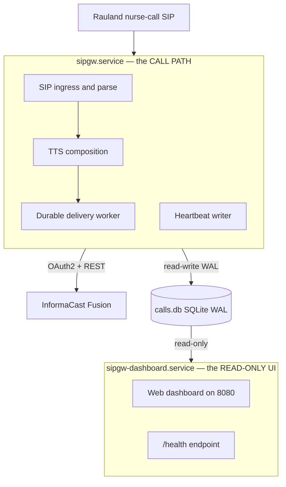

| Service | Role | Type | Can restart independently? |
|---|---|---|---|
| **`sipgw.service`** | The **call path**: SIP ingress + parse + TTS + durable delivery. Owns all database writes and stamps a liveness heartbeat. | `Type=notify`, `WatchdogSec=30s` | This is the paging service; restart only when coordinated. |
| **`sipgw-dashboard.service`** | A separate **read-only web UI** (`dashboard_app.py`) on `:8080`. Opens the database read-only. | `Type=simple` | **Yes** — it can be restarted or crash **without interrupting paging.** |

Why the split matters:

- **Isolation.** A runaway UI request, a dashboard crash, or a dashboard restart cannot touch the paging path. The two processes share only the SQLite database file, and the dashboard opens it **read-only** (`PRAGMA query_only=ON`) — it can *never* mutate a page or the heartbeat. The writer owns every write.
- **Watchdog.** The writer runs under a systemd `Type=notify` watchdog (`WatchdogSec=30s`): a hung event loop is detected and the service restarted. This watchdog is on the writer **exclusively**.
- **Honest health.** Because the writer and dashboard are separate processes, the dashboard's `/health` reads the **writer's heartbeat row** from the database. A healthy `/health` therefore means the *paging process* is genuinely alive — not merely that the web server answered. `/health` also surfaces Fusion reachability and the age of the last inbound SIP from Rauland (an inbound-liveness signal that the nurse-call link is up).

> **Operational note.** Because the paging service and the OS must be coordinated, uncoordinated restarts are a known hazard: on 2026-07-07 an unattended-upgrades (`needrestart`) auto-restart bounced the paging service (issue #20, remediated). OS patching must be coordinated with the paging window; zero-downtime writer restarts (socket activation, issue #19) are on the roadmap.

---

## 8. Supported call types

Call types are **data, not code.** The gateway derives the *purpose* of a page by matching keyword substrings in the SIP display name against the `call_purposes` table in `lookups.yaml`. Adding or renaming a call type is a lookup-table edit — no code change, no redeploy of the application logic.

The production build recognizes:

| Trigger keyword (in SIP display name) | Spoken purpose | Notes |
|---|---|---|
| `Blue` | **Code Blue** | Cardiac/respiratory arrest — the primary life-safety case. |
| `RRT` | **Rapid Response Team** | Clinical deterioration escalation. |
| `Pink` | **Code Pink** | Infant/child security. (Also mapped as specific room names in a few areas.) |

Two design choices reinforce the safety posture:

- **First match wins**, in table order — so ordering in `lookups.yaml` is meaningful.
- **The default is the most critical.** When no keyword matches (or the display name is empty), the gateway falls back to **`default_purpose: "Code Blue"`** — deliberately choosing the most urgent interpretation so an unrecognized alert is never *under*-classified.

Location is resolved the same way: the `areas` table maps an area number to a speech-ready unit name (e.g. `731 → "4th Floor... I.C.U..."`), and an `area_rooms` table provides room-level overrides (e.g. `730*01001 → "C... 32"`). This is how the same generic room number can be spoken correctly across different units. New units, rooms, and call types are all onboarded by editing `lookups.yaml`.

---

## 9. Where to go next

| If you want to… | See |
|---|---|
| Understand the internal modules and data flow in depth | **Architecture** |
| Configure the gateway, Fusion credentials, or dedupe | **Configuration** |
| Edit area/room/purpose mappings | **Lookup Tables** |
| Operate, restart, and monitor the services | **Operations** |
| Diagnose a missed or duplicated page | **Troubleshooting** |
| Understand the security posture and the SIP allowlist | **Security** |
| See what is planned (HA, zero-downtime restarts) | **HA Plan / Roadmap** |


\newpage

# Architecture

> **RedEye sip2api Gateway** — Code Blue / RRT Notification Gateway
> *"SIP in. Page out. Every time."*
>
> This section documents the **current production build (`c23f3eb`, the v1.7 line: v1.6.5 + 6 commits)** as deployed on host `sip2apibridge` at Tift Regional Medical Center. It describes the system that IS running today. Features that are still in development (the HA epic, socket-activated restarts, remaining Dashboard-v2 phases) are called out only in the *Roadmap* and *HA Plan* sections of this manual and are labeled *planned*.

---

## 1. What the gateway does

The RedEye sip2api Gateway is a **life-safety protocol bridge**. Rauland Responder (the nurse-call system) knows how to place a **SIP call**; InformaCast Fusion knows how to make an **overhead page**. Nothing off the shelf connects the two. The gateway sits in the middle: it answers the SIP INVITE that Rauland places for a Code Blue or Rapid Response Team (RRT) event, extracts *who / where / why* from the call, turns that into a spoken **text-to-speech (TTS)** announcement, and drives Fusion's Scenarios API to page it overhead.

The single design imperative is **"page out, every time."** A Code Blue that is placed must result in an overhead page even if Fusion is momentarily unreachable, even if the OAuth token expired at the wrong moment, and even if the gateway process crashes in the half-second between answering the call and delivering the page. The architecture below exists to make that guarantee durable rather than best-effort.

### 1.1 The problem this build solves

On **2026-06-12** a Code Blue was lost. The old code fetched an OAuth token *inline* on the page path; that fetch hit a transient `httpx.ConnectTimeout`, the trigger returned `fusion_status = -1`, and there was no retry — the page silently evaporated. The current build eliminates that failure mode by:

- **Recording the page first** (durable SQLite row) and delivering it **asynchronously** with bounded retries, so a transient network fault is retried instead of dropped.
- **Refreshing the OAuth token in the background**, off the page's critical path, so a page never waits on (or dies from) a token fetch.
- **Escalating to a human** when a page can genuinely not be delivered, instead of failing silently.

---

## 2. System context

Three actors, one direction of flow: nurse-call **in**, overhead page **out**.

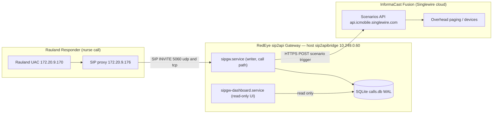

**The upstream SIP path.** Rauland's user agent (`172.20.9.170`) does not talk to the gateway directly; it routes through the Rauland-side SIP proxy (`172.20.9.176`), which forwards the INVITE to the gateway's SIP IP `10.249.0.60` (interface `ens34`) on port **5060 (UDP and TCP)**. The gateway therefore sees `172.20.9.176` as the immediate signaling peer. Both addresses fall inside the SIP allowlist (`172.16.0.0/12`), so both are accepted; any source outside the allowlist is answered with `403 Forbidden` and never becomes a page.

**The downstream page path.** The gateway calls Fusion's Scenarios API at `https://api.icmobile.singlewire.com/api`. It authenticates with OAuth2 client-credentials against `/token` (audience = the customer's provider ID), then POSTs to `/v1/scenario-notifications?scenarioId=<SIPtoTTSBridge scenario id>` with the TTS string as the answer to the `customTTS` field. Fusion resolves the scenario's audience and pages it overhead. Credentials are masked everywhere in this manual as `<CLIENT_ID>` / `<CLIENT_SECRET>`; the customer-owned scenario, audience, and field identifiers are the customer's own and may appear.

**Two services, one host.** The gateway is not a monolith. The **call path** (`sipgw.service`) and the **web UI** (`sipgw-dashboard.service`) are independent systemd units in separate OS processes. The dashboard can be restarted, upgraded, or crash without ever interrupting paging. Both are covered in §6.

---

## 3. A call, end to end (durable delivery)

The following sequence is the heart of the system. Note the two decoupling points that make the page durable: the page is **recorded before it is delivered** (so a crash or outage cannot lose it), and the SIP dialog is **torn down independently of delivery** (so answering the call never waits on Fusion).

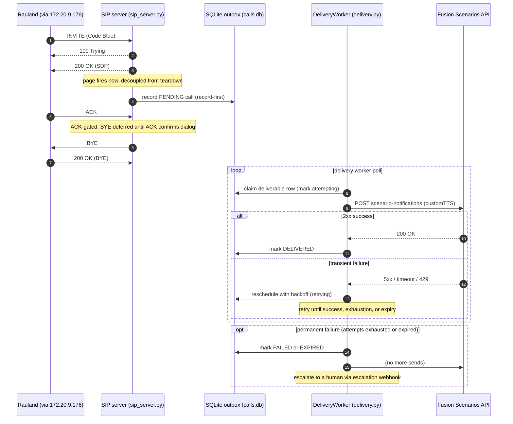

### 3.1 Why the ordering matters

- **200 OK before record, page before teardown.** The gateway answers the INVITE immediately (`100 Trying`, then `200 OK` with SDP). The page callback (`_safe_callback` → `on_call`) fires via `asyncio.create_task` the moment the call is answered — it is *not* chained behind ACK, BYE, or the delivery result. Rauland gets a fast, clean answer regardless of Fusion's health.
- **Record-first.** `on_call` parses the caller, builds the TTS, and writes a **PENDING** row to the outbox *before* any attempt to reach Fusion. From that instant the page is durable: even a hard crash before the first delivery attempt leaves a recoverable row on disk (§5.3).
- **ACK-gated immediate-BYE.** In `immediate_bye` mode (the deployed default) the gateway sends `200 OK`, keeps the dialog, and defers its own `BYE` until the caller's `ACK` confirms the three-way handshake. This fixes the historical **481 race** in which a BYE could outrun the ACK. A lost ACK is covered by a per-call fallback timer (`immediate_bye_ack_timeout_seconds`, 2.0 s) that tears the dialog down and frees the RTP port so a dropped ACK can never strand a dialog or leak a port.
- **Delivery is a separate loop.** The `DeliveryWorker` polls the outbox on its own cadence, claims deliverable rows, and drives the Fusion POST with retries and backoff. Success marks the row **DELIVERED**; permanent failure marks it **FAILED** or **EXPIRED** and escalates.

---

## 4. Internal pipeline

Inside the writer process, an inbound INVITE flows through a short, well-bounded pipeline. The dashboard is deliberately drawn **outside** that pipeline — it is a separate process that only *reads* the same database.

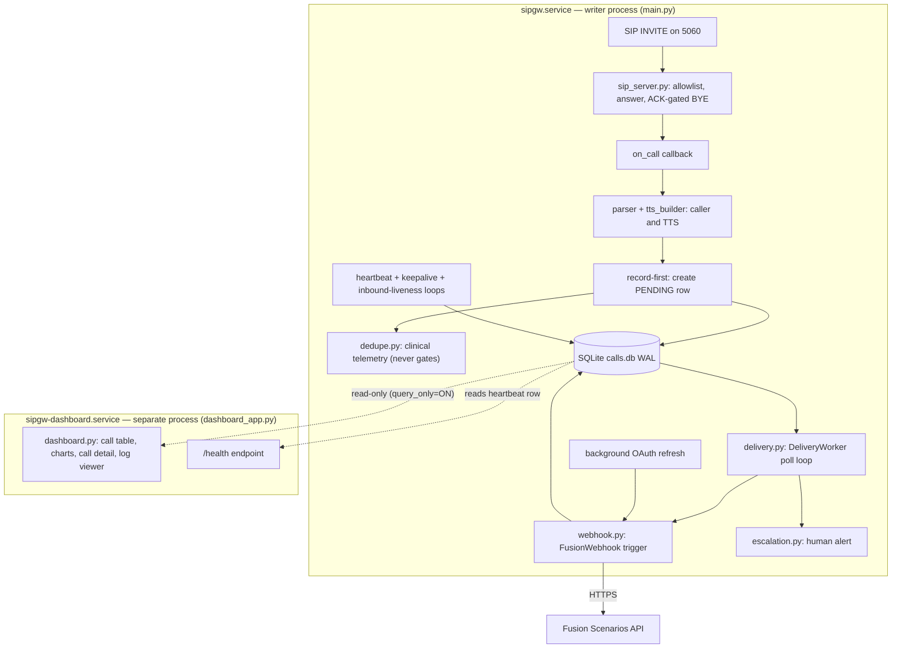

### 4.1 Stage-by-stage

| Stage | Module | Responsibility |
|---|---|---|
| **Ingress** | `sip_server.py` | Listen on 5060 UDP+TCP; enforce the source-IP allowlist; answer INVITE (`100`/`200`); run ACK-gated immediate-BYE teardown; stamp last-inbound time for liveness. |
| **Parse + compose** | `parser.py`, `tts_builder.py`, `lookups.py` | Extract caller/room/area from the From header; resolve area name and call purpose from `lookups.yaml`; assemble the spoken TTS string (preamble + play count). |
| **Record-first** | `main.on_call` → `database.py` | Persist the page as a **PENDING** row *before* any delivery attempt. This is the durability boundary. |
| **Dedupe (telemetry)** | `dedupe.py` | Compute a clinical fingerprint and, when a shadow window is configured, log clinical duplicates. **In this build it runs after the insert and never gates delivery** (see §4.2). |
| **Deliver** | `delivery.py` | Poll the outbox, claim rows, drive the Fusion POST with bounded retries + backoff, honor `Retry-After` delta-seconds, expire stale rows, and invoke escalation on permanent failure. |
| **Webhook** | `webhook.py` | OAuth2 client-credentials auth with a **background token refresher**; POST the scenario trigger; single 401 re-auth-and-retry; surface `Retry-After` to the worker; bounded read-only reachability probe for `/health`. |
| **Escalate** | `escalation.py` | Fire a human alert (Teams/Slack/PagerDuty/NOC webhook) when a page fails or expires. |
| **Liveness** | `main.py` loops + `watchdog.py` | Heartbeat writer, Fusion reachability keepalive, inbound-liveness flush, and the systemd Type=notify watchdog pinger. |

### 4.2 Dedupe status in this build — an accuracy note

Rauland double-emits roughly one INVITE in three (two INVITEs per event). The dedupe subsystem (`dedupe.py`) exists to measure and eventually suppress those, but **in the deployed `c23f3eb` build it ships inert**:

- The `on_call` insert is **record-first and never gated** — the deduper is evaluated *after* the PENDING row is written, purely as telemetry.
- With the shipped config (`dedupe.enforce: false`, `dedupe.window_seconds: 0`) the deduper does not even query the database and always returns a no-suppress decision. Setting `window_seconds > 0` with `enforce: false` turns on **shadow logging** (`WOULD suppress ...`) but every page is still delivered.
- `enforce: true` is a **fatal config error** by policy (real suppression requires clinical sign-off). Even the (unreachable) enforce branch is never allowed to drop a *second real Code Blue for the same room* — the fail-safe direction is always "deliver."

The clinical fingerprint (`cf-v1:`, keyed on area/room/bed/purpose) is deliberately distinct from the SIP **transaction** fingerprint (`v1:`, from Call-ID/From/CSeq in `sip_message.py`) used for INVITE-retransmit correlation and the `event_id` column. The two are never conflated. Enforcing, event-id-keyed suppression is tracked as roadmap work (issues #5 and the dedupe tail).

---

## 5. The durable outbox

### 5.1 Storage

All state lives in a single SQLite database at `/var/lib/sipgw/calls.db`, opened in **WAL** (write-ahead logging) mode. WAL is what lets the writer commit pages while the dashboard reads concurrently without blocking. The **writer process owns every write**; the dashboard opens the same file **read-only** (`query_only=ON`) and can never mutate a page or heartbeat.

The `calls` table carries the outbox columns: `state`, `attempts`, `last_error`, `delivered_at`, `sip_call_id`, `duplicate_of`, `is_test`, and `event_id`, with supporting indexes. Test traffic (`is_test = 1`, set in dry-run) never fires a real page and never counts in statistics or dashboard rollups.

### 5.2 State machine

Each page is a row that moves through a small, explicit state machine. The worker is the only mutator of these states.

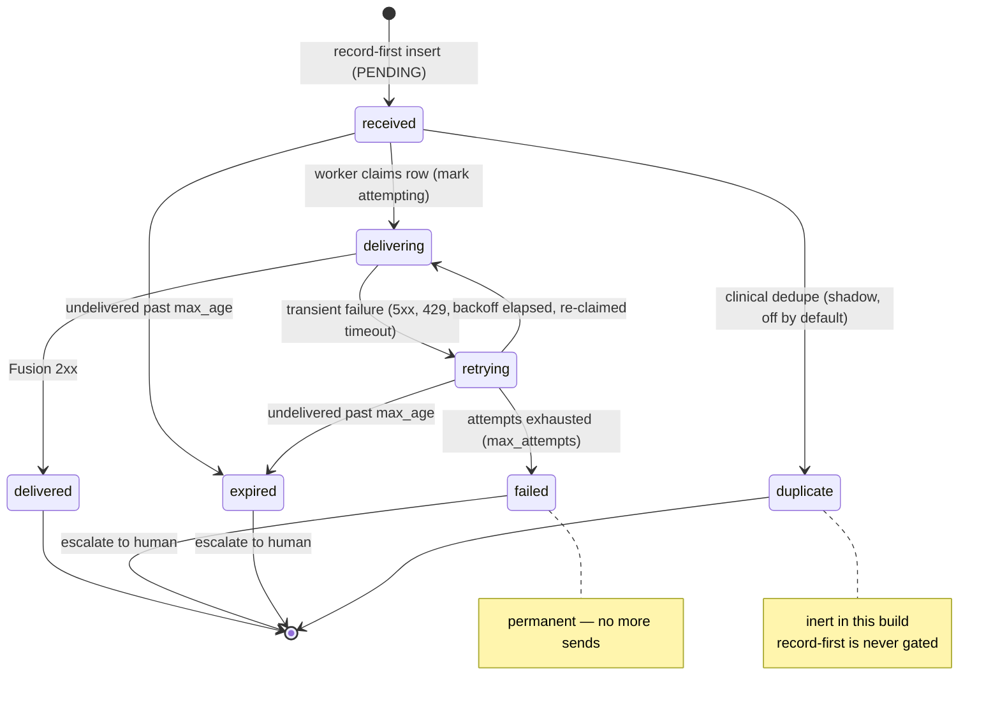

**Reading the states:**

- **received → delivering → delivered** is the happy path: recorded, claimed, POSTed, 2xx.
- **retrying** is entered on any transient failure (5xx, 429, timeout, or the `-1` "exception" status). The worker computes a backoff — exponential from `base_backoff_seconds`, capped at `max_backoff_seconds`, and it honors a Fusion `Retry-After` delta-seconds header when present — then re-claims the row when the cooldown elapses.
- **failed** is terminal: attempts reached `max_attempts` with no success. The worker records the last status/error and **escalates**.
- **expired** is terminal: the page sat undelivered longer than `max_age_seconds`. It is escalated as well — a page that can no longer be trusted to be timely is surfaced to a human rather than delivered late and silently.
- **duplicate** is the dedupe terminal state. It exists in the schema and the state model, but in this build the record-first insert is never gated, so pages are not routed here in production (§4.2).

The legacy state (rows written by pre-outbox builds) is treated as already-handled and is excluded from the deliverable set; state-aware statistics (#10) classify legacy, delivered, and in-flight rows correctly on the dashboard.

### 5.3 Crash recovery — at-least-once delivery

On startup the worker calls `recover()`, which returns any **crash-orphaned `delivering` rows to `received`** (`recover_inflight`). If the process died mid-POST — after claiming a row but before recording its outcome — that row is simply re-queued and retried. Combined with record-first insertion, this gives **at-least-once** delivery: the only way a recorded page leaves the system is DELIVERED, FAILED (escalated), or EXPIRED (escalated). It is never silently dropped. (On a graceful shutdown the worker also best-effort `drain()`s the queue, but durability does not depend on drain succeeding.)

### 5.4 OAuth off the critical path

`webhook.py` runs a **background token refresh loop** that renews the OAuth token roughly `token_refresh_margin_seconds` before it expires. Delivery therefore almost always uses a warm cached token; the on-demand fetch inside `trigger_scenario` is a fallback, not the norm. A single `401` triggers one clear-cache-and-retry. This is the direct architectural fix for the 2026-06-12 incident: no page waits on — or dies from — an inline token fetch.

---

## 6. Deployment topology — two independent services

The paging path is deliberately isolated from the UI. Two systemd units run on the same host and share only the SQLite file (writer read-write, dashboard read-only).

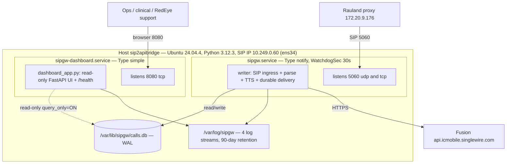

### 6.1 The two units

| | `sipgw.service` (writer) | `sipgw-dashboard.service` (dashboard) |
|---|---|---|
| **systemd type** | `Type=notify`, `WatchdogSec=30s` | `Type=simple` |
| **Entry point** | `python -m sipgw.main <config>` | `python -m sipgw.dashboard_app <config>` |
| **Owns** | SIP ingress, parse, TTS, the durable delivery worker, escalation, heartbeat, watchdog | Read-only web UI on :8080 and `/health` |
| **DB access** | read-write (all writes) | **read-only** (`query_only=ON`) |
| **Listens** | 5060 UDP + TCP | 8080 TCP |
| **Restart impact** | interrupts paging (mitigated by record-first + recovery) | **none** — paging continues uninterrupted |

**Why split (#14).** The dashboard is a rich FastAPI app (call table, a 90-day stacked chart by call type, a correlated `/call/{id}` detail view, a date-picker log viewer, per-call diagnostic-bundle export). Running it in-process with the writer would mean a UI dependency, a memory leak, or a routine dashboard upgrade could jeopardize the paging path. Splitting the processes means the dashboard can be restarted or fail on its own while the writer keeps answering INVITEs and delivering pages. The two processes must not both attach the rotating file handler to the writer's shared logs (a midnight `doRollover()` race would corrupt them), so the dashboard uses **dashboard-safe logging** to its own `sipgw_dashboard.log`.

### 6.2 `/health` and liveness

`/health` is served by the dashboard but reflects the **writer's** health, because the writer stamps a heartbeat row and the dashboard reads it:

- **Heartbeat freshness is the sole determinant of the HTTP status code.** The writer stamps a heartbeat every `heartbeat_interval_seconds` (10 s); `/health` returns **503** once the heartbeat is older than `stale_after_seconds` (30 s). Everything else on `/health` is informational and never flips the status code by default.
- **Fusion reachability** — a bounded, **read-only** GET of the scenario every `keepalive_interval_seconds` (300 s). It never triggers a scenario and never sends a page; the result is stamped for `/health` as an informational field. A transient Fusion blip is deliberately *not* allowed to 503 a single node (which a monitor could then pull or restart). Turning that into a hard 503 is opt-in (`fail_on_fusion_unreachable`, default off).
- **Inbound-liveness** — Rauland sends SIP only on real events (no keepalives), so the writer stamps the time of the last allowed-network inbound SIP and flushes it to the DB. `/health` surfaces `last_inbound_sip_age_s`; the dashboard shows "Last inbound from Rauland" and turns amber past `inbound_stale_after_seconds` (5 days). This is informational; optional silence-escalation is off by default and, if enabled, must be set above the historical ~4.27-day maximum quiet gap to avoid false alarms.

---

## 7. Host, ports, and network facts

| Fact | Value |
|---|---|
| Host | `sip2apibridge`, Ubuntu 24.04.4, Python 3.12.3 |
| SIP / SDP IP | `10.249.0.60` (interface `ens34`) |
| SIP port | `5060` UDP **and** TCP (writer) |
| Dashboard port | `8080` TCP (read-only UI, **no auth** — see below) |
| Install root | `/opt/sipgw` (venv `/opt/sipgw/venv`) |
| Logs | `/var/log/sipgw` — 4 streams, 90-day retention |
| Database | `/var/lib/sipgw/calls.db` (WAL) |
| SIP allowlist | `172.16.0.0/12`, `127.0.0.0/8`, `10.0.0.0/8` |
| Upstream SIP | Rauland UAC `172.20.9.170` → proxy `172.20.9.176` → gateway |
| Fusion base | `https://api.icmobile.singlewire.com/api`, scenario **SIPtoTTSBridge**, field `customTTS` |

**Four log streams** (`/var/log/sipgw`), rotated at midnight with async rotation (#6):

- `sipgw.log` — writer application log (the call/delivery narrative).
- `sipgw_api_debug.log` — full Fusion HTTP request/response captures (secrets masked).
- `sipgw_sip_debug.log` — raw inbound/outbound SIP messages and INVITE fingerprints.
- `sipgw_dashboard.log` — the dashboard process's own log.

**Timestamps.** The host clock is `Etc/UTC` and all stored `timestamp` values are canonical UTC RFC3339 millis-Z. Note the config key `logging.timezone: America/New_York` is *declared but not applied to stored timestamps* in this build — persisted times are UTC. The dashboard renders local wall-clock for display.

### 7.1 Security posture at the perimeter

There is **no host firewall active** (nftables is empty). Ingress protection currently relies entirely on the **application-layer SIP allowlist** in `sip_server.py`, which `403`s any source outside the allowed networks before it can become a page. Two hardening items follow directly from this and are carried in the *Security* and *Roadmap* sections:

1. **Add an nftables policy** scoping `5060` and `8080` to the expected source networks, so the OS enforces the boundary in addition to the app.
2. **The dashboard on :8080 has no authentication.** It is read-only and hides test rows, but it exposes call detail and log content. Until it is placed behind auth or a network boundary, treat :8080 as sensitive and restrict it at the network layer.

---

## 8. Design principles (why it's shaped this way)

- **Record before you send.** Durability is a property of *when you persist*, not of how hard you retry. Writing the PENDING row before the first Fusion attempt is what converts "best-effort page" into "durable page."
- **Decouple the SIP dialog from delivery.** Answering the call and tearing it down must never wait on Fusion. The page fires on a separate task; the delivery worker runs on its own loop.
- **Keep the token warm, off the path.** The one incident this build was built around was an inline token fetch on the critical path. Background refresh removes that class of failure entirely.
- **Isolate the UI from the paging path.** A read-only dashboard in its own process can never take paging down with it.
- **Fail safe, then fail loud.** Ambiguity always resolves toward *deliver the page* (dedupe never drops a real Code Blue; recovery re-queues orphans). When a page genuinely cannot be delivered, it is FAILED/EXPIRED and **escalated to a human**, never dropped in silence.

---

*Continue to the Configuration, Operations, Security, and Reliability sections for the operational detail behind each component described here. Planned work — the NetScaler active/active HA epic (#17), zero-downtime socket-activated restarts (#19), OS auto-restart coordination (#20), and remaining Dashboard-v2 phases (#13) — is documented, and labeled planned, in the HA Plan and Roadmap sections.*


\newpage

# Components & Dependencies

This section is the definitive map of the deployed build (production `c23f3eb`,
the v1.7 line = v1.6.5 + 6 commits). It answers three questions:

1. **What modules make up the `sipgw` package, and what is each one responsible for?**
2. **What does the gateway depend on** — Python packages and external systems — to do its job?
3. **Which of those modules runs in which of the two systemd services?**

Everything here reflects what is *installed and running* on host `sip2apibridge`
today. Where a module ships a capability in an *inert* or *shadow* state (dedupe
enforcement is the notable case), that is called out explicitly rather than
described as if it were active.

---

## 1. Package layout

The application is a single Python package, `sipgw`, installed at `/opt/sipgw`
and run out of its own virtualenv (`/opt/sipgw/venv`, Python 3.12.3). Two
separate processes are started from it — the **writer** (`python -m sipgw.main`)
and the **dashboard** (`python -m sipgw.dashboard_app`) — but they import from
the same package on disk.

```
/opt/sipgw/
├── sipgw/                  # the application package
│   ├── __init__.py
│   ├── main.py             # WRITER entry point (call path)
│   ├── dashboard_app.py    # DASHBOARD entry point (read-only UI)
│   ├── config.py           # config loader + fail-fast validation
│   ├── logging_config.py   # dual logging + async rotation
│   ├── sip_server.py       # SIP UA server (INVITE/ACK/BYE/CANCEL/OPTIONS)
│   ├── sip_message.py      # raw SIP parse + invite_fingerprint (#15)
│   ├── rtp_handler.py      # RTP u-law silence to hold the call up
│   ├── parser.py           # username/display-name → area/room/bed/purpose
│   ├── lookups.py          # area-name / purpose lookup tables (lookups.yaml)
│   ├── tts_builder.py      # parsed call → announcement text
│   ├── webhook.py          # Fusion OAuth2 + scenario trigger (FusionWebhook)
│   ├── delivery.py         # durable outbox / retry worker (DeliveryWorker)
│   ├── escalation.py       # human-channel alert on delivery failure
│   ├── dedupe.py           # clinical dedupe — SHIPS SHADOW/DISABLED
│   ├── database.py         # SQLite (WAL) call store + heartbeat
│   ├── watchdog.py         # systemd Type=notify / sd_notify pinger
│   ├── safety.py           # dry-run / test-mode NO-SEND guarantee
│   └── dashboard.py        # FastAPI UI, charts, /call/{id}, /health, log viewer
├── config.yaml             # deployment config (secrets masked in this manual)
├── lookups.yaml            # area + purpose lookup tables
└── venv/                   # Python 3.12 virtualenv
```

---

## 2. Module responsibility table

Modules are grouped by the role they play. "Runs in" tells you which
service(s) import and exercise the module at runtime — **W** = writer
(`sipgw.service`), **D** = dashboard (`sipgw-dashboard.service`).

### Entry points & shared setup

| Module | Runs in | Responsibility |
|---|---|---|
| `__init__.py` | W · D | Package marker. `"""sipgw - SIP-to-Webhook Gateway for Informacast Fusion."""` Nothing runtime-bearing. |
| `main.py` | **W** | Writer entry point (`python -m sipgw.main <config.yaml>`). Wires the SIP server + delivery worker + heartbeat writer + watchdog together and owns all DB writes. Since the #14 two-service split it no longer serves HTTP; it keeps writing the heartbeat row that the dashboard reads for `/health`. |
| `dashboard_app.py` | **D** | Dashboard entry point (`python -m sipgw.dashboard_app <config.yaml>`). Runs the FastAPI UI in its **own** process. Opens the shared SQLite DB **read-only** (`query_only=ON`) so it can never mutate a page or heartbeat, uses dashboard-safe logging so it never attaches the writer's rotating file handler, and mirrors the writer's bootstrap (load_config → effective_dry_run → prod-DB barrier → validate_config) so a misconfigured/unsafe dashboard refuses to start exactly like the writer does. |
| `config.py` | W · D | Loads `config.yaml` into typed dataclasses with sensible defaults for every value, and provides **fail-fast validation** (#9). Notably makes `dedupe.enforce=true` a **fatal** config error — enforcement is forbidden in production today. |
| `logging_config.py` | W · D | Dual logging: stdout + a daily-rotating file with `.tgz` compression and retention purge (#6, async rotation). Exposes a **dashboard-safe** setup so the read-only process never races the writer at midnight `doRollover()`. Note: `logging.timezone: America/New_York` is declared but *not applied to stored timestamps* — the host clock is `Etc/UTC` and stored timestamps are UTC RFC3339 millis-Z. |

### SIP ingress & parsing (the call path)

| Module | Runs in | Responsibility |
|---|---|---|
| `sip_server.py` | **W** | Purpose-built lightweight SIP UA server on UDP+TCP **5060**. Answers `INVITE`, holds the call up with RTP silence, and terminates on `BYE`/`CANCEL`/timeout. Implements only the SIP methods the gateway needs (INVITE, ACK, BYE, CANCEL, OPTIONS), not full SIP. Enforces the SIP source **allowlist** and performs the **ACK-gated immediate-BYE** that fixed the old 481 race. Supports multiple concurrent inbound calls. |
| `sip_message.py` | **W** | Parses raw SIP requests/responses into a structured form (the INVITE/ACK/BYE/CANCEL subset). Home of the **`invite_fingerprint`** (#15) — the SIP *transaction* identity (Call-ID / From / CSeq), i.e. "is this a retransmit of the *same* INVITE." Distinct from the clinical fingerprint in `dedupe.py`. |
| `rtp_handler.py` | **W** | RTP silence sender. Emits u-law silence (`0xFF`) so the held SIP call stays up, and discards any inbound RTP. This is what keeps Rauland from tearing the call down before the page is built. |
| `parser.py` | **W** | Extracts **area / room / bed** from the SIP username (`a{area}r{room}[b{bed}]`, asterisks stripped) and **call purpose** from the SIP display name. |
| `lookups.py` | W · D | Loads the **area-name** and **call-purpose** substitution tables from `lookups.yaml` so they can be edited without a code change. (The dashboard's verify-lookups view reads these too.) |
| `tts_builder.py` | **W** | Builds the announcement text from parsed call info: base `"{CallPurpose}! {AreaName} {RoomName}"`, then assembles the preamble + 3× repetition sent to Fusion as `customTTS`. |

### Delivery, durability & escalation

| Module | Runs in | Responsibility |
|---|---|---|
| `database.py` | **W** (rw) · **D** (ro) | SQLite call store (`/var/lib/sipgw/calls.db`, **WAL**) via `aiosqlite`. Holds the call history + delivery state machine (`state`, `attempts`, `last_error`, `delivered_at`, `sip_call_id`, `duplicate_of`, `is_test`, `event_id` + indexes) and the **heartbeat** row. The writer owns *all* writes; the dashboard opens it read-only. |
| `webhook.py` | **W** | `FusionWebhook` — the InformaCast Fusion client. OAuth2 client-credentials auth (token cached and **auto-refreshed off the critical path**) plus scenario triggering: `POST {base}/token` for the token, then `POST {base}/v1/scenario-notifications?scenarioId=…` with the `customTTS` field. It is the *only* thing that talks to Fusion, and it carries the §2a no-send guard in dry-run. |
| `delivery.py` | **W** | `DeliveryWorker` — the **durable outbox**. Pages are recorded first (`state='pending'`) by the SIP path, then delivered asynchronously here, so a Fusion outage or a crash between record-and-send cannot drop a Code Blue. Retries with **exponential backoff** (honoring `Retry-After`), escalates on exhaustion, and expires pages left undelivered too long. On startup `recover()` returns crash-orphaned `delivering` rows to `pending` (**at-least-once** delivery). It drives `FusionWebhook`; it never sends anything itself. |
| `escalation.py` | **W** | `Escalator` — alerts a human channel (Teams/Slack/PagerDuty/NOC via `escalation.webhook_url`) when a page hits terminal `failed` (retries exhausted) or `expired` (staleness). Injected into the delivery worker as `on_escalate`; when absent the worker only logs. Shares the dry-run no-send guarantee. Escalation errors are logged, **never raised** — they must never disrupt delivery. |
| `dedupe.py` | **W** | Computes the **clinical** identity of a page — the normalized `(area, room, bed, purpose)` tuple (`cf-v1:` prefix). **Ships SHADOW / DISABLED.** With the deployed config (`enforce: false`, `window_seconds: 0`) `evaluate()` does not even query the DB and always returns *no-suppress*; a test-only `window_seconds > 0` turns on a shadow lookup that logs `WOULD suppress …` but **still never drops a page**. `enforce: true` is forbidden (`validate_config` fatal). This is deliberately **distinct** from `sip_message.py`'s SIP-transaction `invite_fingerprint` and must never be conflated with it. See the note below. |

### Health, safety & UI

| Module | Runs in | Responsibility |
|---|---|---|
| `watchdog.py` | **W** | systemd `Type=notify` + WatchdogSec integration via a pure-Python `sd_notify`. Sends `READY=1` once listeners are up and pings the watchdog on a cadence. Pings prove **event-loop** liveness only (decoupled from DB writes), so transient DB slowness never restarts the life-safety pager. Structurally **inert** when `NOTIFY_SOCKET` is unset (tests, dry-run, non-systemd, single-service rollback). |
| `safety.py` | W · D | The load-bearing **NO-SEND guarantee** for dry-run / test mode. In effective dry-run the shared `httpx` client is built with `NoSendGuardTransport`, which refuses to forward any request whose host is not `127.0.0.1` — every Fusion origin *and* the escalation POST share this client, so none can reach a real host during testing. Also provides `is_test` marking so test traffic never fires a real page and never counts in stats. Effective dry-run = `config.dry_run` **or** env `SIPGW_DRY_RUN=1`; the environment may only *enable* dry-run, never disable it. |
| `dashboard.py` | **D** | The FastAPI web UI (Dashboard v2). Call table with pagination + auto-refresh, 90-day stacked chart by call type, the correlated **`/call/{id}`** call-detail view, date-picker **log viewer**, per-call plain-text **diagnostic bundle export**, verify-lookups, and the real **`/health`** endpoint (delivery health + Fusion reachability + last-inbound-SIP age). Hides `is_test` rows. **No authentication** — see the Security section. |

> **The two fingerprints — do not confuse them.** `invite_fingerprint` (in
> `sip_message.py`, prefix `v1:`) is the **SIP transaction** identity: "is this
> the same INVITE arriving twice on the wire." The **clinical fingerprint** (in
> `dedupe.py`, prefix `cf-v1:`) is the **who/where/why** identity: "is this the
> same clinical event." They are separate functions on purpose. The clinical
> one is shadow/disabled and never drops a page in the deployed build.

> **Dedupe status, stated plainly.** The Rauland source double-emits (~1 in 3
> events arrives as two INVITEs). In the current production build those
> duplicates are **not** actively suppressed by `dedupe.py` — it ships inert.
> The config keys exist (`dedupe.enforce`, `dedupe.window_seconds`) and the
> shadow telemetry can be enabled for measurement, but enforcement remains
> gated behind clinical sign-off and is a fatal config error today. Treat
> enforcing dedupe as a **Roadmap** item (#5 tail), not a shipped behavior.

---

## 3. Runtime dependencies

### 3.1 Python packages

The gateway runs on **CPython 3.12.3** in a dedicated virtualenv. The repository
pins loose lower bounds in `requirements.txt`; the table below lists both those
pins and the **actual versions resolved in the deployed venv** on
`sip2apibridge` (from the host inventory). When reproducing the environment,
match the deployed column.

| Package | `requirements.txt` pin | Deployed version | Used by / why |
|---|---|---|---|
| `httpx` | `>=0.27.0` | **0.28.1** | Async HTTP client for all Fusion calls (`webhook.py`) and escalation POSTs (`escalation.py`); the dry-run `NoSendGuardTransport` plugs in here. |
| `fastapi` | `>=0.115.0` | **0.129** | Dashboard web framework (`dashboard.py` / `dashboard_app.py`). |
| `starlette` | *(via fastapi)* | (fastapi-matched) | ASGI plumbing under FastAPI — routing, requests/responses. Pulled in transitively. |
| `uvicorn[standard]` | `>=0.32.0` | **0.41** | ASGI server that runs the dashboard app. |
| `aiosqlite` | `>=0.20.0` | **0.22** | Async SQLite access for the call store + heartbeat (`database.py`). |
| `PyYAML` | `>=6.0` | 6.x | Parses `config.yaml` and `lookups.yaml` (`config.py`, `lookups.py`). |
| `Jinja2` | `>=3.1.0` | 3.1.x | HTML templating for the dashboard. |
| `anyio` | *(via httpx/starlette)* | (dep-matched) | Async concurrency primitives underlying httpx and Starlette. Transitive. |
| `tzdata` | (present) | (present) | IANA tz database on a slim Ubuntu host, so `America/New_York` resolves for the dashboard's local-wall-clock display. |
| `pytest`, `pytest-asyncio` | `>=8.0.0`, `>=0.24.0` | (test only) | Test suite; **not** required at runtime and not part of the paging path. |

No third-party SIP or RTP stack is used — `sip_server.py`, `sip_message.py`, and
`rtp_handler.py` are purpose-built on the Python standard library (`asyncio`,
sockets, struct). This keeps the life-safety call path free of heavyweight
external SIP dependencies.

### 3.2 External systems

The gateway is a bridge, so its "dependencies" also include the systems on
either side of it and the network between them.

| External system | Role | Endpoint / identity (deployment facts) |
|---|---|---|
| **Rauland nurse-call** (upstream SIP) | Source of `INVITE`s (Code Blue / RRT events) | UAC `172.20.9.170` → proxy `172.20.9.176` → gateway `10.249.0.60:5060`. Rauland double-emits ~1/3 of events. |
| **InformaCast Fusion / Singlewire** (downstream API) | Fires the overhead page | Base `https://api.icmobile.singlewire.com/api`; scenario "SIPtoTTSBridge" (`4cba52d8-…`), field `customTTS`, audience `2ffd6864-…` (customer-owned). OAuth2 client-credentials — `<CLIENT_ID>` / `<CLIENT_SECRET>` are masked. |
| **Escalation channel** (optional) | Human alert on delivery failure | `escalation.webhook_url` (Teams/Slack/PagerDuty/NOC). Opt-in. |
| **Network / DNS** | Reachability of both sides | SIP allowlist `172.16.0.0/12, 127.0.0.0/8, 10.0.0.0/8`; outbound HTTPS to Fusion. **No host firewall is active** (empty nftables) — ingress relies on the app allowlist. See Security. |
| **systemd (host init)** | Process supervision + watchdog + restart | `Type=notify` watchdog on the writer; `Restart=always` on both units. |
| **Host filesystem** | State + logs | DB `/var/lib/sipgw/calls.db` (WAL), logs `/var/log/sipgw` (four streams, 90-day retention). |

---

## 4. Which modules run in which service

The paging path is intentionally isolated from the UI: they are **two
independent systemd units** sharing only the SQLite database and the log
directory on disk. Restarting the dashboard cannot interrupt paging.

| | `sipgw.service` (WRITER) | `sipgw-dashboard.service` (DASHBOARD) |
|---|---|---|
| Entry point | `python -m sipgw.main config.yaml` | `python -m sipgw.dashboard_app config.yaml` |
| systemd type | `Type=notify`, `WatchdogSec=30` | `Type=simple` |
| Port | 5060 udp+tcp (SIP) | 8080 tcp (HTTP) |
| DB access | read-write (owns all writes) | **read-only** (`query_only=ON`) |
| Privileged bind | `CAP_NET_BIND_SERVICE` (port 5060) | none (unprivileged 8080) |
| Restart / resource | `Restart=always`, `StartLimitIntervalSec=0` | `Restart=always`, `MemoryMax=256M`, `CPUQuota=50%` |
| Modules exercised | main, config, logging_config, sip_server, sip_message, rtp_handler, parser, lookups, tts_builder, webhook, delivery, escalation, dedupe, database (rw), watchdog, safety | dashboard_app, dashboard, config, logging_config (dashboard-safe), database (ro), lookups, safety |

Both units run as the unprivileged `sipgw` user/group with `NoNewPrivileges`,
`ProtectSystem=strict`, `ProtectHome`, and `PrivateTmp`. The writer's watchdog
lives only on the writer — the dashboard is a plain long-running HTTP server, so
a stuck UI request can never trip the life-safety watchdog. The dashboard also
gets its own memory/CPU envelope (`MemoryMax`/`CPUQuota`, effective only under
real systemd cgroups) so a runaway UI request cannot starve the writer.

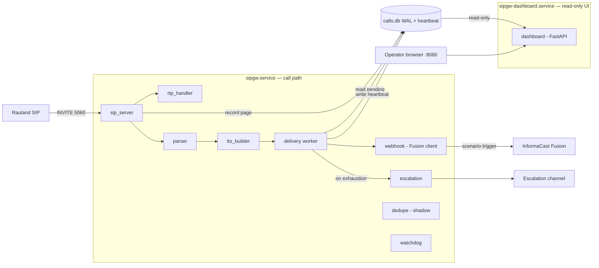

---

## 5. Dependency risk notes

- **No third-party SIP/RTP stack.** The wire-facing code is standard-library
  only. That removes a class of supply-chain and CVE exposure from the call
  path, at the cost of implementing only the SIP subset the gateway needs.
- **`httpx` is the single outbound HTTP dependency** and the single choke point
  for the dry-run NO-SEND guard. Both the Fusion client and escalation share one
  guarded client, so the safety property holds structurally rather than by
  per-call-site discipline.
- **Loose lower-bound pins vs. deployed versions.** `requirements.txt` pins
  minimums, not exact versions; the deployed venv resolved to the versions in
  §3.1. For reproducible rebuilds, pin the deployed column (or a lockfile) so a
  future `pip install` cannot silently pull a newer FastAPI/uvicorn/httpx into
  the life-safety path.
- **`dedupe.py` ships inert.** It is present, imported, and constructed, but it
  does not gate delivery. Do not rely on it to collapse Rauland's duplicate
  INVITEs in the current build; that remains a Roadmap item pending clinical
  sign-off.


\newpage

# Installation & Configuration

This section covers everything required to stand up the **RedEye sip2api Gateway**
on a fresh host and configure it for production: prerequisites, the installer and
the two systemd units, the full `config.yaml` key reference, the `lookups.yaml`
area/room/purpose tables (with worked "add a new area/room" examples), the
firewall/port model, and the environment variables that control config paths and
dry-run.

> This documents the **current production build (`c23f3eb`, the v1.7 line on
> `main`)** as deployed on host `sip2apibridge`. Where the code and older docs
> disagree, the code wins — the authoritative key list below was read straight
> from `sipgw/config.py` at this build.

---

## 1. Prerequisites

| Requirement | Production value | Notes |
|---|---|---|
| Operating system | Ubuntu 24.04.4 LTS | Any modern systemd Linux works; the installer targets Debian/Ubuntu (`apt`). |
| Python | 3.12.3 | Installer accepts **>= 3.11**; production runs 3.12. |
| Privileges | root for install | The service itself runs as the unprivileged `sipgw` user. |
| Privileged port | UDP/TCP 5060 | Granted via `CAP_NET_BIND_SERVICE`, not by running as root. |
| Egress | HTTPS 443 to Singlewire | The gateway must reach `api.icmobile.singlewire.com` for OAuth + paging. |
| Python packages | see `requirements.txt` | `httpx`, `fastapi`, `uvicorn[standard]`, `aiosqlite`, `pyyaml`, `jinja2`, `tzdata` (plus `pytest`/`pytest-asyncio` for the test suite). Installed into a venv by `install.sh`. |

The gateway is pure-Python with no compiled extensions; the only OS packages the
installer adds are `python3-venv` and `python3-pip`.

### Production filesystem layout

| Path | Purpose | Owner / mode |
|---|---|---|
| `/opt/sipgw` | Application code + `config.yaml` + `lookups.yaml` | `sipgw`, config `640` |
| `/opt/sipgw/venv` | Python virtual environment | `sipgw` |
| `/var/log/sipgw` | Log files (4 streams, see §4) | `sipgw`, `750` |
| `/var/lib/sipgw` | SQLite DB `calls.db` (WAL mode) | `sipgw`, `750` |
| `/etc/systemd/system/sipgw.service` | Writer unit | root |
| `/etc/systemd/system/sipgw-dashboard.service` | Dashboard unit | root |

---

## 2. Installation

### 2.1 Run the installer

Copy the release tree to `/opt/sipgw`, then run the installer as root:

```bash
sudo bash /opt/sipgw/install.sh
```

`install.sh` is idempotent and performs seven steps:

1. **Python check** — finds `python3.12`/`python3.11`/`python3` and requires >= 3.11.
2. **System deps** — `apt-get install python3-venv python3-pip`.
3. **Service user** — creates the system user `sipgw` (`nologin`, home `/opt/sipgw`).
4. **Directories** — creates `/var/log/sipgw` and `/var/lib/sipgw`, owned by `sipgw`, mode `750`.
5. **Virtualenv** — builds `/opt/sipgw/venv` and `pip install -r requirements.txt`.
6. **Ownership** — chowns the tree to `sipgw`; keeps `install.sh`/`uninstall.sh` root-owned; sets `config.yaml` to `640`, owner `sipgw` (it holds the Fusion secret).
7. **systemd** — installs and `enable`s both units, then `daemon-reload`.

After the installer completes, before first start:

```bash
sudo -u sipgw editor /opt/sipgw/config.yaml     # set the Fusion client_id / client_secret / scenario_id / audience / scenario_field_id
sudo -u sipgw editor /opt/sipgw/lookups.yaml    # confirm area / room mappings
```

### 2.2 The two systemd services

The paging path is deliberately split from the UI so the dashboard can be
restarted (or crash) without ever interrupting paging.

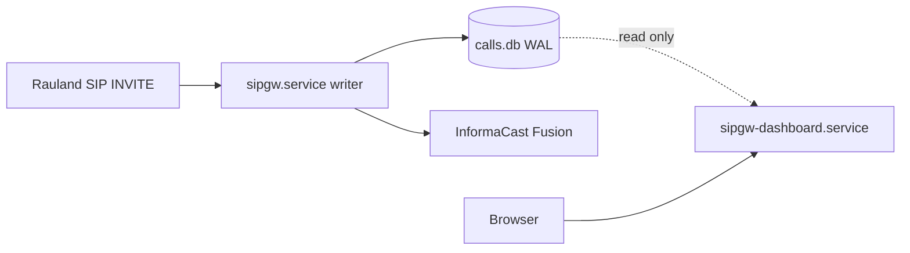

| Unit | Type | Role | Watchdog | Port | Runs |
|---|---|---|---|---|---|
| `sipgw.service` | `notify` | **Writer / life-safety path**: SIP ingress, parse, TTS, durable delivery, heartbeat | `WatchdogSec=30` | 5060 udp+tcp | `python -m sipgw.main /opt/sipgw/config.yaml` |
| `sipgw-dashboard.service` | `simple` | Read-only web UI + `/health` | none | 8080 tcp | `python -m sipgw.dashboard_app /opt/sipgw/config.yaml` |

Key unit facts:

- **Writer (`sipgw.service`)** — `Type=notify` with `WatchdogSec=30`: the app sends
  `READY=1` once listeners are up and pings the watchdog on a cadence; a hung
  event loop is detected and the process restarted. `Restart=always`,
  `RestartSec=5`, and `StartLimitIntervalSec=0` so start-rate limiting can never
  wedge the pager in a failed state. Hardened with `NoNewPrivileges`,
  `ProtectSystem=strict`, `ProtectHome`, `PrivateTmp`, and
  `ReadWritePaths=/var/log/sipgw /var/lib/sipgw /opt/sipgw`. Binds the privileged
  port via `AmbientCapabilities=CAP_NET_BIND_SERVICE` — it does **not** run as root.
- **Dashboard (`sipgw-dashboard.service`)** — plain `Type=simple` long-running HTTP
  server (no watchdog — that stays on the life-safety writer). Opens the DB
  read-only (`query_only`) and reads only the writer's heartbeat row for
  `/health`. Bounded by `MemoryMax=256M` and `CPUQuota=50%` so a runaway UI
  request can never starve the writer. Binds unprivileged 8080, so no
  `CAP_NET_BIND_SERVICE`.

Both units load the **same** `config.yaml` and set
`SIPGW_CONFIG=/opt/sipgw/config.yaml` and
`SIPGW_LOOKUPS=/opt/sipgw/lookups.yaml` in their environment.

### 2.3 Start, verify, and follow logs

```bash
sudo systemctl start sipgw            # writer FIRST
sudo systemctl start sipgw-dashboard  # then the UI
systemctl status sipgw sipgw-dashboard

journalctl -u sipgw -f                # writer
journalctl -u sipgw-dashboard -f      # dashboard

# Dashboard + health once up:
curl -s http://<host-ip>:8080/health
```

Because the dashboard is independent, `systemctl restart sipgw-dashboard` is safe
at any time and never touches the paging path.

---

## 3. `config.yaml` — full reference

`config.yaml` lives at `/opt/sipgw/config.yaml` (mode `640`, owner `sipgw`, since
it holds the Fusion secret). Both services read it. A seed template ships as
`config.yaml.example`.

**Loader behavior (`config.py`):** resolution order is *explicit path >
`SIPGW_CONFIG` env > `/opt/sipgw/config.yaml`*. A missing file or any missing key
falls back to the built-in default. **Unknown keys and unknown sections are not
fatal** — they are ignored but logged as a non-fatal warning (`unknown key
'…' ignored (typo?)`), so a typo shows up loudly in the startup log instead of
silently doing nothing.

**Fail-fast validation (`validate_config`)** runs at startup. In production
(dry-run off) it **refuses to start** unless the Fusion credentials, `scenario_id`,
`audience`, and a preset `scenario_field_id` are all present, plus a set of range
checks (ports, RTP range, CIDRs, delivery tuning). Other odd-but-survivable
values become warnings.

### 3.1 `sip:` — SIP ingress and dialog handling

```yaml
sip:
  bind_ip: "0.0.0.0"
  bind_port: 5060
  allowed_networks:
    - "172.16.0.0/12"
    - "127.0.0.0/8"
    - "10.0.0.0/8"
  call_timeout_seconds: 600
  immediate_bye: true
  immediate_bye_ack_timeout_seconds: 2.0
  rtp_port_range_start: 10000
  rtp_port_range_end: 20000
```

| Key | Default | Meaning |
|---|---|---|
| `bind_ip` | `0.0.0.0` | Address the SIP listener binds. |
| `bind_port` | `5060` | SIP port (UDP + TCP). Must be 1–65535 (validated). |
| `allowed_networks` | `["172.16.0.0/12"]` | CIDR allowlist for accepted SIP sources. Each entry must be a valid CIDR (validated); an empty list means **every** source is rejected (warned). This is the primary ingress control today — see §5. |
| `call_timeout_seconds` | `600` | Max dialog lifetime before the gateway tears it down. `<=0` warns. |
| `immediate_bye` | `false` (prod sets `true`) | ACK-gated immediate BYE: the gateway answers `200 OK`, keeps the dialog, and sends its BYE only after the caller's ACK — killing the old 481 race. |
| `immediate_bye_ack_timeout_seconds` | `2.0` | Per-call fallback: if the ACK is lost, fire the deferred BYE and free the RTP port after this many seconds so a dropped ACK can never strand a dialog. `<=0` with `immediate_bye` on is warned (the BYE could fire before an ACK arrives). |
| `rtp_port_range_start` | `10000` | Low end of the RTP port pool. |
| `rtp_port_range_end` | `20000` | High end. Must be `> start` (fatal otherwise). |

Production allowlist matches the upstream SIP path: Rauland UAC `172.20.9.170` →
proxy `172.20.9.176` → gateway `10.249.0.60`.

### 3.2 `fusion:` — InformaCast Fusion webhook (secrets live here)

```yaml
fusion:
  base_url: "https://api.icmobile.singlewire.com/api"
  token_url: "https://api.icmobile.singlewire.com/api/token"
  audience: "<PROVIDER_ID>"
  scenario_id: "<SCENARIO_ID>"
  scenario_endpoint: "/v1/scenario-notifications"
  variable_name: "customTTS"
  scenario_field_id: "<FIELD_ID>"
  client_id: "<CLIENT_ID>"
  client_secret: "<CLIENT_SECRET>"
  token_refresh_margin_seconds: 300
  dry_run: false
```

| Key | Default | Meaning |
|---|---|---|
| `base_url` | `https://api.icmobile.singlewire.com/api` | Fusion API base. Must be an http(s) URL (fatal otherwise). |
| `token_url` | `…/api/token` | OAuth2 token endpoint. Must be http(s) (fatal otherwise). |
| `audience` | `""` | Fusion provider/audience ID. **Required in production.** Customer-owned; may be shown. |
| `scenario_id` | `""` | The "SIPtoTTSBridge" scenario ID. **Required in production.** |
| `scenario_endpoint` | `/v1/scenario-notifications` | Scenario-trigger path appended to `base_url`. |
| `variable_name` | `customTTS` | The scenario field variable the TTS string is written into. |
| `scenario_field_id` | `""` | Resolved field ID for `variable_name`. **Required (preset) in production** so the first real page never triggers a live field-id lookup. |
| `client_id` | `""` | OAuth2 client id. **Required in production. Mask as `<CLIENT_ID>` — never print the value.** |
| `client_secret` | `""` | OAuth2 client secret. **Required in production. Mask as `<CLIENT_SECRET>` — never print.** |
| `token_refresh_margin_seconds` | `300` | Refresh the OAuth token this many seconds before expiry so a page never blocks on a token round-trip (background refresh). |
| `dry_run` | `false` | When true (or env `SIPGW_DRY_RUN=1`), the HTTP client is built with the no-send guard so no notification can reach a real host. See §6. |

> **Secret handling:** set `client_id`, `client_secret`, `scenario_id`, `audience`,
> and `scenario_field_id` on the host only. The file is `640`/`sipgw`-owned. In
> docs, screenshots, and support bundles the credential values must appear only as
> `<CLIENT_ID>` / `<CLIENT_SECRET>`.

### 3.3 `tts:` — spoken-message shaping

```yaml
tts:
  play_count: 3
  message_preamble: "Attention! Attention! "
  iteration_preamble: ""
```

| Key | Default | Meaning |
|---|---|---|
| `play_count` | `3` | How many times the page repeats. |
| `message_preamble` | `"Attention! "` | Text prepended to the first spoken iteration. |
| `iteration_preamble` | `"Attention! "` | Text prepended to each subsequent iteration. |

### 3.4 `delivery:` — durable-outbox retry worker

```yaml
delivery:
  max_attempts: 6
  base_backoff_seconds: 2.0
  max_backoff_seconds: 60.0
  max_age_seconds: 900.0
  poll_interval_seconds: 1.0
  batch_size: 20
```

| Key | Default | Meaning |
|---|---|---|
| `max_attempts` | `6` | Delivery attempts before a page is marked `failed` and escalated. Must be >= 1 (fatal otherwise). |
| `base_backoff_seconds` | `2.0` | Initial retry backoff. |
| `max_backoff_seconds` | `60.0` | Backoff ceiling. |
| `max_age_seconds` | `900.0` | An undelivered page older than this is marked `expired` and escalated. `<=0` warns. |
| `poll_interval_seconds` | `1.0` | Worker poll cadence. Must be > 0 (fatal otherwise). |
| `batch_size` | `20` | Rows claimed per poll. |

This outbox + retry loop is what prevents the 2026-06-12 lost-Code-Blue failure
mode (a transient timeout during an inline OAuth fetch): the call is durably
recorded first, then delivered with bounded retries, with the token refreshed off
the critical path.

### 3.5 `escalation:` — human alert channel on permanent failure

```yaml
escalation:
  webhook_url: ""
  timeout_seconds: 10.0
```

| Key | Default | Meaning |
|---|---|---|
| `webhook_url` | `""` | Teams/Slack/PagerDuty/NOC webhook fired when a page is `failed` or `expired`. Empty disables escalation (failures still logged at ERROR). Must be http(s) if set (fatal otherwise). In production, an empty value is **warned**. |
| `timeout_seconds` | `10.0` | HTTP timeout for the escalation POST. |

### 3.6 `health:` — heartbeat, Fusion reachability, inbound liveness

```yaml
health:
  heartbeat_interval_seconds: 10.0
  stale_after_seconds: 30.0
  keepalive_interval_seconds: 300.0
  fail_on_fusion_unreachable: false
  fusion_unreachable_max_age_seconds: 0.0
  inbound_flush_interval_seconds: 30.0
  inbound_stale_after_seconds: 432000.0
  inbound_escalate_after_seconds: 0.0
  path: "/var/lib/sipgw/calls.db"
```

| Key | Default | Meaning |
|---|---|---|
| `heartbeat_interval_seconds` | `10.0` | Writer stamps a heartbeat this often; the dashboard reads it. |
| `stale_after_seconds` | `30.0` | `/health` returns 503 once the heartbeat is older than this (the single liveness authority). |
| `keepalive_interval_seconds` | `300.0` | Cadence of the read-only Fusion **reachability** probe (a bounded scenario GET — never a page). `< 30s` warns (may hammer Fusion). |
| `fail_on_fusion_unreachable` | `false` | Opt-in: when true, a *present + fresh* failed probe makes `/health` return 503 `fusion-unreachable`. Default off — a Fusion blip stays informational only. Keep false with a single node behind an LB/monitor. |
| `fusion_unreachable_max_age_seconds` | `0.0` | Freshness bound for the degrade above. `0.0` = auto-derive from probe cadence. |
| `inbound_flush_interval_seconds` | `30.0` | How often the writer flushes the last-inbound-SIP time to the DB. |
| `inbound_stale_after_seconds` | `432000.0` (5 days) | Dashboard shows "last inbound from Rauland" amber past this. Informational — never gates `/health`. |
| `inbound_escalate_after_seconds` | `0.0` (OFF) | Opt-in once-per-episode silence alert via the escalation webhook. If enabled, keep it above the observed ~4.27-day max quiet gap (recommend >= 432000); a lower value warns. |
| `path` | `/var/lib/sipgw/calls.db` | DB path used by the health/heartbeat reads (mirrors `database.path`). |

### 3.7 `dedupe:` — clinical duplicate suppression

> **IMPORTANT — what this build actually does.** At `c23f3eb` the dedupe feature
> ships **SHADOW / DISABLED and safe-by-default**. `enforce: true` is a **fatal
> config error** — the writer refuses to start with it on — because suppressing a
> page is dropping a Code Blue, and enforcement is not yet clinically approved in
> code. Only the two keys below are consumed at this build; `match_bed` and
> `match_purpose` exist as dataclass fields (defaults `true`) but do not enable
> enforcement.

```yaml
dedupe:
  enforce: false        # true = FATAL at this build (refuses to start)
  window_seconds: 0     # 0 = shadow lookup never runs; >0 = shadow telemetry only
  match_bed: true        # field present; not an enforcement switch at this build
  match_purpose: true    # field present; not an enforcement switch at this build
```

| Key | Default | Meaning |
|---|---|---|
| `enforce` | `false` | `false` = never suppresses. **`true` is fatal at this build.** |
| `window_seconds` | `0` | `0` = the duplicate lookup never runs. `>0` with `enforce:false` is **shadow-only telemetry**: each clinical duplicate is logged (`WOULD suppress … gap=…`) and annotated (`duplicate_of`) to measure the real duplicate rate — but **every page is still delivered**. |
| `match_bed` | `true` | Match key includes bed (field present; consumed once enforcement ships). |
| `match_purpose` | `true` | Match key includes call purpose (field present; consumed once enforcement ships). |

**Recommended production setting:** leave `enforce: false`. To *measure* the
Rauland double-emit rate without ever suppressing, set `window_seconds: 60` — this
turns on the shadow "WOULD suppress" telemetry only. Enforcing suppression
(collapsing the two INVITEs Rauland emits per event) is on the roadmap and
requires both clinical sign-off and the code change that lifts the fatal guard;
until then it is documented as planned, not deployed.

### 3.8 `logging:`

```yaml
logging:
  log_dir: "/var/log/sipgw"
  retention_days: 90
  rotation_time: "midnight"
  timezone: ""
  api_debug_log: true
  sip_debug_log: true
```

| Key | Default | Meaning |
|---|---|---|
| `log_dir` | `/var/log/sipgw` | Directory for the log streams. |
| `retention_days` | `90` | Rotated-log retention. |
| `rotation_time` | `midnight` | Daily rotation boundary. |
| `timezone` | `""` | Display/day-boundary zone; `""` reads the host local tz. **Note:** the production host clock is `Etc/UTC`, so stored timestamps are UTC RFC3339 regardless — setting `America/New_York` here affects dashboard display/day-bucketing, not the stored timestamp value. |
| `api_debug_log` | `true` | Enable the API debug stream. |
| `sip_debug_log` | `true` | Enable the SIP debug stream. |

The writer owns four rotating streams in `log_dir`: `sipgw.log`,
`sipgw_api_debug.log`, `sipgw_sip_debug.log`. The dashboard writes its own
`sipgw_dashboard.log` (never the writer's files), for four streams total, 90-day
retention.

### 3.9 `dashboard:`

```yaml
dashboard:
  port: 8080
  bind_ip: "0.0.0.0"
  auto_refresh_seconds: 30
  page_size: 20
```

| Key | Default | Meaning |
|---|---|---|
| `port` | `8080` | Dashboard HTTP port. Must be 1–65535 (fatal otherwise). |
| `bind_ip` | `0.0.0.0` | Address the dashboard binds. |
| `auto_refresh_seconds` | `30` | Client-side auto-refresh interval. |
| `page_size` | `20` | Call-table rows per page. |

> **Security note:** the dashboard has **no authentication** ("No authentication
> required" — `dashboard.py`). Restrict access at the network layer (see §5).

### 3.10 `database:`

```yaml
database:
  path: "/var/lib/sipgw/calls.db"
```

| Key | Default | Meaning |
|---|---|---|
| `path` | `/var/lib/sipgw/calls.db` | SQLite DB (WAL mode). Required (fatal if empty). The writer opens it read-write; the dashboard opens it read-only. In dry-run, a hard barrier refuses to start if this resolves to the production DB (see §6). |

---

## 4. `lookups.yaml` — area / purpose / room tables

`lookups.yaml` (seed: `lookups.yaml.example`) maps the numeric IDs Rauland sends
into speech-ready names. It is **hot-reloaded**: `lookups.py` tracks the file's
mtime and reloads on change with **no service restart** — edits go live on the
next call. A malformed edit is caught and the previous good tables keep serving.

Resolution order for the path: *explicit > `SIPGW_LOOKUPS` env >
`/opt/sipgw/lookups.yaml`*.

### 4.1 The four tables

| Section | Shape | Purpose |
|---|---|---|
| `areas` | `area_id: "Spoken name"` | Area ID → speech-ready area name. Phonetic spelling and `...` pauses are intentional for TTS clarity. |
| `call_purposes` | `substring: "Spoken purpose"` | Substring searched in the SIP display name; **first match wins**. |
| `rooms` | `room: "Spoken name"` | Room-only fallback (empty `{}` in production). |
| `area_rooms` | `"area*room": "Spoken name"` | Area+room combo override — highest priority; disambiguates the same room number across areas. |

Plus the defaults: `default_area` (`"Unknown Area."`), `default_purpose`
(`"Code Blue"` in production — deliberately the most critical, fail-safe),
`default_room_format` (`"Room {room}."`, `{room}` is the numeric placeholder).

**Room-name resolution priority** (`get_room_name`):

1. `area_rooms["area*room"]` combo override, else
2. `rooms[room]`, else
3. `default_room_format`.

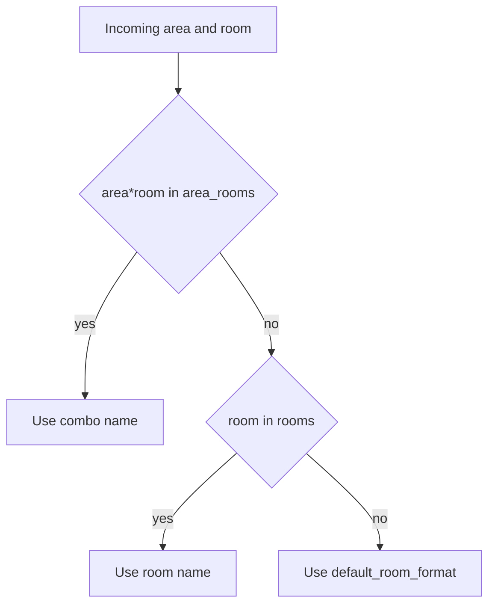

### 4.2 Worked example — add a new area

Say a new unit "4th Floor Oncology" is assigned area ID `740`. Add one line under
`areas:`:

```yaml
areas:
  # …existing entries…
  740: "4th Floor... Oncology..."
```

Use `...` between phrases where you want the TTS voice to pause, and phonetic
spellings where the raw text mis-speaks (e.g. `720: "1st Floor... Pack you..."`
for PACU). Save the file — the next page for area `740` speaks the new name; no
restart needed.

### 4.3 Worked example — add a new room (combo override)

Room `2250` already exists as "Echo 2" under area `797`. Suppose area `740` also
has a room `2250` that must be spoken differently. Add a combo override — it wins
over any `rooms` entry:

```yaml
area_rooms:
  # …existing entries…
  "740*2250": "Oncology Infusion Bay 2"
```

If instead a room number should map the same way regardless of area, put it in the
room-only table:

```yaml
rooms:
  "2250": "Echo Bay"
```

Remember the code appends a trailing `"."` to `rooms`/`area_rooms` values (so
write `"Oncology Infusion Bay 2"`, not `"Oncology Infusion Bay 2."`), whereas
`default_room_format` supplies its own punctuation.

### 4.4 Verifying lookups

Two ways to confirm an edit took effect:

- **Dashboard** — the dashboard exposes `/api/verify-lookups` (surfaced in the UI's
  verify-lookups panel). Because lookups hot-reload, it reflects the current file.
- **Logs** — on each load, `sipgw.log` records a line like
  `Loaded 35 area, 3 purpose, 0 room, and 273 area+room mappings from
  /opt/sipgw/lookups.yaml`; a change on disk logs `lookups.yaml changed on disk,
  reloading...`. Compare the counts against what you expect after the edit.

After a non-trivial edit, send one test event (or a dry-run drill — see §6) and
confirm the spoken area/room/purpose match, since a wrong mapping speaks a wrong
location on a live Code Blue.

---

## 5. Firewall, ports, and network exposure

### 5.1 Port table

| Direction | Proto / Port | Peer | Purpose |
|---|---|---|---|
| Inbound | UDP **5060** | SIP allowlist (Rauland path) | SIP INVITE ingress |
| Inbound | TCP **5060** | SIP allowlist | SIP over TCP |
| Inbound | UDP 10000–20000 | RTP peers | RTP media (config `rtp_port_range_*`) |
| Inbound | TCP **8080** | Ops / admin subnet only | Dashboard + `/health` (**no auth**) |
| Outbound | TCP **443** | `api.icmobile.singlewire.com` | Fusion OAuth token + scenario trigger |

Production host `sip2apibridge` = `10.249.0.60` (ens34). App-level SIP allowlist:
`172.16.0.0/12`, `127.0.0.0/8`, `10.0.0.0/8`.

### 5.2 No host firewall today — recommendation

> **Current state:** the host has **no active firewall** (nftables ruleset is
> empty). Ingress protection relies entirely on the app-level SIP allowlist
> (`sip.allowed_networks`), and the dashboard on :8080 has **no authentication**.

Recommended hardening (add an nftables ruleset):

- Allow **5060 udp+tcp** only from the SIP allowlist sources.
- Allow **8080 tcp** only from the ops/admin management subnet — this is the sole
  guard on the unauthenticated dashboard.
- Allow the RTP range (10000–20000/udp) from expected media peers.
- Allow egress **443** to Singlewire.
- Default-drop everything else inbound.

Example skeleton (adapt the source prefixes to your environment):

```nft
table inet sipgw {
  chain input {
    type filter hook input priority 0; policy drop;
    ct state established,related accept
    iif "lo" accept
    ip saddr { 172.16.0.0/12, 10.0.0.0/8, 127.0.0.0/8 } udp dport 5060 accept
    ip saddr { 172.16.0.0/12, 10.0.0.0/8, 127.0.0.0/8 } tcp dport 5060 accept
    ip saddr { 172.16.0.0/12, 10.0.0.0/8 } udp dport 10000-20000 accept
    ip saddr <MGMT_SUBNET> tcp dport 8080 accept
  }
}
```

Keep the app allowlist as defense-in-depth even after adding nftables.

---

## 6. Environment variables

| Variable | Set by | Effect |
|---|---|---|
| `SIPGW_CONFIG` | both units (`/opt/sipgw/config.yaml`) | Config path when no explicit path is passed. Resolution: explicit arg > `SIPGW_CONFIG` > default. |
| `SIPGW_LOOKUPS` | both units (`/opt/sipgw/lookups.yaml`) | Lookups path. Resolution: explicit > `SIPGW_LOOKUPS` > default. |
| `SIPGW_DRY_RUN` | operator (unset in prod) | `=1` forces **dry-run**: the HTTP client is wrapped in the no-send guard so **no** outbound notification can reach a real host (only `127.0.0.1` is forwarded, for local mock drills). |

**Dry-run semantics (`safety.py`) — important safety properties:**

- Effective dry-run = `config.fusion.dry_run` **OR** `SIPGW_DRY_RUN=1`. The env var
  can only **enable** dry-run, never disable it — there is no code path that lets
  an env value force real sending when the config has it on.
- In dry-run every log line is prefixed `[TEST]` across all streams, and test
  traffic is marked `is_test` — it never fires a real page and never counts in
  stats.
- **Production-DB barrier:** in dry-run/test the writer **refuses to start** if
  `database.path` resolves to the production DB (`/var/lib/sipgw/calls.db`). Staging
  runs must point `database.path` at a staging-only file, so no test artifact can
  ever land in the production DB.

Use dry-run for install validation and mapping drills:

```bash
sudo -u sipgw SIPGW_DRY_RUN=1 \
  /opt/sipgw/venv/bin/python -m sipgw.main /opt/sipgw/staging-config.yaml
```

(Point the staging config's `database.path` away from the production DB, or the
barrier will abort startup by design.)


\newpage

# Security & Hardening

This section documents the security posture of the **RedEye sip2api Gateway** as
deployed in the current production build (`c23f3eb`, the v1.7 line) on host
`sip2apibridge`. It is written for BOTH the Tift Regional IT/telecom team and
RedEye support: it states plainly what is protected today, what is **not** yet
protected, and gives concrete hardening recommendations. Nothing is withheld.

Because this gateway sits on the **life-safety paging path** (Rauland nurse-call
SIP INVITE → InformaCast Fusion Code Blue / RRT overhead page), the security
model deliberately favors *availability* over lockdown: a control that could
silently drop or delay a page is treated as a hazard, not a feature. Several
choices below (no start-rate limiting, informational-only health degrade, wide
SIP allowlist) follow directly from that priority.

---

## 1. Security posture at a glance

| Control | Status today | Where enforced |
|---|---|---|
| Credential masking in logs (client_id **and** client_secret, bearer tokens, access_token) | **Enforced** | `webhook.py` `_log_request()` |
| SIP source-IP allowlist | **Enforced** (application layer) | `sip_server.py` `_is_allowed()` |
| systemd sandboxing on **both** units | **Enforced** | `sipgw.service`, `sipgw-dashboard.service` |
| Egress TLS to Singlewire Fusion | **Enforced** (HTTPS) | `fusion.base_url` / `token_url` |
| Background OAuth token refresh (token off the critical path) | **Enforced** | `webhook.py` refresh loop |
| Dry-run / test-mode no-send guarantee | **Enforced** (structural) | `safety.py` `NoSendGuardTransport` |
| Config file permissions (`0640`), data/log dirs (`0750`) | **Enforced** at install | `install.sh` |
| **Host firewall (nftables) on :5060 / :8080** | **NOT PRESENT** — flagged below | — |
| **Dashboard authentication on :8080** | **NONE** — flagged below | — |
| **Coordinated OS auto-restart of the paging service** | **NOT enforced** — lesson #20 | — |

The three highlighted rows are the open gaps. They are addressed in
[§8 Known gaps & hardening recommendations](#8-known-gaps--hardening-recommendations).

---

## 2. Trust boundaries

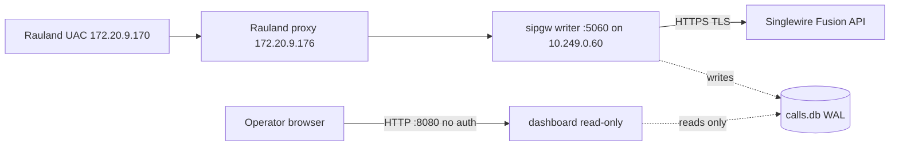

Three boundaries matter:

1. **Ingress (Rauland → :5060).** Untrusted at the packet level (UDP/TCP 5060 is
   bound on `0.0.0.0`). The only gate today is the **application allowlist**
   (§3). There is **no host firewall** in front of it.
2. **Egress (gateway → Fusion).** Outbound HTTPS to
   `https://api.icmobile.singlewire.com/api`. TLS-protected; OAuth2
   client-credentials. Secrets never leave the host in cleartext and are masked
   in logs (§4).
3. **Management (operator → :8080).** The dashboard is a **read-only,
   unauthenticated** web UI. Anyone who can reach TCP 8080 on `10.249.0.60` can
   view call history, room/area, and diagnostic bundles (§6, §7).

---

## 3. Network ingress: SIP source-IP allowlist

The writer (`sipgw.service`) binds SIP on `0.0.0.0:5060` (UDP + TCP) and gates
every inbound message by **source IP** against `sip.allowed_networks`.

Current production allowlist (`config.yaml`):

```yaml
sip:
  bind_ip: "0.0.0.0"
  bind_port: 5060
  allowed_networks:
    - "172.16.0.0/12"   # Rauland / hospital RFC1918 range (UAC + proxy live here)
    - "127.0.0.0/8"     # loopback (local drills / mock server)
    - "10.0.0.0/8"      # gateway's own subnet (10.249.0.60) and adjacent infra
```

Enforcement (`sip_server.py`):

```python
def _is_allowed(self, addr: str) -> bool:
    try:
        ip = ip_address(addr)
        return any(ip in net for net in self.allowed_networks)
    except ValueError:
        return False
```

A message from a non-allowlisted source is answered `403 Forbidden` and dropped
before any parse, TTS, dedupe, or delivery work is done. Importantly, the
**inbound-liveness timestamp is stamped only AFTER the allowlist check**, so
stray or hostile traffic on :5060 cannot mask a real Rauland-side outage in the
`/health` liveness signal.

**Posture note — this is application-layer, not packet-layer.** The allowlist
runs inside the Python process; a packet still reaches the socket and the app
before it is rejected. The allowlist is also **wide** (three large RFC1918
blocks) because the Rauland call path spans multiple hospital subnets and must
never be accidentally excluded. It is *not* a substitute for a firewall — see
§8. Tightening the allowlist to just the Rauland UAC/proxy hosts
(`172.20.9.170`, `172.20.9.176`) plus loopback and the gateway subnet is a
reasonable defense-in-depth step, but must be coordinated with telecom so no
legitimate call source is dropped.

---

## 4. Credential handling & log masking

### 4.1 Secrets at rest

The Fusion OAuth2 client credentials (`fusion.client_id`, `fusion.client_secret`)
live only in `/opt/sipgw/config.yaml`. That file is installed mode **`0640`**,
owned by the `sipgw` service account — readable by the service, not
world-readable. The data and log directories are **`0750`**.

```bash
# install.sh
chmod 640 "$INSTALL_DIR/config.yaml"
chmod 750 "$LOG_DIR" "$DATA_DIR"
```

> **Operational rule:** never widen `config.yaml` to world-readable, and never
> commit a filled-in `config.yaml` to source control. The repository ships
> `config.yaml.example` with placeholders (`YOUR_CLIENT_ID`,
> `YOUR_CLIENT_SECRET`) only.

### 4.2 Secrets in logs — masking is enforced

The four log streams (`sipgw.log`, `sipgw_api_debug.log`, `sipgw_sip_debug.log`,
`sipgw_dashboard.log`) capture full request/response traces for
troubleshooting. `webhook.py` `_log_request()` masks every credential-bearing
field **by default** (`mask_secrets=True`):

- **`Authorization: Bearer …`** request header → truncated to the first 27
  characters + `...`.
- **`client_secret=…`** in the form-encoded token request body → replaced with
  `***`.
- **`client_id=…`** in the token request body → replaced with `***`. *(This
  client_id masking was added in the v1.7 line; previously the client_id VALUE
  could appear in `sipgw_api_debug.log`.)*
- **`access_token`** in JSON token responses → truncated to the first 20
  characters + `...`.

```python
body_text = re.sub(r"(client_secret=)([^&]+)", _mask, body_text)
body_text = re.sub(r"(client_id=)([^&]+)",     _mask, body_text)
```

Net effect: neither the client_id value nor the client_secret value nor a full
bearer/access token is ever written to disk in the shipped configuration.

### 4.3 OAuth token off the critical path

A **background refresh loop** (`webhook.py`) renews the Fusion OAuth token
~`token_refresh_margin_seconds` (default 300s) before expiry, guarded by an
`asyncio.Lock`. This is both a reliability and a security property: the token is
never fetched *inline* during a Code Blue page (which is exactly what caused the
2026-06-12 lost page), and the token is cached in memory only, never persisted.
Egress to the token endpoint and the scenario endpoint is HTTPS/TLS.

---

## 5. Host & service sandboxing (systemd)

Both units run as the unprivileged `sipgw` user/group and carry matching
sandbox directives. This is the primary OS-level containment today.

| Directive | `sipgw.service` (writer) | `sipgw-dashboard.service` (UI) | Effect |
|---|---|---|---|
| `User` / `Group` | `sipgw` / `sipgw` | `sipgw` / `sipgw` | No root. |
| `NoNewPrivileges` | `true` | `true` | No setuid escalation. |
| `ProtectSystem` | `strict` | `strict` | Whole FS read-only except allowlisted paths. |
| `ReadWritePaths` | `/var/log/sipgw /var/lib/sipgw /opt/sipgw` | `/var/lib/sipgw /var/log/sipgw` | Only its own data/log dirs are writable. |
| `ProtectHome` | `true` | `true` | `/home`, `/root` hidden. |
| `PrivateTmp` | `true` | `true` | Private `/tmp`. |
| Capabilities | `CAP_NET_BIND_SERVICE` (ambient + bounding) | *none* | Writer may bind privileged :5060; dashboard binds unprivileged :8080 and holds no caps. |
| `MemoryMax` / `CPUQuota` | — | `256M` / `50%` | Dashboard cannot starve the life-safety writer. |
| `LimitNOFILE` | `65535` | `65535` | FD headroom. |

Design intent worth noting:

- The writer holds **exactly one** capability (`CAP_NET_BIND_SERVICE`) and no
  more — the capability bounding set is pinned to it.
- The dashboard holds **no** capabilities and is boxed by a memory/CPU cgroup so
  a runaway UI request cannot degrade paging. (These cgroup limits are enforced
  only under real systemd with the relevant controllers; they are inert in
  containers/CI.)
- `StartLimitIntervalSec=0` on both units: start-rate limiting is deliberately
  disabled so systemd can **never** wedge the life-safety pager in the `failed`
  state after repeated restarts. This is an availability choice, called out here
  because it interacts with the OS-patching lesson in §8.

---

## 6. The dashboard: read-only, but unauthenticated

`sipgw-dashboard.service` runs `dashboard_app.py` on `:8080` (bound `0.0.0.0`).
Its integrity story is strong; its confidentiality/access story is the main gap.

**What protects it:**

- It opens `calls.db` **read-only** (`query_only=ON` after connect) and only
  *reads* the writer's heartbeat row. It cannot write call state, cannot fire a
  page, and cannot corrupt the outbox. Restarting or crashing the dashboard has
  **zero** effect on paging — the two services are fully decoupled.
- It is memory/CPU-capped (§5) and holds no capabilities.

**What does NOT protect it:**

- **There is no authentication and no authorization on `:8080`.** Any host that
  can reach TCP 8080 on `10.249.0.60` can browse the full call table, the 90-day
  charts, the `/call/{id}` correlated detail view, the date-picker log viewer,
  and can export **per-call plain-text diagnostic bundles**. Those bundles and
  views include room/area/bed and TTS message text (§7).

> **Stated assumption (documented, not assumed-safe):** the current design
> assumes `:8080` is reachable **only** from a trusted management network/VLAN.
> That assumption is **not currently enforced by any control on the host** —
> there is no firewall (§8) and no app auth. Treat network reachability to
> `:8080` as equivalent to full read access to call history.

Recommendation: restrict `:8080` at the network layer (management VLAN /
firewall rule, see §8) and/or place an authenticating reverse proxy in front of
the dashboard. Until then, do not route `:8080` onto any general-access subnet.

---

## 7. Data sensitivity: PHI-adjacency

The gateway does not store patient names or MRNs, but the data it *does* handle
is **PHI-adjacent** and should be treated as sensitive under the hospital's HIPAA
posture:

- **Room / area / bed** identifiers parsed from the SIP INVITE (and resolved via
  `lookups.yaml`).
- **TTS message text** (`customTTS`) — e.g. "Code Blue, ICU room 4" — which is
  what gets announced overhead and is stored/displayed for correlation.
- These appear in `calls.db`, in the log streams, in the dashboard detail views,
  and in exported diagnostic bundles.

Handling controls in force:

- Data at rest is under `/var/lib/sipgw` (`0750`) and `/var/log/sipgw`
  (`0750`), owned by `sipgw`.
- **90-day retention** with async rotation (#6) bounds how long room/TTS data
  persists.
- Diagnostic bundles are plain text — when shared with RedEye support, treat
  them as PHI-adjacent: transfer over an encrypted channel and delete local
  copies after use.
- The `/call/{id}` and log views are gated only by network reachability to
  `:8080` (§6) — which is exactly why restricting that port matters here.

---

## 8. Known gaps & hardening recommendations

These are the deployed build's real weaknesses. Fixing the first two is the
highest-value security work available today.

### 8.1 No host firewall (HIGH) — add nftables for :5060 and :8080

Per the 2026-07-07 host inventory, `sip2apibridge` runs with **empty nftables
(no active host firewall)**. All ingress protection currently rests on the
application allowlist (§3, which only covers :5060) and on the *assumption* that
:8080 is on a trusted network (§6, unenforced).

**Recommendation:** add an nftables ruleset that:

- Permits **UDP/TCP 5060** only from the Rauland source ranges (ideally the
  UAC/proxy hosts `172.20.9.170` / `172.20.9.176`, or the `172.16.0.0/12` block
  if per-host is too brittle) plus loopback.
- Permits **TCP 8080** only from the designated management VLAN / jump host.
- Permits established/related and drops everything else inbound by default.

This gives packet-layer defense in depth **in front of** the app allowlist and,
critically, provides the *only* access control the dashboard would otherwise
have. Stage and test any ruleset against a live drill before enabling — a
mis-scoped rule that blocks Rauland would silently break paging.

### 8.2 Dashboard has no auth (HIGH) — restrict the network path

See §6. Until authentication exists in the product, keep `:8080` on a management
network and firewall it (§8.1). Do not expose it broadly.

### 8.3 Uncoordinated OS auto-restart of the paging service (HIGH) — lesson #20

On **2026-07-07**, an **unattended-upgrades / needrestart auto-restart** bounced
`sipgw.service` *uncoordinated* (issue **#20**). Because the gateway is currently
a **single paging node**, an OS-driven restart at the wrong moment is a direct
availability risk to Code Blue delivery — the OS took a life-safety action with
no operational coordination.

**Recommendations:**

- **Coordinate or disable unattended restarts of `sipgw.service`.** On Ubuntu
  24.04, prevent `needrestart` from auto-restarting the paging unit and schedule
  any required restart into a maintenance window with clinical/telecom
  awareness. Keep security patching, but take the *service restart* decision out
  of the OS's hands for this unit.
- Treat any restart of the writer as a paging outage window, however brief. The
  durable outbox (WAL) means an in-flight call survives a clean restart, but an
  INVITE arriving during the socket-down instant is not yet protected.
- **Durable fix — issue #19 (planned, roadmap):** zero-downtime writer restarts
  via **systemd socket activation**, so the SIP socket stays up across a writer
  restart and no inbound INVITE is dropped during a bounce. This is the
  structural remedy for #20 and is tracked as roadmap, not shipped.

### 8.4 Wide SIP allowlist (MEDIUM)

The `172.16.0.0/12` + `10.0.0.0/8` allowlist is broad (§3). Once §8.1 provides a
firewall, consider narrowing the app allowlist toward the specific Rauland hosts
for defense in depth. Change only with telecom sign-off.

---

## 9. Safe-by-default: dry-run / test mode never pages

`safety.py` provides a **structural** no-send guarantee for development,
staging, and drills — it is not discipline at each call site, it is enforced at
the transport layer so it cannot be bypassed by forgetting a flag.

- **Effective dry-run** = config `dry_run: true` **OR** env `SIPGW_DRY_RUN=1`.
  The environment can only *enable* dry-run; there is deliberately **no** code
  path by which any env value forces real sending. (`effective_dry_run()`.)
- In dry-run the shared httpx client is built with **`NoSendGuardTransport`**,
  which refuses any request whose host is not `127.0.0.1`: it records the
  attempt and returns a synthetic response instead of touching the network.
  Because every Fusion origin (token fetch, field resolve, scenario trigger,
  the Fusion reachability keepalive) **and** the escalation webhook share this
  one client, none of them can reach a real host in dry-run.

```python
ALLOWED_HOSTS = frozenset({"127.0.0.1"})  # the ONLY host that may receive traffic in dry-run
```

- **Production-DB barrier** (`assert_safe_database_path`): if dry-run/test is
  active and `database.path` resolves to the production DB
  (`/var/lib/sipgw/calls.db`), startup **aborts** (`ProdDatabaseBarrier`). Test
  runs must point at a staging DB — no test artifact can land in production.
- **`[TEST]` log marker** (`TestMarkerFilter`): while dry-run/test is active,
  every log line across all three writer streams is prefixed `[TEST] `,
  including every physical line of multi-line SIP/API dumps, so no test line is
  ever mistaken for a real page.
- **`is_test` marking:** test traffic marked `is_test` **never fires a real
  page, never counts in stats, and is hidden from the dashboard** — test drills
  cannot pollute clinical metrics.

Security relevance: this is what lets RedEye and Tift run realistic paging drills
and staging tests *safely* — a misconfigured test cannot emit a real overhead
page, cannot hit the escalation channel, and cannot write to the production
database.

---

## 10. Operator security checklist

- [ ] `config.yaml` is mode `0640`, owned by `sipgw`; never world-readable, never
      committed with real secrets.
- [ ] Confirm log masking is active (grep the api-debug log for `client_secret`
      / `client_id` values — you should see `***`, and never a real token).
- [ ] **Add nftables** restricting :5060 to Rauland sources and :8080 to the
      management VLAN (§8.1).
- [ ] Keep `:8080` off any general-access subnet until authentication exists
      (§6, §8.2).
- [ ] **Disable/coordinate unattended-upgrades restarts of `sipgw.service`**;
      restart only in a maintenance window (§8.3, #20).
- [ ] Treat exported diagnostic bundles and dashboard views as PHI-adjacent;
      transfer encrypted, delete after use (§7).
- [ ] Verify both units still run as `sipgw` with `NoNewPrivileges` and
      `ProtectSystem=strict` after any change (§5).
- [ ] For any staging/drill, confirm `SIPGW_DRY_RUN=1` (or config `dry_run`) and
      a **staging** `database.path` before starting (§9).


\newpage

# Operations Runbook

> **Scope.** Day-2 operations for the deployed production build (`c23f3eb`, the
> v1.7 line) on host **`sip2apibridge`** (Ubuntu 24.04.4, Python 3.12.3). This
> section is command-level: how to start, stop, restart, upgrade, reconfigure,
> and read the running system, and how to drive **Dashboard v2**. Everything
> here documents what is deployed **today**. Planned features (zero-downtime
> restarts, HA) live only in the Reliability / Roadmap sections and are labeled
> planned there.

---

## 1. The two-service model — the one fact that governs every restart

The gateway runs as **two independent systemd units**. Understanding which one
you are touching is the single most important operational rule, because they
have very different blast radii.

| Unit | Role | Type / watchdog | Port(s) | Restart impact on paging |
| --- | --- | --- | --- | --- |
| `sipgw.service` | **The call path** — SIP ingress, parse, TTS, durable delivery, heartbeat | `Type=notify`, `WatchdogSec=30` | 5060 udp+tcp | **Interrupts paging** for the restart window (~0.3 s SIP blip). **Coordinate.** |
| `sipgw-dashboard.service` | **Read-only web UI + `/health`** | `Type=simple` (no watchdog) | 8080 tcp | **None.** Paging continues uninterrupted. |

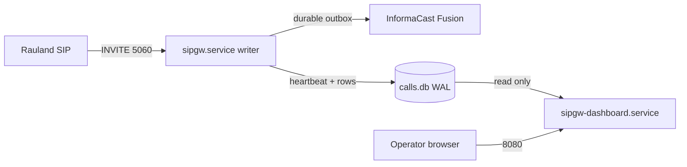

**Why this split matters (issue #14).** The dashboard opens the shared SQLite
database **read-only** (`query_only=ON`) and only *reads* the writer's
heartbeat. It never writes a page and never touches the SIP path. That means:

- You can **restart, upgrade, or debug the dashboard freely** — during a busy
  shift, mid-incident, anytime — **without any paging outage.**
- A restart of **`sipgw.service`** briefly drops the SIP listeners. Rauland only
  sends SIP on a real Code Blue / RRT event, so the practical risk is small, but
  the rule stands: **treat every `sipgw.service` restart as a (very short)
  planned paging outage** and coordinate it (see §5 and the OS-patching lesson
  from issue #20).

> **Golden rule.** *Dashboard down ≠ paging down.* If `/health` or the web UI is
> unreachable but `sipgw.service` is `active (running)`, **paging is still
> working.** Verify the writer before you ever touch it.

---

## 2. Status — check before you act

Always check both units. Do the writer first; it is the life-safety process.

```bash
# One-line status of both units
systemctl status sipgw.service sipgw-dashboard.service --no-pager

# Just the active/failed state, scriptable
systemctl is-active sipgw.service          # -> active
systemctl is-active sipgw-dashboard.service # -> active

# Are they enabled to start on boot? (both should be 'enabled')
systemctl is-enabled sipgw.service sipgw-dashboard.service
```

What a healthy writer looks like:

```
● sipgw.service - sipgw - SIP-to-Webhook Gateway for Informacast Fusion
     Loaded: loaded (/etc/systemd/system/sipgw.service; enabled; preset: enabled)
     Active: active (running) since ...
   Watchdog: 30s
     Status: "READY=1"            <- sd_notify: listeners are up
```

Two extra signals that the writer is truly *alive* (not just "process exists"):

- **Watchdog.** `Type=notify` + `WatchdogSec=30` means the writer must ping
  systemd from its event loop (every ~15 s). A hung event loop is detected and
  the pager is auto-restarted. `systemctl show sipgw -p WatchdogUSec` shows the
  armed value.
- **`/health` heartbeat.** The writer stamps a heartbeat every ~10 s; the
  dashboard's `/health` returns `503 stale` if it ages past 30 s. This is the
  authoritative external liveness check (see §7.6).

```bash
# Fast end-to-end liveness (writer heartbeat, via the read-only dashboard)
curl -s http://localhost:8080/health | python3 -m json.tool
```

---

## 3. Start / stop / restart — per unit

All commands are `root` / `sudo`. Substitute the unit name deliberately.

### 3.1 The dashboard (safe — no paging impact)

Restart the dashboard any time. This is the whole point of the #14 split.

```bash
sudo systemctl restart sipgw-dashboard.service     # safe, anytime
sudo systemctl stop    sipgw-dashboard.service     # UI + /health go dark; PAGING UNAFFECTED
sudo systemctl start   sipgw-dashboard.service
```

While the dashboard is stopped: the web UI and `/health` are unavailable, so any
**external monitor watching `/health` will alarm** — expected, and it does *not*
mean paging is down. Confirm with `systemctl is-active sipgw.service`.

### 3.2 The writer (coordinate — brief paging interruption)

A writer restart drops the SIP listeners for the restart window (a ~0.3 s SIP
blip in normal operation). Do it as a **coordinated, announced** action.

```bash
sudo systemctl restart sipgw.service               # COORDINATE: brief paging interruption
```

Pre-flight checklist before restarting the writer:

1. **Announce** to clinical/telecom that overhead paging is briefly interrupted.
2. **Check the backlog first** — do not restart on top of undelivered pages if
   avoidable:
   ```bash
   curl -s http://localhost:8080/health | python3 -c \
     "import sys,json; d=json.load(sys.stdin); print('backlog:', d.get('backlog'))"
   ```
   Durable delivery means an in-flight page **survives a restart** (it is a WAL
   row in state `pending`/`retrying` and the delivery worker resumes it on
   start-up) — but a clean, low-backlog moment is still the right time.
3. Restart, then **immediately re-verify**:
   ```bash
   systemctl is-active sipgw.service && \
     curl -s http://localhost:8080/health | python3 -m json.tool
   ```
   Expect `active` and `status: ok` with a small `heartbeat_age_s`.

**Never disable the writer's auto-restart.** `Restart=always`, `RestartSec=5`,
and `StartLimitIntervalSec=0` are deliberate: the pager must never get wedged in
`failed` by start-rate limiting. If you must take it down for maintenance, use
`stop` (not a config edit) and `start` when done.

> **Do NOT let the OS restart the writer uncoordinated (issue #20).** On
> 2026-07-07 an `unattended-upgrades` / `needrestart` pass bounced the paging
> service on its own schedule. Coordinate OS patching with a maintenance window;
> the permanent fix (zero-downtime writer restarts via socket activation, #19)
> is planned — see Reliability / Roadmap. Until then, **you** own restart timing.

### 3.3 Enable / disable on boot

Both units are installed `enabled` (start on boot). Leave them enabled.

```bash
systemctl is-enabled sipgw.service sipgw-dashboard.service   # expect: enabled / enabled
# Only if ever needed:
sudo systemctl enable  sipgw.service sipgw-dashboard.service
```

### 3.4 After editing a `.service` unit file

systemd caches unit files. If you edit `/etc/systemd/system/sipgw*.service`,
reload the daemon before restarting:

```bash
sudo systemctl daemon-reload
sudo systemctl restart sipgw-dashboard.service   # or sipgw.service (coordinate)
```

---

## 4. Configuration changes — what needs a restart and what doesn't

| Change | File | Applies via |
| --- | --- | --- |
| **Lookups** (area / room / purpose names, defaults) | `/opt/sipgw/lookups.yaml` | **Hot reload — NO restart** (see §4.1) |
| Gateway config (SIP, Fusion, delivery, dedupe, health, logging) | `/opt/sipgw/config.yaml` | **Writer restart** (coordinate) |
| Dashboard-only config (port, `page_size`, `auto_refresh_seconds`) | `config.yaml` `dashboard:` block | **Dashboard restart only** (safe) |
| systemd unit file | `/etc/systemd/system/sipgw*.service` | `daemon-reload` + restart |

### 4.1 lookups.yaml hot reload (no restart)

`lookups.yaml` maps SIP area/room IDs and call-purpose keywords to the
speech-ready phrases that go into the TTS page. It is **hot-reloaded on
change — no service restart, no paging interruption.**

Mechanism (`sipgw/lookups.py`): every lookup call checks the file's mtime; when
it changes, the table is reloaded on the next event. If the file is malformed or
mid-write, **the previous good table keeps serving** (the load is exception-safe
and never blanks the maps) — a bad edit degrades gracefully rather than breaking
paging.

Procedure:

```bash
sudo -u sipgw nano /opt/sipgw/lookups.yaml          # edit as the sipgw user
# (optional but recommended) validate YAML before it goes live:
python3 -c "import yaml,sys; yaml.safe_load(open('/opt/sipgw/lookups.yaml')); print('YAML OK')"
```

Then **verify the reload took**, without waiting for a real Code Blue:

1. In the dashboard, open **Verify lookups** (§7.5) — it re-reads the file from
   disk and reports counts + any errors.
2. Or watch the writer log for the reload line:
   ```bash
   journalctl -u sipgw -f | grep -i lookups
   # -> "lookups.yaml changed on disk, reloading..."
   # -> "Loaded N area, M purpose, ... mappings from /opt/sipgw/lookups.yaml"
   ```

> **Caution.** Because the reload is silent and automatic, an accidental save of
> a syntactically-valid-but-wrong table takes effect on the next page. Always
> confirm with **Verify lookups** after editing. Keep a backup:
> `cp /opt/sipgw/lookups.yaml /opt/sipgw/lookups.yaml.bak-$(date +%F)`.

---

## 5. Upgrade procedure (deploy a new build)

The gateway is deployed from a Git checkout under `/opt/sipgw` with a venv at
`/opt/sipgw/venv`. Upgrades follow the same shape the installer sets up
(`install.sh`). The **writer restart at the end is the only paging-affecting
step**, so it is done last, coordinated, and verified.

**Pre-flight**

```bash
# 1. Announce a short paging-maintenance window (writer restart at the end).
# 2. Snapshot the current state so rollback is trivial.
cd /opt/sipgw
git rev-parse --short HEAD                                  # record current build (e.g. c23f3eb)
sudo cp config.yaml   /opt/sipgw/config.yaml.bak-$(date +%F)
sudo cp lookups.yaml  /opt/sipgw/lookups.yaml.bak-$(date +%F)
sudo cp /var/lib/sipgw/calls.db /var/lib/sipgw/calls.db.bak-$(date +%F)   # WAL DB backup
```

**Apply**

```bash
cd /opt/sipgw
sudo -u sipgw git fetch --all
sudo -u sipgw git checkout <new-tag-or-commit>             # the new build

# Update Python deps into the existing venv (idempotent)
sudo /opt/sipgw/venv/bin/pip install --upgrade -r requirements.txt

# If any .service file changed in the new build, reinstall + reload:
sudo cp sipgw.service           /etc/systemd/system/sipgw.service
sudo cp sipgw-dashboard.service /etc/systemd/system/sipgw-dashboard.service
sudo systemctl daemon-reload
```

**Restart order — dashboard first (safe), writer last (coordinated)**

```bash
# 1. Dashboard first — zero paging impact; confirms the new build parses/starts.
sudo systemctl restart sipgw-dashboard.service
curl -s http://localhost:8080/health >/dev/null && echo "dashboard up"

# 2. Writer last — the brief paging interruption. Coordinate + verify.
sudo systemctl restart sipgw.service
systemctl is-active sipgw.service
curl -s http://localhost:8080/health | python3 -m json.tool     # expect status: ok
```

Both processes **fail-fast on a bad config** (`validate_config` refuses to start
on a fatal problem and exits non-zero), so a misconfigured upgrade surfaces
immediately in `systemctl status` / journal rather than silently.

**Post-upgrade verification**

```bash
git -C /opt/sipgw rev-parse --short HEAD           # confirm the new build hash
journalctl -u sipgw -n 40 --no-pager               # look for "READY=1", clean start, no tracebacks
curl -s http://localhost:8080/health | python3 -m json.tool
```

Then run the relevant host **drills** documented in `docs/TESTING.md` (e.g. the
SIP dialog drill and the dedupe drill) in dry-run/test mode so the exercise
never fires a real page.

**Rollback**

```bash
cd /opt/sipgw
sudo -u sipgw git checkout <previous-commit>       # the hash recorded in pre-flight
sudo /opt/sipgw/venv/bin/pip install -r requirements.txt
sudo systemctl restart sipgw-dashboard.service     # safe
sudo systemctl restart sipgw.service               # coordinated
```

The database schema is backward-tolerant across the v1.6.x/v1.7 line, but a DB
backup was taken in pre-flight if a restore is ever needed.

---

## 6. Reading the logs

There are **two complementary lenses**: journald (per unit) and the four log
files on disk. All file timestamps are **UTC RFC3339** (`...Z`), UTC-sortable and
directly string-matchable against Fusion's `Date`/`createdAt` fields.

> **Timezone note.** `logging.timezone: America/New_York` may appear in config,
> but the **log-file stamps are always UTC-Z** by design. The dashboard renders
> wall-clock local for humans; the raw files stay UTC. Do not be surprised that a
> 20:00 ET event shows `00:00Z` in the files.

### 6.1 journalctl — per unit (live, no file access needed)

```bash
# Live tail the writer (the call path)
journalctl -u sipgw.service -f

# Live tail the dashboard
journalctl -u sipgw-dashboard.service -f

# Last N lines / since a time
journalctl -u sipgw.service -n 200 --no-pager
journalctl -u sipgw.service --since "2026-07-07 12:00" --until "2026-07-07 13:00"

# Errors only, this boot
journalctl -u sipgw.service -p err -b --no-pager
```

### 6.2 The four log files (`/var/log/sipgw`, 90-day retention)

Each rotates daily at UTC midnight and is compressed to `.tgz`; files older than
90 days are purged. Rotation runs **off the event loop** (async, issue #6) so it
never stalls the SIP path.

| File | Written by | Contents |
| --- | --- | --- |
| `sipgw.log` | writer | Main application log — call lifecycle, delivery, retries, escalation, watchdog |
| `sipgw_api_debug.log` | writer | Northbound Fusion/API traces (OAuth, webhook POSTs, responses) — `api_debug_log: true` |
| `sipgw_sip_debug.log` | writer | Raw SIP/SDP message traces (INVITE, 200 OK, ACK, BYE) — `sip_debug_log: true` |
| `sipgw_dashboard.log` | **dashboard** | The dashboard process's own log — a **distinct file** the writer never touches |

> **Why the dashboard has its own file.** Two processes each owning a rotating
> handler on the *same* file would race at midnight `doRollover()` and corrupt
> logs. `setup_dashboard_logging` deliberately writes only `sipgw_dashboard.log`
> plus stdout (captured by journald). This is part of the #14 isolation.

Common file reads:

```bash
# Follow the main writer log
tail -f /var/log/sipgw/sipgw.log

# Grep a Call-ID across the SIP + main logs (correlation by hand)
grep "<sip-call-id>" /var/log/sipgw/sipgw_sip_debug.log /var/log/sipgw/sipgw.log

# Read yesterday's rotated, compressed main log without extracting it
zcat /var/log/sipgw/sipgw.log.2026-07-06.tgz | less
# (For the dashboard's date-picker, which does this decompression for you, see §7.4.)
```

For **per-call correlation**, prefer the dashboard's `/call/{id}` view (§7.3) and
its diagnostic bundle export (§7.3) — they join the SIP-debug, main, and
api-debug streams by the exact Call-ID for you.

---

## 7. Dashboard v2 — operator user guide

Open `http://<host>:8080/` (deployed at **`http://10.249.0.60:8080/`**). The
dashboard is **read-only** — nothing you click can send a page or mutate a
record. It hides `is_test` rows everywhere (test traffic never appears in the
operator UI, stats, chart, or exports).

> **No authentication.** The dashboard has **no login** and binds `0.0.0.0:8080`
> with **no host firewall active**. Treat the URL as sensitive and restrict
> network access to it (see the Security section; adding nftables for :8080 is a
> standing recommendation).

### 7.1 The call table (home page `/`)

The landing page shows the calls for the **selected day** (default: today) with:

- **Stat cards** — success / failed / pending / suppressed counts, plus a
  **"Last call from Rauland"** banner (the durable last real page, with a
  relative age like "3 h ago"). The banner survives a writer restart.
- **Call rows** — time (local wall-clock, click-through to the detail view),
  caller/bed, derived purpose, and a plain-language delivery status glyph
  (delivered / failed / pending). Paginated (`page_size`, default 20).
- **Auto-refresh** — 10/30/60/120/300 s, live view only. Historical days do not
  auto-refresh.

The **date picker drives both the table and the log viewer together** — pick a
day and the calls table, the day's stats, and the log panels all move to that
same local day.

### 7.2 90-day call-type chart

A stacked bar chart of **calls by type over the last 90 days** (Code Blue, RRT,
etc.). Purpose is derived live from each call's SIP display-name via
`lookups.yaml`, so **all rows are covered** (including legacy rows) and any new
call type appears automatically. Chart build failures are swallowed — the chart
simply hides, the dashboard never errors on it.

### 7.3 `/call/{id}` — correlated call-detail view + diagnostic bundle

Click any call's time to open **`/call/{id}`**, the single most useful
troubleshooting screen. It joins three sources for one event, keyed on the
call's authoritative **`sip_call_id`** (written on the SIP path):

- **SIP blocks** — the exact INVITE / 200 / ACK / BYE for this Call-ID from
  `sipgw_sip_debug.log`.
- **Main-log lines** — the matching lifecycle/delivery lines from `sipgw.log`.
- **API-debug candidates** — the likely Fusion/API traces (clearly labeled a
  heuristic, since the API log has no Call-ID).

Unknown id → clean 404 (never a 500); a test row is treated as not-found.

**Per-call diagnostic bundle export.** On the detail view, the bundle link
downloads a **plain-text file** (`/call/{id}/bundle.txt`, saved as
`sipgw-call-<id>.txt`) containing the same correlated SIP + main + API context
as one copy/paste blob. This is the artifact to attach to a support ticket or
paste to RedEye — it captures everything about one event with a single click.

```bash
# Grab a bundle from the CLI (e.g. for call #482)
curl -s -OJ http://10.249.0.60:8080/call/482/bundle.txt
```

### 7.4 Date-picker log viewer

Below the table, the page shows the **log lines for the selected day**, in up to
three panels: main (`sipgw.log`), SIP debug, and API debug (the debug panels
appear only when those streams are enabled). "A day" is the configured display
zone's local day; the viewer transparently reads across the overlapping UTC log
files and **decompresses `.tgz` rotated files for you**, so you can browse
history without shelling into the host. The zone label is shown so you always
know which wall-clock the lines are rendered in.

### 7.5 Verify lookups

The **Verify lookups** action (backed by `/api/verify-lookups`) re-reads
`lookups.yaml` **from disk** and reports the parsed area / room / purpose counts
and any validation errors. Use it:

- After **any lookups edit** (§4.1) to confirm the hot reload picked up a valid
  table before the next real page relies on it.
- During onboarding of new areas/beds to sanity-check the mapping.

There is also `/api/sample-lookups`, which downloads a fully-commented sample
`lookups.yaml` you can use as an editing reference.

### 7.6 `/health` — the machine-readable liveness endpoint

`GET http://<host>:8080/health` is the endpoint for external monitors and for
your own quick checks. Its **status code is keyed solely on writer-heartbeat
freshness**:

| Response | Meaning |
| --- | --- |
| `200 {"status":"ok", "heartbeat_age_s": …}` | Writer heartbeat is fresh → **paging path alive** |
| `503 {"status":"stale", "heartbeat_age_s": …}` | Heartbeat older than 30 s → writer stalled/hung |
| `503 {"status":"no-heartbeat"}` | Writer has never stamped a heartbeat (not started) |

The 200 body also carries **informational fields that never change the status
code** (a Fusion blip or a delivery backlog must never 503 the sole node and get
it restarted):

- `backlog`, `last_delivered_at`, `last_failed_at`, `last_error` — delivery
  health.
- `fusion_reachable`, `fusion_detail`, `fusion_checked_age_s` — the read-only
  Fusion reachability probe (a GET of the scenario; it **never** sends a page).
- `last_inbound_sip_at`, `last_inbound_sip_age_s` — age of the last inbound SIP
  from Rauland (link-liveness; Rauland is silent between real events, so this is
  informational, not an alarm).

```bash
# Human-readable snapshot
curl -s http://10.249.0.60:8080/health | python3 -m json.tool

# Scriptable up/down (exit non-zero if not 200)
curl -sf http://10.249.0.60:8080/health >/dev/null && echo UP || echo DOWN
```

> There are two **opt-in, default-off** degrade behaviors (`health:` block):
> `fail_on_fusion_unreachable` (let a fresh Fusion-unreachable probe 503 the
> node) and `inbound_escalate_after_seconds` (fire the escalation webhook after
> a long inbound silence). Both are **off in production** by design — enabling
> the first on a single node can get the node pulled on a transient Fusion blip.
> See the Configuration and Reliability sections before touching them.

---

## 8. Quick command reference

```bash
# --- Status (do this first, always) ---
systemctl status sipgw.service sipgw-dashboard.service --no-pager
curl -s http://localhost:8080/health | python3 -m json.tool

# --- Dashboard (SAFE — no paging impact) ---
sudo systemctl restart sipgw-dashboard.service

# --- Writer (COORDINATE — brief paging interruption) ---
curl -s http://localhost:8080/health | python3 -c "import sys,json;print('backlog:',json.load(sys.stdin).get('backlog'))"
sudo systemctl restart sipgw.service
systemctl is-active sipgw.service

# --- Logs ---
journalctl -u sipgw.service -f
journalctl -u sipgw-dashboard.service -f
tail -f /var/log/sipgw/sipgw.log

# --- Lookups hot reload (NO restart) ---
sudo -u sipgw nano /opt/sipgw/lookups.yaml
# then: dashboard -> Verify lookups, or:
journalctl -u sipgw -f | grep -i lookups

# --- Unit-file edit ---
sudo systemctl daemon-reload && sudo systemctl restart sipgw-dashboard.service
```

**The one rule to remember:** restart the **dashboard** freely; restart the
**writer** only as a coordinated, announced, verified action.


\newpage

# Monitoring, Health & Backup/DR

> **Product:** RedEye sip2api Gateway — *SIP in. Page out. Every time.*
> **Applies to:** production build `c23f3eb` (branch `main`, the v1.7 line = v1.6.5 + 6 commits) on host `sip2apibridge`.
> **Audience:** Tift Regional IT + clinical/telecom, and RedEye support. Identical content for both.

This section covers how you know the gateway is alive and delivering pages, how it distinguishes a **silent-dead node** from a **genuinely-quiet** night, and how to back up, restore, and pull diagnostics for a support ticket.

Everything here documents what is **deployed today**. Planned high-availability work (LB active/active, socket-activation zero-downtime restart) lives only in the "HA Plan" and "Roadmap" sections and is not described here.

---

## 1. The two things that must always be true

The gateway's job is life-safety: a Rauland Code Blue / RRT SIP INVITE must become an InformaCast Fusion overhead page **every time**. Monitoring exists to answer two questions continuously:

1. **Is the paging writer alive?** — the `sipgw.service` process that ingests SIP and delivers pages.
2. **Is the end-to-end path healthy?** — can we still hear Rauland (inbound), and can we still reach Fusion (outbound), and is the durable outbox draining?

The design deliberately keeps these **separate**. Only question 1 controls the `/health` **status code**. Everything from question 2 is surfaced as **informational** telemetry so that a Fusion blip, a delivery backlog, or a quiet night can **never** trip an external monitor into killing or pulling the sole paging node.

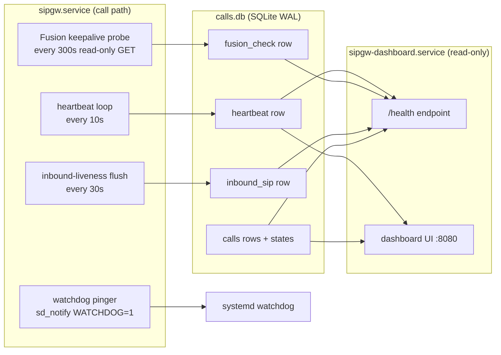

The writer and the dashboard are **two independent systemd services**. The dashboard reads the shared database over a **read-only** (`query_only=ON`) connection and never mutates it, so the dashboard can be restarted at any time without interrupting paging.

---

## 2. The `/health` endpoint

`/health` is served by the **dashboard** process at `http://10.249.0.60:8080/health`. It is the single machine-readable liveness signal. (Code: `dashboard.py`, `health()` and `_health_info()`; snapshot query in `database.py:delivery_health_snapshot`.)

### 2.1 What sets the status code

The HTTP **status code is keyed solely on the writer heartbeat.** The writer stamps a heartbeat row every `heartbeat_interval_seconds` (default **10 s**). The dashboard reads it:

| Condition | HTTP | `status` |
|---|---|---|
| Heartbeat fresher than `stale_after_seconds` (default **30 s**) | `200` | `ok` |
| Heartbeat older than `stale_after_seconds` | `503` | `stale` (includes `heartbeat_age_s`) |
| No heartbeat row at all | `503` | `no-heartbeat` |

This is the "silent-dead" detector: if the writer process wedges, crashes, or is killed, its heartbeat goes stale within ~30 s and `/health` returns `503`. A monitor or a human sees the node is down even though **no page has failed yet**.

> **Design guarantee.** A Fusion outage, a delivery backlog, or a quiet Rauland link **do not** change the status code by default. Only the heartbeat does. This prevents an external monitor from pulling or restarting the only paging node over a transient upstream problem.

### 2.2 Informational fields (never flip the code)

When the heartbeat gate passes, `/health` adds a body of informational fields read from the shared DB. Any read failure here is swallowed — `/health` can never `500` on an info read.

```json
{
  "status": "ok",
  "heartbeat_age_s": 3.2,
  "backlog": 0,
  "last_delivered_at": 1751894400.0,
  "last_failed_at": null,
  "last_error": null,
  "fusion_reachable": true,
  "fusion_detail": "HTTP 200",
  "fusion_checked_age_s": 41.7,
  "last_inbound_sip_at": 1751890000.0,
  "last_inbound_sip_age_s": 4400.0
}
```

| Field | Meaning | Source |
|---|---|---|
| `backlog` | Real (non-test) calls still `pending` + `delivering` — the outbox depth | `count_by_state` |
| `last_delivered_at` | Epoch of the most recent successful delivery | `calls` |
| `last_failed_at` / `last_error` | Most recent `failed`/`expired` call + its truncated error | `calls` |
| `fusion_reachable` | Result of the last outbound reachability probe (`true`/`false`/`null`=unknown) | `fusion_check` |
| `fusion_detail` | Short human string, e.g. `HTTP 200` | `fusion_check` |
| `fusion_checked_age_s` | Age of that probe | `fusion_check` |
| `last_inbound_sip_at` / `last_inbound_sip_age_s` | When we last heard SIP from Rauland | `inbound_sip` |

Test/dry-run rows (`is_test=1`) are excluded from `backlog`, `last_delivered_at`, and `last_failed_at`, so drills never pollute health.

### 2.3 Outbound: the Fusion reachability keepalive

The writer runs a **read-only** reachability probe every `keepalive_interval_seconds` (default **300 s**): a short-timeout `GET` of the scenario definition through the same no-send-guarded HTTP client used for delivery. (`main.py:_keepalive_loop` → `webhook.py:check_reachable` → `database.py:write_fusion_check`.)

- It is **not a page path**. It never triggers the scenario and never sends an overhead page. In dry-run the no-send guard makes it reach no real host and return a synthetic 200.
- It never holds the OAuth token lock across the network call, so the probe can never delay a real page (the background token refresher keeps the token warm — see the Reliability section).
- The result (`ok` + `checked_at` + short `detail`) is stamped to the `fusion_check` DB row and surfaced as the `fusion_*` fields above.

**Optional degrade (opt-in, default OFF).** Set `health.fail_on_fusion_unreachable: true` to make a **present + fresh** `ok=false` probe return `503 status="fusion-unreachable"`. `null` (never probed / older writer) and **stale** checks are treated as unknown and stay `200` (fail-safe). Freshness bound = `fusion_unreachable_max_age_seconds`, or `0.0` to auto-derive it from the probe cadence (`keepalive_interval_seconds × 2 + stale_after_seconds`).

> **Caution — this is a foot-gun by design.** With `fail_on_fusion_unreachable: true`, a Fusion blip will `503` the node. On the current **single-node** deployment there is nothing to fail over to, so a monitor wired to restart/pull on `503` would take the pager offline over an upstream problem. Leave it **OFF** on the single node; it exists for the future LB active/active topology (Roadmap #17). The config validator will warn if you enable the flag while the keepalive is disabled.

### 2.4 Inbound: solving "silent-dead vs genuinely-quiet"

Rauland sends SIP **only on real clinical events** — there are no keepalives — and roughly a quarter of days have **zero** calls, with an observed maximum quiet gap of about **4.27 days**. So "no calls for hours" is normal and must never look like a fault. But a broken inbound link (proxy down, allowlist wrong, network cut) also looks like silence. The **inbound-liveness monitor** separates the two:

- The SIP server records the wall-clock time of the last request received from an **allowed** (Rauland) network, in memory (`sip_server.py:last_inbound_at`).
- The writer flushes that timestamp to the DB every `inbound_flush_interval_seconds` (default **30 s**), and **never** overwrites the persisted value with `now`/`None` when it has seen no datagram since boot — so a writer restart during a real silence cannot clobber the last-real value (`main.py:_inbound_flush_loop`, `database.py:write_inbound_seen`).
- `/health` and the dashboard surface `last_inbound_sip_age_s`. The dashboard turns this **amber** once it exceeds `inbound_stale_after_seconds` (default **432000 s = 5 days**, deliberately longer than the observed max quiet gap). This is **informational only** — it never flips the `/health` code.

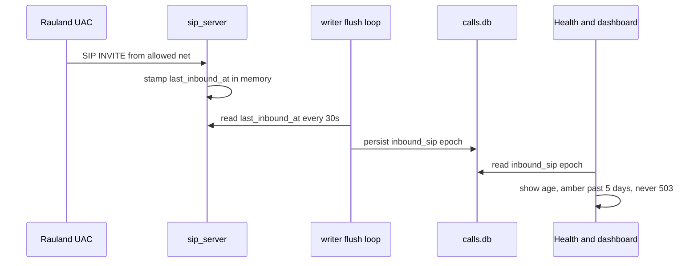

**Optional silence escalation (opt-in, default OFF).** Set `health.inbound_escalate_after_seconds` > 0 to fire an escalation **once per silence episode** via the escalation webhook when inbound age exceeds the threshold (`main.py:_maybe_escalate_inbound_silence`). It de-duplicates on the reference epoch so you get **one** alert per episode, and it resets when inbound resumes. Because a 4-plus-day quiet stretch is normal, set the threshold generously (well above ~4.3 days) if you enable it. It never sends a page and never gates `/health`.

### 2.5 Health config reference

From `config.yaml.example` (block `health:`):

```yaml
health:
  heartbeat_interval_seconds: 10.0        # writer stamps liveness this often
  stale_after_seconds: 30.0               # /health 503 once heartbeat older than this
  keepalive_interval_seconds: 300.0       # read-only Fusion reachability GET cadence
  fail_on_fusion_unreachable: false       # opt-in: fresh ok=false -> 503 (see caution)
  fusion_unreachable_max_age_seconds: 0.0 # 0 = auto (keepalive*2 + stale_after)
  inbound_flush_interval_seconds: 30.0    # persist last-inbound-SIP time this often
  inbound_stale_after_seconds: 432000.0   # 5 days -> dashboard shows amber
  inbound_escalate_after_seconds: 0.0     # 0 = OFF; >0 = once-per-episode alert
```

### 2.6 Probing `/health` operationally

```bash
# Simple up/down (exit non-zero on 503):
curl -fsS http://10.249.0.60:8080/health >/dev/null && echo UP || echo DOWN

# Full body, human-readable:
curl -s http://10.249.0.60:8080/health | python3 -m json.tool
```

A good external monitor polls `/health` and alerts on `503` (status `stale`/`no-heartbeat`). On the single node, **do not** auto-restart the writer from an external monitor over a `503` — investigate first (see the Troubleshooting section); an unsupervised auto-restart already caused incident **#20**.

---

## 3. The systemd watchdog

`sipgw.service` runs `Type=notify` with `WatchdogSec=30`. The writer proves **event-loop liveness** to systemd with a pure-Python `sd_notify` implementation (`watchdog.py`).

- On startup the writer sends `READY=1`; on clean shutdown it sends `STOPPING=1`.
- A background pinger sends `WATCHDOG=1` on a cadence of **half** of systemd's `WATCHDOG_USEC` (so ~15 s for a 30 s window). If the event loop stalls and misses pings, systemd restarts the service per its unit policy.
- The pinger is **completely inert** when not under systemd (`WATCHDOG_USEC`/`NOTIFY_SOCKET` unset) — tests, dry-run runs, and non-systemd invocations behave exactly as before.

> **Why event-loop liveness, not DB writes.** The watchdog proves the async loop is turning, deliberately **decoupled** from database writes. Transient DB slowness must never restart the life-safety pager. The heartbeat (which does touch the DB) is the separate signal that feeds `/health`.

Check it:

```bash
systemctl status sipgw.service            # look for WATCHDOG=1 / Notify state
journalctl -u sipgw.service -b | grep -i watchdog
```

---

## 4. Dashboard: state-aware stats and the 90-day chart

The dashboard (`dashboard.py`, ~2155 lines) is a **read-only** UI on `:8080`. It hides `is_test` rows everywhere so drills never appear in customer-facing counts.

### 4.1 State-aware stats

Stats are computed from the durable **call state** (the `calls.state` column), not from guessing at a raw HTTP code. `_stats_from_rows` (and its live-day twin `get_today_stats`) classify each call identically:

| Bucket | States counted |
|---|---|
| **success** | `delivered` (+ legacy rows with a 2xx `fusion_status`) |
| **failed** | `failed` + `expired` (+ legacy rows with a non-2xx/NULL `fusion_status`) |
| **pending** | `pending` + `delivering` |
| **suppressed** | `duplicate` (dedupe suppression) |

Legacy rows (pre-outbox, `state = legacy`) are back-classified by their stored `fusion_status` so historical days and the live day report the same semantics. Per-call delivery state is shown with a glyph + plain-language label (e.g. `✓ Delivered`, `✗ NOT SENT - rejected`, `○ Pending`) so status is never signalled by colour alone (WCAG).

### 4.2 90-day calls-by-type stacked chart

A self-contained inline-SVG stacked bar chart buckets the last **90 days** of real calls by **type** (call purpose, derived from the display name), one bar per day. It is rendered server-side from data already fetched, is read-only, and has zero SIP impact.

### 4.3 Correlated call-detail view and log viewer

- **`/call/{id}`** — a correlated call-detail view joining the `calls` row to the SIP messages (exact `sip_call_id` join), the application-log lines that reference the Call-ID, and a **heuristic** Fusion API exchange (matched by TTS body + time window, since the API debug log carries no Call-ID; ambiguous matches are shown, never silently picked).
- **Date-picker log viewer** — one picker drives both the call table and the on-page log viewer for a chosen day.
- **verify-lookups** — validates `lookups.yaml` and reports results.

All dashboard timestamps display in the configured local timezone via `display_local`, while the underlying stored/log timestamps are UTC (see §6).

---

## 5. Backup & Disaster Recovery

Three things constitute the gateway's recoverable state:

1. **The call database** — `/var/lib/sipgw/calls.db` (SQLite, **WAL** mode).
2. **Configuration** — `/opt/sipgw/config.yaml`.
3. **Lookups** — `/opt/sipgw/lookups.yaml` (area/room → page mappings).

The code itself lives in git and on the host at `/opt/sipgw`; the venv is reproducible. The **irreplaceable** artifacts are the three above.

### 5.1 WAL-safe database backup (do this, not `cp`)

The database runs in **WAL** mode (`PRAGMA journal_mode=WAL`, `synchronous=NORMAL`, `busy_timeout=5000`). That means at any instant the on-disk state is spread across **three** files:

| File | Role |
|---|---|
| `calls.db` | main database |
| `calls.db-wal` | write-ahead log (may hold committed pages not yet checkpointed) |
| `calls.db-shm` | shared-memory index for the WAL |

**A plain `cp calls.db backup.db` is unsafe** — it can capture the main file without the committed pages still in `-wal`, producing a torn/stale copy. Always use SQLite's online backup API, which produces a **single consistent** file while the writer keeps running:

```bash
# Consistent, hot backup — safe while sipgw.service is live:
sqlite3 /var/lib/sipgw/calls.db ".backup '/var/backups/sipgw/calls-$(date -u +%Y%m%dT%H%M%SZ).db'"
```

`.backup` walks the live database under SQLite's locking and folds in the `-wal` contents, so the output is a self-contained `.db` with **no sidecars needed**. Notes:

- Run it as a user that can read the DB (root, or the service user). It is read-only against the source.
- The output is a normal DB file; it does not need `-wal`/`-shm` alongside it to restore.
- If you must copy raw files instead (not recommended), you **must** copy all three (`calls.db`, `calls.db-wal`, `calls.db-shm`) together, atomically — but prefer `.backup`.

A minimal daily backup job (cron/systemd timer), keeping 30 days:

```bash
#!/usr/bin/env bash
set -euo pipefail
DEST=/var/backups/sipgw
mkdir -p "$DEST"
STAMP=$(date -u +%Y%m%dT%H%M%SZ)
sqlite3 /var/lib/sipgw/calls.db ".backup '$DEST/calls-$STAMP.db'"
cp /opt/sipgw/config.yaml   "$DEST/config-$STAMP.yaml"
cp /opt/sipgw/lookups.yaml  "$DEST/lookups-$STAMP.yaml"
# integrity-check the backup we just took:
sqlite3 "$DEST/calls-$STAMP.db" 'PRAGMA integrity_check;'
find "$DEST" -type f -mtime +30 -delete
```

Store backups off-host (the same off-host store used for the log bundles). The DB holds the audit trail of every page; treat it as clinical record-adjacent.

### 5.2 Restore

The call DB is an **audit/history** store — the live paging path does **not** need it pre-populated to function (a fresh DB is created and migrated on first start). Restore it to recover history and in-flight outbox state.

```bash
# 1. Stop the writer so nothing is mid-write:
sudo systemctl stop sipgw.service

# 2. (Optional) move the current DB + sidecars aside:
sudo mv /var/lib/sipgw/calls.db      /var/lib/sipgw/calls.db.old      2>/dev/null || true
sudo mv /var/lib/sipgw/calls.db-wal  /var/lib/sipgw/calls.db-wal.old  2>/dev/null || true
sudo mv /var/lib/sipgw/calls.db-shm  /var/lib/sipgw/calls.db-shm.old  2>/dev/null || true

# 3. Put the backup in place (a .backup output is a single file — no sidecars):
sudo cp /var/backups/sipgw/calls-YYYYMMDDTHHMMSSZ.db /var/lib/sipgw/calls.db
sudo chown sipgw:sipgw /var/lib/sipgw/calls.db      # match service user/perms

# 4. Verify, then start:
sqlite3 /var/lib/sipgw/calls.db 'PRAGMA integrity_check; PRAGMA journal_mode;'
sudo systemctl start sipgw.service
curl -fsS http://10.249.0.60:8080/health >/dev/null && echo UP
```

On start the writer re-applies WAL mode and runs migrations, so a backup taken from any recent build re-opens cleanly. To restore **config**/**lookups**, drop the saved files back into `/opt/sipgw` and restart the affected service (a lookups/config change requires a writer restart to take effect — coordinate per incident #20's lesson, §6).

### 5.3 Bare-host rebuild (DR)

To rebuild `sip2apibridge` from nothing: reinstall Ubuntu 24.04, redeploy `/opt/sipgw` from git (`c23f3eb`), recreate the venv, restore `config.yaml` + `lookups.yaml` + `calls.db` from backup, reinstall both systemd units, then confirm SIP ingress on **5060 udp+tcp** and `/health` on **8080**. Full step-by-step is in the deployment/cutover runbook; the DR-critical inputs are the three backed-up artifacts above.

---

## 6. Log management

### 6.1 The four log streams

Logging is configured in `logging_config.py`. There are **four** files under `/var/log/sipgw`:

| File | Contents | Logger | Toggle |
|---|---|---|---|
| `sipgw.log` | Main application log (call path, delivery, escalation) | `sipgw` | always on |
| `sipgw_api_debug.log` | Northbound Fusion API traces (no Call-ID) | `sipgw.api_debug` | `logging.api_debug_log` |
| `sipgw_sip_debug.log` | Detailed SIP message traces | `sipgw.sip_debug` | `logging.sip_debug_log` |
| `sipgw_dashboard.log` | Dashboard process log | `sipgw` (dashboard proc) | dashboard |

The debug streams are **enabled** in the deployed config (`api_debug_log: true`, `sip_debug_log: true`).

> **Two processes, no shared rotating handler.** The writer owns `sipgw.log` / `sipgw_api_debug.log` / `sipgw_sip_debug.log`. The dashboard process writes only its **own** `sipgw_dashboard.log`. This is deliberate (`setup_dashboard_logging`): two processes each owning a rotating handler on the same file would race at midnight rotation and corrupt logs. The dashboard therefore never attaches to the writer's files.

### 6.2 Rotation, compression, retention

- **Daily rotation at UTC midnight** (`when="midnight"`), one file per calendar day, suffix `%Y-%m-%d`.
- Rotated files are compressed to **`.tgz`** and files older than **90 days** are purged (`retention_days: 90`).
- **Rotation and compression run off the event loop** on a background thread (async `QueueHandler`/`QueueListener`), so a logging call from the call path only enqueues and never blocks on disk I/O or a rotation (issue #6). The queue is flushed at interpreter exit.

### 6.3 UTC timestamps

Every log line is stamped in **canonical UTC RFC3339 milliseconds-Z**, e.g. `2026-07-01T18:23:45.007Z`, regardless of host timezone (`ISO8601Formatter`). This makes all four streams byte-for-byte zone-consistent, UTC-sortable, and directly string-matchable against Singlewire's `Date`/`createdAt` fields for far-end correlation.

> **Known nuance.** The host clock is `Etc/UTC` and the config declares `logging.timezone: America/New_York` (or empty), but that setting is **not applied to log stamps** — log-file timestamps are hard-coded **UTC-Z**. The dashboard and CSV export render **local** wall-clock via `display_local`; only the raw log files are UTC. When reading raw logs alongside the dashboard, remember the log is UTC and the UI is local.

Because rotation rolls at 00:00 UTC and stamps are UTC-Z, each day-file's boundary and its internal timestamps are self-consistent.

### 6.4 Operational lesson: coordinate OS patching (#20)

On 2026-07-07 an `unattended-upgrades`/`needrestart` auto-restart bounced the paging service uncoordinated (issue **#20**, remediated). The monitoring takeaway: an external monitor or an OS patch job that restarts `sipgw.service` on its own can drop the paging path with no coordination. Patch during a maintenance window and confirm `/health` is `UP` afterward. Zero-downtime writer restarts via socket activation (#19) are the planned fix (Roadmap).

---

## 7. Exporting a support bundle

There are two complementary ways to hand RedEye support (or a vendor) the evidence for one event.

### 7.1 Per-call diagnostic bundle (one click, one event)

From the call-detail page, export a **plain-text diagnostic bundle** at:

```
http://10.249.0.60:8080/call/{id}/bundle.txt
```

`_render_bundle_text` (`dashboard.py`) assembles a copy/paste-friendly `text/plain` report with these sections:

1. **CALL RECORD** — the full `calls` row: id, created_at (local + epoch), caller, area/room, TTS string, `fusion_status`, `response_time_ms`, `state`, `attempts`, `last_error`, `sip_call_id`, `event_id`.
2. **SIP MESSAGES** — the SIP debug blocks joined by **exact Call-ID** (or a clear note if SIP debug is off / no match / a pre-outbox legacy row with no `sip_call_id`).
3. **APPLICATION LOG** — main-log lines that reference the Call-ID.
4. **FUSION API EXCHANGE** — the heuristic TTS/time-matched API block(s), explicitly flagged **provisional**; if more than one matched, all are shown and labelled ambiguous (nothing is silently suppressed).

This is the fastest way to attach "everything about page X" to a ticket without leaking anything beyond that one call. Grab it from a terminal too:

```bash
curl -s "http://10.249.0.60:8080/call/1234/bundle.txt" -o call-1234-bundle.txt
```

### 7.2 Raw logs for a time range

For a broader window (an incident spanning many events), collect the raw streams for the affected UTC day(s) directly:

```bash
# Today's live files:
sudo tar czf /var/backups/sipgw/logs-$(date -u +%Y%m%d).tgz \
  -C /var/log/sipgw sipgw.log sipgw_api_debug.log sipgw_sip_debug.log sipgw_dashboard.log

# A specific past day (rotated files are already .tgz):
ls /var/log/sipgw/*.2026-06-12.tgz
```

Pair the raw-log bundle with the DB backup (`.backup`, §5.1) for a complete forensic snapshot. Because all four streams are UTC-Z stamped, they line up on a single UTC timeline and correlate against Singlewire's records without timezone math.

---

## 8. Quick reference

| Task | Command / URL |
|---|---|
| Liveness (up/down) | `curl -fsS http://10.249.0.60:8080/health` |
| Full health JSON | `curl -s http://10.249.0.60:8080/health \| python3 -m json.tool` |
| Watchdog / notify state | `systemctl status sipgw.service` |
| Writer logs (live) | `journalctl -u sipgw.service -f` |
| Dashboard logs (live) | `journalctl -u sipgw-dashboard.service -f` |
| Hot DB backup | `sqlite3 /var/lib/sipgw/calls.db ".backup '/var/backups/sipgw/calls-$(date -u +%Y%m%dT%H%M%SZ).db'"` |
| DB integrity check | `sqlite3 <backup.db> 'PRAGMA integrity_check;'` |
| Per-call bundle | `http://10.249.0.60:8080/call/{id}/bundle.txt` |
| Log dir | `/var/log/sipgw` (4 streams, 90-day `.tgz` retention, UTC-Z) |
| DB path | `/var/lib/sipgw/calls.db` (WAL: `.db` + `.db-wal` + `.db-shm`) |
| Config / lookups | `/opt/sipgw/config.yaml`, `/opt/sipgw/lookups.yaml` |

**Golden rules**
- `/health` `503` means the **writer** is dead/stale — investigate, don't reflexively auto-restart on the single node (#20).
- A quiet Rauland link is **normal**; inbound-liveness is amber-after-5-days and informational — it never `503`s.
- Back up the DB with **`sqlite3 .backup`**, never a bare `cp` (WAL sidecars).
- Raw logs are **UTC**; the dashboard is **local**.


\newpage

# As-Built — Current Production Deployment

_Snapshot captured **2026-07-07 19:23 UTC** from host **`sip2apibridge`** by the read-only `product-docs` host inventory. Describes the deployed build **`c23f3eb`** (branch `main`) — i.e. **v1.6.5 + 6 commits, the in-progress v1.7 line**. The deployed code matches GitHub `main` HEAD; the working tree carries only untracked backup files (no code divergence)._

## Host & platform

| Attribute | Value |
|---|---|
| Hostname | `sip2apibridge` |
| OS | Ubuntu 24.04.4 LTS |
| Kernel | Linux 6.8.0-124-generic (x86_64) |
| CPU | Intel Xeon Platinum 8558P — 4 vCPU (1 socket × 4 cores, 1 thread/core) |
| Memory | 15 GiB (~1.2 GiB used at capture) + 4 GiB swap |
| Storage | root `/` 38 GB (22% used); dedicated `/var` LV 32 GB (3% used) |
| Timezone | **Etc/UTC** (NTP-synced) |
| Uptime | ~3 weeks, 2 days at capture |

## Network

- Single interface **`ens34` → `10.249.0.60/24`**; default route `10.249.0.1`.
- `10.249.0.60` is the address the Rauland nurse-call system targets for SIP.

## Deployed build

| Attribute | Value |
|---|---|
| Commit | **`c23f3eb`** (2026-07-03) — `feat(#13): F3 — group Today view + real last-call-from-Rauland lookback` |
| Branch | `main` (= GitHub `main` HEAD — no local code divergence) |
| Relative to releases | **v1.6.5 + 6 commits** (the unreleased **v1.7** line) |
| Working tree | untracked backups only: `config.yaml.pre-v1.7.*`, `lookups.yaml.bkp`, `fixesprompt.md` — no tracked-file modifications |
| Python | 3.12.3 (venv `/opt/sipgw/venv`) |

**Key package versions:** fastapi 0.129.0 · starlette 0.52.1 · uvicorn 0.41.0 · httpx 0.28.1 · httpcore 1.0.9 · aiosqlite 0.22.1 · PyYAML 6.0.3 · Jinja2 3.1.6 · anyio 4.12.1.

## Services — two-service topology

Two independent systemd units, both **active & enabled** (the call path is isolated from the dashboard):

| Unit | `Type` | `Restart` | `WatchdogSec` | Listens | Role |
|---|---|---|---|---|---|
| `sipgw.service` | **notify** | always (5s) | **30s** | 5060/udp+tcp | Call path — SIP + durable delivery |
| `sipgw-dashboard.service` | simple | always (5s) | — | 8080/tcp | Reporting UI (read-only DB reader) |

Both unit files are installed under `/etc/systemd/system/`. Both last (re)started **2026-07-07 06:29:48 UTC** — an unattended-upgrades (`needrestart`) auto-restart, tracked as **issue #20** and remediated; `NRestarts=0` since. `socket`-activation units are **not** present (zero-downtime restarts, #19, not yet deployed).

## Listening ports

| Proto | Port | Process | Purpose |
|---|---|---|---|
| UDP | 5060 | `sipgw` | SIP (inbound INVITE) |
| TCP | 5060 | `sipgw` | SIP (inbound INVITE) |
| TCP | 8080 | `sipgw-dashboard` | Web dashboard |

## Firewall & ingress filtering ⚠

- **No host firewall is active** — the `nftables` ruleset is effectively empty and `firewalld` is not installed.
- Ingress is filtered **at the application layer** by the SIP allowlist `sip.allowed_networks`: **`172.16.0.0/12`, `127.0.0.0/8`, `10.0.0.0/8`** — plus upstream network ACLs.
- **Recommendation (defense-in-depth):** add an `nftables` policy restricting **:5060** to the nurse-call/SIP sources and **:8080** to trusted management hosts. The dashboard has no authentication, so `:8080` exposure should be constrained at the network/firewall layer.

## Configuration (`/opt/sipgw/config.yaml` — secrets masked)

| Section | Key settings |
|---|---|
| `sip` | bind `0.0.0.0:5060`; allowlist `172.16.0.0/12, 127.0.0.0/8, 10.0.0.0/8`; `call_timeout_seconds: 1`; `immediate_bye: true`; RTP range 10000–20000 |
| `fusion` | base `https://api.icmobile.singlewire.com/api`; audience `2ffd6864-…`; scenario `4cba52d8-…` ("SIPtoTTSBridge"); endpoint `/v1/scenario-notifications`; field `customTTS` (`23435ce7-…`); `client_id`/`client_secret` **redacted** |
| `tts` | `play_count: 3`; `message_preamble: "Attention! Attention! "`; `iteration_preamble: ""` |
| `logging` | dir `/var/log/sipgw`; `retention_days: 90`; rotation midnight; `timezone: America/New_York` (declared; host clock is UTC — see note); api + sip debug logs on |
| `dashboard` | port 8080; bind `0.0.0.0`; `auto_refresh_seconds: 30`; `page_size: 20` |
| `database` | `/var/lib/sipgw/calls.db` |
| `dedupe` | **`enforce: true`**; `window_seconds: 2`; `match_bed: true`; `match_purpose: true` (clinically signed-off duplicate suppression) |

> **Timestamp note:** `logging.timezone` is set to `America/New_York` but the host clock is `Etc/UTC`, so emitted timestamps render in **UTC**. When reading logs, interpret times as UTC (subtract 4h for EDT / 5h for EST).

## Database

- SQLite `/var/lib/sipgw/calls.db` — **WAL** journal mode (`.db-wal` + `.db-shm` sidecars present); **307** call rows at capture.
- **Schema (`calls`)** — base columns plus the durable-delivery/outbox columns: `state`, `attempts`, `last_error`, `delivered_at`, `sip_call_id`, `duplicate_of`, `is_test`, **`event_id`**. Indexes: `idx_calls_created_at`, `idx_calls_state`, `idx_calls_event_id`.
- A pre-migration backup `calls.db.bak-int-columns` (2026-03-24) is retained alongside.

## Logs

Four daily-rotated streams in `/var/log/sipgw/` (compressed to `.tgz`, **90-day** retention, ~1.3 MB on disk at capture):

| Stream | Contents |
|---|---|
| `sipgw.log` | Application events (calls, delivery, lifecycle) |
| `sipgw_api_debug.log` | Northbound HTTP traces (OAuth + scenario POST) |
| `sipgw_sip_debug.log` | Raw inbound/outbound SIP messages |
| `sipgw_dashboard.log` | Dashboard service (new with the two-service split) |

Timestamps are **UTC**.

## Refreshing this section

This inventory is captured by the read-only host-inventory step of the `product-docs` skill (see the skill in `.claude/skills/product-docs/`). Re-run it on the host at each release to refresh the As-Built with the then-current build, schema, and configuration.


\newpage

# Reliability, Delivery Guarantees & Known Limitations

> **Applies to:** RedEye sip2api Gateway production build `c23f3eb` (branch `main`, the v1.7 line = v1.6.5 + 6 commits), deployed on host `sip2apibridge`.
>
> This section documents the **durable delivery model as it works today** — the transactional outbox, the delivery worker, the state machine, escalation, and background token refresh — then states plainly what the design does and does **not** guarantee, and which remaining limitations the roadmap addresses.

---

## 1. The core promise: "Duplicate OK, missed never"

A Code Blue or RRT page is a life-safety signal. The single design rule that shapes every reliability decision in this product is:

> **It is acceptable to deliver a page twice. It is never acceptable to miss one.**

Everything in this section — recording the page before we try to send it, retrying on failure, expiring only after a long deadline and escalating when we do, keeping the OAuth token off the critical path, gating the SIP teardown behind the ACK — exists to honor that rule. Where the design has to choose, it chooses **at-least-once delivery** (a possible duplicate) over any risk of **at-most-once** (a possible miss).

This is why clinical **suppression of duplicates ships DISABLED** (see [§7](#7-duplicate-invites-and-clinical-dedupe-shadow-mode-today)): dropping a page is the one thing the gateway must never do by accident, so it is gated behind explicit clinical sign-off that has not been given.

---

## 2. Durable delivery model (transactional outbox)

Older builds sent the page **inline**, on the SIP thread, at the moment the INVITE arrived. If that single HTTP call to Fusion failed, the page was gone — there was nothing to retry from and nothing that recorded the intent to page. That is exactly the failure that lost a Code Blue on 2026-06-12 ([§6](#6-the-2026-06-12-lost-code-blue-what-happened-and-how-this-build-prevents-it)).

The current build uses a **transactional outbox**. Delivery is split into two phases with a durable boundary in between:

1. **Record first.** The instant a valid page is parsed, the SIP path writes a durable `pending` row to SQLite (`create_pending_call`, [`database.py`](../../sipgw/database.py)) and commits it — **before any attempt to reach Fusion**. The page now survives a crash, a restart, or a Fusion outage.
2. **Deliver asynchronously.** A separate background worker (`DeliveryWorker`, [`delivery.py`](../../sipgw/delivery.py)) polls for `pending` rows and delivers them with bounded retries and backoff, driving the Fusion webhook client. The SIP thread never blocks on the network.

The database runs in **SQLite WAL mode** (`PRAGMA journal_mode=WAL`, `synchronous=NORMAL`) at `/var/lib/sipgw/calls.db`. WAL is what makes "record-first" a real durability guarantee (the commit is on disk before delivery is attempted) **and** lets the read-only dashboard read the same file concurrently without blocking the writer.

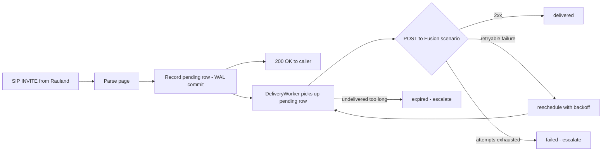

**Why this is durable.** The critical guarantee is the ordering `record -> commit -> attempt`. If the process dies at *any* point after the commit — power loss, `SIGKILL`, an OS-triggered restart — the `pending` (or crash-orphaned `delivering`) row is still on disk and is re-driven on the next startup ([§4](#4-crash-recovery-and-graceful-drain)). No page is ever "in flight only in memory."

### Delivery tuning (defaults, from `delivery.py` / `config.py`)

| Setting | Default | Meaning |
|---|---|---|
| `max_attempts` | `6` | Delivery attempts before a page is marked `failed` and escalated. |
| `base_backoff_seconds` | `2.0` | First retry delay; doubles each attempt (exponential backoff). |
| `max_backoff_seconds` | `60.0` | Ceiling on any single backoff interval. |
| `max_age_seconds` | `900.0` | A page still undelivered after 15 min is marked `expired` and escalated. |
| `poll_interval_seconds` | `1.0` | How often the worker sweeps for deliverable rows. |
| `batch_size` | `20` | Rows examined per sweep. |

Backoff is **exponential** (`base * 2^(attempt-1)`, capped at `max_backoff_seconds`), but if Fusion returns a `Retry-After` header with a delta-seconds value, the worker **honors that instead** (capped at the same ceiling). The `Retry-After` HTTP-date form is intentionally *not* honored — it falls back to exponential backoff (see [`webhook.py` `_parse_retry_after`](../../sipgw/webhook.py)).

---

## 3. The delivery state machine

Every call row carries a `state` column. The `DeliveryWorker` and the DB helpers move a row through these states. This is the single source of truth for "did this page get out?" and it is what the dashboard's stats and `/call/{id}` view read.

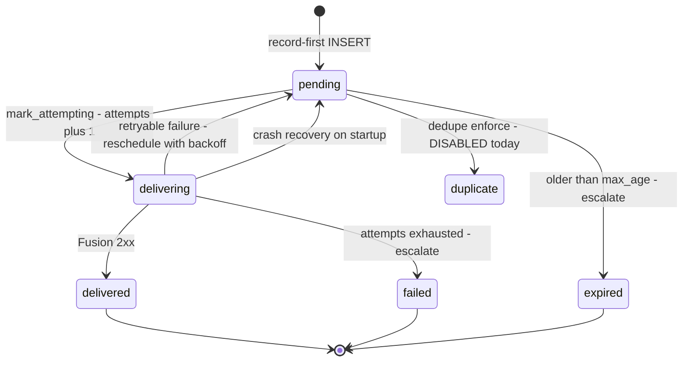

| State | Meaning | Terminal? |
|---|---|---|
| `pending` | Recorded durably, awaiting a delivery attempt (or waiting out a backoff cooldown before the next one). This is the state a page sits in between retries. | No |
| `delivering` | The worker has claimed the row and is mid-attempt (`attempts` was just incremented). A crash here is recovered back to `pending` on startup. | No |
| `delivered` | Fusion returned **2xx**. The page is out; `delivered_at`, `fusion_status`, and `response_time_ms` are stamped and `last_error` cleared. | **Yes (success)** |
| `retrying` | Conceptual label for a page that has failed at least once and is scheduled for another attempt. On disk this is represented as `pending` with `attempts > 0` and a non-null `last_error`; the worker holds an in-memory cooldown until the backoff elapses. | No |
| `failed` | Delivery **exhausted** `max_attempts` without a 2xx. `last_error` records the last status; **escalation fires**. Requires human attention. | **Yes (failure)** |
| `expired` | The page stayed undelivered past `max_age_seconds` (15 min default). Marked `expired`, **escalation fires**. A very stale page is retired rather than paged out minutes late. | **Yes (failure)** |
| `duplicate` | A page suppressed as a clinical duplicate. **Not used in production today** — dedupe enforcement ships disabled ([§7](#7-duplicate-invites-and-clinical-dedupe-shadow-mode-today)). Reserved for the enforcement path; when it exists, the row is recorded but deliberately not delivered. | **Yes (suppressed)** |
| `legacy` | Pre-outbox rows that predate the state machine (the ~300 historical prod rows the migration back-filled). Classified for stats by their stored `fusion_status`, not re-delivered. | **Yes (historical)** |

**Notes on the "retrying" state.** It is a *reporting* state, not a distinct on-disk value: the retry path calls `reschedule()`, which returns the row to `pending` with an updated `last_error` and `fusion_status`, while the worker keeps a per-row cooldown (`_next_before`) in memory. That cooldown is intentionally in memory only — if it is lost to a restart, the row is simply re-attempted sooner, which is the safe direction (we would rather retry early than late).

---

## 4. Crash recovery and graceful drain

- **Startup recovery.** On boot, `recover()` calls `recover_inflight()`, which flips every crash-orphaned `delivering` row back to `pending`. A page that was mid-attempt when the process died is re-queued and delivered. This is the mechanism that turns "record-first" into genuine **at-least-once** delivery across restarts.
- **Graceful drain.** On a clean shutdown the worker runs `drain()` (best-effort, deadline-bounded) to flush any `pending` rows before exiting. Durability does **not** depend on drain succeeding — record-first plus startup recovery already cover a hard stop; drain is purely an optimization to empty the queue on a coordinated stop.
- **Systemd watchdog.** `sipgw.service` runs `Type=notify` with `WatchdogSec=30s` ([`watchdog.py`](../../sipgw/watchdog.py)). If the writer wedges, systemd restarts it and startup recovery re-drives the queue.

---

## 5. Background OAuth token refresh (token off the critical path)

Fusion's Scenarios API requires an OAuth2 bearer token. In the old inline model, if the cached token was expired **at the moment a page arrived**, the page's own delivery had to stop and fetch a fresh token first — a network round-trip on the critical path, and precisely the kind of transient failure that lost the 2026-06-12 page.

The current build runs a **background refresh loop** (`start_token_refresh` / `_refresh_loop` in [`webhook.py`](../../sipgw/webhook.py)):

- A dedicated task keeps a valid token cached at all times, renewing it roughly `token_refresh_margin_seconds` (default **300s**) **before** expiry.
- When a page is delivered, the token is almost always already warm — no fetch on the paging path.
- If a delivery ever does hit a `401` (token revoked/rotated mid-flight), `trigger_scenario` clears the cache, re-authenticates, and retries the POST **once** inline — and any remaining failure still falls through to the durable retry loop rather than being lost.
- Token refresh takes the token lock only while actually refreshing; the reachability probe and the delivery path never block each other on it.

The net effect: **token acquisition is no longer a single point of failure on the paging path.** A transient token-endpoint hiccup is absorbed by the background loop and the outbox retries, not paid for by a live Code Blue.

---

## 6. The 2026-06-12 lost Code Blue: what happened, and how this build prevents it

**What happened.** A Code Blue INVITE arrived and was processed on the old **inline** delivery path. Delivering the page required an OAuth token fetch, and that fetch hit a transient `httpx.ConnectTimeout`. Because delivery was inline and **there was no durable record and no retry**, the exception propagated, the call was recorded with `fusion_status = -1`, and **the page was never sent**. One transient network timeout on the critical path lost a life-safety notification with no second chance.

**How the current build prevents it.** Every contributing factor has been removed:

| 2026-06-12 failure factor | Current-build mitigation |
|---|---|
| Delivery was inline on the SIP thread. | **Record-first outbox** — the page is durably committed before any network attempt ([§2](#2-durable-delivery-model-transactional-outbox)). |
| A single transient timeout was fatal. | **Bounded retries with backoff** — up to `max_attempts` (6) attempts before failure ([§3](#3-the-delivery-state-machine)). |
| Token fetch happened on the paging path. | **Background token refresh** keeps the token warm off the critical path ([§5](#5-background-oauth-token-refresh-token-off-the-critical-path)). |
| A lost page was silent (just `fusion_status=-1`). | On permanent failure/expiry, **escalation fires** to a human channel ([§8](#8-escalation-on-permanent-failure)). |
| A crash mid-send lost the page entirely. | **Startup recovery** re-drives crash-orphaned rows ([§4](#4-crash-recovery-and-graceful-drain)). |

Under today's build, that exact scenario would land the page in `pending`, retry it within seconds as the transient timeout cleared, and deliver it — or, in a genuine sustained outage, escalate it loudly rather than dropping it silently.

---

## 7. Duplicate INVITEs and clinical dedupe (SHADOW mode today)

**The upstream behavior.** Rauland's nurse-call source emits **two INVITEs per event** for a meaningful fraction (~1/3) of events. Left unhandled, this means some events would produce two overhead pages.

**What ships in production today — accuracy note.** The clinical dedupe module (`dedupe.py`) is present but ships **DISABLED / SHADOW-only**. The shipped config is:

```yaml
dedupe:
  enforce: false        # never suppresses a page
  window_seconds: 0     # the duplicate-lookup query never even runs
  match_bed: true
  match_purpose: true
```

With these defaults:

- `evaluate()` computes a stable **clinical fingerprint** (`cf-v1:` — normalized `area / room / bed / purpose`) but, because `window_seconds` is 0, **never queries the database and never suppresses anything**.
- Setting `window_seconds > 0` with `enforce: false` turns on **shadow telemetry only**: each clinical duplicate is logged as `WOULD suppress ... gap=<seconds> ...` and annotated in `duplicate_of`, so the real duplicate rate can be measured — but **the page is still delivered**.
- `enforce: true` is treated as an **out-of-policy configuration**. `validate_config` warns loudly (`*** DEDUPE SUPPRESSION ACTIVE ***`), and even in that state the main paging path never gates delivery on the decision. Suppression that actually drops a page requires clinical sign-off that has **not** been given.

> **Why disabled?** Suppressing a duplicate is indistinguishable, in code, from dropping a real second Code Blue for the same room. Per the "missed never" rule ([§1](#1-the-core-promise-duplicate-ok-missed-never)), that trade is gated behind explicit clinical approval. Until then the gateway **delivers both INVITEs** — a duplicate page is the accepted, safe outcome.

Two identities are kept strictly separate and must never be conflated:

- **SIP transaction identity** (`v1:` `invite_fingerprint`, #15) — a *retransmit of the same INVITE* (same Call-ID/From/CSeq).
- **Clinical identity** (`cf-v1:` fingerprint, #5) — *who/where/why* (area/room/bed/purpose).

The upstream **event-id** (extracted from the SIP Call-ID, stored in the indexed `event_id` column) is recorded on every page as telemetry and is a prerequisite for the future HA "one-call-one-host" work, but today it is annotation only — never a match key, never a delivery gate.

---

## 8. Escalation on permanent failure

When a page reaches a terminal failure state, the gateway makes the failure **loud** rather than silent (`on_escalate` callback -> [`escalation.py`](../../sipgw/escalation.py)):

- **`failed`** (retries exhausted) and **`expired`** (undelivered past the deadline) both trigger escalation.
- The escalator POSTs a JSON summary (reason, call id, caller, area/room, attempts, `fusion_status`, `last_error`) to the configured `escalation.webhook_url` (Teams / Slack / PagerDuty / NOC).
- If **no** webhook is configured, the failure is still logged at `ERROR` (`ESCALATION (no webhook configured) — ...`) so it is visible in `sipgw.log`.
- Escalation is **robust by contract**: any failure inside the escalator is logged and swallowed, never raised — a broken alert channel can never disrupt delivery of the *next* page.
- In dry-run/test the escalation client carries the same **no-send guard** as the Fusion client, so drills cannot page a real human channel.

> **Operational recommendation:** set `escalation.webhook_url` in production. Without it, a `failed`/`expired` page is recorded and logged but will not actively alert anyone.

---

## 9. SIP correctness: ACK-gated BYE (the 481 race, fixed)

The gateway answers each INVITE (`200 OK`), then in **immediate-BYE** mode tears the call back down so the RTP port is freed promptly. An older build could send the gateway's `BYE` **before** the caller's `ACK` had arrived, drawing a `481 Call Leg/Transaction Does Not Exist` from the far end and leaving the SIP dialog in an inconsistent teardown.

The current build ([`sip_server.py`](../../sipgw/sip_server.py), #11) makes teardown **ACK-gated**:

- After sending `200 OK`, the gateway **keeps the call and defers its BYE** until the caller's `ACK` confirms the three-way handshake. This guarantees `INVITE -> 200 -> ACK -> BYE` ordering — the BYE never outruns the ACK, so no 481 is drawn.
- A **lost-ACK fallback timer** (`immediate_bye_ack_timeout_seconds`) tears the call down anyway if the ACK never arrives, so a dropped ACK can't leak a call or an RTP port.
- The teardown funnel is a **single-fire, idempotent** path — whichever of {ACK arrives, fallback fires, peer BYE, shutdown} happens first sends the deferred BYE exactly once.

**Crucially, the page does not depend on any of this.** The durable page is recorded from the INVITE handler; ACK/BYE/fallback are the SIP-hygiene layer and never gate whether the page goes out.

---

## 10. What the design guarantees (and what it does not)

**Guaranteed (as deployed):**

- **At-least-once delivery** of every accepted page, across process crashes, restarts, Fusion outages, and transient token/network failures — via record-first + WAL durability + bounded retries + startup recovery.
- **No silent loss** — a page that ultimately can't be delivered ends in `failed` or `expired` and is escalated (and always logged).
- **Token acquisition is not on the critical path.**
- **SIP teardown is spec-correct** (no 481 race) and independent of the paging guarantee.
- **Duplicate pages are tolerated, never dropped by accident** — clinical suppression is off by default.

**Explicitly NOT guaranteed:**

- **Exactly-once delivery.** The design is at-least-once by choice. A retry after an ambiguous response (e.g., a 2xx that was lost in transit) can produce a duplicate page. This is accepted under the "duplicate OK" rule.
- **Ordering across pages.** The worker delivers oldest-first per sweep, but retries and backoff mean a retried page can be delivered after a newer one. Each page is independent; there is no cross-page sequencing contract.
- **Delivery within a hard latency bound.** Normal delivery is sub-second, but a page under retry/backoff can take up to `max_age_seconds` (15 min) before it is retired as `expired`. There is no faster hard SLA than "delivered as soon as Fusion accepts it, or escalated."
- **Automatic de-duplication of Rauland's double-INVITEs** — suppression is disabled ([§7](#7-duplicate-invites-and-clinical-dedupe-shadow-mode-today)).

---

## 11. Known limitations (and the roadmap that addresses them)

These are real, current limitations of build `c23f3eb`. The fixes live in the **[Roadmap](70-roadmap.md)** and are **not** deployed today.

### 11.1 Single node — no automatic failover (roadmap #17)

The gateway runs on a **single host** (`sip2apibridge`). Durability protects against process crashes and transient failures, but **not against loss of the host itself** (hardware failure, network partition, a long OS outage). While the node is down, no pages are delivered; a stale page resumes when the node returns and startup recovery re-drives the queue, but there is no *live* second node.

> **Roadmap #17 (HA epic):** NetScaler load-balanced active/active with autonomous durable nodes, one-call-one-host via Call-ID persistence, a delivery-aware `/health` monitor, and failover-without-failback. Planned; not built.

### 11.2 Uncoordinated OS-triggered restarts (issues #20, #19)

On 2026-07-07, an `unattended-upgrades`/`needrestart` auto-restart bounced the paging service uncoordinated (**issue #20**). Because delivery is durable, no page was lost — the outbox and startup recovery covered it — but the restart was **uncoordinated**, i.e., it could interrupt an in-flight attempt at an arbitrary moment rather than during a drained, quiescent window.

> **Roadmap #20:** coordinate OS patching / auto-restarts with the paging service.
> **Roadmap #19:** zero-downtime writer restarts via systemd **socket activation**, so the SIP listener survives a writer restart with no dropped datagrams.

This is an **operational lesson**, not a delivery-durability gap: the durable outbox already prevented data loss; #19/#20 close the *availability* window during patching.

### 11.3 Timestamp timezone (documented quirk)

The host clock is `Etc/UTC` and stored timestamps are canonical **UTC RFC3339**. The config declares `logging.timezone: America/New_York`, but that value is **not applied to stored timestamps** — on-disk timestamps are UTC. The dashboard renders local wall-clock for humans; day-boundary bucketing keys off the numeric `created_at` epoch, so mixed legacy-local and new-UTC rows still classify correctly. This is a cosmetic/config-clarity item, not a reliability defect.

### 11.4 No host firewall on the paging ports (security-adjacent, see Security section)

There is currently **no host firewall** (empty nftables) on `:5060` and `:8080`; ingress relies on the application-level SIP allowlist, and the dashboard has no authentication. This does not affect delivery guarantees but is a hardening gap — see the **Security** section for the recommended nftables rules.

---

## 12. Reliability at a glance

| Concern | Mechanism | Module |
|---|---|---|
| Don't lose a page on a transient failure | Record-first outbox + bounded retries + backoff | `delivery.py`, `database.py` |
| Survive a crash mid-delivery | WAL durability + startup `recover_inflight()` | `database.py` |
| Keep auth off the critical path | Background token refresh | `webhook.py` |
| Make permanent failures loud | Escalation on `failed` / `expired` | `escalation.py` |
| Don't drop a real duplicate Code Blue | Clinical dedupe ships **disabled** (shadow) | `dedupe.py` |
| No 481 on SIP teardown | ACK-gated deferred BYE + lost-ACK fallback | `sip_server.py` |
| Detect a wedged writer | systemd `Type=notify` watchdog | `watchdog.py` |
| Report true delivery state | `state` column + state-aware stats | `database.py`, dashboard |

**Bottom line:** as deployed, the gateway is a durable, single-node, at-least-once paging system that will not silently lose a Code Blue. Its remaining gaps are *availability during host loss and OS patching* — addressed by the HA and restart-coordination roadmap items, which are planned and not yet in production.


\newpage

# High-Availability Plan (Next Iteration)

> **Status: PLANNED — not deployed.** Everything in this section describes the
> *next* iteration of the RedEye sip2api Gateway. The **current production build
> (`c23f3eb`, the v1.7 line)** runs a **single autonomous durable node**
> (`sip2apibridge`, 10.249.0.60). The single node is already hardened for
> reliability — record-first durable outbox, bounded retries with backoff,
> background OAuth refresh, watchdog, and a delivery-aware `/health` — so the HA
> work below adds **node-level redundancy**, not a rewrite. It is tracked as the
> open **HA epic #17**, with **#19 (zero-downtime writer restarts)** as its
> near-term companion. Nothing here should be read as a description of what is
> live today.

This section documents the target HA architecture, the design decisions behind
it, the companion zero-downtime-restart work, and the concrete open requirements
(NetScaler, Singlewire, Rauland) that must be satisfied before HA can be cut in.

---

## 1. Why HA, and why now

The gateway is on the life-safety path: a real Code Blue or RRT INVITE from
Rauland must become an InformaCast Fusion overhead page **every time**. The
current single node already survives the failure modes that used to lose a page
*within* one host:

- a Fusion outage or transient `httpx.ConnectTimeout` (the 2026-06-12 loss) — now
  absorbed by the durable outbox + bounded retries + background token refresh;
- a process crash between "page received" and "page delivered" — now recovered on
  restart (`recover_inflight()` returns orphaned `delivering` rows to `pending`);
- duplicate upstream INVITEs — now collapsed by enforcing dedupe.

What a single node **cannot** survive is the loss of the **host itself**: a
kernel panic, a hypervisor failure, a NIC/link failure on ens34, an OS patch
that wedges the box, or a botched maintenance window. During any of those, there
is no second node to answer the SIP INVITE, and a page can be lost at the front
door before the durable outbox ever sees it.

The 2026-07-07 **unattended-upgrades / `needrestart` incident (#20)** made the
gap concrete: an OS auto-restart bounced the paging service uncoordinated, with
no second node to carry traffic during the blip. That incident motivates **both**
tracks below — node redundancy (#17) *and* zero-downtime restarts (#19).

**HA goal:** no single host failure — planned or unplanned — can drop, delay past
the retry budget, or duplicate a Code Blue.

---

## 2. Target topology (planned)

Two or more **autonomous durable nodes** sit behind an **HA NetScaler load
balancer** that fronts the SIP virtual IP. Rauland points at the NetScaler SIP
VIP instead of directly at the gateway. Each node is a full, independent copy of
today's production node: its own SIP listener, its own record-first durable
outbox (SQLite WAL), its own delivery worker, escalation, and dashboard. Nodes
are **shared-nothing** — there is no shared database, no cross-node lock, and no
leader election on the paging path.

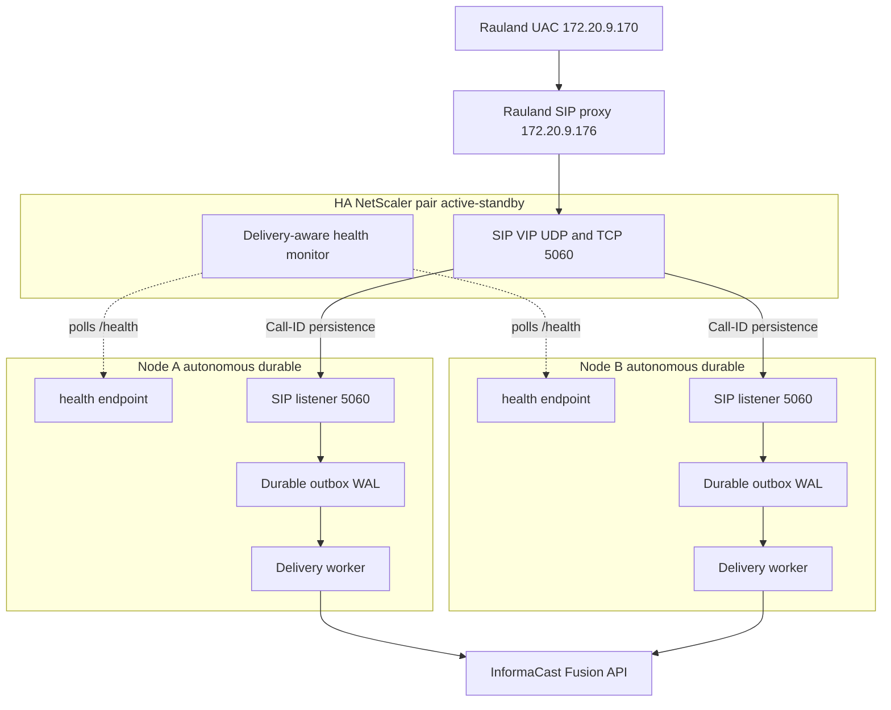

Key properties:

| Property | Design choice |
|---|---|
| Load balancer | HA NetScaler pair fronting a single SIP VIP (UDP **and** TCP 5060) |
| Node model | 2+ **autonomous, shared-nothing** nodes; each a full durable gateway |
| Call affinity | One call to one node via **SIP Call-ID persistence** (not source IP) |
| Durability | **Per-node** durable outbox (record-first WAL) — no shared DB |
| Health | **Delivery-aware** `/health` monitored by the LB; unhealthy nodes drained |
| Failover | Automatic failover **on**, automatic **failback off** (see §5) |
| Maintenance | Native **drain** of a node (stop new calls, finish in-flight) |

---

## 3. Call affinity: SIP Call-ID persistence (not source IP)

The single most important LB decision is **how a call is pinned to a node**.

A SIP call is a multi-message dialog — `INVITE`, `ACK`, and `BYE` for the same
call must all reach the **same** node, because that node holds the in-memory
dialog state keyed on the Call-ID. In the current code the SIP server stores
every live call in `self.calls[call_id]` and matches the follow-up `ACK` and
`BYE` back to it by Call-ID; a message that lands on the wrong node is an "ACK
for unknown call" and the ACK-gated immediate-BYE teardown cannot complete
cleanly.

The obvious LB persistence method — **source-IP affinity — does not work here.**
Every INVITE arrives from the **single Rauland proxy source `172.20.9.176`**
(Rauland UAC `172.20.9.170` → proxy `172.20.9.176` → gateway). Source-IP
persistence would therefore pin **all** traffic to **one** node and defeat the
entire purpose of HA: the "balancer" would never balance, and losing that one
node would lose everything.

**The persistence key must be the SIP `Call-ID` header.** The NetScaler must
parse the SIP message, extract `Call-ID`, and hash it to a node, so that:

- every INVITE for a *new* Call-ID is balanced across the healthy node set;
- every subsequent ACK / BYE for that *same* Call-ID lands on the *same* node
  that answered its INVITE.

This is a hard NetScaler requirement (see §6). The gateway already emits the
retransmit-stable transaction fingerprint (`v1:…`, keyed on Call-ID + From +
CSeq) and persists the upstream `event_id` derived from the Call-ID, so the
node-side correlation needed to reason about "one call → one host" is already in
place; the missing piece is **Call-ID-based persistence on the balancer**.

---

## 4. Autonomous durable nodes — no shared state

Each node keeps the **per-node durable outbox** exactly as it works today. There
is deliberately **no shared database** and **no cross-node coordination** on the
paging path:

- A node that answers an INVITE **records the page first** (state `pending`, WAL)
  on its **own** disk before any Fusion send, then its **own** delivery worker
  drives `pending → delivering → delivered | failed | expired` with bounded
  retries and backoff, escalating on permanent failure.
- Because a whole call (INVITE + ACK + BYE) is pinned to one node by Call-ID
  persistence, that node owns the page end-to-end. There is never a hand-off of
  a half-delivered page between nodes, so there is nothing to replicate and no
  split-brain to resolve on the delivery path.
- If a node dies **after** recording a page but **before** delivering it, that
  page lives in *that node's* WAL. On restart the node's `recover_inflight()`
  re-queues it and delivery resumes. HA does not change this contract — it just
  means the *rest* of the cluster keeps answering **new** calls while the dead
  node is down or recovering.

This shared-nothing model is what makes the nodes "autonomous": each is
independently correct and independently durable. The LB adds availability for
**new** calls; the per-node outbox continues to guarantee durability for calls a
node has already accepted.

> **Duplicate suppression is per-node.** Enforcing dedupe (window 2s, event-id /
> clinical-key based) runs against each node's **own** WAL. Rauland's ~1-in-3
> double-INVITE is collapsed correctly **as long as both INVITEs of one event
> land on the same node** — which Call-ID persistence guarantees when both
> INVITEs share a Call-ID. See §6 for the Singlewire idempotency-key backstop
> that covers the residual cross-node case.

---

## 5. Failover with no automatic failback

Failover is **automatic**; failback is **not**.

- **Failover (automatic).** When the LB's delivery-aware monitor marks a node
  unhealthy (see below), the NetScaler stops sending it **new** calls and
  distributes them across the remaining healthy node(s). In-flight calls already
  pinned to a surviving node are unaffected.
- **No automatic failback.** When a previously-failed node comes back healthy,
  the LB does **not** automatically resume steering new calls to it. A node is
  returned to rotation only by a **deliberate operator action**.

The reason is life-safety stability. A node that is *flapping* — healthy, then
unhealthy, then healthy again on a short cycle (e.g. a partial network fault, an
OOM loop, or a half-finished OS patch) — would, under automatic failback, be
handed live Code Blue traffic during a window when it is not actually trustworthy.
"No automatic failback" makes recovery an explicit, observed, human-gated step:
an operator confirms the node is genuinely healthy (its outbox has drained, its
`/health` has been solidly green, logs are clean) and only then returns it to the
active set. We prefer a brief period running on fewer-but-known-good nodes over
auto-rejoining a flapping node onto the paging path.

### Delivery-aware health as the failover signal

Failover is only as good as the health signal driving it. The LB must **not**
rely on a bare TCP-connect or "the web server answered" check — a node can accept
TCP on 5060 while its delivery pipeline is stuck. The monitor polls each node's
existing **delivery-aware `/health`**, which already reflects:

- **writer heartbeat freshness** — `/health` returns `200 {"status":"ok"}` only
  when the writer's heartbeat is fresher than `stale_after_seconds` (default 30s);
  a dead or hung writer returns `503 stale` / `503 no-heartbeat`. This is genuine
  cross-process writer liveness, not just "the HTTP server is up";
- **delivery backlog and last-delivered** telemetry (`backlog`,
  `last_delivered_at`);
- **Fusion reachability** (`fusion_reachable`, `fusion_checked_age_s`) — optional
  degrade available;
- **inbound-liveness / Rauland-reachability** (`last_inbound_sip_age_s`) — "is the
  Rauland link up, or just quiet?".

For HA, the LB monitor should key failover on the **`/health` status code**
(heartbeat-driven, the current authoritative liveness signal), with a **fast poll
interval** so a dead node is drained from the SIP VIP within a small number of
seconds rather than the current single-node self-restart timeframe. The
informational fields (`backlog`, `fusion_reachable`, `last_inbound_sip_age_s`)
feed operator dashboards and the failback decision; whether any of them should
also gate LB removal is an open policy question (see §6). Today, deliberately, a
Fusion blip or a delivery backlog **does not** flip the single node's `/health`
status code — because on a lone node, self-evicting on a transient Fusion issue
would take the *only* pager offline. In a multi-node cluster that trade-off can be
revisited: with peers available, a node with a genuinely stuck delivery pipeline
*could* be drained. That is a config decision to make at HA cut-in, not a code
change already shipped.

---

## 6. Companion: zero-downtime writer restarts (#19)

HA across hosts does not, by itself, make a **single node** restart gracefully.
The #20 incident was a *writer restart* problem: bouncing `sipgw.service`
tears down the SIP listener, so INVITEs that arrive during the restart window hit
a closed socket. On a single node that is a brief SIP blip; even in a cluster,
every node still needs to restart cleanly for routine patching and upgrades.

**Issue #19 — systemd socket activation** is the fix, and the natural companion
to the HA epic:

- systemd owns the listening sockets for **UDP and TCP 5060** (and, if desired,
  the dashboard's 8080) via a `.socket` unit. The kernel keeps the socket open
  and **queues** inbound datagrams/connections across a writer restart.
- When the writer process restarts, it **inherits** the already-open sockets from
  systemd instead of binding them itself. The socket never closes, so INVITEs
  that arrive mid-restart are buffered by the kernel and serviced the moment the
  new writer is ready — **no dropped INVITE, no reset connection, no SIP blip.**
- This composes cleanly with the record-first outbox: a page is still recorded
  before any send, and `recover_inflight()` still re-queues anything caught
  in-flight by the restart. Socket activation removes the *front-door* gap;
  the outbox already covers the *delivery* gap.

Paired with **#20's operational lesson** (coordinate OS patching; never let
unattended-upgrades bounce the paging service unannounced), socket activation
turns a writer restart from a "brief outage" into a "non-event." In the HA
cluster, restarts are further covered by draining one node at a time (§7) so the
VIP always has a live node — socket activation and node drain are
complementary, not redundant.

---

## 7. Native maintenance drain

The planned build supports a first-class **drain** of a single node for
maintenance without any paging gap:

1. Operator marks Node A for drain (a maintenance flag the LB monitor honors, or
   an admin action on the NetScaler).
2. The LB stops steering **new** Call-IDs to Node A; new calls go to the
   remaining healthy node(s).
3. Node A **finishes in-flight work**: it completes the ACK/BYE teardown for
   calls it already answered, and its delivery worker drains its outbox
   (`pending → delivered`) with the normal retry/backoff budget.
4. Once Node A's outbox is empty and no dialogs are live, it can be patched,
   rebooted, or upgraded (ideally with #19 socket activation so even its own
   restart is seamless).
5. Because **failback is not automatic** (§5), Node A rejoins the active set only
   when the operator explicitly returns it.

This is the supported answer to the #20 class of problem: OS patching and
gateway upgrades become a rolling, one-node-at-a-time operation with the SIP VIP
continuously served by at least one healthy durable node.

---

## 8. Open requirements before HA can be cut in

HA is a **plan**, and it depends on capabilities outside the gateway code. These
are the concrete gates:

### 8.1 NetScaler (load balancer)

- **SIP load balancing for UDP *and* TCP on 5060** across the node set behind a
  single VIP.
- **SIP Call-ID persistence** — parse the SIP `Call-ID` header and pin all
  messages of a dialog (INVITE/ACK/BYE) to the node that answered the INVITE.
  **Source-IP persistence is explicitly unusable** because all traffic shares the
  single proxy source `172.16.…`/`172.20.9.176` (§3).
- **Fast, delivery-aware `/health` monitoring** — an HTTP monitor against each
  node's `/health`, keyed on the status code, at a poll interval short enough to
  drain a dead node from the VIP within a few seconds. Open policy question:
  whether the monitor should *also* consider `/health` informational fields
  (`backlog`, `fusion_reachable`) for LB removal, or leave those to operators and
  the failback decision (§5).
- **Automatic failover, manual failback** semantics configured on the service
  group (§5), plus a **maintenance-drain** action (§7).

### 8.2 Singlewire / InformaCast Fusion

- **Idempotency key on the scenario trigger.** Per-node dedupe collapses Rauland's
  double-INVITE **when both INVITEs land on the same node** (Call-ID persistence
  makes that the normal case). A Singlewire-honored **idempotency key** on the
  Fusion trigger — derived from the upstream `event_id` the gateway already
  persists — is the cluster-wide backstop that guarantees **one event → one
  overhead page** even in the residual case where two related INVITEs are answered
  by two different nodes (each with its own outbox and no shared dedupe view).
  Without an upstream idempotency key, cross-node duplicate suppression cannot be
  fully guaranteed by the gateway alone.

### 8.3 Rauland (upstream)

- **Dual-target / VIP awareness.** Rauland's UAC/proxy must send INVITEs to the
  **NetScaler SIP VIP** (not directly to a single gateway host at 10.249.0.60), so
  the LB can distribute and persist calls. Confirm Rauland can be pointed at the
  VIP and, where applicable, be configured with the VIP as its notification
  target so failover is transparent to the source.

### 8.4 Gateway (this product)

The gateway is already largely HA-ready: shared-nothing per-node durable outbox,
record-first persistence, Call-ID-keyed dialog state, persisted `event_id`, and a
delivery-aware `/health`. The remaining gateway-side work for the epic is
**#19 socket activation** (§6) and the small amount of glue needed to expose a
**drain** state the LB monitor can observe (§7). No change to the durability
contract is required — HA is additive.

---

## 9. Summary

| Concern | Current build (`c23f3eb`, live) | Planned HA build (#17 + #19) |
|---|---|---|
| Nodes | Single autonomous durable node | 2+ autonomous durable nodes behind NetScaler VIP |
| Host failure | Page path down until host recovers | Surviving node(s) keep answering new calls |
| Call affinity | N/A (one node) | SIP **Call-ID** persistence (never source IP) |
| Durability | Per-node record-first WAL outbox | **Unchanged** — per-node, shared-nothing |
| Restart | Brief SIP blip on writer restart (#20) | **#19 socket activation** — no dropped INVITE |
| Health/failover | Self-restart on hung writer (watchdog) | LB drains unhealthy node via delivery-aware `/health` |
| Failback | N/A | **Manual only** — no auto-failback of a flapping node |
| Maintenance | Coordinated restart window | Native one-node-at-a-time **drain** |
| Duplicate control | Per-node enforcing dedupe (event-id keyed) | Per-node dedupe **+** Singlewire idempotency key backstop |

**Bottom line:** the HA plan adds node-level redundancy *around* the reliability
guarantees the single node already provides, without weakening any of them. It is
gated on three external capabilities — **NetScaler SIP LB with Call-ID
persistence and fast delivery-aware health monitoring**, a **Singlewire
idempotency key**, and **Rauland targeting the SIP VIP** — plus the gateway-side
**#19 zero-downtime-restart** companion. Until those gates are cleared, this
remains the documented target for the next iteration, not the deployed build.


\newpage

# Roadmap

> **Applies to:** RedEye sip2api Gateway production build `c23f3eb` (branch `main`, the v1.7 line = v1.6.5 + 6 commits), deployed on host `sip2apibridge`.
>
> This section describes **direction, not dated commitments**. It states what has already shipped (so the roadmap is read against an honest baseline), then the concrete open work that remains, then the upstream asks we are pursuing with our vendors. Anything listed here as planned is **not deployed today** — the current build is exactly what the rest of this manual documents.

---

## 1. What has already shipped (the reliability + observability program)

Most of the hard reliability and observability work is **done and in production**. It is easy, reading a roadmap, to assume everything below is still aspirational — it is not. The following all shipped across the **v1.6.x** line and are the deployed build today:

| Capability | What it does | Shipped |
|---|---|---|
| **Durable delivery** (transactional outbox) | Record-first `pending` row in SQLite WAL before any Fusion attempt; a background `DeliveryWorker` delivers with bounded retries + exponential backoff | v1.6.0 |
| **Escalation** | Permanent (`failed` / `expired`) pages post to a human alert channel | v1.6.0 |
| **Background OAuth token refresh** | Token refreshed proactively, off the critical path — a page never blocks on a token round-trip | v1.6.0 |
| **Async logging** | Non-blocking queue handler moves file writes / rotation / gzip off the event loop | v1.6.0 |
| **Real `/health` + watchdog** | Writer heartbeat backs `/health`; systemd `Type=notify` + `WatchdogSec` restarts a hung writer | v1.6.0 |
| **Config validation** | Fatal on invalid production config; loud warnings on soft issues; unknown-key typo warnings | v1.6.0 / v1.6.1 |
| **State-aware stats** | Dashboard stats derive from the delivery state machine and exclude test rows | v1.6.0 |
| **Canonical UTC timestamps** | RFC3339 `…Z` stamps in DB and all four log streams; UTC-sortable, string-matchable against Singlewire | v1.6.0 / v1.6.1 |
| **Two-service split** | Read-only dashboard is a separate process; it can be restarted without interrupting paging | v1.6.0 |
| **INVITE fingerprint + event_id** | Stable transaction fingerprint and persisted upstream `event_id` column | v1.6.0 / v1.6.1 / v1.6.3 |
| **Dashboard v2 core** | Date-picker log viewer, 90-day stacked call-type chart, `/call/{id}` correlated detail, per-call diagnostic bundle | v1.6.2 – v1.6.5 / v1.7 |
| **Fusion reachability + inbound-liveness on `/health`** | Optional Fusion-unreachable signal; last-inbound-SIP-age (Rauland reachability) card | v1.6.1 / v1.6.3 |
| **Enforcing dedupe** | Clinical duplicate suppression, signed off and enabled: window 2s, bed-level, purpose-keyed, record-first, fail-safe | v1.7 |
| **ACK-gated immediate-BYE** | Page fires immediately; gateway BYE deferred until the ACK confirms the dialog (closes the 481 race), with a lost-ACK fallback | v1.7 |

The single lost Code Blue of 2026-06-12 — a transient `httpx.ConnectTimeout` during an inline OAuth fetch, with no retry — is **prevented** by the durable outbox, bounded retries, and background token refresh above. See the **Reliability** section for the full account.

Everything from here down is what is **not** yet built.

---

## 2. Open work — the six tracked issues

These are the only open issues at build `c23f3eb`. Everything else in the reliability/observability program shipped in v1.6.x. They are listed roughly in the order they matter for a **single-node** deployment; the two availability items (#20, #19) are the near-term focus, the HA epic (#17) is the larger-horizon effort.

### #20 — OS auto-restart coordination *(near-term)*

**Problem.** On 2026-07-07 an `unattended-upgrades` / `needrestart` auto-restart bounced the paging service **uncoordinated**. No page was lost — the durable outbox and startup recovery covered it — but the restart landed at an arbitrary moment rather than during a drained, quiescent window.

**Direction.** Coordinate OS patching and automatic service restarts with the paging service so restarts happen in controlled windows, not whenever the package manager decides. This is an operational-safety item; the data-loss risk was already closed by durability. Interim mitigation (documented in **Operations**): scope `needrestart`/`unattended-upgrades` away from the paging unit and patch in a planned window.

### #19 — Zero-downtime writer restarts (systemd socket activation) *(near-term)*

**Problem.** A writer restart today drops a brief (~0.3 s) SIP window: while the process is down, inbound UDP datagrams to `:5060` have no listener.

**Direction.** Move the SIP listening socket to **systemd socket activation**, so the socket is owned by systemd and **survives** a writer restart. Datagrams that arrive during the swap are buffered by the kernel and handed to the new process, so a planned (or unplanned) writer restart no longer drops a packet. This is the clean fix underneath #20 — with it, coordinated restarts become genuinely seamless.

### #17 — High-availability epic (NetScaler active/active) *(larger horizon)*

**Problem.** The gateway runs on a **single host**. Durability protects against process crashes and transient failures, but **not against loss of the host itself** (hardware, network partition, long OS outage). While the node is down, no pages are delivered.

**Direction — a shared-nothing, active/active pair behind the site NetScaler:**

- **Two autonomous durable nodes.** Each node is a complete, self-sufficient gateway (its own outbox, its own delivery worker) — no shared database, no shared state, nothing for one node to wait on. Either node can deliver any page on its own.
- **One call → one host, via Call-ID persistence.** The NetScaler pins each SIP dialog to a single node by **Call-ID**, so the INVITE / ACK / BYE of one call all land on the same gateway and the SIP state machine stays coherent.
- **Delivery-aware `/health` monitor.** The load balancer health check reflects real **delivery** health (not just "the web server answered"), so a node that can accept SIP but cannot reach Fusion is taken out of rotation. This is why the `health.fail_on_fusion_unreachable` foot-gun exists and ships **OFF** today — it is built for this topology, where there is a second node to fail over to.
- **Failover without failback.** On failover, traffic moves to the healthy node and **stays** there until an operator deliberately returns it — no automatic flapping back to a node that just proved unreliable.

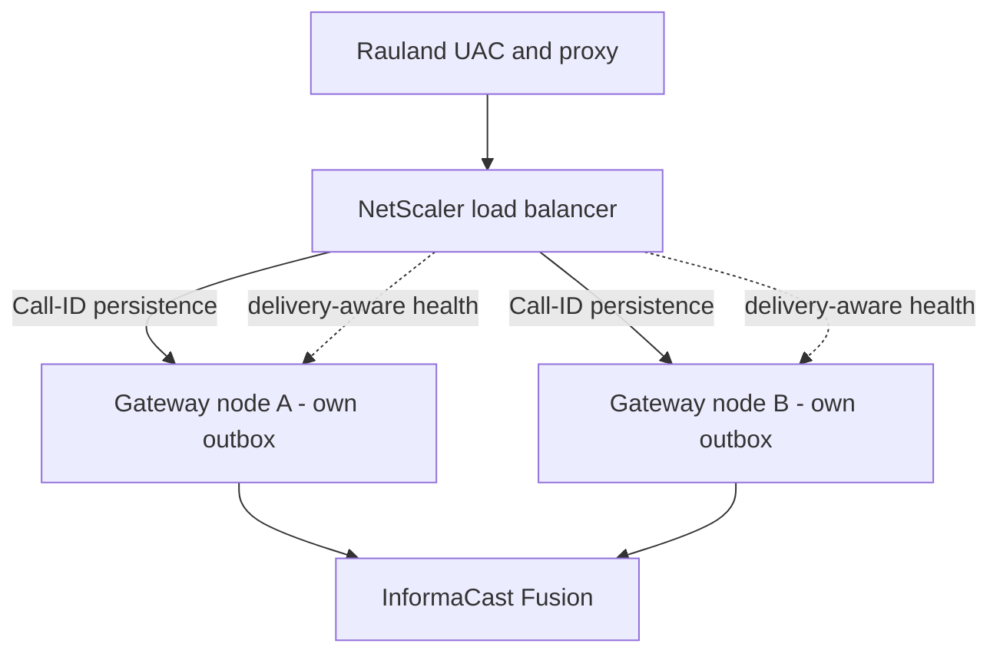

**Prerequisites already in place.** Two design decisions in the shipped build exist specifically to enable this epic: the persisted upstream **`event_id`** (the cross-node merge key that lets two nodes recognize the same clinical event), and the **shared-nothing** node design (each node's outbox is already fully independent). #17 builds on those; it does not require rearchitecting them.

### #13 — Dashboard-v2 remaining phases *(incremental)*

The dashboard-v2 **core** shipped (date-picker log viewer, 90-day stacked call-type chart, `/call/{id}` correlated detail view, per-call diagnostic bundle, verify-lookups). The remaining phases are the incremental tail of that epic — further correlation, filtering, and reporting refinements. Dashboard-only work: it deploys by restarting **only** `sipgw-dashboard.service`, with zero SIP-path impact.

### #5 — Dedupe tail *(cleanup)*

Enforcing clinical duplicate suppression **shipped** (signed off, enabled in production: 2 s window, bed-level, purpose-keyed, record-first, fail-safe toward delivery). The **#5 tail** is follow-up hardening and telemetry on top of the live feature — e.g. tightening the event-id keying and continued monitoring of the suppress/deliver split — not the core capability, which is done.

### #11 — Logging-hygiene tail *(cleanup)*

The load-bearing logging-hygiene work **shipped**: full `client_id` / `client_secret` / bearer-token redaction, UTC RFC3339 stamps across all four streams, the ACK-gated / spec-correct BYE. The **#11 tail** is the residual cleanup on top — minor formatter and log-content polish, no behavior change to the call path.

---

## 3. Upstream asks (dependencies on our vendors)

Two items are **not ours to build** — they depend on Singlewire and Rauland. We are pursuing both; neither blocks the current build, which already compensates for both defensively.

### Singlewire — idempotency key on the scenario trigger

**Ask.** An **idempotency key** on the InformaCast Fusion scenario-trigger API, so a retried POST that Fusion actually received (but whose response we lost) cannot fan out a **second** overhead page.

**Why.** Our delivery model is deliberately **at-least-once** ("duplicate OK, missed never"), so on an ambiguous failure we retry — and a retry can produce a duplicate page. A server-side idempotency key would let Fusion collapse a retried-but-already-accepted request, giving us *effectively-once* delivery **without** ever weakening the retry that guarantees we never miss a page. Until Singlewire offers this, our own record-first + clinical dedupe reduce (but cannot fully eliminate) duplicate fan-out on retry.

### Rauland — duplicate-origination investigation

**Ask.** Investigation of why the Rauland source **double-emits** — roughly one in three events arrives as **two** INVITEs — and, ideally, a fix at origin.

**Why.** We already suppress these downstream (enforcing dedupe, 2 s window, event-id keyed). That is robust, but it is a **compensating control**: it collapses duplicates *after* they cross the wire. Fixing the double-emission at the Rauland origin would remove the duplicate class entirely and reduce the load our dedupe path carries. Our suppression stays in place regardless — it is fail-safe and clinically signed off — so this ask is an improvement at the source, not a dependency for correct operation.

---

## 4. Guiding principles (how the roadmap is prioritized)

Every item above is weighed against the product's one non-negotiable rule:

> **It is acceptable to deliver a page twice. It is never acceptable to miss one.**

That ordering explains the roadmap's shape: durability and delivery guarantees shipped **first** (a missed page is the unacceptable failure), availability of the node (#20, #19, #17) comes next (a down node delays but — thanks to durability — does not silently lose pages), and the duplicate-reduction asks (Singlewire idempotency, Rauland origination) come as *refinements* — because a duplicate is the tolerable side of that trade, never the dangerous one. No roadmap item will be accepted if it trades away the "never miss" guarantee to reduce duplicates.

---

*See the **Reliability** section for the delivery guarantees and known limitations these roadmap items address, and the **Architecture** and **Operations** sections for the current single-node build the roadmap builds upon.*


\newpage

# Troubleshooting Guide

This guide is symptom-first. Find the symptom, read the likely cause, apply the
resolution. Everything here describes the **current production build**
(`c23f3eb`, the v1.7 line) as deployed on host `sip2apibridge`. Where behavior
changed from earlier builds, the change is called out so you are not chasing a
bug that a current release already fixed.

Two facts frame almost every diagnosis:

1. **The paging path and the dashboard are two independent services.** A dead or
   blank dashboard does **not** mean paging is down, and restarting the
   dashboard never interrupts a page. See [Service map](#service-map).
2. **A page is durably recorded before it is delivered.** Once the SIP INVITE is
   accepted, the call is written to SQLite (WAL) as `state='pending'` and then
   delivered by a background worker with bounded retries. A transient Fusion
   failure no longer loses the page — it retries, and if it can never be
   delivered it **escalates** to a human channel. See [Page did not
   arrive](#symptom-a-page-was-expected-but-did-not-come-over-the-overhead).

---

## Service map

| Service | Type | What it does | Restart impact |
|---|---|---|---|
| `sipgw.service` | `Type=notify`, `WatchdogSec=30` | SIP ingress + parse + TTS + durable delivery (the call path) | Restarting this **interrupts paging** briefly. Coordinate. |
| `sipgw-dashboard.service` | `Type=simple` | Read-only web UI on `:8080` (`dashboard_app.py`) | Safe to restart any time. Does **not** touch paging. |

Both processes open the **same** SQLite database at `/var/lib/sipgw/calls.db`
(WAL mode). The writer (`sipgw.service`) stamps a heartbeat row; the dashboard
reads it to answer `/health`. This is why `/health` can report the *writer's*
liveness even though it is served by the *dashboard* process.

```mermaid
flowchart LR
  Rauland[Rauland UAC 172.20.9.170] --> Proxy[SIP proxy 172.20.9.176]
  Proxy --> GW[sipgw.service 10.249.0.60:5060]
  GW --> DB[(calls.db WAL)]
  GW --> Fusion[InformaCast Fusion API]
  DASH[sipgw-dashboard.service :8080] --> DB
  DASH -->|/health reads heartbeat| DB
```

### Where to look — files and ports

| Thing | Location |
|---|---|
| Install root | `/opt/sipgw` |
| Virtualenv | `/opt/sipgw/venv` |
| Database (WAL) | `/var/lib/sipgw/calls.db` |
| Logs | `/var/log/sipgw/` |
| Main service log | `/var/log/sipgw/sipgw.log` |
| Fusion/API debug (full HTTP) | `/var/log/sipgw/sipgw_api_debug.log` |
| SIP wire debug | `/var/log/sipgw/sipgw_sip_debug.log` |
| Dashboard log | `/var/log/sipgw/sipgw_dashboard.log` |
| SIP port | `5060/udp` **and** `5060/tcp` |
| Dashboard port | `8080/tcp` |
| Health endpoint | `http://10.249.0.60:8080/health` |

Log retention is **90 days**. All timestamps are **UTC** (the host clock is
`Etc/UTC`; note `logging.timezone: America/New_York` is declared in config but is
**not** applied — do not expect Eastern time in the log files).

### First-response triage (run these three)

```bash
# 1. Are both services up?
systemctl status sipgw.service sipgw-dashboard.service --no-pager

# 2. Is the writer alive and is Rauland reaching us? (JSON)
curl -s http://10.249.0.60:8080/health | python3 -m json.tool

# 3. What has the call path logged in the last few minutes?
tail -n 100 /var/log/sipgw/sipgw.log
```

---

## Symptom: a page was expected but did not come over the overhead

This is the highest-stakes symptom. Work it in this order; the goal is to find
**which stage** the event reached: never arrived (SIP), arrived but rejected
(allowlist / parse), or arrived and is stuck/failed in delivery (Fusion).

### Step 1 — Did the call reach the gateway at all?

Open the dashboard call table (`http://10.249.0.60:8080/`) or query the DB. If
there is **no row** for the expected time, the INVITE never reached us or was
rejected before it was recorded. Go to [No calls appearing at
all](#symptom-no-calls-appearing-at-all-dashboard-table-empty-or-not-growing).

If there **is** a row, click the timestamp to open the **`/call/{id}` detail
view**. That page correlates, for this one call, the SIP wire block, the main
service log lines, and the Fusion API exchange. It is the fastest way to see
where the event stopped.

### Step 2 — Read the call's delivery state

Every recorded call carries a `state`. The states you will see:

| `state` | Meaning | What it tells you |
|---|---|---|
| `pending` | Recorded, not yet delivered (or between retry attempts) | Delivery is in flight or waiting on a backoff cooldown. Momentary is normal. |
| `delivering` | A delivery attempt is in progress right now | Transient. If a row is stuck here after a crash, startup recovery returns it to `pending`. |
| `delivered` | Fusion returned 2xx — the page fired | Success. |
| `failed` | Retries exhausted (`max_attempts`) — permanently not delivered | **Escalation fired.** See [Fusion errors](#symptom-fusion-rejects-or-cannot-be-reached-4xx-5xx-401-connect-timeout). |
| `expired` | Undelivered past `max_age_seconds` and given up | **Escalation fired.** The page was too old to still be clinically useful. |
| `legacy` | Row predates the durable-delivery state machine | Classified by its `fusion_status`, not by state. Old rows only. |
| `duplicate` | Recorded but suppressed by clinical dedupe | **Not seen in production today** — clinical dedupe ships inert. See [Duplicate pages](#symptom-the-same-code-blue-paged-twice-duplicate-overhead-announcements). |

> **Important — "retrying" is a behavior, not a stored state.** When an attempt
> fails retryably, the worker records the error and returns the row to
> **`pending`**, then holds an in-memory cooldown before the next attempt. So a
> call that is mid-retry shows `state='pending'` with a non-empty `last_error`
> and `attempts > 0`. Do not expect a literal `retrying` value in the DB.

Quick DB reads (read-only; safe while the service runs):

```bash
# State breakdown of recent, real (non-test) calls
sqlite3 /var/lib/sipgw/calls.db \
  "SELECT state, COUNT(*) FROM calls WHERE is_test=0 GROUP BY state;"

# Anything not yet delivered, newest first
sqlite3 -header -column /var/lib/sipgw/calls.db \
  "SELECT id, datetime(created_at,'unixepoch') AS created_utc, state, attempts, \
          fusion_status, substr(last_error,1,60) AS last_error \
   FROM calls WHERE state IN ('pending','delivering','failed','expired') \
   ORDER BY created_at DESC LIMIT 20;"
```

### Step 3 — Interpret and act

- **`state='delivered'` but staff say they heard nothing.** The gateway did its
  job — Fusion accepted the notification (2xx). The problem is downstream of
  this gateway: InformaCast scenario/audience configuration, speaker zones, or
  volume. Confirm the TTS text was correct on the `/call/{id}` view, then hand
  off to the InformaCast/overhead side. (If the TTS text is wrong, see [Wrong
  or garbled TTS](#symptom-the-page-played-but-said-the-wrong-thing-wrong-tts).)

- **`state='pending'` and it is not moving.** Either delivery is actively
  retrying (check `last_error`/`attempts`) or the delivery worker is not
  running. Confirm the worker started:

  ```bash
  grep "delivery worker started" /var/log/sipgw/sipgw.log | tail -1
  grep -E "call [0-9]+ (DELIVERED|retry|FAILED|EXPIRED)" /var/log/sipgw/sipgw.log | tail -20
  ```

  A healthy retry looks like:
  `call 4213 retry #2 in 4.0s (status 503, Retry-After=4)`.
  If you see repeated retries, this is Fusion-side — go to [Fusion
  errors](#symptom-fusion-rejects-or-cannot-be-reached-4xx-5xx-401-connect-timeout).

- **`state='failed'` or `state='expired'`.** The page was **not** delivered and
  the system **escalated** (posted to the configured escalation channel, or —
  if no channel is configured — logged a loud `ESCALATION` line). This is the
  designed loud-failure path, not a silent loss. Grep the escalation trail:

  ```bash
  grep -E "ESCALATION|call [0-9]+ (FAILED|EXPIRED)" /var/log/sipgw/sipgw.log | tail -20
  ```

  Then treat the underlying cause as a Fusion problem (below), fix it, and note
  that expired/failed pages are **not** auto-resent — the clinical event is over.

### The June 2026 loss is now prevented

On **2026-06-12** a Code Blue was lost to a transient `httpx.ConnectTimeout`
during an **inline** OAuth token fetch (recorded as `fusion_status=-1`, with no
retry). That failure mode is now structurally prevented in this build:

- **Durable outbox + bounded retries** — a connect timeout returns
  `status=-1`, the worker reschedules with backoff instead of dropping the page,
  and escalates only after `max_attempts`.
- **Background OAuth token refresh** — the token is renewed off the critical
  path (`webhook.py` refresh loop), so a page almost never blocks on a fresh
  token fetch in the first place.

If you ever see a **modern** row at `fusion_status=-1` that is *not* retrying,
that is a real incident — capture the diagnostic bundle (below) and escalate.

### Capture a diagnostic bundle for any hard case

Every call detail page offers a **plain-text diagnostic bundle**:

```
http://10.249.0.60:8080/call/<id>/bundle.txt
```

It assembles, for that one call, the correlated SIP block, main-log lines, and
Fusion API exchange into copy/paste text for a ticket. Grab this before you
restart anything — it is the single best artifact for RedEye support.

---

## Symptom: no calls appearing at all (dashboard table empty or not growing)

No new rows for a stretch where you expected activity. The question is whether
**Rauland is reaching us** or **our services are down**. Do not assume a dead
gateway — a genuinely quiet period looks identical in the table.

### Step 1 — Check inbound liveness on `/health`

```bash
curl -s http://10.249.0.60:8080/health | python3 -m json.tool
```

Look at `last_inbound_sip_age_s` — the seconds since the **last allowlisted SIP
datagram from Rauland** was seen. This is your Rauland-reachability signal.

- **Small / recently updated age** → Rauland *is* reaching the gateway. A quiet
  table just means no clinical events fired. This is normal and not a fault.
- **Large / growing age** (hours where you expected traffic) → the upstream SIP
  path is the suspect: Rauland UAC `172.20.9.170`, the proxy `172.20.9.176`,
  network/VLAN, or the far side simply not emitting. Escalate to the Rauland /
  network side.
- **Field is `null`** → no allowlisted inbound SIP has been seen since the last
  writer start. Combined with a fresh service start, that is expected; combined
  with a long-running service, it points to an upstream break.

> `last_inbound_sip_age_s` is **informational** — it never changes the `/health`
> status code. A long quiet Rauland stretch must not make an external monitor
> think the node is unhealthy, so a silent Rauland does **not** return 503.
> Optionally, silence-escalation can be enabled
> (`health.inbound_escalate_after_seconds > 0`) to alert a human once per
> silence episode; it is **off by default**.

### Step 2 — Confirm the services are actually up

```bash
systemctl status sipgw.service --no-pager
systemctl is-active sipgw.service sipgw-dashboard.service
```

If `/health` itself returns **503**:

| `/health` body | Meaning | Action |
|---|---|---|
| `{"status":"no-heartbeat"}` | The writer has never stamped a heartbeat | `sipgw.service` is not running or failed at startup. `systemctl status`, check `sipgw.log`. |
| `{"status":"stale","heartbeat_age_s":N}` | Writer heartbeat is older than the stale bound (~30s) | The call-path process is hung or dead. This is a real paging outage — restart `sipgw.service` and investigate the hang. |
| `{"status":"fusion-unreachable"}` | (Only if opt-in fusion-degrade is enabled) heartbeat is fine but Fusion probe is failing | Paging ingress is fine; Fusion is unreachable. Go to [Fusion errors](#symptom-fusion-rejects-or-cannot-be-reached-4xx-5xx-401-connect-timeout). |

### Step 3 — Watch the SIP wire

If liveness is stale but you believe Rauland is sending, watch the SIP debug log
live while a test is placed:

```bash
tail -f /var/log/sipgw/sipgw_sip_debug.log
```

You should see `INVITE fingerprint=... call_id=... from=<ip>:<port>` lines as
INVITEs land. If nothing appears here even though the far side claims to be
sending, the traffic is not reaching the socket — suspect network/firewall/VLAN
between the proxy and `10.249.0.60:5060`.

> **Firewall note.** There is currently **no host firewall** (nftables is empty)
> on `sip2apibridge`. Ingress protection relies entirely on the application
> **allowlist** (`172.16.0.0/12, 127.0.0.0/8, 10.0.0.0/8`). This means a missing
> `/health` or blank table is *not* caused by a host firewall rule — but it also
> means adding nftables for `:5060`/`:8080` is a recommended hardening step (and
> the dashboard has no authentication). See the Security section of this manual.

---

## Symptom: SIP requests are rejected with 403 Forbidden

The gateway answered the far side with **`403 Forbidden`** and the log shows:

```
Rejected INVITE from unauthorized IP 203.0.113.9
```

**Cause.** The source IP is **not** inside the SIP allowlist
(`sip.allowed_networks` = `172.16.0.0/12, 127.0.0.0/8, 10.0.0.0/8`). Every
request from outside those ranges is rejected *before* it is parsed or recorded,
and the source clock (inbound-liveness) is **not** reset by it — so internet
scan noise on UDP 5060 cannot mask a real Rauland outage.

**Resolution.**

- If the rejected IP is **internet noise / a scanner**, this is working as
  intended. No action beyond the recommended nftables hardening.
- If the rejected IP is a **legitimate Rauland/proxy source** that changed
  (re-IP, new proxy, added leg), add its network to `sip.allowed_networks` in
  `config.yaml` and restart `sipgw.service`. Confirm the current expected path is
  `172.20.9.170 → 172.20.9.176 → gateway`.

```bash
# Who is being rejected, and how often?
grep "Rejected" /var/log/sipgw/sipgw.log | tail -30
```

---

## Symptom: SIP 481 Call Leg/Transaction Does Not Exist

**This should no longer occur in the current build.** The old race — the gateway
sending BYE before the caller's ACK, drawing a `481` — is fixed. In
immediate-BYE mode the gateway now **waits for the ACK** before sending BYE
(`sip_server.py`, ACK-gated teardown), guaranteeing `INVITE → 200 OK → ACK →
BYE` ordering. A lost ACK is covered by a per-call fallback timer that tears the
dialog down cleanly instead of racing.

Critically, **the page never depends on ACK/BYE/teardown** — the durable page is
recorded when the INVITE is answered, so even a messy teardown cannot cost you a
page.

**If you still see 481 in the wire log:** you are almost certainly looking at
historical lines, or a peer is sending BYE/requests for a dialog the gateway
already tore down (benign). Confirm the timestamp and confirm you are on build
`c23f3eb`+. If a *new* 481 correlates with a *missing page*, capture the
diagnostic bundle and escalate — that would be a regression.

```bash
grep -i "481\|awaiting ACK\|ACK-timeout fallback" /var/log/sipgw/sipgw_sip_debug.log | tail -20
```

---

## Symptom: the same Code Blue paged twice (duplicate overhead announcements)

Rauland is known to emit **two INVITEs per event** for roughly a third of
events. There are **two different** de-duplication mechanisms in this codebase,
and only one of them is active in production today. Getting this distinction
right is essential to a correct diagnosis.

### What IS active: SIP transaction de-duplication (re-INVITE handling)

If the second INVITE is a **retransmit of the same SIP dialog** — same
`Call-ID` — the gateway recognizes it as a **re-INVITE**, simply re-sends the
`200 OK`, and does **not** fire a second page. The `on_call` page callback is
invoked only for the first INVITE of a Call-ID. Every INVITE (including
retransmits) still gets a `#15` **correlation fingerprint** line for audit:

```
INVITE fingerprint=v1:abcd1234 call_id=... from=172.20.9.170:5060
Re-INVITE for existing call <call_id>
```

So: **true SIP retransmits do not double-page.**

### What is NOT active: clinical dedupe (`dedupe.py`)

Clinical dedupe collapses two INVITEs that are the *same clinical event but
different SIP dialogs* (different Call-IDs), keyed on the normalized clinical
identity `(area, room, bed, purpose)`. **In the current production build this
ships inert / shadow-disabled:**

- `dedupe.enforce: false` and `dedupe.window_seconds: 0` — with these shipped
  defaults `evaluate()` does not even query the database and **never** suppresses
  a page.
- Setting `enforce: true` is a **fatal config error** (fail-fast validation
  refuses it) because suppression requires clinical sign-off.

**Consequence to state plainly:** if Rauland double-emits an event as **two
separate SIP dialogs** (two Call-IDs), the current build **will page twice** —
that is expected behavior today, not a bug. The clinical-dedupe machinery is
present and can run in *shadow* mode (`window_seconds > 0`, `enforce` still
`false`) to *measure* duplicates — it logs `WOULD suppress ...` and delivers
anyway — but it does not drop pages.

```bash
# Shadow evidence (only present if a shadow window was enabled for measurement)
grep "WOULD suppress" /var/log/sipgw/sipgw.log | tail -20

# Confirm the deployed dedupe posture
grep -A3 "^dedupe:" /opt/sipgw/config.yaml
```

### Resolution / tuning

- If duplicate pages are true **SIP retransmits** (same Call-ID) and you *still*
  see two pages, that is a real defect — capture bundles for both call rows and
  escalate.
- If duplicates are **distinct dialogs** (two Call-IDs for one event), collapsing
  them requires enabling enforcing clinical dedupe, which is a **clinical
  decision** (a legitimate second same-bed page within the window would also be
  suppressed) and is currently out of policy. Until then, the double-page is
  expected. Tuning parameters, when clinically approved, are `window_seconds`
  (how close in time), `match_bed`, and `match_purpose` (RRT vs Code Blue never
  merge regardless).

> Note: the `state='duplicate'` value and the `duplicate_of` column exist in the
> schema for the enforcing path, but because enforcement is off, **you will not
> see `duplicate` rows in production**.

---

## Symptom: Fusion rejects or cannot be reached (4xx / 5xx / 401 / connect timeout)

The gateway accepted the SIP call and recorded the page, but delivery to
InformaCast Fusion is failing. All of this surfaces in **`state`**,
**`fusion_status`**, **`last_error`**, and the **`sipgw_api_debug.log`** (which
logs the full HTTP exchange, with `client_id`/`client_secret`/tokens masked).

| Symptom / status | Cause | What the build does | Your action |
|---|---|---|---|
| **401 Unauthorized** | Access token expired or rejected | The client **clears the token cache and retries once** automatically. Background refresh normally prevents this. | Persistent 401s → the Fusion **credentials** (`<CLIENT_ID>`/`<CLIENT_SECRET>`) or `audience` are wrong/revoked. Verify in config; check token-exchange lines in api_debug. |
| **4xx (e.g. 400/403/404)** | Bad request, wrong scenario/field/audience ID, or Fusion-side permission | Non-2xx → counts as a failed attempt; worker **retries with backoff** up to `max_attempts`, then `failed` + escalate. | Check `scenario_id`, `variable_name`/`scenario_field_id`, `audience`, `base_url` against Fusion. Read the response body in api_debug. |
| **5xx (500/502/503)** | Fusion transient/server-side outage | **Retries with exponential backoff**; honors a numeric `Retry-After` (delta-seconds) when present. | Usually self-heals. If sustained, Fusion is down — the page will `expire` and escalate if the outage outlasts `max_age_seconds`. |
| **`fusion_status=-1`** | Client-side exception (e.g. `ConnectTimeout`, DNS, TLS) — no HTTP response | Treated as a retryable failure and **rescheduled** (this is exactly the 2026-06-12 failure mode, now retried instead of dropped). | Check network path to `api.icmobile.singlewire.com`, DNS, and TLS. Inspect the exception in api_debug. |

Log recipes:

```bash
# Every Fusion delivery outcome from the call path
grep -E "Fusion webhook (response|retry|error)" /var/log/sipgw/sipgw.log | tail -30

# 401 auto-retry trail
grep -i "Got 401" /var/log/sipgw/sipgw_api_debug.log | tail

# Full, masked HTTP exchanges (token exchange + scenario trigger)
tail -n 200 /var/log/sipgw/sipgw_api_debug.log
```

### Is Fusion reachable at all right now?

`/health` carries **informational** Fusion fields from a periodic **read-only**
reachability probe (a short GET of the scenario definition — it never triggers a
page):

```bash
curl -s http://10.249.0.60:8080/health | python3 -m json.tool
# fusion_reachable: true|false|null   fusion_detail: "HTTP 200" | "<exc>"
# fusion_checked_age_s: seconds since the probe ran
```

By default a failing probe **does not** flip `/health` to 503 (a Fusion blip must
not make an external monitor pull the only node). If the opt-in
`health.fail_on_fusion_unreachable` is enabled, a **fresh** `false` probe returns
`{"status":"fusion-unreachable"}` — but only *after* the writer-heartbeat gate
passes, so a dead writer is never mislabeled as a Fusion problem.

---

## Symptom: the page played but said the wrong thing (wrong TTS)

Fusion delivered (`state='delivered'`) but the spoken announcement named the
wrong area/room or the wrong code type.

**Cause.** The TTS string is built from the SIP INVITE fields resolved through
`lookups.yaml`:

- **Area** — `areas` map (with `default_area` = `Unknown Area.` when unmatched).
- **Room** — resolved in priority order: `area_rooms` combo override
  (`"<area>*<room>"`) → `rooms` room-only map → `default_room_format`
  (`Room {room}.`). The combo override exists precisely because the same room
  number can mean different rooms in different areas.
- **Purpose** — `call_purposes` keyword match on the SIP **display name**
  (e.g. `Blue → Code Blue`, `RRT → Rapid Response Team`), else `default_purpose`.

Common failure shapes:

| You hear | Likely cause | Fix |
|---|---|---|
| "Unknown Area" | Area ID has no `areas` entry | Add the area to `lookups.yaml`. |
| "Room 2201" instead of a name | No `rooms`/`area_rooms` mapping for that room | Add the mapping (use `area_rooms` if the number collides across areas). |
| Wrong / generic code ("Code") | Display name didn't match a `call_purposes` keyword | Add/adjust the keyword. Check the actual display name in the SIP block on `/call/{id}`. |
| Right name, wrong room | An `area_rooms` combo override is masking (or missing) | Reconcile the combo key `"<area>*<room>"`. |

**`lookups.yaml` reloads without a restart.** The gateway watches the file's
mtime and reloads on change — no service bounce needed. A malformed edit is
**not** applied destructively: on a load error the previous good table is kept
and the failure is logged.

**Validate before trusting an edit** using the dashboard's built-in checker:

- Click **"Verify lookups.yaml"** on the dashboard, or hit `GET /api/verify-lookups`.
- Confirm the correct area/room in the `/call/{id}` detail view, which shows the
  raw SIP fields next to the resolved TTS.

```bash
# Confirm the reload actually happened after you saved the file
grep -E "lookups.yaml changed|Loaded .* area" /var/log/sipgw/sipgw.log | tail
```

---

## Symptom: the dashboard is blank, won't load, or `/health` won't answer

**First, confirm this is a *dashboard* problem, not a paging problem.** They are
separate services. Paging can be perfectly healthy while the dashboard is down.

```bash
systemctl status sipgw-dashboard.service --no-pager
curl -sI http://10.249.0.60:8080/            # dashboard root
tail -n 50 /var/log/sipgw/sipgw_dashboard.log
```

| Symptom | Cause | Resolution |
|---|---|---|
| Connection refused on `:8080` | Dashboard service down | `systemctl restart sipgw-dashboard.service` — **safe, does not interrupt paging.** |
| Page loads but table empty | No non-test calls in range, or DB read issue | Check the date filter; confirm `calls.db` is readable; check dashboard log. Remember **test rows are hidden** by design. |
| `/health` 503 but dashboard HTML loads | Dashboard is up; the **writer** heartbeat is stale/absent | This is a **paging** problem surfaced by the dashboard — go to [No calls appearing](#symptom-no-calls-appearing-at-all-dashboard-table-empty-or-not-growing). Do **not** just restart the dashboard. |
| A recent test doesn't show | Test traffic is intentionally hidden | Test/dry-run calls are marked `is_test=1`, never fire a real page, and are excluded from the table and stats. This is correct. |

Because the dashboard is read-only and decoupled, when in doubt you can restart
it freely to clear a transient UI issue without any paging risk.

---

## Symptom: paging blipped after an unexpected service restart (the #20 pattern)

You see a short paging interruption that lines up with an OS/package activity
window rather than a crash or a deliberate restart.

**Cause.** On **2026-07-07**, an **unattended-upgrades / `needrestart`
auto-restart** bounced `sipgw.service` uncoordinated (tracked as issue **#20**,
remediated). An OS patch cycle decided a dependent library changed and restarted
the service on its own schedule — with no coordination with clinical timing.

**How to recognize it in the logs.** Look for a service stop/start that is
adjacent to apt/dpkg/needrestart activity and is *not* preceded by a crash trace
or an operator command:

```bash
# Service lifecycle around the event
journalctl -u sipgw.service --since "-1 day" --no-pager | grep -Ei "Stopped|Started|Stopping|Starting"

# Correlate with unattended-upgrades / needrestart
journalctl --since "-1 day" --no-pager | grep -Ei "unattended-upgrade|needrestart|dpkg|systemd.*sipgw"

# The clean shutdown/startup markers from the app itself
grep -E "delivery worker (started|stopped)|writer .*heartbeat" /var/log/sipgw/sipgw.log | tail
```

**Why it did not lose a page (usually).** Durability is designed to survive a
hard stop: pages are recorded before delivery, a graceful stop **drains** the
queue best-effort, and on the next startup **recovery** returns any
crash-orphaned `delivering` rows to `pending` so they are retried
(at-least-once). The risk is a page arriving in the exact restart window, which
is why coordination matters.

**Resolution / prevention.**

- Operationally: **coordinate OS patching** — do not let unattended-upgrades
  restart the paging service on its own. Schedule patch windows and drain first.
- The engineering fix is **roadmap #19** (zero-downtime writer restarts via
  systemd socket activation) and **#20** (OS auto-restart coordination). Both are
  in the Roadmap section, labeled planned — not yet in this build.

---

## Symptom: the watchdog restarted the service / `WatchdogSec` trips

`sipgw.service` runs `Type=notify` with `WatchdogSec=30`. If the process stops
sending its watchdog keepalive to systemd within the window, systemd restarts it.

**Cause.** The event loop stalled long enough that the watchdog notify
(`watchdog.py`) missed its deadline — typically a hang or a pathological block,
not a normal Fusion slowdown (delivery is off the SIP hot path).

**What to check.**

```bash
journalctl -u sipgw.service --no-pager | grep -Ei "watchdog|WATCHDOG|Killing|restart" | tail
grep -Ei "watchdog" /var/log/sipgw/sipgw.log | tail
```

If watchdog restarts recur, capture the logs around each restart and escalate to
RedEye — a recurring watchdog trip indicates a real stall to diagnose, not
something to paper over by widening `WatchdogSec`.

---

## Quick reference — grep cheat sheet

```bash
# --- Paging path (sipgw.log) ---
grep -E "call [0-9]+ (DELIVERED|retry|FAILED|EXPIRED)" /var/log/sipgw/sipgw.log
grep "ESCALATION" /var/log/sipgw/sipgw.log
grep "delivery worker started" /var/log/sipgw/sipgw.log
grep -E "Fusion webhook (response|retry|error)" /var/log/sipgw/sipgw.log
grep "Rejected" /var/log/sipgw/sipgw.log                 # 403 allowlist rejects
grep -E "lookups.yaml changed|Loaded .* area" /var/log/sipgw/sipgw.log

# --- SIP wire (sipgw_sip_debug.log) ---
grep "INVITE fingerprint=" /var/log/sipgw/sipgw_sip_debug.log
grep -i "481\|awaiting ACK\|ACK-timeout" /var/log/sipgw/sipgw_sip_debug.log

# --- Fusion/API (sipgw_api_debug.log; secrets masked) ---
grep -i "Got 401" /var/log/sipgw/sipgw_api_debug.log
tail -n 200 /var/log/sipgw/sipgw_api_debug.log

# --- Dashboard (sipgw_dashboard.log) ---
tail -n 50 /var/log/sipgw/sipgw_dashboard.log

# --- Health + state ---
curl -s http://10.249.0.60:8080/health | python3 -m json.tool
sqlite3 /var/lib/sipgw/calls.db \
  "SELECT state, COUNT(*) FROM calls WHERE is_test=0 GROUP BY state;"
```

## When to escalate to RedEye support

Open a ticket (attach the **`/call/{id}/bundle.txt`** diagnostic bundle) when:

- A **modern** call is `failed`/`expired`, or shows `fusion_status=-1` **without**
  retries, and staff report a missed page.
- A **true SIP retransmit** (same Call-ID) double-pages.
- A `481` correlates with a *missing* page (possible regression of the ACK-gated
  fix).
- Watchdog restarts recur, or you see uncoordinated auto-restarts (the #20
  pattern) affecting paging.
- `/health` is persistently `stale`/`no-heartbeat` and a restart does not clear
  it.

Always grab the bundle **before** restarting anything — it is the highest-value
artifact for diagnosis.


\newpage

# FAQ & Support / Escalation

This section answers the questions RedEye support and Tift Regional staff ask most
often about the **RedEye sip2api Gateway** as it runs in production today
(build `c23f3eb`, the v1.7 line), then explains how to open a support case, how
severities are triaged, and — most importantly — **what to collect before you
call** so the first response is a fix and not a request for more data.

> **The one-line escalation rule:** if a real Code Blue or RRT did **not** result
> in an overhead page, treat it as **Severity 1** and contact RedEye immediately
> (see [Contacting RedEye Support](#contacting-redeye-support)). Grab the
> **per-call diagnostic bundle** on the way — it is one click and it is exactly
> what support needs.

---

## Frequently Asked Questions

### 1. We saw two identical pages (or two rows) for one event. Is something broken?

Almost certainly **not** — and in the current build you should rarely see a
duplicate *page* at all. Rauland emits **two SIP INVITEs for a single event**
(this is a source-side behavior, observed on roughly one third of events). The
gateway now runs **enforcing duplicate suppression** (`dedupe.py`): the second
INVITE that arrives within a **2-second window** for the **same bed and same
purpose** is recorded as a `duplicate` audit row and is **not** delivered a
second time. You will see the original page fire once and a `duplicate` row on
the dashboard pointing back at the original.

What is deliberately **not** suppressed:

- A re-page for the same room/bed **more than 2 seconds later** — that is treated
  as a legitimate new event and is **always delivered**.
- A different **bed** in the same room (two patients coding at once are never
  merged — `match_bed: true`).
- A different **purpose** (an RRT and a Code Blue never collapse into each other).

If you see two *delivered* pages seconds apart for the same bed, that is worth a
ticket. Two *rows* where one is marked `duplicate` is the system working as
designed. See [Q5](#5-what-do-the-call-states-mean-received-delivered-retrying-failed-expired-duplicate-legacy)
for the state column.

### 2. Why are the log and database timestamps in UTC, not Eastern time?

The **stored** call `timestamp` is canonical **UTC, RFC3339 milliseconds**
(`...Z`). The host clock (`sip2apibridge`) is set to `Etc/UTC`, and although the
config declares `logging.timezone: America/New_York`, that setting is **not
currently applied to the log files** — so the four log streams and the DB are
UTC. The **dashboard** renders wall-clock times for readability, but when you
read a raw log line or a diagnostic bundle, read it as UTC (Eastern is UTC minus
4 hours during daylight time, minus 5 in winter). This is called out here because
correlating a clinical timeline against the logs is the single most common source
of confusion — the log is not "an hour off," it is a different zone.

### 3. What happens now if Singlewire / InformaCast Fusion is unreachable when a page fires?

The page is **not lost.** This is the central reliability guarantee of the
current build and the direct fix for the 2026-06-12 incident
([Q10](#10-what-was-the-2026-06-12-incident-and-is-it-actually-fixed)). The flow is
**record-first**:

1. The call is written durably to the database (SQLite **WAL**) in state
   `received` **before any delivery is attempted**.
2. A background **delivery worker** (`delivery.py`) attempts the Fusion webhook.
   If Fusion is unreachable, returns an error, or times out, the worker
   **retries with exponential backoff** (starting ~2s, doubling to a 60s cap,
   honoring a `Retry-After` header if Fusion sends one).
3. Retries continue up to **6 attempts**. A page still undelivered after
   **15 minutes** is marked `expired`.
4. If a page ends in `failed` (attempts exhausted) or `expired`, the gateway
   **escalates** to a human alert channel (`escalation.py` → Teams/Slack/PagerDuty/NOC
   webhook), so a human is notified rather than the failure being silent.

Separately, the OAuth token is refreshed **in the background** (`webhook.py`),
~5 minutes before it expires, so a page never blocks on a token round-trip — the
exact failure mode that dropped the 2026-06-12 page.

```mermaid
flowchart LR
  A[SIP INVITE arrives] --> B[Record call in DB state received]
  B --> C[Delivery worker attempts Fusion webhook]
  C -->|2xx| D[state delivered]
  C -->|error or timeout| E[state retrying, backoff]
  E --> C
  E -->|6 attempts exhausted| F[state failed]
  C -->|still undelivered after 15 min| G[state expired]
  F --> H[Escalate to human channel]
  G --> H
```

### 4. Does a retry or an escalation mean a page was missed?

Not by itself. A `retrying` state means the first attempt did not succeed and the
worker is trying again — most transient blips deliver on a later attempt and end
as `delivered`. An **escalation** is different: it fires only when a page ended
`failed` or `expired`, meaning it was **not** delivered to Fusion after all
retries. An escalation is a **real signal** — treat it as Severity 1 and confirm
whether the clinical event still needs a manual overhead announcement.

### 5. What do the call "states" mean (received, delivered, retrying, failed, expired, duplicate, legacy)?

The `state` column tracks each call through the durable delivery pipeline:

| State       | Meaning                                                                 |
|-------------|-------------------------------------------------------------------------|
| `received`  | Recorded durably, delivery not yet completed (the record-first insert). |
| `retrying`  | An attempt failed; the worker is backing off and will try again.        |
| `delivered` | Fusion accepted the page (HTTP 2xx). **This is the success state.**     |
| `failed`    | All retry attempts exhausted without a 2xx. Escalated.                  |
| `expired`   | Still undelivered past the 15-minute age limit. Escalated.              |
| `duplicate` | Suppressed as a same-bed/same-purpose duplicate within the 2s window; points at the original via `duplicate_of`. Never delivered (by design). |
| `legacy`    | A row that predates the durable pipeline; migrated in place, no data loss. It was handled by the older best-effort path. |

A healthy day is almost entirely `delivered` (plus some `duplicate` rows from
Rauland's double-emit). Any `failed` or `expired` row warrants a look.

### 6. Can we change the TTS voice, the announcement wording, or the dedupe window?

- **Wording / repetition:** yes. The announcement is assembled from lookup tables
  plus `tts.message_preamble` (currently "Attention! Attention! ") and
  `tts.play_count` (currently 3 repeats) in `config.yaml`. Changing wording is a
  config edit plus a coordinated **writer restart**.
- **Voice:** the spoken voice is chosen by **InformaCast Fusion**, not by the
  gateway — the gateway sends text (the `customTTS` field). Voice changes are made
  on the Fusion side.
- **Dedupe window:** yes, `dedupe.window_seconds` (currently `2`) is configurable,
  as are `match_bed` and `match_purpose`. **Do not** widen this without clinical
  sign-off — a wider window risks suppressing a legitimate re-page. `validate_config`
  will warn loudly if the window is set inert (`<= 0`) or wide (`> 10s`).

All of the above are **config changes on the writer** and take effect on a
coordinated restart. RedEye should make dedupe/wording changes with you, not
around you.

### 7. How do we add a new area, unit, or room so it announces correctly?

Room/area/purpose text comes from the **lookup tables** (`lookups.yaml`) — this
maps the numbers Rauland sends into the human-readable location and call-type the
page speaks. Adding a unit or fixing a room name is a **lookups edit** followed by
a writer restart. The dashboard has a **Verify Lookups** view so you can confirm a
given area/room resolves the way you expect **before** it is needed in an
emergency. RedEye maintains lookups jointly with Tift telecom; send the
Rauland-side identifier and the exact spoken text you want and it will be added
and verified.

### 8. Is the dashboard password-protected?

**No.** The dashboard (`sipgw-dashboard.service` on port **8080**) currently has
**no authentication** and is **read-only**. It exposes call history, logs, and
diagnostics to anyone who can reach the port. Today the only protection is network
reach — and note the host currently has **no active firewall** (empty nftables),
so ingress relies on the application-level SIP allowlist, which does **not** cover
the dashboard port. **Recommendation:** restrict :8080 (and :5060) with nftables
and/or place the dashboard behind an authenticated reverse proxy. Treat the
dashboard URL as sensitive until that is in place. (Dashboard authentication is a
known gap, not a shipped feature.)

### 9. Can we restart the dashboard without interrupting paging? What about restarting the paging service?

**Restarting the dashboard is safe** and does **not** affect paging. The two are
**independent systemd services**:

- `sipgw.service` — the **call path** (SIP ingress, parsing, TTS, durable
  delivery). This is the life-safety service.
- `sipgw-dashboard.service` — the **read-only web UI**. It opens the database
  read-only and can be restarted, upgraded, or crash **without touching the paging
  path**.

So `sudo systemctl restart sipgw-dashboard` is a routine, no-page-impact
operation. Restarting `sipgw.service`, by contrast, is a **brief SIP blip**
(~0.3s) and should be **coordinated** — see [Q11](#11-a-patch-or-auto-restart-bounced-the-service-how-do-we-avoid-that).
Durability protects you across a writer restart (record-first plus crash
recovery re-queues anything in flight), but you still want to avoid restarting
during a known event.

### 10. What was the 2026-06-12 incident, and is it actually fixed?

**Yes, it is fixed.** On 2026-06-12 a Code Blue was **lost**: the page fired an
**inline OAuth token fetch** on the critical path, that fetch hit a transient
`httpx.ConnectTimeout`, the delivery recorded `fusion_status=-1`, and — in the old
best-effort design — **there was no retry**. The page silently did not go out.

The current build removes every leg of that failure:

- **Record-first durability:** the call is persisted **before** delivery, so a
  failure after recording cannot erase it.
- **Bounded retries with backoff:** a transient timeout is retried, not dropped.
- **Background token refresh:** the OAuth token is kept warm off the page path, so
  a page never blocks on — or fails because of — a token fetch.
- **Escalation:** if delivery genuinely cannot complete, a human is paged.

That specific incident's root cause is now structurally impossible to lose
silently.

### 11. A patch (or auto-restart) bounced the service. How do we avoid that?

On 2026-07-07, an **unattended-upgrades / needrestart auto-restart** bounced the
paging service **uncoordinated** (issue **#20**, since remediated). The lesson:
**coordinate OS patching** with paging, and prefer maintenance windows. The
durable design means an unplanned bounce does not lose recorded pages, but an
uncoordinated restart is still an availability risk during a live event.
Zero-downtime writer restarts via systemd socket activation (**#19**) are on the
roadmap; until then, patch on a schedule and confirm `/health` after any restart.

### 12. How do we know the Rauland link is actually up, versus just quiet?

Rauland only sends SIP on a **real event** — there are no keepalives — so a quiet
gateway could mean "no emergencies" **or** "the link is down." The gateway stamps
the time of the **last inbound SIP from an allowed network** and surfaces it as
**"Last inbound from Rauland"** on the dashboard and as `last_inbound_sip_age_s`
in `/health`. The card turns **amber** after ~5 days of silence. This is
**informational** — a normal quiet stretch does **not** flip `/health` to 503, and
optional silence-escalation is **off** by default. If the card is amber and you
expected traffic, that is worth investigating with RedEye.

### 13. What does `/health` actually check, and when does it go red (503)?

`/health` returns **503** only when the **writer heartbeat is stale** (the writer
stamps a heartbeat every 10s; `/health` goes stale after 30s) or missing — i.e.
the call-path process is not alive. It **additionally reports** (as informational
fields, **not** as 503 triggers by default) **Fusion reachability**, delivery
backlog, last delivered/failed, and the last-inbound-SIP age. By design a **Fusion
blip does not 503 the node** (that default protects a single node behind a monitor
from being pulled for a transient upstream hiccup). So: **red `/health` = the
pager process itself is in trouble** — that is a page-now condition.

### 14. Is any test traffic mixed into our stats or pages?

No. The gateway has a **safety layer** (`safety.py`): dry-run / test-mode traffic
is marked `is_test=1`, **never fires a real page**, and is **excluded** from
dashboard stats, charts, and the call table. When you read the dashboard you are
seeing real clinical traffic only.

---

## Support & Escalation

### Contacting RedEye Support

> **Contact details are environment-specific — fill these in for your deployment.**

| Channel                         | Detail                                    |
|---------------------------------|-------------------------------------------|
| Support email                   | `<REDEYE_SUPPORT_EMAIL>`                   |
| Support phone / on-call         | `<REDEYE_SUPPORT_PHONE>`                   |
| After-hours / Sev-1 escalation  | `<REDEYE_ONCALL_ESCALATION>`              |
| Ticket portal                   | `<REDEYE_TICKET_PORTAL_URL>`              |
| Escalation webhook (auto-alert) | configured in `escalation.webhook_url`    |
| Provider              | RedEye Network Solutions LLC, in conjunction with Claude Code |

For a **missed real page (Severity 1)**, use the phone / on-call path — do not wait
on email.

### Severity levels

| Severity | Definition | Examples | Target first response |
|----------|------------|----------|-----------------------|
| **Sev 1 — Critical** | A real Code Blue / RRT did not page, or the call path is down. Life-safety impact. | An escalation alert for a `failed`/`expired` page; a clinical event with no overhead page; `/health` red (heartbeat stale/missing); `sipgw.service` down. | `<SEV1_RESPONSE_TARGET>` (immediate / on-call) |
| **Sev 2 — Major** | Paging works but is degraded or at risk. | Repeated `retrying` then `delivered`; Fusion intermittently unreachable; dashboard down (paging unaffected); "Last inbound from Rauland" unexpectedly amber. | `<SEV2_RESPONSE_TARGET>` |
| **Sev 3 — Minor** | Cosmetic, informational, or config request. | Wrong room/area spoken text (lookups fix); wording/repetition change; a duplicate-row question. | `<SEV3_RESPONSE_TARGET>` |
| **Sev 4 — Request** | Planned change or enhancement. | Add a unit, adjust dedupe window (with sign-off), roadmap questions. | `<SEV4_RESPONSE_TARGET>` |

A **duplicate row** by itself is **not** an incident (see
[Q1](#1-we-saw-two-identical-pages-or-two-rows-for-one-event-is-something-broken)).
A **missed delivery** always is.

### What to collect first (before you call)

Collecting these three things up front turns most cases into a single round-trip.

1. **The per-call diagnostic bundle** — this is the single most useful artifact.
   On the dashboard, open the call (`/call/{id}`) and use **Export diagnostic
   bundle**, or fetch it directly:

   ```
   http://<dashboard-host>:8080/call/<CALL_ID>/bundle.txt
   ```

   The bundle is a plain-text, copy/paste-friendly file that correlates, for that
   one call:
   - the **call record** (id, timestamps, caller/display name, area/room, the
     exact `tts_string`, `fusion_status`, response time, **`state`**, `attempts`,
     `last_error`, `sip_call_id`, `event_id`);
   - the **SIP messages** joined by exact **Call-ID**;
   - the **application-log** lines referencing that Call-ID;
   - the best-match **Fusion API exchange** (marked provisional/heuristic).

   Attach the `.txt` to the ticket verbatim. It contains no secrets (credentials
   are never logged), so it is safe to send.

2. **The As-Built / host inventory** — the deployment facts for `sip2apibridge`
   (host, IPs, ports, paths, Fusion scenario/audience, allowlist). This lets
   support reason about your specific environment without a discovery round-trip.
   Reference: `<AS_BUILT_DOC_LOCATION>`.

3. **The relevant log window** — from `/var/log/sipgw`, the slice around the
   event, remembering the logs are **UTC**
   ([Q2](#2-why-are-the-log-and-database-timestamps-in-utc-not-eastern-time)).
   There are **four streams**:
   - `sipgw.log` — main application log (start here);
   - `sipgw_sip_debug.log` — raw SIP messages;
   - `sipgw_api_debug.log` — Fusion API exchange;
   - `sipgw_dashboard.log` — dashboard process (only for dashboard issues).

   The dashboard's **date-picker log viewer** can pull the right day directly if
   you cannot reach the host.

Also state, in one line: **the clinical time of the event** (wall clock),
**what was expected** (e.g. "Code Blue, 3 West, room 312"), and **what happened**
(no page / wrong text / late page).

### What to expect

- **Sev 1:** immediate triage on the on-call path. Support will confirm the call
  path is alive (`/health`), locate the call by `state`, determine whether it was
  `failed`/`expired`/never-recorded, and advise whether a manual overhead
  announcement is needed **now** while the root cause is worked.
- **Sev 2–4:** worked to the response target above. Config/lookups changes are
  applied by RedEye **with** Tift telecom and, for dedupe or wording, only with
  the appropriate sign-off, on a coordinated writer restart.

### Quick self-triage before escalating

```mermaid
flowchart TD
  A[A page did not fire] --> B{Is /health green?}
  B -->|No, 503 or unreachable| S1[Sev 1 - call path down, call RedEye now]
  B -->|Yes| C{Find the call on the dashboard}
  C -->|state delivered| D[Fusion accepted it - check the Fusion/paging side]
  C -->|state failed or expired| S1b[Sev 1 - export bundle, call RedEye]
  C -->|state duplicate| E[Working as designed - suppressed same-bed duplicate]
  C -->|no row at all| S1c[Sev 1 - no INVITE recorded, export logs, call RedEye]
```

For anything in a red box, grab the **diagnostic bundle** and the **log window**
first, then escalate — you will have handed support everything it needs.


\newpage

# Appendix A — README

## sip2apigw — SIP-to-Webhook Gateway for Nurse Call Systems

A production Python asyncio service that bridges **Rauland nurse call systems** with **Informacast Fusion** mass notification. When a Code Blue, Rapid Response Team, or Code Pink alert is initiated, the system receives the inbound SIP call, parses caller information from SIP headers, builds a text-to-speech announcement, and triggers a Fusion scenario that broadcasts the alert to IP speakers.

**v1.6.0** is the reliability + observability release. A page is now **recorded before it is sent** (record-first), delivered by a **durable retry worker** that survives a Fusion outage or a process crash, **escalated to a human channel** if it can never be delivered, and observed through a real heartbeat-backed `/health`. The dashboard runs as a **separate read-only process**, and the whole system is designed around a set of hard life-safety invariants (see [Safety Model](#safety-model)).

> **Status:** v1.6.0 has been running in production since **2026-07-01**, validated on a live Code Blue (call #303: record-first → Fusion HTTP 200 in 795 ms → 12 IP speakers). See the [CHANGELOG](CHANGELOG.md).

---

### How It Works

```
Rauland Nurse Call                sipgw (writer)                 Informacast Fusion
─────────────────       ──────────────────────────────       ─────────────────────
                        ┌──────────────────────────┐
   SIP INVITE ────────> │ 1. Receive INVITE        │
                        │ 2. 100 Trying            │
              <──────── │ 3. 200 OK                │
                        │ 4. Send BYE (immediate)  │
                        │ 5. Parse caller          │
                        │ 6. Build TTS             │
                        │ 7. RECORD-FIRST:         │
                        │    persist PENDING row   │ ── record-first, then dedupe (shadow)
                        └───────────┬──────────────┘
                                    │ (durable outbox)
                        ┌───────────▼──────────────┐
                        │ Delivery worker (#2)     │ ──────> OAuth2 Token (kept warm, #4)
                        │  retry + backoff         │ ──────> POST /scenario-notifications
                        │  escalate on fail (#3)   │ <────── 200 OK + TTS Audio
                        │  expire if too old       │
                        └──────────────────────────┘         Speakers announce:
                                                             "Attention! Code Blue!
   sipgw-dashboard (read-only process, #14)                   1st Floor. E.D.
   ┌───────────────────────────────┐                          Room 201."
   │ Call history + state-aware     │
   │ stats, CSV export, log viewers │
   │ /health  ◄── writer heartbeat  │
   └───────────────────────────────┘  :8080 (read-only DB)
```

#### Two-service topology (#14)

v1.6.0 splits the single process into two systemd units that share one `config.yaml` and one SQLite database:

| Service | Unit | Role |
|---------|------|------|
| **Writer** | `sipgw.service` | SIP listener + record-first + durable delivery worker + escalation + heartbeat + systemd watchdog. **Owns all writes** to the DB and the shared log files. |
| **Dashboard** | `sipgw-dashboard.service` | Read-only web UI + `/health`. Opens the DB `query_only=ON` so it **can never mutate a page or the heartbeat**, and writes only its own `sipgw_dashboard.log`. |

Both processes bootstrap identically: `load_config` → effective-dry-run → **prod-DB barrier** → `validate_config`. A misconfigured or unsafe dashboard refuses to start exactly like the writer does. **Both services must run for a healthy system.**

#### Example

SIP call from `"Code Blue" <sip:a730r201@172.16.1.100>` with default config produces:

```
Attention! Attention! Code Blue! 1st Floor. E.D. Room 201. Code Blue! 1st Floor.
E.D. Room 201. Code Blue! 1st Floor. E.D. Room 201.
```

This is delivered as TTS audio to all IP speakers in the configured Fusion device group.

---

### What's New in v1.6.0

#### Reliability

- **#2 Durable, record-first delivery** — On call answer, the page is written to the `calls` outbox as a `pending` row **before** any send is attempted (`create_pending_call`). A background `DeliveryWorker` then delivers it asynchronously with **exponential backoff** (honoring `Retry-After` delta-seconds), so a Fusion outage or a crash between "answered" and "sent" cannot drop a Code Blue. The state machine is `pending → delivering → delivered | failed | expired` (plus `legacy` for pre-v1.6.0 rows). On startup, `recover_inflight()` returns any crash-orphaned `delivering` rows to `pending` — **at-least-once** delivery. The DB runs in **WAL** mode so the read-only dashboard can read while the writer commits.
- **#3 Escalation on failure/expiry** — When a page exhausts `delivery.max_attempts` (`failed`) or ages past `delivery.max_age_seconds` (`expired`), the `Escalator` POSTs a JSON alert to a human channel (`escalation.webhook_url` — Teams/Slack/PagerDuty/NOC). Escalation failures are logged, never raised, and never disrupt delivery. Empty URL still logs the failure loudly at ERROR.
- **#4 Background OAuth2 token refresh** — A background task keeps the Fusion token warm, renewing it `token_refresh_margin_seconds` (default 300s) before expiry, so a real page never blocks on a token round-trip on the critical path.
- **#8 systemd `Type=notify` watchdog** — The writer sends `READY=1` **before** running crash-recovery (a large recover must not delay READY and trip the restart loop), then pings `WATCHDOG=1` on a cadence (`WATCHDOG_USEC/2`). Watchdog pings prove **event-loop liveness only** — decoupled from DB writes, so transient DB slowness never restarts the life-safety pager. Completely **inert without systemd** (`NOTIFY_SOCKET`/`WATCHDOG_USEC` unset): tests, dry-run, and non-systemd runs behave exactly as before.
- **#9 Startup config validation** — `validate_config` runs before the service starts and is **fatal on invalid production config**: Fusion credentials, `scenario_id`, and a **preset** `scenario_field_id` are required in prod so the first real Code Blue does not fail auth or trigger a live field-id lookup. CIDR ranges, ports, and retry tuning are validated too. Non-fatal issues surface as warnings.

#### Observability

- **#7 Heartbeat-backed `/health`** — The writer stamps a `heartbeat` row every `health.heartbeat_interval_seconds`; the dashboard reads it and returns **`200 {"status":"ok"}`** only if the beat is fresh, **`503`** if it is stale (`health.stale_after_seconds`, default 30s) or absent. `/health` now reflects real writer liveness, not just "the web server answered".
- **#10 State-aware, test-excluding stats** — Dashboard cards derive success/failed/pending from the delivery **state** (`get_today_stats`), exclude all `is_test=1` rows, and classify `legacy` rows by their stored `fusion_status` for continuity across the cutover boundary.
- **#12 Canonical UTC timestamps, host-local display** — Every row's `timestamp` is written as canonical **UTC RFC3339 millis-`Z`**. Bucketing and the "today" boundary key off the numeric `created_at` epoch (uniform across old local-format and new UTC rows), while the dashboard and CSV render **host-local** wall-clock. `logging.timezone: ""` reads the host's local zone; an IANA name overrides per install.
- **#13-P1 Dashboard view toggle + CSV export** — A **Summary / Advanced** view toggle, plus `GET /export.csv` which exports today's **real** calls (invalid `view` falls back to summary, never a 500). CSV always appends `AND is_test=0`, so dry-run/test rows can never leak into an exported file.
- **#6 Async logging** — File writes, daily rotation, and `.tgz` compression happen on a background `QueueListener` thread (via `QueueHandler`), so the event loop never blocks on disk I/O. The dashboard uses a **dashboard-safe** logging setup that never attaches the rotating handler to the writer's shared log files (two processes racing midnight `doRollover()` would corrupt them).
- **#11 Logging hygiene** — `client_id` + `client_secret` and bearer tokens masked in all debug logs, exception **types** logged, BYE `Via` transport corrected.
- **#15 INVITE fingerprint** — `invite_fingerprint(msg)` computes a stable **transaction identity** (`v1:<hex>` from Call-ID + From user + From tag + CSeq) so a UDP retransmission of the same INVITE is recognizable. This is deliberately **distinct** from #5's clinical identity (see below).

#### Dedupe (#5) — ships SHADOW / DISABLED

Clinical dedupe computes a stable **clinical identity** for a page — normalized `(area, room, bed, purpose)` as `cf-v1:<hex>` — to measure how often true duplicates arrive. **It ships inert and never drops a page:**

- **Two OFF switches**, both default off:
  - `dedupe.enforce: false` — never suppresses. Setting it `true` is a **fatal** config error (`validate_config` forbids it in all modes; suppression requires clinical sign-off).
  - `dedupe.window_seconds: 0` — the shadow duplicate lookup **never even runs**; `evaluate` returns a fingerprint-only, no-suppress decision without touching the DB. A test-only `window_seconds > 0` turns on `WOULD suppress …` telemetry, and even then the page is still delivered.
- **Record-first is sacred.** Dedupe runs **after** `create_pending_call`, purely as telemetry (it may annotate `duplicate_of` and log). It **never gates, delays, or skips** delivery. **A real second Code Blue for the same room is always sent.**
- The clinical fingerprint (`cf-v1:`) is intentionally **not** the same as #15's transaction fingerprint (`v1:`). The two are separate, clearly named functions and must never be conflated.

---

### Safety Model

These invariants are load-bearing and enforced in code and tests:

- **No real send in dev/test** — `NoSendGuardTransport` (`sipgw/safety.py`) backs every outbound HTTP client (Fusion webhook **and** escalation) when dry-run is active. Effective dry-run = `fusion.dry_run` **OR** env `SIPGW_DRY_RUN=1`; the environment can only **enable** dry-run, never disable it.
- **`[TEST]` marking** — In dry-run, the `[TEST]` marker is installed on the loggers **first**, so every log line (including init lines) is marked, and every DB row is written `is_test=1`.
- **Prod-DB hard barrier** — `assert_safe_database_path` runs on **every** DB open — including the read-only dashboard reader — so dry-run/test can never attach to the production database.
- **Never weakened** — SIP IP allowlist, credential masking, and Jinja `autoescape=True`.

---

### Features

- **SIP UA** — Listens on UDP/TCP port 5060. Handles INVITE, ACK, BYE, CANCEL, OPTIONS.
- **Immediate BYE mode** — Answer and hang up instantly without RTP (mirrors existing systems).
- **Caller parsing** — Extracts area, room, bed from SIP username format `a{area}r{room}[b{bed}]`. Leading zeros preserved (e.g., `r01196` stays `01196`).
- **Configurable TTS** — Play count (default 3x), message preamble, iteration preamble.
- **Area+Room combo overrides** — Same room number, different name per area.
- **Fusion integration** — OAuth2 client credentials with token caching + background refresh, field-based scenario trigger, auto field-id resolution.
- **Hot-reload lookups** — `lookups.yaml` changes detected on next SIP call or page load, no restart needed.
- **Durable record-first delivery** — retry/backoff, crash recovery, expiry, escalation.
- **Read-only web dashboard** — dark-themed, auto-refreshing history, state-aware stats, view toggle, CSV export, log viewers, heartbeat-backed `/health`.
- **3 debug logs** — application, SIP messages, API — async-written, daily rotation with `.tgz` compression, 90-day retention.
- **266 tests** — unit, functional, and system-level.

---

### Quick Start

```bash
## Install (as root) — installs BOTH services
sudo bash install.sh

## Configure (one file, shared by both services)
sudo vi /opt/sipgw/config.yaml     # Set fusion credentials + preset scenario_field_id
sudo vi /opt/sipgw/lookups.yaml    # Review area/room mappings (hot-reloaded)

## Start both services
sudo systemctl start sipgw            # writer (SIP + delivery)
sudo systemctl start sipgw-dashboard  # read-only dashboard + /health

## Verify
systemctl status sipgw sipgw-dashboard
curl http://localhost:8080/health     # 200 only if the writer heartbeat is fresh
```

---

### Configuration

All settings are in a single `config.yaml`, loaded by both services. Full reference in [docs/CONFIGURATION.md](docs/CONFIGURATION.md) and [docs/SIPGW_SERVICE_MANUAL.md](docs/SIPGW_SERVICE_MANUAL.md).

#### SIP

| Parameter | Default | Description |
|-----------|---------|-------------|
| `sip.bind_ip` | `0.0.0.0` | IP to bind SIP listener |
| `sip.bind_port` | `5060` | SIP port (UDP + TCP) |
| `sip.allowed_networks` | `["172.16.0.0/12"]` | CIDR ranges allowed to send SIP |
| `sip.call_timeout_seconds` | `600` | Max call duration before auto-BYE |
| `sip.immediate_bye` | `false` | Answer then immediately BYE (no RTP) |
| `sip.rtp_port_range_start` / `_end` | `10000` / `20000` | RTP port range |

#### Fusion API

| Parameter | Default | Description |
|-----------|---------|-------------|
| `fusion.base_url` | `https://api.icmobile.singlewire.com/api` | Fusion API base URL |
| `fusion.token_url` | `.../api/token` | OAuth2 token endpoint |
| `fusion.audience` | | Provider ID (required in prod) |
| `fusion.scenario_id` | | Scenario UUID (required in prod) |
| `fusion.variable_name` | `customTTS` | Scenario field variable name |
| `fusion.scenario_field_id` | | Field UUID (**must be preset in prod**; auto-resolved only in dry-run) |
| `fusion.client_id` / `client_secret` | | OAuth2 credentials (required in prod) |
| `fusion.token_refresh_margin_seconds` | `300` | Refresh the token this long before expiry (#4) |
| `fusion.dry_run` | `false` | Force no-send guard on all outbound HTTP (env `SIPGW_DRY_RUN=1` can also enable) |

#### Delivery (#2 retry worker)

| Parameter | Default | Description |
|-----------|---------|-------------|
| `delivery.max_attempts` | `6` | Attempts before a page is marked `failed` + escalated |
| `delivery.base_backoff_seconds` | `2.0` | Base for exponential backoff |
| `delivery.max_backoff_seconds` | `60.0` | Backoff cap (also caps honored `Retry-After`) |
| `delivery.max_age_seconds` | `900.0` | Undelivered longer than this → `expired` + escalate |
| `delivery.poll_interval_seconds` | `1.0` | Worker poll cadence |
| `delivery.batch_size` | `20` | Rows processed per pass |

#### Escalation (#3) / Health (#7) / Dedupe (#5)

| Parameter | Default | Description |
|-----------|---------|-------------|
| `escalation.webhook_url` | `""` | Human alert channel; empty logs failures at ERROR only |
| `escalation.timeout_seconds` | `10.0` | Escalation POST timeout |
| `health.heartbeat_interval_seconds` | `10.0` | Writer heartbeat cadence |
| `health.stale_after_seconds` | `30.0` | `/health` returns 503 once the heartbeat is older than this |
| `dedupe.enforce` | `false` | **Must stay false** — `true` is a fatal config error |
| `dedupe.window_seconds` | `0` | `0` = shadow lookup never runs; `>0` = test-only `WOULD suppress` telemetry |

#### Logging / Dashboard / Database

| Parameter | Default | Description |
|-----------|---------|-------------|
| `logging.log_dir` | `/var/log/sipgw` | Log directory |
| `logging.retention_days` | `90` | Days to keep rotated `.tgz` logs |
| `logging.timezone` | `""` | Display/day-boundary zone; `""` = host local, or an IANA name (#12) |
| `logging.api_debug_log` / `sip_debug_log` | `true` | Enable detailed API / SIP logs |
| `dashboard.port` / `bind_ip` | `8080` / `0.0.0.0` | Dashboard listener |
| `dashboard.auto_refresh_seconds` | `30` | Default page auto-refresh interval |
| `dashboard.page_size` | `20` | Rows per page |
| `database.path` | `/var/lib/sipgw/calls.db` | Shared SQLite DB (writer RW, dashboard read-only) |

---

### Lookup Tables

`lookups.yaml` maps SIP caller data to speech-ready names. **Changes are hot-reloaded automatically** — the file's mtime is checked on every lookup (SIP call or dashboard page load); no restart needed. Use the "Verify lookups.yaml" dashboard button to validate after editing.

```yaml
areas:
  730: "1st Floor... E.D..."
  731: "4th Floor... I.C.U..."
default_area: "Unknown Area."

call_purposes:            # display-name keyword → call purpose (first match wins)
  "Blue": "Code Blue"
  "RRT": "Rapid Response Team"
  "Pink": "Code Pink"
default_purpose: "Code Blue"

rooms: {}                 # room-only fallback

area_rooms:               # "area*room" → spoken name (handles duplicate room numbers)
  "797*2201": "Prepost 1"
  "730*01196": "B 15"     # leading zeros preserved

default_room_format: "Room {room}."
```

**Lookup priority:** `area_rooms` combo match → `rooms` fallback → `"Room {N}."`

---

### Fusion API Integration

1. **Token**: `POST {base_url}/token` with `client_credentials` grant + `audience` (provider ID), kept warm by the background refresher (#4).
2. **Trigger**: `POST {base_url}/v1/scenario-notifications?scenarioId={id}`
3. **Body**: `{"fields": [{"fieldId": "<uuid>", "answer": "<assembled TTS>"}]}`

In production `scenario_field_id` must be preset; auto-resolution runs only in dry-run.

#### Required Fusion Setup

1. Create + enable an OAuth2 application; note the client ID/secret.
2. Add scope `urn:singlewire:scenario-notifications:write`.
3. Create a scenario with a text field variable (e.g., `customTTS`) and a message template using `{{customTTS}}`.

---

### Dashboard

Read-only web UI at `http://<host>:8080` — no authentication required. Served by the separate `sipgw-dashboard` process against a **read-only** DB connection.

- **Call table** — Summary / Advanced view toggle; timestamps shown in host-local time.
- **State-aware stats cards** — total, successful, failed, pending; test rows excluded; legacy rows classified by stored status.
- **CSV export** — `GET /export.csv` (today's real calls; test rows never leak).
- **Log viewers** — `sipgw.log`, SIP messages, API debug, each with a Copy button.
- **Lookup verification** — `GET /api/verify-lookups`, `GET /api/sample-lookups`, plus the Verify button.
- **JSON API** — `GET /api/calls?limit=100`.
- **Health check** — `GET /health` returns `200 {"status":"ok","heartbeat_age_s":…}` only when the writer heartbeat is fresh; `503` (`stale` / `no-heartbeat`) otherwise.

---

### Logging

| Log File | Content | Written by |
|----------|---------|-----------|
| `/var/log/sipgw/sipgw.log` | Application events, call processing, errors | writer |
| `/var/log/sipgw/sipgw_sip_debug.log` | Raw SIP messages (both directions) | writer |
| `/var/log/sipgw/sipgw_api_debug.log` | Full HTTP request/response traces to Fusion | writer |
| `/var/log/sipgw/sipgw_dashboard.log` | Dashboard process log (separate file — never the writer's) | dashboard |

All writer logs are written off the event loop (#6), rotate daily at midnight, compress to `.tgz`, and are retained 90 days. In dry-run every line is `[TEST]`-marked.

---

### SIP Implementation

Lightweight custom SIP UA (not pjsua2/sipsimple), purpose-built for narrow requirements:

| Method | Handling |
|--------|----------|
| INVITE | 100 Trying → 200 OK (with SDP) → optional RTP → optional immediate BYE |
| ACK | Acknowledged silently |
| BYE | 200 OK → terminate call + cleanup |
| CANCEL | 200 OK + 487 Request Terminated |
| OPTIONS | 200 OK with capabilities |

RTP silence: 12-byte header + 160 bytes of `0xFF` (u-law silence), 20ms intervals, PCMU/8000. `invite_fingerprint(msg)` (#15) provides a stable transaction identity for correlating retransmissions.

---

### Testing

**266 tests** pass across the suite:

```bash
cd /opt/sipgw && SIPGW_LOOKUPS=/opt/sipgw/lookups.yaml \
  ./venv/bin/python -m pytest -q
```

Coverage includes the new v1.6.0 subsystems: `test_delivery`, `test_escalation`, `test_token_refresh`, `test_dedupe`, `test_health`, `test_watchdog`, `test_migration`, `test_readonly_db`, `test_stats`, `test_timestamps`, `test_startup_safety`, `test_no_send`, `test_safety_barrier_marker`, `test_logging_hygiene`, `test_async_logging`, `test_invite_fingerprint`, `test_dashboard_app`, `test_config_validation`, alongside the original parser/lookups/TTS/SIP/RTP/webhook/dashboard/functional/system tests.

---

### Service Management

```bash
## Writer (SIP + durable delivery)
sudo systemctl {start|stop|restart|status} sipgw

## Read-only dashboard + /health
sudo systemctl {start|stop|restart|status} sipgw-dashboard

journalctl -u sipgw -f
journalctl -u sipgw-dashboard -f
```

---

### Security

- **IP filtering** — `sip.allowed_networks` CIDR ranges (empty = reject all).
- **No-send guard** — `NoSendGuardTransport` blocks all outbound HTTP in dry-run.
- **Prod-DB barrier** — enforced on every DB open, writer and reader alike.
- **systemd hardening** — `NoNewPrivileges`, `ProtectSystem=strict`, `ProtectHome`, `PrivateTmp`; writer uses `CAP_NET_BIND_SERVICE` for port 5060; dashboard has its own `MemoryMax=256M` / `CPUQuota=50%` envelope so a runaway UI request can't starve the life-safety writer.
- **Read-only dashboard** — `query_only=ON`; cannot mutate pages or the heartbeat.
- **Token lock** — `asyncio.Lock` + double-check prevents concurrent token refresh races.
- **XSS protection** — Jinja2 `autoescape=True` on all dashboard output.
- **Secret masking** — `client_id`/`client_secret` and bearer tokens truncated in debug logs.

---

### Project Structure

```
/opt/sipgw/
├── config.yaml                  # Single config, shared by both services
├── lookups.yaml                 # Area/purpose/room lookup tables
├── sipgw.service                # systemd unit — writer (Type=notify watchdog)
├── sipgw-dashboard.service      # systemd unit — read-only dashboard
├── install.sh / uninstall.sh
├── sipgw/
│   ├── main.py                  # Writer entry point + SIPGateway orchestrator
│   ├── dashboard_app.py         # Dashboard entry point (read-only, #14)
│   ├── sip_server.py            # SIP UA (UDP+TCP)
│   ├── sip_message.py           # SIP parser + response builder + invite_fingerprint (#15)
│   ├── rtp_handler.py           # RTP silence stream (u-law PCMU/8000)
│   ├── parser.py                # Caller info parser
│   ├── lookups.py               # Lookup table loader (hot-reload)
│   ├── tts_builder.py           # TTS builder + assembler
│   ├── webhook.py               # Fusion client (OAuth2, background refresh #4)
│   ├── delivery.py              # Durable delivery worker (#2)
│   ├── escalation.py            # Human-channel escalation (#3)
│   ├── dedupe.py                # Clinical dedupe — SHADOW/DISABLED (#5)
│   ├── watchdog.py              # systemd Type=notify + watchdog (#8)
│   ├── database.py              # SQLite state machine, heartbeat, stats, timestamps
│   ├── dashboard.py             # FastAPI UI (view toggle, CSV, /health)
│   ├── config.py                # Typed config loader + validate_config (#9)
│   ├── logging_config.py        # Async logging + dashboard-safe setup (#6)
│   └── safety.py                # No-send guard, [TEST] marker, prod-DB barrier
├── tests/                       # 266 tests
└── docs/
    ├── ARCHITECTURE.md   ASSUMPTIONS.md   CONFIGURATION.md
    ├── TESTING.md        SIPGW_SERVICE_MANUAL.md
    └── RUNBOOK-cutover-2026-07-01.md

/var/log/sipgw/  sipgw.log · sipgw_sip_debug.log · sipgw_api_debug.log · sipgw_dashboard.log
/var/lib/sipgw/  calls.db (+ -wal / -shm sidecars)
```

---

### Environment Variables

| Variable | Default | Description |
|----------|---------|-------------|
| `SIPGW_CONFIG` | `/opt/sipgw/config.yaml` | Path to configuration file |
| `SIPGW_LOOKUPS` | `/opt/sipgw/lookups.yaml` | Path to lookup tables |
| `SIPGW_DRY_RUN` | unset | `1` forces effective dry-run (can only **enable**, never disable) |

---

### Troubleshooting

| Problem | Solution |
|---------|----------|
| Writer won't start | `journalctl -u sipgw` — `validate_config` is fatal on missing prod credentials / `scenario_field_id`, bad CIDR, port conflict |
| `/health` returns 503 | Writer heartbeat stale/absent — check `sipgw.service` is running; the dashboard alone cannot be healthy |
| Pages stuck `pending` | Check Fusion reachability / credentials; the worker retries with backoff and escalates on exhaustion |
| Pages `expired` | Undelivered past `delivery.max_age_seconds` — inspect escalation channel + Fusion outage window |
| 401/403 from Fusion | Verify credentials + scope `urn:singlewire:scenario-notifications:write` |
| Service refuses to start in dry-run | Prod-DB barrier — dry-run/test cannot open the production `database.path` |

---

### Deferred / Host-Gated Items

These require real hardware, a live capture, or clinical sign-off and are **not** exercised by the test suite:

- **Real-systemd watchdog + OOM isolation drills** — `Type=notify` READY/`WATCHDOG=1` behavior, and the dashboard `MemoryMax`/`CPUQuota` isolation, only take effect under real systemd with the relevant cgroup controllers. Validate on the target host, not in CI/containers.
- **#5 dedupe enforcement** — remains SHADOW/DISABLED. Turning suppression on requires **clinical sign-off** and validation against a **real Rauland INVITE capture**; `enforce=true` is a fatal config error until then.
- **Production cutover** — see [docs/RUNBOOK-cutover-2026-07-01.md](docs/RUNBOOK-cutover-2026-07-01.md) for the no-data-loss lookups/config preservation gate and cutover steps.

---

### Documentation

- Architecture: [docs/ARCHITECTURE.md](docs/ARCHITECTURE.md)
- Configuration reference: [docs/CONFIGURATION.md](docs/CONFIGURATION.md)
- Assumptions: [docs/ASSUMPTIONS.md](docs/ASSUMPTIONS.md)
- Testing: [docs/TESTING.md](docs/TESTING.md)
- Service manual: [docs/SIPGW_SERVICE_MANUAL.md](docs/SIPGW_SERVICE_MANUAL.md)
- Cutover runbook: [docs/RUNBOOK-cutover-2026-07-01.md](docs/RUNBOOK-cutover-2026-07-01.md)
- Changelog: [CHANGELOG.md](CHANGELOG.md)

---

### Prerequisites

- Ubuntu 22.04+ / Debian 12+
- Python 3.11+
- Network access to Informacast Fusion API (`api.icmobile.singlewire.com`)
- SIP traffic from the nurse call system on port 5060

---

### Uninstall

```bash
sudo bash uninstall.sh
```


\newpage

# Appendix B — CHANGELOG

## Changelog

All notable changes to the sipgw project are documented in this file.

---

### [Unreleased] — v1.7 (writer)

Behavioral SIP change — **writer restart** (brief ~0.3s SIP blip); no dashboard impact.

- **#11 immediate-BYE is now ACK-gated (closes the 481 race).** In `immediate_bye`
  mode the gateway used to send its BYE in the same tick as the `200 OK`, which
  could outrun the caller's ACK and draw a **481 Call Leg/Transaction Does Not Exist**.
  The gateway now answers, keeps the call, **fires the page immediately (fully
  decoupled from teardown)**, and defers the gateway BYE until the ACK confirms the
  dialog. A new per-call **lost-ACK fallback** (`sip.immediate_bye_ack_timeout_seconds`,
  default 2.0s) tears the dialog down and frees the RTP port if the ACK is lost, so a
  dropped ACK can never strand the dialog or leak a port. The teardown funnel is
  single-fire (atomic `answered → terminating`), so a duplicate ACK or an ACK/fallback
  race can never double-send the BYE or double-free the port. A retransmitted INVITE
  during the ACK-wait now hits the re-INVITE 200-resend branch instead of re-paging.
- **#11 spec-correct BYE (additive).** The BYE request-URI now targets the caller's
  **Contact** (falling back to `From-user@remote` when absent) and carries the
  **reversed Record-Route** as its Route set. **Packet routing is unchanged** — the
  datagram still goes to `remote_addr`; only the request-URI / Route header *content*
  changed.
- New knob `sip.immediate_bye_ack_timeout_seconds` (default 2.0). Staging now mirrors
  production (`immediate_bye: true`) and a new **host drill M7** gates the deploy:
  INVITE→200→ACK→BYE with zero 481 / zero "ACK for unknown call", plus the lost-ACK
  fallback path.
- **#5 clinical dedupe SUPPRESSION enabled (closes #5).** After clinical sign-off,
  `dedupe.enforce` is no longer a fatal config — it is enabled in production with the
  **safest** parameters: `window_seconds: 2` (only near-instant duplicates; a re-page
  >2s later is treated as legitimate and always delivered), **bed-level** (`match_bed:
  true`, so two patients coding in one room are never merged), and purpose in the key
  (RRT and Code Blue never merge). A suppressed page is **still recorded** (record-first:
  it becomes a durable `duplicate` audit row pointing at the original), it is simply not
  delivered. Suppression is **fail-safe**: it is guarded on `state='pending'`, so if the
  delivery worker has already picked the page up, the page is delivered rather than
  dropped — every race resolves toward *delivery*, never a wrongful drop. `validate_config`
  now WARNS loudly (`*** DEDUPE SUPPRESSION ACTIVE ***`) instead of refusing to start, and
  flags an inert (`window<=0`) or wide (`window>10s`) window. **Kill-switch:**
  `dedupe.enforce=false` + restart. A new host drill **M8** gates the deploy (two same-bed
  pages <2s → one suppressed; >2s → both delivered).

### [v1.6.5] — 2026-07-03

Dashboard-only (zero SIP impact).

- **#13 date picker is now a most-recent-first dropdown.** Replaced the native date
  input with a `<select>` whose options are **descending** (Today first, then
  yesterday, …), so looking back a day or two is at the top of the list rather than
  starting months ago. Works consistently across browsers. Today and the current
  selection are always present.

### [v1.6.4] — 2026-07-03

Dashboard-only (zero SIP impact) — date-picker UX.

- **#13 the date picker now defaults to the current date** (was: the last day that
  happened to have logs, which could show a stale month) and moved to a **prominent
  labelled bar at the top** of the page (📅 "Viewing date (zone)" + a Today/Historical
  badge + "Back to today"), since it drives the whole page (call table + stats + logs),
  not just the log panel. The redundant in-log picker was removed. Today/live keeps the
  existing today-only query; a historical pick uses the local-day window.

### [v1.6.3] — 2026-07-03

Backlog burn-down batch. Dashboard parts deploy with **zero SIP impact** (restart
only `sipgw-dashboard`); the two writer parts activate on a coordinated writer
restart (additive/idempotent, safe even on an unplanned one).

#### Dashboard (zero SIP impact)
- **#7 opt-in Fusion-unreachable /health signal (closes #7).** New
  `health.fail_on_fusion_unreachable` (default **false**) + `fusion_unreachable_max_age_seconds`;
  when off (default), `/health` behavior is byte-for-byte unchanged (status stays
  heartbeat-only). When an operator opts in, a *stale/failed* Fusion probe can degrade
  `/health` — never a transient blip.
- **#13 F1 — the date picker now also drives the call table + stats**, not just the log
  viewer: selecting a day filters the table/stats/logs to that **local** day (one
  `_local_day_window` source of truth).
- **#13 F2 — 90-day stacked "calls by type" chart.** A self-contained inline SVG stacked
  bar chart over the last 90 local days, stacked by call **type/purpose** (Code Blue /
  RRT / Code Pink / any future type — derived from `display_name` via lookups, so all
  legacy rows count). No external JS/CDN; excludes `is_test=1`.
- **#13 Phase-2 — `/call/{id}` correlated call-detail view.** Joins the call row with its
  exact SIP + main-log lines by Call-ID (read-only, autoescaped; test rows 404 to keep
  the UI-wide `is_test=0` discipline).

#### Writer (coordinated restart)
- **#15 persist the upstream `event_id`.** Idempotent nullable `event_id` column + index
  (legacy rows stay NULL), threaded from the INVITE through record-first
  `create_pending_call` and surfaced read-only on the dashboard. The extraction shipped
  in v1.6.1; this stores it (and is the merge-key prerequisite for #17 HA and #5's
  event-id dedupe).
- **Inbound-liveness / Rauland-reachability monitor (new).** An additive stamp of the
  last inbound SIP receive time (after the IP allowlist — no behavior change to
  INVITE/ACK/BYE), persisted like the heartbeat and surfaced as `last_inbound_sip_age_s`
  in `/health` + a dashboard card. Answers "is the Rauland link up, or just quiet?".
  Optional silence escalation is **default OFF** (`inbound_escalate_after_seconds=0`);
  the age never flips the `/health` status code.

### [v1.6.2] — 2026-07-03

Dashboard-only (zero SIP-path impact).

- **#13 timezone-aware date-picker log viewer.** The log viewer gains a date
  picker across all three streams. "A day" is the **viewer's day**, defined in the
  configured display zone (`logging.timezone`, labelled in the UI). Because logs
  are UTC-stamped and rotate at UTC midnight, a local day is gathered across the
  overlapping UTC archive(s) and filtered by each entry's timestamp (DST-correct;
  multi-line entries kept as a unit). Avoids re-decompressing: the day list is
  built from archive filenames, and reads decompress at most the 1–2 relevant
  archives, cached by `(path, mtime)`. UTC rotation is unchanged.

### [v1.6.1] — 2026-07-02

Backlog burn-down: a batch of **safe, additive, outage-free** observability + diagnostics
improvements (no SIP/delivery behavior change, no dedupe enforcement). Closes **#9** and
**#12**; advances **#5, #7, #11, #13, #15**.

- **#12 log timestamps → UTC RFC3339 millis-Z.** All log streams (`sipgw.log`,
  `sipgw_api_debug.log`, `sipgw_sip_debug.log`, and the dashboard's own
  `sipgw_dashboard.log`) now emit a canonical `YYYY-MM-DDTHH:MM:SS.mmmZ` stamp
  via the new `ISO8601Formatter`, replacing the ambiguous space-separated
  host-local `YYYY-MM-DD HH:MM:SS`. All streams are byte-for-byte zone-consistent,
  UTC-sortable, and string-matchable against the Singlewire `Date`/`createdAt`
  fields. This completes the log half of #12 (the DB/dashboard half shipped in
  v1.6.0).
- The dashboard and CSV export are unchanged — they still render **host-local**
  wall-clock and compute the "today" boundary from `logging.timezone`. Log stamps
  are hard-coded UTC-Z and are **not** driven by that knob.
- The host runs UTC, so the #6 `when="midnight"` rotation continues to roll at
  00:00 UTC; each day-file and the UTC-Z stamps inside it now share the same UTC
  calendar day (self-consistent). No rotation/compression/retention behavior
  changed. No SIP/delivery/call-path change — purely additive observability.
- Operators: log scrapers expecting the old local stamp must adjust to `...T...Z`.
- **#9 unknown-key startup warnings (final acceptance criterion).** Misspelled
  config keys (e.g. `sip.imediate_bye`) and unknown top-level sections are now
  surfaced as **non-fatal** startup warnings naming the offending key
  (`unknown key 'sip.imediate_bye' ignored (typo?)`) instead of being silently
  dropped. Unknown keys are still **not applied** (the real field keeps its
  default), and this is warning-only — an unexpected/forward-compat key never
  refuses to start prod. Warnings ride the existing `validate_config` warning
  loop, so both the gateway and the dashboard log them with no caller change.
  Completes #9 (the fatal-validation half shipped in v1.6.0).
- **#11 full credential redaction (closes the masking sub-item).** `client_secret`
  and `client_id` are now **fully** redacted in `api_debug` request logs (the prior
  4-char prefix leak is gone). The BYE-before-ACK (481) teardown items remain open
  as a separate SIP-state-machine change.
- **#15 structured INVITE fingerprint line + upstream event-id extraction.** Each
  inbound INVITE now logs a structured, greppable line carrying the retransmit-stable
  transaction `fp=` plus a best-effort upstream `event_id` (Call-ID segment) — purely
  additive telemetry, never touching routing/answer/BYE or the `on_call` callback.
- **#5 richer SHADOW dedupe audit trail.** The (still-disabled) shadow detector's
  `WOULD suppress` line now records the inter-page `gap`, `bed_match`/`purpose_match`,
  and **both** Call-IDs, so the live duplicate-rate/gap evidence needed for the
  clinical window decision is captured. Enforcement stays `validate_config`-forbidden;
  a real second Code Blue is still always delivered.
- **#7 enriched `/health` + additive Fusion reachability keepalive.** `/health` gains
  informational fields (`backlog`, `last_delivered_at`, `fusion_reachable`,
  `fusion_checked_age_s`); the **200/503 status stays driven solely by the writer
  heartbeat** (no new failure flips it, so external monitors are unaffected). A
  writer-side keepalive stamps Fusion reachability off the page path and is routed
  through the no-send guard in dry-run (reaches no real host).
- **#13 dashboard v2 Phase-1 remainder.** Time toggle (Local/UTC/Both), plain-language
  + glyph + `aria-label` delivery status (WCAG, no colour-only signalling), a friendly
  `Fusion Result` CSV column + UTC timestamp, and a read-only `get_calls_between` range
  export. Dashboard-only (isolated read-only process); the epic's Phases 2–5 stay open.

### [v1.6.0] — 2026-07-01

Reliability + observability release. The gateway moves from best-effort,
single-process paging to a **durable, record-first delivery pipeline** with retry,
escalation, and a decoupled read-only dashboard. Every change here preserves the
life-safety invariants: no real outbound send in dev/test (`NoSendGuardTransport`),
`[TEST]`-marked logs and `is_test=1` rows under dry-run, the prod-DB path barrier on
every DB open, and — above all — **a real page is never dropped, duplicated, or gated
by any new machinery.**

**Validated in production (2026-07-01).** Cut over on the live host after all six
real-systemd drills passed there (Type=notify `READY`, watchdog kill+restart, dashboard
crash isolation, WAL `-shm` under `ProtectSystem=strict`, two-process no-send,
restart-recovery). Confirmed on a live Code Blue — call #303: INVITE → fingerprint
`v1:c621e265…` → record-first `PENDING` row → Fusion **HTTP 200 in 795 ms** → overhead
page fanned to **12 IP speakers**, delivered on attempt 1, `is_test=0`, no duplicate,
no escalation. `lookups.yaml` preserved byte-identical and all 302 prior rows migrated
losslessly.

#### Added
- **Durable, record-first delivery (#2)** — `on_call` now writes the page to the DB
  in state `pending` **before** any delivery is attempted (`main.py` record-first
  path). A background `DeliveryWorker` (`delivery.py`) drives the state machine
  `pending → delivering → delivered | failed | expired` (`database.py`, WAL mode,
  idempotent schema migration; legacy rows carry state `legacy`). If the process
  restarts, `recover()` re-queues in-flight pages so nothing is lost.
- **Retry with exponential backoff (#2)** — failed attempts retry with
  `base_backoff_seconds` (default 2.0s) doubling up to `max_backoff_seconds`
  (default 60s), honoring an upstream `Retry-After` delta-seconds when present.
  After `delivery.max_attempts` (default 6) a page is marked `failed`; a page
  undelivered past `delivery.max_age_seconds` (default 900s) is marked `expired`.
  Poll cadence is `poll_interval_seconds` (default 1.0s).
- **Escalation on failed/expired pages (#3)** — `escalation.py` posts to a human
  alert channel (`escalation.webhook_url` — Teams/Slack/PagerDuty/NOC) when a page
  ends in `failed` or `expired`. Empty URL disables escalation (failures still
  logged at ERROR). In dry-run the escalation HTTP client is routed through the
  no-send guard like every other client.
- **Background OAuth2 token refresh (#4)** — the token is refreshed proactively
  `fusion.token_refresh_margin_seconds` (default 300s) before expiry (`webhook.py`),
  so a page never blocks on a token round-trip on the hot path.
- **Clinical dedupe in SHADOW / DISABLED (#5)** — `dedupe.py` computes a stable
  **clinical** fingerprint `cf-v1:<hex>` over the normalized
  (area, room, bed, purpose) tuple — deliberately distinct from #15's SIP
  transaction fingerprint. It ships **inert** behind two OFF switches:
  `dedupe.enforce=false` (never suppresses) and `dedupe.window_seconds=0` (the
  shadow duplicate lookup never even queries the DB). Setting `window_seconds>0` is
  test-only telemetry that logs `WOULD suppress …` but **still returns no-suppress**;
  `enforce=true` is out-of-policy and made **fatal** by `validate_config`. The
  deduper runs *after* `create_pending_call` and never gates the insert — **a real
  second Code Blue for the same room is always delivered.**
- **Async logging (#6)** — a non-blocking `QueueHandler` moves all file writes,
  rotation, and gzip compression off the event loop (`logging_config.py`;
  `CompressingTimedRotatingFileHandler` on `sipgw.log`, `sipgw_api_debug.log`,
  `sipgw_sip_debug.log`).
- **Real `/health` backed by a writer heartbeat (#7)** — the writer stamps a
  `heartbeat` row every `dashboard.heartbeat_interval_seconds` (default 10s;
  `database.write_heartbeat`); the dashboard's `/health` reads it
  (`read_heartbeat`) and reports unhealthy if older than
  `dashboard.stale_after_seconds` (default 30s) — a single source of truth, no
  duplicate dashboard key.
- **systemd `Type=notify` watchdog (#8)** — `watchdog.py`; `main` sends `READY=1`
  once listeners are up (before `recover()`) and pings `WATCHDOG` on a cadence, so
  a hung event loop is detected and the writer restarted. Fully inert without real
  systemd (containers/CI). `StartLimitIntervalSec=0` keeps start-rate limiting from
  ever wedging the life-safety pager in `failed`.
- **Startup config validation (#9)** — `validate_config` fails fatally on invalid
  production config (e.g. `max_attempts < 1`, `poll_interval_seconds <= 0`,
  `dedupe.enforce=true`) and warns on soft issues (e.g. empty
  `escalation.webhook_url`).
- **State-aware, test-excluding dashboard stats (#10)** — stats derive from the
  delivery state machine and exclude `is_test=1` rows; a **Pending** card was added
  alongside Successful/Failed.
- **Canonical UTC RFC3339-Z timestamps (#12)** — the writer stamps atomic
  `…Z` UTC timestamps (`database._utc_rfc3339`); day-boundary bucketing keys off
  the numeric `created_at` epoch (`_day_start_epoch`), and the dashboard renders
  **host-local** time ("Time (local)", `display_local`). `logging.timezone=""`
  means host-local (hosts are UTC); an IANA name overrides.
- **Two-service split: writer + read-only dashboard (#14)** — the dashboard is now
  a separate process (`dashboard_app.py`, `sipgw-dashboard.service`) that opens the
  DB **read-only** (`query_only`) and only reads the writer's heartbeat. The sd_notify
  watchdog stays exclusively on the life-safety writer (`sipgw.service`). The
  dashboard runs under its own `MemoryMax=256M` / `CPUQuota=50%` envelope so a
  runaway UI request cannot starve the writer (enforced only under real systemd
  cgroups; inert in CI/containers).
- **Dashboard view toggle + CSV export (#13-P1)** — Summary/Advanced view toggle
  (invalid `view` values fall back to `summary`, never a 500) and an `/export.csv`
  endpoint.
- **Stable INVITE fingerprint (#15)** — `invite_fingerprint(msg)` (`sip_message.py`)
  yields a `v1:<hex>` SIP **transaction** identity (Call-ID/From/CSeq) for
  correlation and as the basis for #5. Kept clearly separate from #5's `cf-v1:`
  clinical identity.

#### Changed
- `on_call` is now record-first: the DB insert precedes delivery and is never
  gated by dedupe or any downstream check.
- Dashboard is decoupled from the writer and can be restarted independently
  without affecting paging.

#### Safety / invariants
- Dry-run can only be **enabled**, never disabled; any new HTTP client
  (escalation) uses the `NoSendGuardTransport`. All test logs are `[TEST]`-marked
  and all test rows are `is_test=1`. The prod-DB path barrier
  (`assert_safe_database_path`) runs on **every** DB open, including the dashboard's
  read-only connection. SIP IP allowlist, credential masking, and Jinja
  `autoescape=True` are unchanged.

#### Deferred to future releases (tracked as open issues)
v1.6.0 ships some issues partially by design; the remainder stays tracked and open:
- **#5 dedupe enforcement** stays SHADOW/DISABLED (suppression is
  `validate_config`-forbidden) until clinical sign-off **and** a real Rauland INVITE
  capture validate the clinical fingerprint; adopting the **upstream event-id** as the
  primary key is part of that follow-up.
- **#7 Fusion-reachability keepalive probe** — `/health` reports the writer heartbeat
  (dead-writer detection); an active Fusion-reachability / component-level probe is
  not yet implemented.
- **#12 log-line timezone offset** — stored DB timestamps and dashboard display are now
  unambiguous (UTC stored, host-local shown), but the log **formatters**
  (`logging_config.py`) still emit local time without an explicit offset.
- **#15 upstream event-id extraction** — the retransmit-stable transaction fingerprint
  shipped; parsing an upstream event-id header for cross-system correlation is open.
- **#11 BYE-before-ACK (481) teardown race**, **#9** residual config-validation
  coverage, and **#13** dashboard Phases 2–4 remain open with exact scope documented on
  each issue.
- **#17 Shared-nothing HA** (active/active, fail-open) is a separate future epic.

---

### [v1.5.1] — 2026-03-24

#### Fixed
- **Dashboard stats capped at page size** — "Successful" and "Failed" counts were computed from the current page (max 20 rows) instead of all today's calls. Now uses a dedicated SQL query (`get_today_stats()`) that counts across all of today's records.
- **Copy buttons not working over HTTP** — `navigator.clipboard.writeText()` requires HTTPS or localhost. Added `document.execCommand('copy')` fallback for plain HTTP connections over LAN.

---

### [v1.5] — 2026-03-24

#### Added
- **Area+Room combo overrides** (`area_rooms:` in lookups.yaml) — maps `"area*room"` keys to spoken room names, handling duplicate room numbers across areas. 211 authoritative overrides. Lookup priority: area_rooms combo → rooms fallback → default format.
- **Hot-reload of lookups.yaml** — file changes detected automatically via mtime check on every lookup call. No service restart needed. Failed reloads logged with full traceback; previous data preserved.
- **Verify lookups.yaml button** on dashboard — validates YAML syntax, required sections, key formats, value types, and cross-references. Shows detailed per-entry error messages and warnings.
- **Sample lookups download** (`/api/sample-lookups`) — downloadable `lookups-sample.yaml` with extensive commentary documenting all mapping types.
- `/api/verify-lookups` JSON endpoint for programmatic validation.
- 120 tests across 9 test files.

#### Changed
- Room naming now uses `get_room_name(room, area)` — area parameter enables combo lookups.
- Removed all 305 room-only entries from `lookups.yaml` — all overrides now use `area_rooms` combos.
- `tts_builder.py` passes `area_number` to `get_room_name()` for combo lookup support.

---

### [v1.4] — 2026-03-24

#### Fixed
- **Leading zeros stripped from room/area numbers** — `a730*r01196*b1` was parsed as room `1196` instead of `01196`. Area, room, and bed numbers are now stored as strings throughout the entire pipeline (parser, lookups, database, TTS builder, dashboard) to preserve the original format from SIP headers.

#### Changed
- `CallerInfo.area_number`, `room_number`, `bed_number` types changed from `Optional[int]` to `Optional[str]`.
- Lookup table keys (`areas`, `rooms`) changed from `int` to `str` internally.
- Database schema: `area_number` and `room_number` columns changed from `INTEGER` to `TEXT`.
- All 112 tests updated to use string values for area/room/bed assertions.

#### Added
- Leading-zero preservation tests in parser, TTS builder, and lookups test suites.
- Updated `lookups.yaml` with expanded room mappings (~500 entries) and ellipsis-style TTS pauses in area names.

---

### [v1.3] — 2026-03-04

#### Added
- **Dashboard pagination** — calls displayed 20 per page (configurable `dashboard.page_size`), today's calls only.
- **Auto-refresh toggle** — disabled by default, with dropdown for 10s/30s/60s/120s/300s intervals.
- **Default refresh interval** configurable via `dashboard.auto_refresh_seconds` (default 30s).
- Client-side JS manages refresh timer; state preserved in URL query params.

#### Changed
- Stats cards now show today's totals instead of all-time.
- Removed server-side `<meta http-equiv="refresh">` tag in favor of client-controlled timer.

---

### [v1.2] — 2026-03-04

#### Added
- **Immediate BYE mode** (`sip.immediate_bye`) — answer and immediately hang up without RTP stream, mirroring the existing nurse call receiver's SIP behavior.
- **SIP messages debug log** (`sipgw_sip_debug.log`) — full raw inbound/outbound SIP message capture with `<<< RECV` / `>>> SEND` markers.
- **SIP Messages Log panel** on dashboard (light blue theme) with Copy button.
- `logging.sip_debug_log` config toggle.

#### Fixed
- **Token refresh race condition** — added `asyncio.Lock` with double-check pattern to prevent concurrent coroutines from duplicating token requests.
- **RTP port leak** — ports are now freed if INVITE setup fails after allocation.
- **XSS vulnerability** — dashboard switched from `Jinja2.Template()` to `Environment(autoescape=True)`.
- **Token JSON validation** — explicit `JSONDecodeError` handling and `access_token` key check with clear error messages.

---

### [v1.1] — 2026-02-19

#### Added
- **TTS assembly** — configurable `play_count` (default 3), `message_preamble`, and `iteration_preamble` in new `tts:` config section.
- **Room number mapping** — `rooms:` section in `lookups.yaml` for overriding "Room N" with custom names.
- `get_room_name()` lookup function with fallback to `default_room_format`.
- **Fusion fieldId-based payload** — scenario trigger now sends `{"fields": [{"fieldId": "...", "answer": "..."}]}` for proper TTS delivery.
- **Auto field resolution** — `scenario_field_id` discovered automatically from Fusion API on first call.
- **API debug log** (`sipgw_api_debug.log`) — full HTTP request/response traces for northbound API.
- **Dashboard log panels** — Recent Logs, API Debug Log with Copy buttons.
- **Comprehensive service manual** (`docs/SIPGW_SERVICE_MANUAL.md`).
- **Automated backups** — daily at 2:00 AM with 30-day retention.
- 105+ tests across 9 test files.

---

### [v1.0] — 2026-02-19

#### Initial Release
- SIP UA on UDP/TCP port 5060 with IP filtering.
- SIP INVITE/ACK/BYE/CANCEL/OPTIONS handling.
- RTP silence stream (u-law PCMU/8000, 20ms intervals).
- Caller info parsing from SIP From header (`a{area}r{room}[b{bed}]`).
- TTS string builder with area/purpose lookups from `lookups.yaml`.
- Informacast Fusion webhook client with OAuth2 client credentials.
- SQLite call history via aiosqlite.
- FastAPI web dashboard on port 8080 (dark theme, auto-refresh).
- Daily log rotation with .tgz compression, 90-day retention.
- systemd service with security hardening.
- Install/uninstall scripts.


\newpage

# Appendix C — Sample Configuration Files

## `config.yaml` (example)

```yaml
# =============================================================================
# sipgw config.yaml — shared by BOTH services in the #14 two-service topology:
#   * sipgw.service            — the WRITER: SIP listener + durable delivery
#                                worker + heartbeat + systemd watchdog. Owns ALL
#                                writes to database.path and to the log files.
#   * sipgw-dashboard.service  — the DASHBOARD: read-only web UI + /health.
#                                Opens database.path READ-ONLY (query_only=ON),
#                                only READS the writer's heartbeat row for
#                                /health, and logs to its OWN sipgw_dashboard.log
#                                (never the writer's rotating log files).
# Both processes load THIS file. `dashboard:` and `health:` are consumed by the
# dashboard process; `sip:`, `delivery:`, `escalation:` by the writer; the rest
# (fusion/logging/database/dedupe) by both. Run `python -m sipgw.dashboard_app
# <config>` for the dashboard and `python -m sipgw.main <config>` for the writer.
# =============================================================================

sip:
  bind_ip: "0.0.0.0"
  bind_port: 5060
  allowed_networks:
    - "172.16.0.0/12"
    - "127.0.0.0/8"
    - "10.0.0.0/8"
  call_timeout_seconds: 600
  immediate_bye: true
  # #11 In immediate_bye mode the gateway answers (200 OK), keeps the call, and
  # sends the deferred gateway BYE only once the caller's ACK confirms the dialog
  # — so the BYE never outruns the three-way handshake (kills the 481 race). If
  # the ACK is lost, this per-call fallback fires the BYE and frees the RTP port
  # after this many seconds so a dropped ACK can never strand the dialog.
  immediate_bye_ack_timeout_seconds: 2.0
  rtp_port_range_start: 10000
  rtp_port_range_end: 20000

fusion:
  base_url: "https://api.icmobile.singlewire.com/api"
  token_url: "https://api.icmobile.singlewire.com/api/token"
  audience: "YOUR_PROVIDER_ID"
  scenario_id: "YOUR_SCENARIO_ID"
  scenario_endpoint: "/v1/scenario-notifications"
  variable_name: "customTTS"
  scenario_field_id: ""
  client_id: "YOUR_CLIENT_ID"
  client_secret: "YOUR_CLIENT_SECRET"

tts:
  play_count: 3
  message_preamble: "Attention! Attention! "
  iteration_preamble: ""

logging:
  log_dir: "/var/log/sipgw"
  retention_days: 90
  rotation_time: "midnight"
  timezone: ""              # empty = host local tz (hosts are UTC); set an IANA name to override
  api_debug_log: true
  sip_debug_log: true

dashboard:
  port: 8080
  bind_ip: "0.0.0.0"
  auto_refresh_seconds: 30
  page_size: 20

health:
  # The writer stamps a heartbeat every heartbeat_interval_seconds; the
  # dashboard process reads it and reports /health 503 once it is older than
  # stale_after_seconds (a single source of truth — no duplicate dashboard key).
  heartbeat_interval_seconds: 10.0
  stale_after_seconds: 30.0
  # #7 Fusion reachability keepalive: the writer runs a bounded, READ-ONLY GET
  # of the scenario every keepalive_interval_seconds (a reachability probe — it
  # NEVER triggers a scenario / sends a page, and in dry-run the no-send guard
  # blocks the real host). The ok/checked_at/detail result is stamped to the DB
  # and surfaced in /health as INFORMATIONAL fields (fusion_reachable,
  # fusion_checked_age_s, backlog, last delivered/failed). These are for humans
  # and monitors ONLY — a Fusion blip is deliberately NOT allowed to flip
  # /health to 503; the status code stays keyed solely on heartbeat freshness.
  keepalive_interval_seconds: 300.0
  # #7 OPT-IN degraded /health signal for the Fusion-unreachable probe above.
  # Default false: /health stays heartbeat-only (fusion_reachable stays purely
  # informational, exactly as today). Set true ONLY if you deliberately want a
  # Fusion outage to make /health return 503 status='fusion-unreachable'.
  # TRADEOFF (read carefully): with a single node behind an LB/monitor, a
  # transient Fusion blip CAN then 503 the node and get it pulled or restarted —
  # the exact scenario the default-off protects against. Keep it FALSE outside
  # production (dry-run/test probes reach no real host). Only a PRESENT + FRESH
  # ok=False probe degrades; a never-run or stale check stays 200 (fail-safe).
  fail_on_fusion_unreachable: false
  # Freshness bound for the degrade above (seconds). 0.0 = auto: derived from the
  # probe cadence (keepalive_interval_seconds * 2 + stale_after_seconds) so a
  # normally-aged check is never mistaken for stale. Only a check newer than this
  # can degrade /health.
  fusion_unreachable_max_age_seconds: 0.0
  # inbound-liveness (sibling of the #7 checks, for the INBOUND / Rauland
  # direction). Rauland sends SIP only on real Code Blue events — no keepalives —
  # so the gateway cannot by itself tell "Rauland idle" from "Rauland link down".
  # The writer stamps the time of the last inbound SIP from an ALLOWED network and
  # flushes it to the DB every inbound_flush_interval_seconds; the dashboard shows
  # "Last inbound from Rauland" (amber once older than inbound_stale_after_seconds)
  # and /health surfaces last_inbound_sip_age_s. These are INFORMATIONAL only — a
  # normal quiet stretch is NOT allowed to flip /health to 503.
  inbound_flush_interval_seconds: 30.0
  inbound_stale_after_seconds: 432000.0     # 5 days -> dashboard turns amber
  # OPT-IN silence escalation via the escalation webhook below. 0 = OFF (default).
  # If enabled, keep it ABOVE the historical ~4.27-day (368,837 s) max quiet gap —
  # recommend >= 432000 (5 days) — or a normal idle stretch will false-alarm. It
  # fires at most once per silence episode and resets when inbound resumes.
  inbound_escalate_after_seconds: 0.0       # 0 = OFF
  path: "/var/lib/sipgw/calls.db"

escalation:
  # Human alert channel for pages that fail delivery or expire
  # (Teams/Slack/PagerDuty/NOC webhook). Empty disables escalation
  # (failures are still logged at ERROR). In dry-run the escalation client
  # carries the no-send guard, so this URL is blocked in testing.
  webhook_url: ""
  timeout_seconds: 10.0

# --- #5 clinical dedupe (SHADOW / DISABLED) --------------------------------
# SAFETY: a real second Code Blue for the same room must NEVER be dropped.
# This ships inert (safe-by-default): enforce=false (never suppresses) and
# window_seconds=0 (the shadow duplicate lookup never even runs), so a fresh or
# misconfigured deploy stays completely inert.
#
# Setting enforce=true is a FATAL config error — suppression requires clinical
# sign-off and is not approved.
#
# window_seconds > 0 with enforce:false is SHADOW-ONLY TELEMETRY, never
# suppression: it turns on the duplicate lookup so each clinical duplicate is
# logged ('WOULD suppress ... gap=<inter-page seconds> ... this_call_id=..
# dup_call_id=..') and annotated (duplicate_of) to measure the real duplicate
# rate and gap distribution. Every page is STILL delivered. Operators enable
# this (e.g. window_seconds: 60) on the live deploy to gather evidence; the
# example stays 0 so nothing is measured until deliberately turned on.
dedupe:
  enforce: false
  window_seconds: 0

# --- #12 timestamps note ---------------------------------------------------
# Stored call `timestamp` is canonical UTC RFC3339 millis-Z. The dashboard
# displays LOCAL wall-clock (and the "today" boundary is computed) using
# `logging.timezone` above. Bucketing keys off the numeric created_at epoch, so
# legacy local-format rows and new UTC rows both classify correctly.

```

## `lookups.yaml` (excerpt)

```yaml
# not found
```
