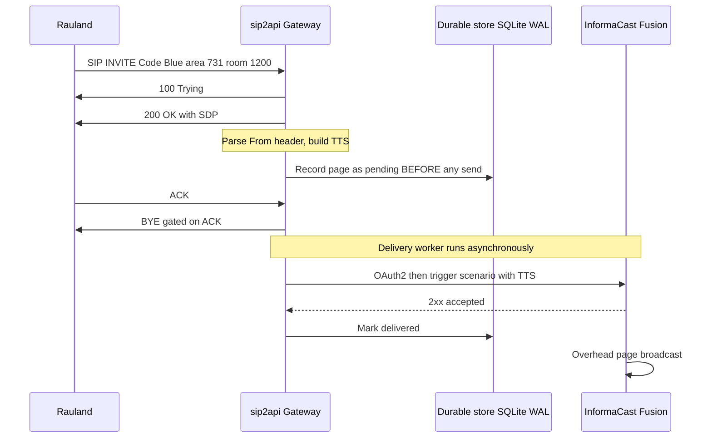
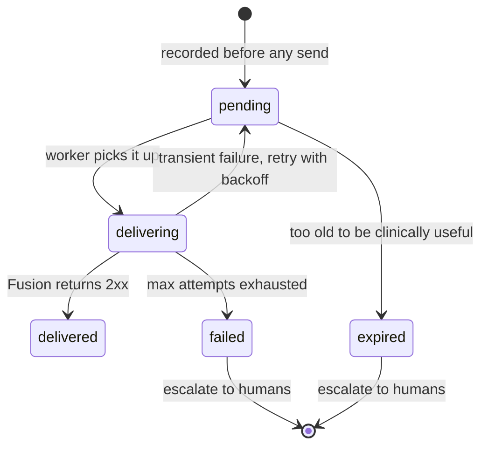
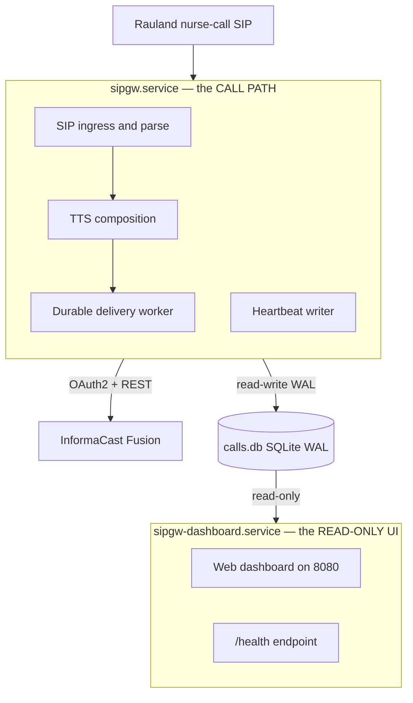

# Product Overview & Key Concepts

> **RedEye sip2api Gateway** — "SIP in. Page out. Every time."
> Code Blue / RRT Notification Gateway.
> Built by RedEye Network Solutions LLC, in conjunction with Claude Code.
> This section documents the **current production build (`c23f3eb`, the v1.7 line — v1.6.5 + 6 commits)** deployed at Tift Regional Medical Center on host `sip2apibridge`.

---

## 1. What it is, at a glance

The RedEye sip2api Gateway is a small, single-purpose, **life-safety** appliance. It sits between the hospital's **Rauland Responder nurse-call system** and **Singlewire InformaCast Fusion**, the overhead mass-notification platform. Its one job is to turn a nurse-call emergency into an audible overhead page — reliably, every time.

When a clinician triggers a **Code Blue**, **Rapid Response Team (RRT)**, or **Code Pink** at a nurse-call station, the Rauland system dials the gateway as if it were a phone. The gateway is not a phone: it answers the call, reads the *who / where / what* out of the SIP signaling, builds a spoken announcement ("Code Blue... 4th Floor... I.C.U... Room 12..."), and hands that announcement to InformaCast Fusion, which broadcasts it over the hospital's overhead speakers.

In plain terms:

> **A nurse presses a Code Blue button. Seconds later, the overhead speakers announce it — with the unit and room spoken aloud. The gateway is the box that makes that happen.**

The product is deliberately narrow. It is not a PBX, not a full SIP stack, and not a general integration bus. It does exactly one path — **SIP INVITE in, Fusion overhead page out** — and it does that path durably.

### At-a-glance facts

| | |
|---|---|
| **Product** | RedEye sip2api Gateway (a.k.a. `sipgw`) |
| **Purpose** | Convert Rauland nurse-call SIP INVITEs into InformaCast Fusion overhead pages |
| **Deployed build** | `c23f3eb` (branch `main`, v1.7 line) |
| **Host** | `sip2apibridge` — Ubuntu 24.04.4, Python 3.12.3 |
| **Listens for SIP** | `10.249.0.60:5060` (UDP **and** TCP) |
| **Web dashboard** | `http://10.249.0.60:8080` (read-only, internal network) |
| **Upstream (in)** | Rauland UAC `172.20.9.170` → proxy `172.20.9.176` → gateway |
| **Downstream (out)** | InformaCast Fusion REST API (`https://api.icmobile.singlewire.com/api`), scenario `SIPtoTTSBridge` |
| **Supported call types** | Code Blue, Rapid Response Team (RRT), Code Pink — extensible via lookup tables |
| **Core promise** | A real emergency page is **never dropped**. Delivery is durable and retried. |

---

## 2. End-to-end value: from button-press to overhead page

The whole system exists to close one gap: the Rauland nurse-call world speaks **SIP**, and the InformaCast overhead-paging world speaks a **REST API**. Nothing off the shelf bridges the two with the reliability a Code Blue demands. The gateway is that bridge.

```mermaid
flowchart LR
    A[Clinician triggers Code Blue at nurse-call station] --> B[Rauland Responder places a SIP call]
    B --> C[sip2api Gateway answers on 5060]
    C --> D[Parse SIP headers for area room bed purpose]
    D --> E[Build spoken TTS announcement]
    E --> F[Record page durably in database]
    F --> G[Deliver to InformaCast Fusion via REST]
    G --> H[Fusion broadcasts overhead page]
    H --> I[Care team responds]
```



Each hop adds value:

- **Rauland → SIP.** The nurse-call system already knows how to place a SIP call when an alert fires. The gateway meets it there, on the wire the hospital already runs.
- **SIP → meaning.** The emergency's identity is encoded in the SIP `From` header — the *purpose* in the display name (e.g. "Blue"), and the *location* in the username (e.g. `a731r1200` → area 731, room 1200). The gateway parses this into a structured `CallerInfo`.
- **Meaning → speech.** Using site-specific **lookup tables** (`lookups.yaml`), the gateway translates codes into words a responder actually hears: area `731` becomes "4th Floor... I.C.U...", the purpose "Blue" becomes "Code Blue". The result is a clear, repeated, speech-ready announcement.
- **Speech → Fusion.** The announcement is delivered to the InformaCast Fusion scenario `SIPtoTTSBridge` via its REST API. Fusion owns the actual audio broadcast to the overhead speakers and to any subscribed devices.
- **Durability wraps all of it.** The page is written to a durable store **before** any network call, so a Fusion hiccup, a token timeout, or a process crash cannot silently swallow it.

---

## 3. Key concept: the paging path — nurse-call → SIP → TTS → Fusion

The paging path is the heart of the product. It runs entirely inside the writer process (`sipgw.service`), and it is the path everything else is built to protect.



The stages, in order:

1. **Ingress (SIP).** Rauland sends a SIP `INVITE` to `10.249.0.60:5060` (UDP or TCP). The gateway runs a purpose-built, lightweight SIP handler (only `INVITE` / `ACK` / `BYE` / `CANCEL` / `OPTIONS`) — chosen over a full SIP stack for zero native dependencies and full behavioral control. The source IP is checked against the **SIP allowlist** (`172.16.0.0/12, 127.0.0.0/8, 10.0.0.0/8`) before anything else happens.
2. **Answer.** The gateway replies `100 Trying`, then `200 OK` with SDP (advertising PCMU/8000). The call is answered like a real endpoint would.
3. **Parse.** The `From` header is decoded into a `CallerInfo`: **purpose** from the display name, **area / room / (optional) bed** from the username pattern `a{area}r{room}[b{bed}]`.
4. **Compose TTS.** The lookup tables convert the codes into a speech-ready string, which is then wrapped with a preamble and repeated for clarity on a noisy overhead system.
5. **Record durably.** The page is written to the SQLite database (WAL mode) in state `pending` — **this happens before any attempt to reach Fusion.** This is the durability boundary (see §5).
6. **Deliver asynchronously.** A background **delivery worker** picks up the pending row and delivers it to Fusion — authenticating via OAuth2 and triggering the `SIPtoTTSBridge` scenario with the TTS string as the payload. Retries and escalation apply if the first attempt fails.
7. **Broadcast.** Fusion accepts the trigger (2xx) and performs the actual overhead broadcast. The gateway marks the row `delivered`.

Crucially, **delivery is fully decoupled from the SIP call.** The gateway does not hold the phone call open waiting for Fusion. It answers Rauland immediately, records the page, tears the call down cleanly, and lets the delivery worker do the network work on its own schedule. A Fusion outage never backs up onto the SIP side, and a slow SIP teardown never delays a page.

---

## 4. Key concept: the immediate-BYE model (ACK-gated teardown)

Because the gateway does not need to keep an audio channel open — Fusion, not the SIP call, carries the announcement — it uses an **immediate-BYE** model in production. As soon as it has answered (`200 OK`) and dispatched the page, it wants to hang up the SIP call and free the resource.

The subtlety is *when* it hangs up. Earlier behavior sent the gateway's `BYE` in the same instant as the `200 OK`, which could race ahead of the caller's `ACK` and reach the proxy before the three-way handshake finished — drawing a **`481 Call/Transaction Does Not Exist`**. The current build fixes this by **gating teardown on the ACK**:

- After the `200 OK`, the gateway **keeps** the call and **fires the page immediately** (decoupled — the page never depends on the ACK, BYE, or any teardown outcome).
- The gateway's `BYE` is **deferred until the caller's `ACK`** confirms the handshake, guaranteeing correct `INVITE → 200 → ACK → BYE` ordering with no 481.
- A **lost-ACK fallback timer** (`immediate_bye_ack_timeout_seconds`, default 2.0s) tears the call down anyway if the ACK never arrives, so a dropped ACK cannot leave a call stuck.
- All teardown paths — **ACK arrives, fallback fires, peer BYE, or shutdown** — funnel through one idempotent teardown that sends the `BYE` exactly once and frees the RTP port exactly once. A duplicate ACK or an ACK/fallback race can never double-send.

The governing rule is *answer-SIP-first, deliver-async*: **the page is recorded and dispatched independently of the ACK/BYE/fallback outcome**, so no SIP teardown quirk can ever lose a Code Blue.

---

## 5. Key concept: durable, at-least-once delivery — "duplicate OK, missed never"

This is the single most important idea in the product, and the reason it exists in its current form.

### The principle

> **A real emergency page is never dropped, never silently lost, never gated behind some other machinery. If forced to choose, the gateway would rather send a page twice than miss one.**

That is the meaning of **at-least-once, "duplicate OK / missed never."** A dropped Code Blue is a potential death; a duplicated overhead page is a minor annoyance. The whole delivery design leans, at every branch point, toward the safe side of that trade.

### Why it matters — the incident that shaped it

On **2026-06-12**, a Code Blue was lost. The gateway tried to fetch an OAuth token inline, on the critical path, at the moment it needed to page. A transient `httpx.ConnectTimeout` during that fetch failed the send (`fusion_status=-1`), and because delivery was best-effort and single-shot, there was **no retry** — the page was simply gone. That must never happen again.

The current build **prevents that exact failure** with three changes working together:
- The page is **recorded before any network send**, so it survives a failure or crash.
- Delivery is **retried with backoff**, so a transient timeout is recovered from, not fatal.
- The OAuth token is **refreshed in the background**, off the critical path, so a page never blocks on a token round-trip in the first place.

### How durability works (the transactional outbox)

The gateway implements a **transactional outbox**. Every page moves through an explicit state machine backed by the SQLite database (WAL mode), tracked in the `calls.state` column:



- **Record-first is sacred.** `create_pending_call()` inserts the `pending` row *before* the gateway even tries to reach Fusion. From that instant the page survives a Fusion outage, a network blip, or a process crash.
- **Bounded retries with backoff.** The delivery worker retries failed attempts with exponential backoff (honoring an upstream `Retry-After` when present), up to a bounded number of attempts.
- **Crash recovery.** On startup, any page left mid-flight by a crash is re-queued for redelivery — nothing in flight is lost across restarts. (This re-queue is exactly why the model is *at-least-once*: after a crash the gateway may resend rather than risk having missed one.)
- **Escalation.** A page that permanently fails or expires triggers an **escalation** to a human channel (a NOC/Teams/Slack/PagerDuty endpoint), so a delivery that truly cannot complete becomes a loud, visible alert rather than a silent loss.
- **Background OAuth refresh.** The Fusion access token is kept warm by a background refresh loop, so the first real Code Blue never pays a token-fetch latency — closing the 2026-06-12 failure mode at its root.

The states you will see in the `calls.state` column: `pending`, `delivering`, `delivered`, `retrying`, `failed`, `expired`, `duplicate`, and `legacy` (pre-outbox rows migrated losslessly).

---

## 6. Key concept: enforcing duplicate suppression

Rauland has a quirk: for roughly **one in three events it emits two INVITEs** for the same clinical emergency. Left alone, that means two identical overhead pages for one Code Blue — clinically confusing ("is there a second patient?") and noisy.

The current build **suppresses these duplicates** with an enforcing deduper. This was **enabled in this build after clinical sign-off** (it ships disabled-by-default in the reference config; the production `config.yaml` turns it on):

```yaml
dedupe:
  enforce: true
  window_seconds: 2
  match_bed: true
  match_purpose: true
```

How it works, and — more importantly — how it stays safe:

- **Keyed on the upstream `event_id`.** Rauland's double-emit carries the same upstream event identifier on both INVITEs, so the two are recognized as one clinical event and collapsed. The match also considers the clinical fingerprint (area, room, bed, purpose) within a short **2-second window**.
- **A genuine second emergency is always delivered.** Two *different* Code Blues for the same room, or a Code Blue and an RRT, are distinct clinical events and are **both paged** — the deduper only collapses the true same-event double-emit.
- **Suppression can never drop a real page — by construction.** The deduper runs **after** the record-first insert. It never gates or delays the insert or the delivery. When it does suppress, it transitions the *already-recorded* duplicate row to state `duplicate` — and that transition is **guarded on the row still being `pending`.** If the delivery worker has already picked the row up, the row is delivered anyway. This is the deliberate **fail-safe direction: deliver a duplicate rather than risk dropping a page.**

In short: dedupe makes the *nice-to-have* better (no double announcements) without ever compromising the *must-have* (no missed page). It is consistent with, not an exception to, the "duplicate OK / missed never" principle — the one duplicate it removes is a known upstream artifact, keyed on the upstream event id, and the safety fallback still favors delivery in every ambiguous case.

---

## 7. Key concept: the two-service topology

The gateway runs as **two independent systemd services**, deliberately split so that the read-only web UI can never interfere with the life-safety paging path.



| Service | Role | Type | Can restart independently? |
|---|---|---|---|
| **`sipgw.service`** | The **call path**: SIP ingress + parse + TTS + durable delivery. Owns all database writes and stamps a liveness heartbeat. | `Type=notify`, `WatchdogSec=30s` | This is the paging service; restart only when coordinated. |
| **`sipgw-dashboard.service`** | A separate **read-only web UI** (`dashboard_app.py`) on `:8080`. Opens the database read-only. | `Type=simple` | **Yes** — it can be restarted or crash **without interrupting paging.** |

Why the split matters:

- **Isolation.** A runaway UI request, a dashboard crash, or a dashboard restart cannot touch the paging path. The two processes share only the SQLite database file, and the dashboard opens it **read-only** (`PRAGMA query_only=ON`) — it can *never* mutate a page or the heartbeat. The writer owns every write.
- **Watchdog.** The writer runs under a systemd `Type=notify` watchdog (`WatchdogSec=30s`): a hung event loop is detected and the service restarted. This watchdog is on the writer **exclusively**.
- **Honest health.** Because the writer and dashboard are separate processes, the dashboard's `/health` reads the **writer's heartbeat row** from the database. A healthy `/health` therefore means the *paging process* is genuinely alive — not merely that the web server answered. `/health` also surfaces Fusion reachability and the age of the last inbound SIP from Rauland (an inbound-liveness signal that the nurse-call link is up).

> **Operational note.** Because the paging service and the OS must be coordinated, uncoordinated restarts are a known hazard: on 2026-07-07 an unattended-upgrades (`needrestart`) auto-restart bounced the paging service (issue #20, remediated). OS patching must be coordinated with the paging window; zero-downtime writer restarts (socket activation, issue #19) are on the roadmap.

---

## 8. Supported call types

Call types are **data, not code.** The gateway derives the *purpose* of a page by matching keyword substrings in the SIP display name against the `call_purposes` table in `lookups.yaml`. Adding or renaming a call type is a lookup-table edit — no code change, no redeploy of the application logic.

The production build recognizes:

| Trigger keyword (in SIP display name) | Spoken purpose | Notes |
|---|---|---|
| `Blue` | **Code Blue** | Cardiac/respiratory arrest — the primary life-safety case. |
| `RRT` | **Rapid Response Team** | Clinical deterioration escalation. |
| `Pink` | **Code Pink** | Infant/child security. (Also mapped as specific room names in a few areas.) |

Two design choices reinforce the safety posture:

- **First match wins**, in table order — so ordering in `lookups.yaml` is meaningful.
- **The default is the most critical.** When no keyword matches (or the display name is empty), the gateway falls back to **`default_purpose: "Code Blue"`** — deliberately choosing the most urgent interpretation so an unrecognized alert is never *under*-classified.

Location is resolved the same way: the `areas` table maps an area number to a speech-ready unit name (e.g. `731 → "4th Floor... I.C.U..."`), and an `area_rooms` table provides room-level overrides (e.g. `730*01001 → "C... 32"`). This is how the same generic room number can be spoken correctly across different units. New units, rooms, and call types are all onboarded by editing `lookups.yaml`.

---

## 9. Where to go next

| If you want to… | See |
|---|---|
| Understand the internal modules and data flow in depth | **Architecture** |
| Configure the gateway, Fusion credentials, or dedupe | **Configuration** |
| Edit area/room/purpose mappings | **Lookup Tables** |
| Operate, restart, and monitor the services | **Operations** |
| Diagnose a missed or duplicated page | **Troubleshooting** |
| Understand the security posture and the SIP allowlist | **Security** |
| See what is planned (HA, zero-downtime restarts) | **HA Plan / Roadmap** |
