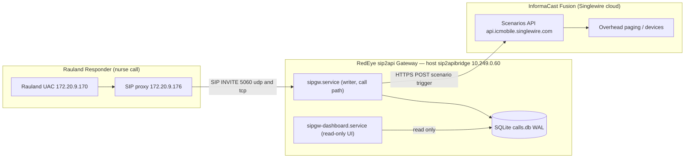
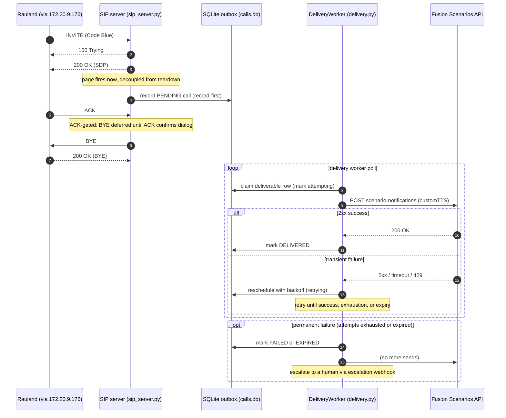
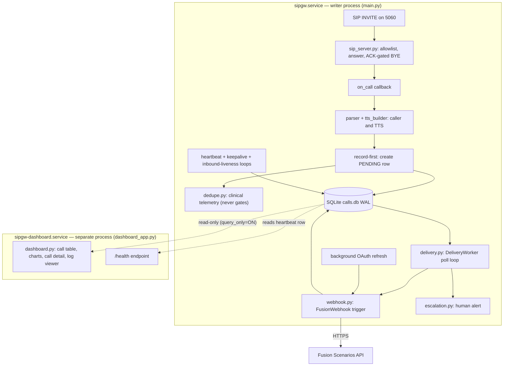
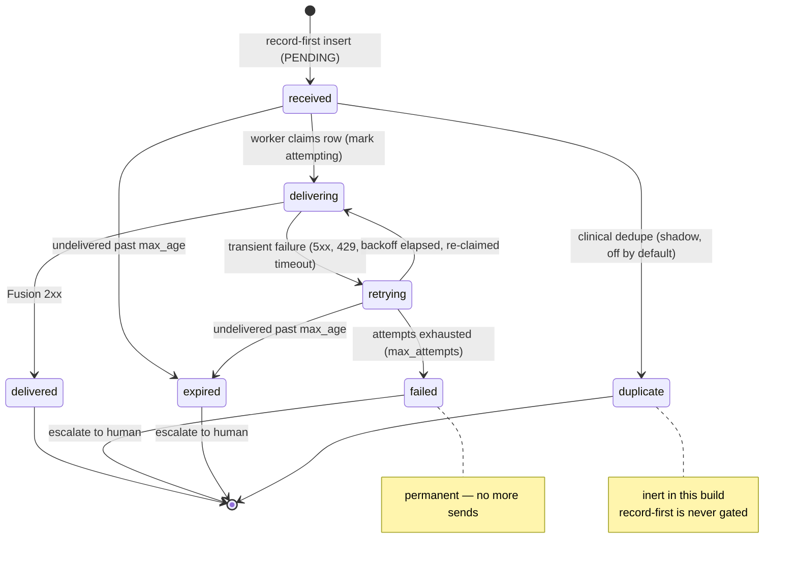
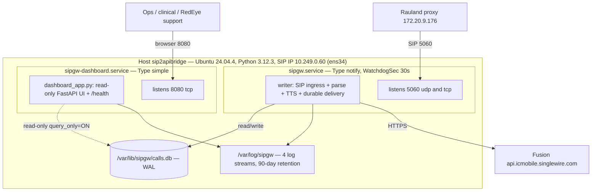

# Architecture

> **RedEye sip2api Gateway** — Code Blue / RRT Notification Gateway
> *"SIP in. Page out. Every time."*
>
> This section documents the **current production build (`c23f3eb`, the v1.7 line: v1.6.5 + 6 commits)** as deployed on host `sip2apibridge` at Tift Regional Medical Center. It describes the system that IS running today. Features that are still in development (the HA epic, socket-activated restarts, remaining Dashboard-v2 phases) are called out only in the *Roadmap* and *HA Plan* sections of this manual and are labeled *planned*.

---

## 1. What the gateway does

The RedEye sip2api Gateway is a **life-safety protocol bridge**. Rauland Responder (the nurse-call system) knows how to place a **SIP call**; InformaCast Fusion knows how to make an **overhead page**. Nothing off the shelf connects the two. The gateway sits in the middle: it answers the SIP INVITE that Rauland places for a Code Blue or Rapid Response Team (RRT) event, extracts *who / where / why* from the call, turns that into a spoken **text-to-speech (TTS)** announcement, and drives Fusion's Scenarios API to page it overhead.

The single design imperative is **"page out, every time."** A Code Blue that is placed must result in an overhead page even if Fusion is momentarily unreachable, even if the OAuth token expired at the wrong moment, and even if the gateway process crashes in the half-second between answering the call and delivering the page. The architecture below exists to make that guarantee durable rather than best-effort.

### 1.1 The problem this build solves

On **2026-06-12** a Code Blue was lost. The old code fetched an OAuth token *inline* on the page path; that fetch hit a transient `httpx.ConnectTimeout`, the trigger returned `fusion_status = -1`, and there was no retry — the page silently evaporated. The current build eliminates that failure mode by:

- **Recording the page first** (durable SQLite row) and delivering it **asynchronously** with bounded retries, so a transient network fault is retried instead of dropped.
- **Refreshing the OAuth token in the background**, off the page's critical path, so a page never waits on (or dies from) a token fetch.
- **Escalating to a human** when a page can genuinely not be delivered, instead of failing silently.

---

## 2. System context

Three actors, one direction of flow: nurse-call **in**, overhead page **out**.

**The upstream SIP path.** Rauland's user agent (`172.20.9.170`) does not talk to the gateway directly; it routes through the Rauland-side SIP proxy (`172.20.9.176`), which forwards the INVITE to the gateway's SIP IP `10.249.0.60` (interface `ens34`) on port **5060 (UDP and TCP)**. The gateway therefore sees `172.20.9.176` as the immediate signaling peer. Both addresses fall inside the SIP allowlist (`172.16.0.0/12`), so both are accepted; any source outside the allowlist is answered with `403 Forbidden` and never becomes a page.

**The downstream page path.** The gateway calls Fusion's Scenarios API at `https://api.icmobile.singlewire.com/api`. It authenticates with OAuth2 client-credentials against `/token` (audience = the customer's provider ID), then POSTs to `/v1/scenario-notifications?scenarioId=<SIPtoTTSBridge scenario id>` with the TTS string as the answer to the `customTTS` field. Fusion resolves the scenario's audience and pages it overhead. Credentials are masked everywhere in this manual as `<CLIENT_ID>` / `<CLIENT_SECRET>`; the customer-owned scenario, audience, and field identifiers are the customer's own and may appear.

**Two services, one host.** The gateway is not a monolith. The **call path** (`sipgw.service`) and the **web UI** (`sipgw-dashboard.service`) are independent systemd units in separate OS processes. The dashboard can be restarted, upgraded, or crash without ever interrupting paging. Both are covered in §6.

---

## 3. A call, end to end (durable delivery)

The following sequence is the heart of the system. Note the two decoupling points that make the page durable: the page is **recorded before it is delivered** (so a crash or outage cannot lose it), and the SIP dialog is **torn down independently of delivery** (so answering the call never waits on Fusion).

### 3.1 Why the ordering matters

- **200 OK before record, page before teardown.** The gateway answers the INVITE immediately (`100 Trying`, then `200 OK` with SDP). The page callback (`_safe_callback` → `on_call`) fires via `asyncio.create_task` the moment the call is answered — it is *not* chained behind ACK, BYE, or the delivery result. Rauland gets a fast, clean answer regardless of Fusion's health.
- **Record-first.** `on_call` parses the caller, builds the TTS, and writes a **PENDING** row to the outbox *before* any attempt to reach Fusion. From that instant the page is durable: even a hard crash before the first delivery attempt leaves a recoverable row on disk (§5.3).
- **ACK-gated immediate-BYE.** In `immediate_bye` mode (the deployed default) the gateway sends `200 OK`, keeps the dialog, and defers its own `BYE` until the caller's `ACK` confirms the three-way handshake. This fixes the historical **481 race** in which a BYE could outrun the ACK. A lost ACK is covered by a per-call fallback timer (`immediate_bye_ack_timeout_seconds`, 2.0 s) that tears the dialog down and frees the RTP port so a dropped ACK can never strand a dialog or leak a port.
- **Delivery is a separate loop.** The `DeliveryWorker` polls the outbox on its own cadence, claims deliverable rows, and drives the Fusion POST with retries and backoff. Success marks the row **DELIVERED**; permanent failure marks it **FAILED** or **EXPIRED** and escalates.

---

## 4. Internal pipeline

Inside the writer process, an inbound INVITE flows through a short, well-bounded pipeline. The dashboard is deliberately drawn **outside** that pipeline — it is a separate process that only *reads* the same database.

### 4.1 Stage-by-stage

| Stage | Module | Responsibility |
|---|---|---|
| **Ingress** | `sip_server.py` | Listen on 5060 UDP+TCP; enforce the source-IP allowlist; answer INVITE (`100`/`200`); run ACK-gated immediate-BYE teardown; stamp last-inbound time for liveness. |
| **Parse + compose** | `parser.py`, `tts_builder.py`, `lookups.py` | Extract caller/room/area from the From header; resolve area name and call purpose from `lookups.yaml`; assemble the spoken TTS string (preamble + play count). |
| **Record-first** | `main.on_call` → `database.py` | Persist the page as a **PENDING** row *before* any delivery attempt. This is the durability boundary. |
| **Dedupe (telemetry)** | `dedupe.py` | Compute a clinical fingerprint and, when a shadow window is configured, log clinical duplicates. **In this build it runs after the insert and never gates delivery** (see §4.2). |
| **Deliver** | `delivery.py` | Poll the outbox, claim rows, drive the Fusion POST with bounded retries + backoff, honor `Retry-After` delta-seconds, expire stale rows, and invoke escalation on permanent failure. |
| **Webhook** | `webhook.py` | OAuth2 client-credentials auth with a **background token refresher**; POST the scenario trigger; single 401 re-auth-and-retry; surface `Retry-After` to the worker; bounded read-only reachability probe for `/health`. |
| **Escalate** | `escalation.py` | Fire a human alert (Teams/Slack/PagerDuty/NOC webhook) when a page fails or expires. |
| **Liveness** | `main.py` loops + `watchdog.py` | Heartbeat writer, Fusion reachability keepalive, inbound-liveness flush, and the systemd Type=notify watchdog pinger. |

### 4.2 Dedupe status in this build — an accuracy note

Rauland double-emits roughly one INVITE in three (two INVITEs per event). The dedupe subsystem (`dedupe.py`) exists to measure and eventually suppress those, but **in the deployed `c23f3eb` build it ships inert**:

- The `on_call` insert is **record-first and never gated** — the deduper is evaluated *after* the PENDING row is written, purely as telemetry.
- With the shipped config (`dedupe.enforce: false`, `dedupe.window_seconds: 0`) the deduper does not even query the database and always returns a no-suppress decision. Setting `window_seconds > 0` with `enforce: false` turns on **shadow logging** (`WOULD suppress ...`) but every page is still delivered.
- `enforce: true` is a **fatal config error** by policy (real suppression requires clinical sign-off). Even the (unreachable) enforce branch is never allowed to drop a *second real Code Blue for the same room* — the fail-safe direction is always "deliver."

The clinical fingerprint (`cf-v1:`, keyed on area/room/bed/purpose) is deliberately distinct from the SIP **transaction** fingerprint (`v1:`, from Call-ID/From/CSeq in `sip_message.py`) used for INVITE-retransmit correlation and the `event_id` column. The two are never conflated. Enforcing, event-id-keyed suppression is tracked as roadmap work (issues #5 and the dedupe tail).

---

## 5. The durable outbox

### 5.1 Storage

All state lives in a single SQLite database at `/var/lib/sipgw/calls.db`, opened in **WAL** (write-ahead logging) mode. WAL is what lets the writer commit pages while the dashboard reads concurrently without blocking. The **writer process owns every write**; the dashboard opens the same file **read-only** (`query_only=ON`) and can never mutate a page or heartbeat.

The `calls` table carries the outbox columns: `state`, `attempts`, `last_error`, `delivered_at`, `sip_call_id`, `duplicate_of`, `is_test`, and `event_id`, with supporting indexes. Test traffic (`is_test = 1`, set in dry-run) never fires a real page and never counts in statistics or dashboard rollups.

### 5.2 State machine

Each page is a row that moves through a small, explicit state machine. The worker is the only mutator of these states.

**Reading the states:**

- **received → delivering → delivered** is the happy path: recorded, claimed, POSTed, 2xx.
- **retrying** is entered on any transient failure (5xx, 429, timeout, or the `-1` "exception" status). The worker computes a backoff — exponential from `base_backoff_seconds`, capped at `max_backoff_seconds`, and it honors a Fusion `Retry-After` delta-seconds header when present — then re-claims the row when the cooldown elapses.
- **failed** is terminal: attempts reached `max_attempts` with no success. The worker records the last status/error and **escalates**.
- **expired** is terminal: the page sat undelivered longer than `max_age_seconds`. It is escalated as well — a page that can no longer be trusted to be timely is surfaced to a human rather than delivered late and silently.
- **duplicate** is the dedupe terminal state. It exists in the schema and the state model, but in this build the record-first insert is never gated, so pages are not routed here in production (§4.2).

The legacy state (rows written by pre-outbox builds) is treated as already-handled and is excluded from the deliverable set; state-aware statistics (#10) classify legacy, delivered, and in-flight rows correctly on the dashboard.

### 5.3 Crash recovery — at-least-once delivery

On startup the worker calls `recover()`, which returns any **crash-orphaned `delivering` rows to `received`** (`recover_inflight`). If the process died mid-POST — after claiming a row but before recording its outcome — that row is simply re-queued and retried. Combined with record-first insertion, this gives **at-least-once** delivery: the only way a recorded page leaves the system is DELIVERED, FAILED (escalated), or EXPIRED (escalated). It is never silently dropped. (On a graceful shutdown the worker also best-effort `drain()`s the queue, but durability does not depend on drain succeeding.)

### 5.4 OAuth off the critical path

`webhook.py` runs a **background token refresh loop** that renews the OAuth token roughly `token_refresh_margin_seconds` before it expires. Delivery therefore almost always uses a warm cached token; the on-demand fetch inside `trigger_scenario` is a fallback, not the norm. A single `401` triggers one clear-cache-and-retry. This is the direct architectural fix for the 2026-06-12 incident: no page waits on — or dies from — an inline token fetch.

---

## 6. Deployment topology — two independent services

The paging path is deliberately isolated from the UI. Two systemd units run on the same host and share only the SQLite file (writer read-write, dashboard read-only).

### 6.1 The two units

| | `sipgw.service` (writer) | `sipgw-dashboard.service` (dashboard) |
|---|---|---|
| **systemd type** | `Type=notify`, `WatchdogSec=30s` | `Type=simple` |
| **Entry point** | `python -m sipgw.main <config>` | `python -m sipgw.dashboard_app <config>` |
| **Owns** | SIP ingress, parse, TTS, the durable delivery worker, escalation, heartbeat, watchdog | Read-only web UI on :8080 and `/health` |
| **DB access** | read-write (all writes) | **read-only** (`query_only=ON`) |
| **Listens** | 5060 UDP + TCP | 8080 TCP |
| **Restart impact** | interrupts paging (mitigated by record-first + recovery) | **none** — paging continues uninterrupted |

**Why split (#14).** The dashboard is a rich FastAPI app (call table, a 90-day stacked chart by call type, a correlated `/call/{id}` detail view, a date-picker log viewer, per-call diagnostic-bundle export). Running it in-process with the writer would mean a UI dependency, a memory leak, or a routine dashboard upgrade could jeopardize the paging path. Splitting the processes means the dashboard can be restarted or fail on its own while the writer keeps answering INVITEs and delivering pages. The two processes must not both attach the rotating file handler to the writer's shared logs (a midnight `doRollover()` race would corrupt them), so the dashboard uses **dashboard-safe logging** to its own `sipgw_dashboard.log`.

### 6.2 `/health` and liveness

`/health` is served by the dashboard but reflects the **writer's** health, because the writer stamps a heartbeat row and the dashboard reads it:

- **Heartbeat freshness is the sole determinant of the HTTP status code.** The writer stamps a heartbeat every `heartbeat_interval_seconds` (10 s); `/health` returns **503** once the heartbeat is older than `stale_after_seconds` (30 s). Everything else on `/health` is informational and never flips the status code by default.
- **Fusion reachability** — a bounded, **read-only** GET of the scenario every `keepalive_interval_seconds` (300 s). It never triggers a scenario and never sends a page; the result is stamped for `/health` as an informational field. A transient Fusion blip is deliberately *not* allowed to 503 a single node (which a monitor could then pull or restart). Turning that into a hard 503 is opt-in (`fail_on_fusion_unreachable`, default off).
- **Inbound-liveness** — Rauland sends SIP only on real events (no keepalives), so the writer stamps the time of the last allowed-network inbound SIP and flushes it to the DB. `/health` surfaces `last_inbound_sip_age_s`; the dashboard shows "Last inbound from Rauland" and turns amber past `inbound_stale_after_seconds` (5 days). This is informational; optional silence-escalation is off by default and, if enabled, must be set above the historical ~4.27-day maximum quiet gap to avoid false alarms.

---

## 7. Host, ports, and network facts

| Fact | Value |
|---|---|
| Host | `sip2apibridge`, Ubuntu 24.04.4, Python 3.12.3 |
| SIP / SDP IP | `10.249.0.60` (interface `ens34`) |
| SIP port | `5060` UDP **and** TCP (writer) |
| Dashboard port | `8080` TCP (read-only UI, **no auth** — see below) |
| Install root | `/opt/sipgw` (venv `/opt/sipgw/venv`) |
| Logs | `/var/log/sipgw` — 4 streams, 90-day retention |
| Database | `/var/lib/sipgw/calls.db` (WAL) |
| SIP allowlist | `172.16.0.0/12`, `127.0.0.0/8`, `10.0.0.0/8` |
| Upstream SIP | Rauland UAC `172.20.9.170` → proxy `172.20.9.176` → gateway |
| Fusion base | `https://api.icmobile.singlewire.com/api`, scenario **SIPtoTTSBridge**, field `customTTS` |

**Four log streams** (`/var/log/sipgw`), rotated at midnight with async rotation (#6):

- `sipgw.log` — writer application log (the call/delivery narrative).
- `sipgw_api_debug.log` — full Fusion HTTP request/response captures (secrets masked).
- `sipgw_sip_debug.log` — raw inbound/outbound SIP messages and INVITE fingerprints.
- `sipgw_dashboard.log` — the dashboard process's own log.

**Timestamps.** The host clock is `Etc/UTC` and all stored `timestamp` values are canonical UTC RFC3339 millis-Z. Note the config key `logging.timezone: America/New_York` is *declared but not applied to stored timestamps* in this build — persisted times are UTC. The dashboard renders local wall-clock for display.

### 7.1 Security posture at the perimeter

There is **no host firewall active** (nftables is empty). Ingress protection currently relies entirely on the **application-layer SIP allowlist** in `sip_server.py`, which `403`s any source outside the allowed networks before it can become a page. Two hardening items follow directly from this and are carried in the *Security* and *Roadmap* sections:

1. **Add an nftables policy** scoping `5060` and `8080` to the expected source networks, so the OS enforces the boundary in addition to the app.
2. **The dashboard on :8080 has no authentication.** It is read-only and hides test rows, but it exposes call detail and log content. Until it is placed behind auth or a network boundary, treat :8080 as sensitive and restrict it at the network layer.

---

## 8. Design principles (why it's shaped this way)

- **Record before you send.** Durability is a property of *when you persist*, not of how hard you retry. Writing the PENDING row before the first Fusion attempt is what converts "best-effort page" into "durable page."
- **Decouple the SIP dialog from delivery.** Answering the call and tearing it down must never wait on Fusion. The page fires on a separate task; the delivery worker runs on its own loop.
- **Keep the token warm, off the path.** The one incident this build was built around was an inline token fetch on the critical path. Background refresh removes that class of failure entirely.
- **Isolate the UI from the paging path.** A read-only dashboard in its own process can never take paging down with it.
- **Fail safe, then fail loud.** Ambiguity always resolves toward *deliver the page* (dedupe never drops a real Code Blue; recovery re-queues orphans). When a page genuinely cannot be delivered, it is FAILED/EXPIRED and **escalated to a human**, never dropped in silence.

---

*Continue to the Configuration, Operations, Security, and Reliability sections for the operational detail behind each component described here. Planned work — the NetScaler active/active HA epic (#17), zero-downtime socket-activated restarts (#19), OS auto-restart coordination (#20), and remaining Dashboard-v2 phases (#13) — is documented, and labeled planned, in the HA Plan and Roadmap sections.*
