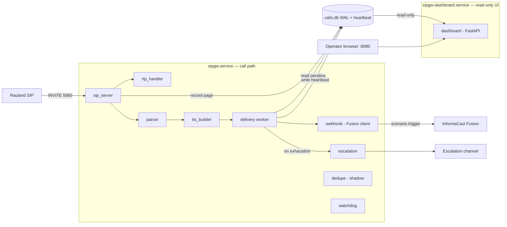

# Components & Dependencies

This section is the definitive map of the deployed build (production `c23f3eb`,
the v1.7 line = v1.6.5 + 6 commits). It answers three questions:

1. **What modules make up the `sipgw` package, and what is each one responsible for?**
2. **What does the gateway depend on** — Python packages and external systems — to do its job?
3. **Which of those modules runs in which of the two systemd services?**

Everything here reflects what is *installed and running* on host `sip2apibridge`
today. Where a module ships a capability in an *inert* or *shadow* state (dedupe
enforcement is the notable case), that is called out explicitly rather than
described as if it were active.

---

## 1. Package layout

The application is a single Python package, `sipgw`, installed at `/opt/sipgw`
and run out of its own virtualenv (`/opt/sipgw/venv`, Python 3.12.3). Two
separate processes are started from it — the **writer** (`python -m sipgw.main`)
and the **dashboard** (`python -m sipgw.dashboard_app`) — but they import from
the same package on disk.

```
/opt/sipgw/
├── sipgw/                  # the application package
│   ├── __init__.py
│   ├── main.py             # WRITER entry point (call path)
│   ├── dashboard_app.py    # DASHBOARD entry point (read-only UI)
│   ├── config.py           # config loader + fail-fast validation
│   ├── logging_config.py   # dual logging + async rotation
│   ├── sip_server.py       # SIP UA server (INVITE/ACK/BYE/CANCEL/OPTIONS)
│   ├── sip_message.py      # raw SIP parse + invite_fingerprint (#15)
│   ├── rtp_handler.py      # RTP u-law silence to hold the call up
│   ├── parser.py           # username/display-name → area/room/bed/purpose
│   ├── lookups.py          # area-name / purpose lookup tables (lookups.yaml)
│   ├── tts_builder.py      # parsed call → announcement text
│   ├── webhook.py          # Fusion OAuth2 + scenario trigger (FusionWebhook)
│   ├── delivery.py         # durable outbox / retry worker (DeliveryWorker)
│   ├── escalation.py       # human-channel alert on delivery failure
│   ├── dedupe.py           # clinical dedupe — SHIPS SHADOW/DISABLED
│   ├── database.py         # SQLite (WAL) call store + heartbeat
│   ├── watchdog.py         # systemd Type=notify / sd_notify pinger
│   ├── safety.py           # dry-run / test-mode NO-SEND guarantee
│   └── dashboard.py        # FastAPI UI, charts, /call/{id}, /health, log viewer
├── config.yaml             # deployment config (secrets masked in this manual)
├── lookups.yaml            # area + purpose lookup tables
└── venv/                   # Python 3.12 virtualenv
```

---

## 2. Module responsibility table

Modules are grouped by the role they play. "Runs in" tells you which
service(s) import and exercise the module at runtime — **W** = writer
(`sipgw.service`), **D** = dashboard (`sipgw-dashboard.service`).

### Entry points & shared setup

| Module | Runs in | Responsibility |
|---|---|---|
| `__init__.py` | W · D | Package marker. `"""sipgw - SIP-to-Webhook Gateway for Informacast Fusion."""` Nothing runtime-bearing. |
| `main.py` | **W** | Writer entry point (`python -m sipgw.main <config.yaml>`). Wires the SIP server + delivery worker + heartbeat writer + watchdog together and owns all DB writes. Since the #14 two-service split it no longer serves HTTP; it keeps writing the heartbeat row that the dashboard reads for `/health`. |
| `dashboard_app.py` | **D** | Dashboard entry point (`python -m sipgw.dashboard_app <config.yaml>`). Runs the FastAPI UI in its **own** process. Opens the shared SQLite DB **read-only** (`query_only=ON`) so it can never mutate a page or heartbeat, uses dashboard-safe logging so it never attaches the writer's rotating file handler, and mirrors the writer's bootstrap (load_config → effective_dry_run → prod-DB barrier → validate_config) so a misconfigured/unsafe dashboard refuses to start exactly like the writer does. |
| `config.py` | W · D | Loads `config.yaml` into typed dataclasses with sensible defaults for every value, and provides **fail-fast validation** (#9). Notably makes `dedupe.enforce=true` a **fatal** config error — enforcement is forbidden in production today. |
| `logging_config.py` | W · D | Dual logging: stdout + a daily-rotating file with `.tgz` compression and retention purge (#6, async rotation). Exposes a **dashboard-safe** setup so the read-only process never races the writer at midnight `doRollover()`. Note: `logging.timezone: America/New_York` is declared but *not applied to stored timestamps* — the host clock is `Etc/UTC` and stored timestamps are UTC RFC3339 millis-Z. |

### SIP ingress & parsing (the call path)

| Module | Runs in | Responsibility |
|---|---|---|
| `sip_server.py` | **W** | Purpose-built lightweight SIP UA server on UDP+TCP **5060**. Answers `INVITE`, holds the call up with RTP silence, and terminates on `BYE`/`CANCEL`/timeout. Implements only the SIP methods the gateway needs (INVITE, ACK, BYE, CANCEL, OPTIONS), not full SIP. Enforces the SIP source **allowlist** and performs the **ACK-gated immediate-BYE** that fixed the old 481 race. Supports multiple concurrent inbound calls. |
| `sip_message.py` | **W** | Parses raw SIP requests/responses into a structured form (the INVITE/ACK/BYE/CANCEL subset). Home of the **`invite_fingerprint`** (#15) — the SIP *transaction* identity (Call-ID / From / CSeq), i.e. "is this a retransmit of the *same* INVITE." Distinct from the clinical fingerprint in `dedupe.py`. |
| `rtp_handler.py` | **W** | RTP silence sender. Emits u-law silence (`0xFF`) so the held SIP call stays up, and discards any inbound RTP. This is what keeps Rauland from tearing the call down before the page is built. |
| `parser.py` | **W** | Extracts **area / room / bed** from the SIP username (`a{area}r{room}[b{bed}]`, asterisks stripped) and **call purpose** from the SIP display name. |
| `lookups.py` | W · D | Loads the **area-name** and **call-purpose** substitution tables from `lookups.yaml` so they can be edited without a code change. (The dashboard's verify-lookups view reads these too.) |
| `tts_builder.py` | **W** | Builds the announcement text from parsed call info: base `"{CallPurpose}! {AreaName} {RoomName}"`, then assembles the preamble + 3× repetition sent to Fusion as `customTTS`. |

### Delivery, durability & escalation

| Module | Runs in | Responsibility |
|---|---|---|
| `database.py` | **W** (rw) · **D** (ro) | SQLite call store (`/var/lib/sipgw/calls.db`, **WAL**) via `aiosqlite`. Holds the call history + delivery state machine (`state`, `attempts`, `last_error`, `delivered_at`, `sip_call_id`, `duplicate_of`, `is_test`, `event_id` + indexes) and the **heartbeat** row. The writer owns *all* writes; the dashboard opens it read-only. |
| `webhook.py` | **W** | `FusionWebhook` — the InformaCast Fusion client. OAuth2 client-credentials auth (token cached and **auto-refreshed off the critical path**) plus scenario triggering: `POST {base}/token` for the token, then `POST {base}/v1/scenario-notifications?scenarioId=…` with the `customTTS` field. It is the *only* thing that talks to Fusion, and it carries the §2a no-send guard in dry-run. |
| `delivery.py` | **W** | `DeliveryWorker` — the **durable outbox**. Pages are recorded first (`state='pending'`) by the SIP path, then delivered asynchronously here, so a Fusion outage or a crash between record-and-send cannot drop a Code Blue. Retries with **exponential backoff** (honoring `Retry-After`), escalates on exhaustion, and expires pages left undelivered too long. On startup `recover()` returns crash-orphaned `delivering` rows to `pending` (**at-least-once** delivery). It drives `FusionWebhook`; it never sends anything itself. |
| `escalation.py` | **W** | `Escalator` — alerts a human channel (Teams/Slack/PagerDuty/NOC via `escalation.webhook_url`) when a page hits terminal `failed` (retries exhausted) or `expired` (staleness). Injected into the delivery worker as `on_escalate`; when absent the worker only logs. Shares the dry-run no-send guarantee. Escalation errors are logged, **never raised** — they must never disrupt delivery. |
| `dedupe.py` | **W** | Computes the **clinical** identity of a page — the normalized `(area, room, bed, purpose)` tuple (`cf-v1:` prefix). **Ships SHADOW / DISABLED.** With the deployed config (`enforce: false`, `window_seconds: 0`) `evaluate()` does not even query the DB and always returns *no-suppress*; a test-only `window_seconds > 0` turns on a shadow lookup that logs `WOULD suppress …` but **still never drops a page**. `enforce: true` is forbidden (`validate_config` fatal). This is deliberately **distinct** from `sip_message.py`'s SIP-transaction `invite_fingerprint` and must never be conflated with it. See the note below. |

### Health, safety & UI

| Module | Runs in | Responsibility |
|---|---|---|
| `watchdog.py` | **W** | systemd `Type=notify` + WatchdogSec integration via a pure-Python `sd_notify`. Sends `READY=1` once listeners are up and pings the watchdog on a cadence. Pings prove **event-loop** liveness only (decoupled from DB writes), so transient DB slowness never restarts the life-safety pager. Structurally **inert** when `NOTIFY_SOCKET` is unset (tests, dry-run, non-systemd, single-service rollback). |
| `safety.py` | W · D | The load-bearing **NO-SEND guarantee** for dry-run / test mode. In effective dry-run the shared `httpx` client is built with `NoSendGuardTransport`, which refuses to forward any request whose host is not `127.0.0.1` — every Fusion origin *and* the escalation POST share this client, so none can reach a real host during testing. Also provides `is_test` marking so test traffic never fires a real page and never counts in stats. Effective dry-run = `config.dry_run` **or** env `SIPGW_DRY_RUN=1`; the environment may only *enable* dry-run, never disable it. |
| `dashboard.py` | **D** | The FastAPI web UI (Dashboard v2). Call table with pagination + auto-refresh, 90-day stacked chart by call type, the correlated **`/call/{id}`** call-detail view, date-picker **log viewer**, per-call plain-text **diagnostic bundle export**, verify-lookups, and the real **`/health`** endpoint (delivery health + Fusion reachability + last-inbound-SIP age). Hides `is_test` rows. **No authentication** — see the Security section. |

> **The two fingerprints — do not confuse them.** `invite_fingerprint` (in
> `sip_message.py`, prefix `v1:`) is the **SIP transaction** identity: "is this
> the same INVITE arriving twice on the wire." The **clinical fingerprint** (in
> `dedupe.py`, prefix `cf-v1:`) is the **who/where/why** identity: "is this the
> same clinical event." They are separate functions on purpose. The clinical
> one is shadow/disabled and never drops a page in the deployed build.

> **Dedupe status, stated plainly.** The Rauland source double-emits (~1 in 3
> events arrives as two INVITEs). In the current production build those
> duplicates are **not** actively suppressed by `dedupe.py` — it ships inert.
> The config keys exist (`dedupe.enforce`, `dedupe.window_seconds`) and the
> shadow telemetry can be enabled for measurement, but enforcement remains
> gated behind clinical sign-off and is a fatal config error today. Treat
> enforcing dedupe as a **Roadmap** item (#5 tail), not a shipped behavior.

---

## 3. Runtime dependencies

### 3.1 Python packages

The gateway runs on **CPython 3.12.3** in a dedicated virtualenv. The repository
pins loose lower bounds in `requirements.txt`; the table below lists both those
pins and the **actual versions resolved in the deployed venv** on
`sip2apibridge` (from the host inventory). When reproducing the environment,
match the deployed column.

| Package | `requirements.txt` pin | Deployed version | Used by / why |
|---|---|---|---|
| `httpx` | `>=0.27.0` | **0.28.1** | Async HTTP client for all Fusion calls (`webhook.py`) and escalation POSTs (`escalation.py`); the dry-run `NoSendGuardTransport` plugs in here. |
| `fastapi` | `>=0.115.0` | **0.129** | Dashboard web framework (`dashboard.py` / `dashboard_app.py`). |
| `starlette` | *(via fastapi)* | (fastapi-matched) | ASGI plumbing under FastAPI — routing, requests/responses. Pulled in transitively. |
| `uvicorn[standard]` | `>=0.32.0` | **0.41** | ASGI server that runs the dashboard app. |
| `aiosqlite` | `>=0.20.0` | **0.22** | Async SQLite access for the call store + heartbeat (`database.py`). |
| `PyYAML` | `>=6.0` | 6.x | Parses `config.yaml` and `lookups.yaml` (`config.py`, `lookups.py`). |
| `Jinja2` | `>=3.1.0` | 3.1.x | HTML templating for the dashboard. |
| `anyio` | *(via httpx/starlette)* | (dep-matched) | Async concurrency primitives underlying httpx and Starlette. Transitive. |
| `tzdata` | (present) | (present) | IANA tz database on a slim Ubuntu host, so `America/New_York` resolves for the dashboard's local-wall-clock display. |
| `pytest`, `pytest-asyncio` | `>=8.0.0`, `>=0.24.0` | (test only) | Test suite; **not** required at runtime and not part of the paging path. |

No third-party SIP or RTP stack is used — `sip_server.py`, `sip_message.py`, and
`rtp_handler.py` are purpose-built on the Python standard library (`asyncio`,
sockets, struct). This keeps the life-safety call path free of heavyweight
external SIP dependencies.

### 3.2 External systems

The gateway is a bridge, so its "dependencies" also include the systems on
either side of it and the network between them.

| External system | Role | Endpoint / identity (deployment facts) |
|---|---|---|
| **Rauland nurse-call** (upstream SIP) | Source of `INVITE`s (Code Blue / RRT events) | UAC `172.20.9.170` → proxy `172.20.9.176` → gateway `10.249.0.60:5060`. Rauland double-emits ~1/3 of events. |
| **InformaCast Fusion / Singlewire** (downstream API) | Fires the overhead page | Base `https://api.icmobile.singlewire.com/api`; scenario "SIPtoTTSBridge" (`4cba52d8-…`), field `customTTS`, audience `2ffd6864-…` (customer-owned). OAuth2 client-credentials — `<CLIENT_ID>` / `<CLIENT_SECRET>` are masked. |
| **Escalation channel** (optional) | Human alert on delivery failure | `escalation.webhook_url` (Teams/Slack/PagerDuty/NOC). Opt-in. |
| **Network / DNS** | Reachability of both sides | SIP allowlist `172.16.0.0/12, 127.0.0.0/8, 10.0.0.0/8`; outbound HTTPS to Fusion. **No host firewall is active** (empty nftables) — ingress relies on the app allowlist. See Security. |
| **systemd (host init)** | Process supervision + watchdog + restart | `Type=notify` watchdog on the writer; `Restart=always` on both units. |
| **Host filesystem** | State + logs | DB `/var/lib/sipgw/calls.db` (WAL), logs `/var/log/sipgw` (four streams, 90-day retention). |

---

## 4. Which modules run in which service

The paging path is intentionally isolated from the UI: they are **two
independent systemd units** sharing only the SQLite database and the log
directory on disk. Restarting the dashboard cannot interrupt paging.

| | `sipgw.service` (WRITER) | `sipgw-dashboard.service` (DASHBOARD) |
|---|---|---|
| Entry point | `python -m sipgw.main config.yaml` | `python -m sipgw.dashboard_app config.yaml` |
| systemd type | `Type=notify`, `WatchdogSec=30` | `Type=simple` |
| Port | 5060 udp+tcp (SIP) | 8080 tcp (HTTP) |
| DB access | read-write (owns all writes) | **read-only** (`query_only=ON`) |
| Privileged bind | `CAP_NET_BIND_SERVICE` (port 5060) | none (unprivileged 8080) |
| Restart / resource | `Restart=always`, `StartLimitIntervalSec=0` | `Restart=always`, `MemoryMax=256M`, `CPUQuota=50%` |
| Modules exercised | main, config, logging_config, sip_server, sip_message, rtp_handler, parser, lookups, tts_builder, webhook, delivery, escalation, dedupe, database (rw), watchdog, safety | dashboard_app, dashboard, config, logging_config (dashboard-safe), database (ro), lookups, safety |

Both units run as the unprivileged `sipgw` user/group with `NoNewPrivileges`,
`ProtectSystem=strict`, `ProtectHome`, and `PrivateTmp`. The writer's watchdog
lives only on the writer — the dashboard is a plain long-running HTTP server, so
a stuck UI request can never trip the life-safety watchdog. The dashboard also
gets its own memory/CPU envelope (`MemoryMax`/`CPUQuota`, effective only under
real systemd cgroups) so a runaway UI request cannot starve the writer.



---

## 5. Dependency risk notes

- **No third-party SIP/RTP stack.** The wire-facing code is standard-library
  only. That removes a class of supply-chain and CVE exposure from the call
  path, at the cost of implementing only the SIP subset the gateway needs.
- **`httpx` is the single outbound HTTP dependency** and the single choke point
  for the dry-run NO-SEND guard. Both the Fusion client and escalation share one
  guarded client, so the safety property holds structurally rather than by
  per-call-site discipline.
- **Loose lower-bound pins vs. deployed versions.** `requirements.txt` pins
  minimums, not exact versions; the deployed venv resolved to the versions in
  §3.1. For reproducible rebuilds, pin the deployed column (or a lockfile) so a
  future `pip install` cannot silently pull a newer FastAPI/uvicorn/httpx into
  the life-safety path.
- **`dedupe.py` ships inert.** It is present, imported, and constructed, but it
  does not gate delivery. Do not rely on it to collapse Rauland's duplicate
  INVITEs in the current build; that remains a Roadmap item pending clinical
  sign-off.
