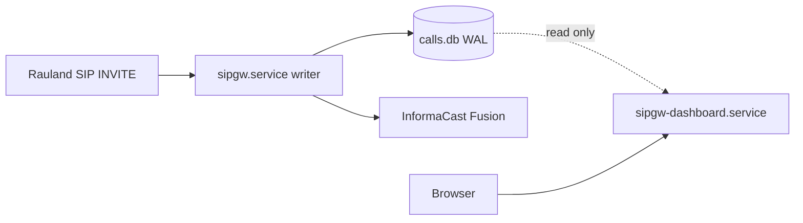
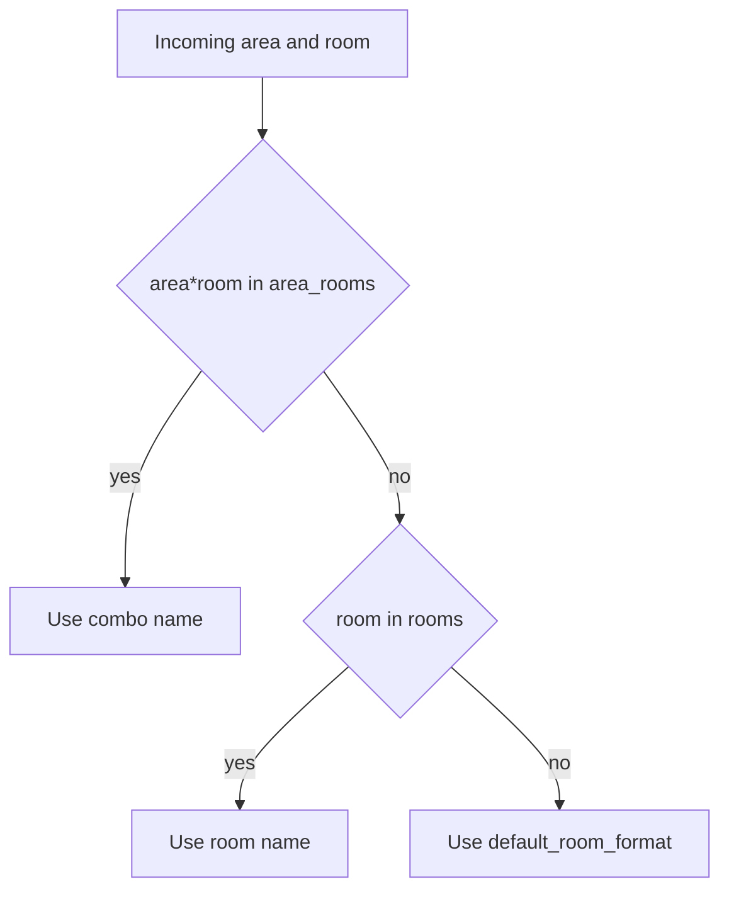

# Installation & Configuration

This section covers everything required to stand up the **RedEye sip2api Gateway**
on a fresh host and configure it for production: prerequisites, the installer and
the two systemd units, the full `config.yaml` key reference, the `lookups.yaml`
area/room/purpose tables (with worked "add a new area/room" examples), the
firewall/port model, and the environment variables that control config paths and
dry-run.

> This documents the **current production build (`c23f3eb`, the v1.7 line on
> `main`)** as deployed on host `sip2apibridge`. Where the code and older docs
> disagree, the code wins — the authoritative key list below was read straight
> from `sipgw/config.py` at this build.

---

## 1. Prerequisites

| Requirement | Production value | Notes |
|---|---|---|
| Operating system | Ubuntu 24.04.4 LTS | Any modern systemd Linux works; the installer targets Debian/Ubuntu (`apt`). |
| Python | 3.12.3 | Installer accepts **>= 3.11**; production runs 3.12. |
| Privileges | root for install | The service itself runs as the unprivileged `sipgw` user. |
| Privileged port | UDP/TCP 5060 | Granted via `CAP_NET_BIND_SERVICE`, not by running as root. |
| Egress | HTTPS 443 to Singlewire | The gateway must reach `api.icmobile.singlewire.com` for OAuth + paging. |
| Python packages | see `requirements.txt` | `httpx`, `fastapi`, `uvicorn[standard]`, `aiosqlite`, `pyyaml`, `jinja2`, `tzdata` (plus `pytest`/`pytest-asyncio` for the test suite). Installed into a venv by `install.sh`. |

The gateway is pure-Python with no compiled extensions; the only OS packages the
installer adds are `python3-venv` and `python3-pip`.

### Production filesystem layout

| Path | Purpose | Owner / mode |
|---|---|---|
| `/opt/sipgw` | Application code + `config.yaml` + `lookups.yaml` | `sipgw`, config `640` |
| `/opt/sipgw/venv` | Python virtual environment | `sipgw` |
| `/var/log/sipgw` | Log files (4 streams, see §4) | `sipgw`, `750` |
| `/var/lib/sipgw` | SQLite DB `calls.db` (WAL mode) | `sipgw`, `750` |
| `/etc/systemd/system/sipgw.service` | Writer unit | root |
| `/etc/systemd/system/sipgw-dashboard.service` | Dashboard unit | root |

---

## 2. Installation

### 2.1 Run the installer

Copy the release tree to `/opt/sipgw`, then run the installer as root:

```bash
sudo bash /opt/sipgw/install.sh
```

`install.sh` is idempotent and performs seven steps:

1. **Python check** — finds `python3.12`/`python3.11`/`python3` and requires >= 3.11.
2. **System deps** — `apt-get install python3-venv python3-pip`.
3. **Service user** — creates the system user `sipgw` (`nologin`, home `/opt/sipgw`).
4. **Directories** — creates `/var/log/sipgw` and `/var/lib/sipgw`, owned by `sipgw`, mode `750`.
5. **Virtualenv** — builds `/opt/sipgw/venv` and `pip install -r requirements.txt`.
6. **Ownership** — chowns the tree to `sipgw`; keeps `install.sh`/`uninstall.sh` root-owned; sets `config.yaml` to `640`, owner `sipgw` (it holds the Fusion secret).
7. **systemd** — installs and `enable`s both units, then `daemon-reload`.

After the installer completes, before first start:

```bash
sudo -u sipgw editor /opt/sipgw/config.yaml     # set the Fusion client_id / client_secret / scenario_id / audience / scenario_field_id
sudo -u sipgw editor /opt/sipgw/lookups.yaml    # confirm area / room mappings
```

### 2.2 The two systemd services

The paging path is deliberately split from the UI so the dashboard can be
restarted (or crash) without ever interrupting paging.



| Unit | Type | Role | Watchdog | Port | Runs |
|---|---|---|---|---|---|
| `sipgw.service` | `notify` | **Writer / life-safety path**: SIP ingress, parse, TTS, durable delivery, heartbeat | `WatchdogSec=30` | 5060 udp+tcp | `python -m sipgw.main /opt/sipgw/config.yaml` |
| `sipgw-dashboard.service` | `simple` | Read-only web UI + `/health` | none | 8080 tcp | `python -m sipgw.dashboard_app /opt/sipgw/config.yaml` |

Key unit facts:

- **Writer (`sipgw.service`)** — `Type=notify` with `WatchdogSec=30`: the app sends
  `READY=1` once listeners are up and pings the watchdog on a cadence; a hung
  event loop is detected and the process restarted. `Restart=always`,
  `RestartSec=5`, and `StartLimitIntervalSec=0` so start-rate limiting can never
  wedge the pager in a failed state. Hardened with `NoNewPrivileges`,
  `ProtectSystem=strict`, `ProtectHome`, `PrivateTmp`, and
  `ReadWritePaths=/var/log/sipgw /var/lib/sipgw /opt/sipgw`. Binds the privileged
  port via `AmbientCapabilities=CAP_NET_BIND_SERVICE` — it does **not** run as root.
- **Dashboard (`sipgw-dashboard.service`)** — plain `Type=simple` long-running HTTP
  server (no watchdog — that stays on the life-safety writer). Opens the DB
  read-only (`query_only`) and reads only the writer's heartbeat row for
  `/health`. Bounded by `MemoryMax=256M` and `CPUQuota=50%` so a runaway UI
  request can never starve the writer. Binds unprivileged 8080, so no
  `CAP_NET_BIND_SERVICE`.

Both units load the **same** `config.yaml` and set
`SIPGW_CONFIG=/opt/sipgw/config.yaml` and
`SIPGW_LOOKUPS=/opt/sipgw/lookups.yaml` in their environment.

### 2.3 Start, verify, and follow logs

```bash
sudo systemctl start sipgw            # writer FIRST
sudo systemctl start sipgw-dashboard  # then the UI
systemctl status sipgw sipgw-dashboard

journalctl -u sipgw -f                # writer
journalctl -u sipgw-dashboard -f      # dashboard

# Dashboard + health once up:
curl -s http://<host-ip>:8080/health
```

Because the dashboard is independent, `systemctl restart sipgw-dashboard` is safe
at any time and never touches the paging path.

---

## 3. `config.yaml` — full reference

`config.yaml` lives at `/opt/sipgw/config.yaml` (mode `640`, owner `sipgw`, since
it holds the Fusion secret). Both services read it. A seed template ships as
`config.yaml.example`.

**Loader behavior (`config.py`):** resolution order is *explicit path >
`SIPGW_CONFIG` env > `/opt/sipgw/config.yaml`*. A missing file or any missing key
falls back to the built-in default. **Unknown keys and unknown sections are not
fatal** — they are ignored but logged as a non-fatal warning (`unknown key
'…' ignored (typo?)`), so a typo shows up loudly in the startup log instead of
silently doing nothing.

**Fail-fast validation (`validate_config`)** runs at startup. In production
(dry-run off) it **refuses to start** unless the Fusion credentials, `scenario_id`,
`audience`, and a preset `scenario_field_id` are all present, plus a set of range
checks (ports, RTP range, CIDRs, delivery tuning). Other odd-but-survivable
values become warnings.

### 3.1 `sip:` — SIP ingress and dialog handling

```yaml
sip:
  bind_ip: "0.0.0.0"
  bind_port: 5060
  allowed_networks:
    - "172.16.0.0/12"
    - "127.0.0.0/8"
    - "10.0.0.0/8"
  call_timeout_seconds: 600
  immediate_bye: true
  immediate_bye_ack_timeout_seconds: 2.0
  rtp_port_range_start: 10000
  rtp_port_range_end: 20000
```

| Key | Default | Meaning |
|---|---|---|
| `bind_ip` | `0.0.0.0` | Address the SIP listener binds. |
| `bind_port` | `5060` | SIP port (UDP + TCP). Must be 1–65535 (validated). |
| `allowed_networks` | `["172.16.0.0/12"]` | CIDR allowlist for accepted SIP sources. Each entry must be a valid CIDR (validated); an empty list means **every** source is rejected (warned). This is the primary ingress control today — see §5. |
| `call_timeout_seconds` | `600` | Max dialog lifetime before the gateway tears it down. `<=0` warns. |
| `immediate_bye` | `false` (prod sets `true`) | ACK-gated immediate BYE: the gateway answers `200 OK`, keeps the dialog, and sends its BYE only after the caller's ACK — killing the old 481 race. |
| `immediate_bye_ack_timeout_seconds` | `2.0` | Per-call fallback: if the ACK is lost, fire the deferred BYE and free the RTP port after this many seconds so a dropped ACK can never strand a dialog. `<=0` with `immediate_bye` on is warned (the BYE could fire before an ACK arrives). |
| `rtp_port_range_start` | `10000` | Low end of the RTP port pool. |
| `rtp_port_range_end` | `20000` | High end. Must be `> start` (fatal otherwise). |

Production allowlist matches the upstream SIP path: Rauland UAC `172.20.9.170` →
proxy `172.20.9.176` → gateway `10.249.0.60`.

### 3.2 `fusion:` — InformaCast Fusion webhook (secrets live here)

```yaml
fusion:
  base_url: "https://api.icmobile.singlewire.com/api"
  token_url: "https://api.icmobile.singlewire.com/api/token"
  audience: "<PROVIDER_ID>"
  scenario_id: "<SCENARIO_ID>"
  scenario_endpoint: "/v1/scenario-notifications"
  variable_name: "customTTS"
  scenario_field_id: "<FIELD_ID>"
  client_id: "<CLIENT_ID>"
  client_secret: "<CLIENT_SECRET>"
  token_refresh_margin_seconds: 300
  dry_run: false
```

| Key | Default | Meaning |
|---|---|---|
| `base_url` | `https://api.icmobile.singlewire.com/api` | Fusion API base. Must be an http(s) URL (fatal otherwise). |
| `token_url` | `…/api/token` | OAuth2 token endpoint. Must be http(s) (fatal otherwise). |
| `audience` | `""` | Fusion provider/audience ID. **Required in production.** Customer-owned; may be shown. |
| `scenario_id` | `""` | The "SIPtoTTSBridge" scenario ID. **Required in production.** |
| `scenario_endpoint` | `/v1/scenario-notifications` | Scenario-trigger path appended to `base_url`. |
| `variable_name` | `customTTS` | The scenario field variable the TTS string is written into. |
| `scenario_field_id` | `""` | Resolved field ID for `variable_name`. **Required (preset) in production** so the first real page never triggers a live field-id lookup. |
| `client_id` | `""` | OAuth2 client id. **Required in production. Mask as `<CLIENT_ID>` — never print the value.** |
| `client_secret` | `""` | OAuth2 client secret. **Required in production. Mask as `<CLIENT_SECRET>` — never print.** |
| `token_refresh_margin_seconds` | `300` | Refresh the OAuth token this many seconds before expiry so a page never blocks on a token round-trip (background refresh). |
| `dry_run` | `false` | When true (or env `SIPGW_DRY_RUN=1`), the HTTP client is built with the no-send guard so no notification can reach a real host. See §6. |

> **Secret handling:** set `client_id`, `client_secret`, `scenario_id`, `audience`,
> and `scenario_field_id` on the host only. The file is `640`/`sipgw`-owned. In
> docs, screenshots, and support bundles the credential values must appear only as
> `<CLIENT_ID>` / `<CLIENT_SECRET>`.

### 3.3 `tts:` — spoken-message shaping

```yaml
tts:
  play_count: 3
  message_preamble: "Attention! Attention! "
  iteration_preamble: ""
```

| Key | Default | Meaning |
|---|---|---|
| `play_count` | `3` | How many times the page repeats. |
| `message_preamble` | `"Attention! "` | Text prepended to the first spoken iteration. |
| `iteration_preamble` | `"Attention! "` | Text prepended to each subsequent iteration. |

### 3.4 `delivery:` — durable-outbox retry worker

```yaml
delivery:
  max_attempts: 6
  base_backoff_seconds: 2.0
  max_backoff_seconds: 60.0
  max_age_seconds: 900.0
  poll_interval_seconds: 1.0
  batch_size: 20
```

| Key | Default | Meaning |
|---|---|---|
| `max_attempts` | `6` | Delivery attempts before a page is marked `failed` and escalated. Must be >= 1 (fatal otherwise). |
| `base_backoff_seconds` | `2.0` | Initial retry backoff. |
| `max_backoff_seconds` | `60.0` | Backoff ceiling. |
| `max_age_seconds` | `900.0` | An undelivered page older than this is marked `expired` and escalated. `<=0` warns. |
| `poll_interval_seconds` | `1.0` | Worker poll cadence. Must be > 0 (fatal otherwise). |
| `batch_size` | `20` | Rows claimed per poll. |

This outbox + retry loop is what prevents the 2026-06-12 lost-Code-Blue failure
mode (a transient timeout during an inline OAuth fetch): the call is durably
recorded first, then delivered with bounded retries, with the token refreshed off
the critical path.

### 3.5 `escalation:` — human alert channel on permanent failure

```yaml
escalation:
  webhook_url: ""
  timeout_seconds: 10.0
```

| Key | Default | Meaning |
|---|---|---|
| `webhook_url` | `""` | Teams/Slack/PagerDuty/NOC webhook fired when a page is `failed` or `expired`. Empty disables escalation (failures still logged at ERROR). Must be http(s) if set (fatal otherwise). In production, an empty value is **warned**. |
| `timeout_seconds` | `10.0` | HTTP timeout for the escalation POST. |

### 3.6 `health:` — heartbeat, Fusion reachability, inbound liveness

```yaml
health:
  heartbeat_interval_seconds: 10.0
  stale_after_seconds: 30.0
  keepalive_interval_seconds: 300.0
  fail_on_fusion_unreachable: false
  fusion_unreachable_max_age_seconds: 0.0
  inbound_flush_interval_seconds: 30.0
  inbound_stale_after_seconds: 432000.0
  inbound_escalate_after_seconds: 0.0
  path: "/var/lib/sipgw/calls.db"
```

| Key | Default | Meaning |
|---|---|---|
| `heartbeat_interval_seconds` | `10.0` | Writer stamps a heartbeat this often; the dashboard reads it. |
| `stale_after_seconds` | `30.0` | `/health` returns 503 once the heartbeat is older than this (the single liveness authority). |
| `keepalive_interval_seconds` | `300.0` | Cadence of the read-only Fusion **reachability** probe (a bounded scenario GET — never a page). `< 30s` warns (may hammer Fusion). |
| `fail_on_fusion_unreachable` | `false` | Opt-in: when true, a *present + fresh* failed probe makes `/health` return 503 `fusion-unreachable`. Default off — a Fusion blip stays informational only. Keep false with a single node behind an LB/monitor. |
| `fusion_unreachable_max_age_seconds` | `0.0` | Freshness bound for the degrade above. `0.0` = auto-derive from probe cadence. |
| `inbound_flush_interval_seconds` | `30.0` | How often the writer flushes the last-inbound-SIP time to the DB. |
| `inbound_stale_after_seconds` | `432000.0` (5 days) | Dashboard shows "last inbound from Rauland" amber past this. Informational — never gates `/health`. |
| `inbound_escalate_after_seconds` | `0.0` (OFF) | Opt-in once-per-episode silence alert via the escalation webhook. If enabled, keep it above the observed ~4.27-day max quiet gap (recommend >= 432000); a lower value warns. |
| `path` | `/var/lib/sipgw/calls.db` | DB path used by the health/heartbeat reads (mirrors `database.path`). |

### 3.7 `dedupe:` — clinical duplicate suppression

> **IMPORTANT — what this build actually does.** At `c23f3eb` the dedupe feature
> ships **SHADOW / DISABLED and safe-by-default**. `enforce: true` is a **fatal
> config error** — the writer refuses to start with it on — because suppressing a
> page is dropping a Code Blue, and enforcement is not yet clinically approved in
> code. Only the two keys below are consumed at this build; `match_bed` and
> `match_purpose` exist as dataclass fields (defaults `true`) but do not enable
> enforcement.

```yaml
dedupe:
  enforce: false        # true = FATAL at this build (refuses to start)
  window_seconds: 0     # 0 = shadow lookup never runs; >0 = shadow telemetry only
  match_bed: true        # field present; not an enforcement switch at this build
  match_purpose: true    # field present; not an enforcement switch at this build
```

| Key | Default | Meaning |
|---|---|---|
| `enforce` | `false` | `false` = never suppresses. **`true` is fatal at this build.** |
| `window_seconds` | `0` | `0` = the duplicate lookup never runs. `>0` with `enforce:false` is **shadow-only telemetry**: each clinical duplicate is logged (`WOULD suppress … gap=…`) and annotated (`duplicate_of`) to measure the real duplicate rate — but **every page is still delivered**. |
| `match_bed` | `true` | Match key includes bed (field present; consumed once enforcement ships). |
| `match_purpose` | `true` | Match key includes call purpose (field present; consumed once enforcement ships). |

**Recommended production setting:** leave `enforce: false`. To *measure* the
Rauland double-emit rate without ever suppressing, set `window_seconds: 60` — this
turns on the shadow "WOULD suppress" telemetry only. Enforcing suppression
(collapsing the two INVITEs Rauland emits per event) is on the roadmap and
requires both clinical sign-off and the code change that lifts the fatal guard;
until then it is documented as planned, not deployed.

### 3.8 `logging:`

```yaml
logging:
  log_dir: "/var/log/sipgw"
  retention_days: 90
  rotation_time: "midnight"
  timezone: ""
  api_debug_log: true
  sip_debug_log: true
```

| Key | Default | Meaning |
|---|---|---|
| `log_dir` | `/var/log/sipgw` | Directory for the log streams. |
| `retention_days` | `90` | Rotated-log retention. |
| `rotation_time` | `midnight` | Daily rotation boundary. |
| `timezone` | `""` | Display/day-boundary zone; `""` reads the host local tz. **Note:** the production host clock is `Etc/UTC`, so stored timestamps are UTC RFC3339 regardless — setting `America/New_York` here affects dashboard display/day-bucketing, not the stored timestamp value. |
| `api_debug_log` | `true` | Enable the API debug stream. |
| `sip_debug_log` | `true` | Enable the SIP debug stream. |

The writer owns four rotating streams in `log_dir`: `sipgw.log`,
`sipgw_api_debug.log`, `sipgw_sip_debug.log`. The dashboard writes its own
`sipgw_dashboard.log` (never the writer's files), for four streams total, 90-day
retention.

### 3.9 `dashboard:`

```yaml
dashboard:
  port: 8080
  bind_ip: "0.0.0.0"
  auto_refresh_seconds: 30
  page_size: 20
```

| Key | Default | Meaning |
|---|---|---|
| `port` | `8080` | Dashboard HTTP port. Must be 1–65535 (fatal otherwise). |
| `bind_ip` | `0.0.0.0` | Address the dashboard binds. |
| `auto_refresh_seconds` | `30` | Client-side auto-refresh interval. |
| `page_size` | `20` | Call-table rows per page. |

> **Security note:** the dashboard has **no authentication** ("No authentication
> required" — `dashboard.py`). Restrict access at the network layer (see §5).

### 3.10 `database:`

```yaml
database:
  path: "/var/lib/sipgw/calls.db"
```

| Key | Default | Meaning |
|---|---|---|
| `path` | `/var/lib/sipgw/calls.db` | SQLite DB (WAL mode). Required (fatal if empty). The writer opens it read-write; the dashboard opens it read-only. In dry-run, a hard barrier refuses to start if this resolves to the production DB (see §6). |

---

## 4. `lookups.yaml` — area / purpose / room tables

`lookups.yaml` (seed: `lookups.yaml.example`) maps the numeric IDs Rauland sends
into speech-ready names. It is **hot-reloaded**: `lookups.py` tracks the file's
mtime and reloads on change with **no service restart** — edits go live on the
next call. A malformed edit is caught and the previous good tables keep serving.

Resolution order for the path: *explicit > `SIPGW_LOOKUPS` env >
`/opt/sipgw/lookups.yaml`*.

### 4.1 The four tables

| Section | Shape | Purpose |
|---|---|---|
| `areas` | `area_id: "Spoken name"` | Area ID → speech-ready area name. Phonetic spelling and `...` pauses are intentional for TTS clarity. |
| `call_purposes` | `substring: "Spoken purpose"` | Substring searched in the SIP display name; **first match wins**. |
| `rooms` | `room: "Spoken name"` | Room-only fallback (empty `{}` in production). |
| `area_rooms` | `"area*room": "Spoken name"` | Area+room combo override — highest priority; disambiguates the same room number across areas. |

Plus the defaults: `default_area` (`"Unknown Area."`), `default_purpose`
(`"Code Blue"` in production — deliberately the most critical, fail-safe),
`default_room_format` (`"Room {room}."`, `{room}` is the numeric placeholder).

**Room-name resolution priority** (`get_room_name`):

1. `area_rooms["area*room"]` combo override, else
2. `rooms[room]`, else
3. `default_room_format`.



### 4.2 Worked example — add a new area

Say a new unit "4th Floor Oncology" is assigned area ID `740`. Add one line under
`areas:`:

```yaml
areas:
  # …existing entries…
  740: "4th Floor... Oncology..."
```

Use `...` between phrases where you want the TTS voice to pause, and phonetic
spellings where the raw text mis-speaks (e.g. `720: "1st Floor... Pack you..."`
for PACU). Save the file — the next page for area `740` speaks the new name; no
restart needed.

### 4.3 Worked example — add a new room (combo override)

Room `2250` already exists as "Echo 2" under area `797`. Suppose area `740` also
has a room `2250` that must be spoken differently. Add a combo override — it wins
over any `rooms` entry:

```yaml
area_rooms:
  # …existing entries…
  "740*2250": "Oncology Infusion Bay 2"
```

If instead a room number should map the same way regardless of area, put it in the
room-only table:

```yaml
rooms:
  "2250": "Echo Bay"
```

Remember the code appends a trailing `"."` to `rooms`/`area_rooms` values (so
write `"Oncology Infusion Bay 2"`, not `"Oncology Infusion Bay 2."`), whereas
`default_room_format` supplies its own punctuation.

### 4.4 Verifying lookups

Two ways to confirm an edit took effect:

- **Dashboard** — the dashboard exposes `/api/verify-lookups` (surfaced in the UI's
  verify-lookups panel). Because lookups hot-reload, it reflects the current file.
- **Logs** — on each load, `sipgw.log` records a line like
  `Loaded 35 area, 3 purpose, 0 room, and 273 area+room mappings from
  /opt/sipgw/lookups.yaml`; a change on disk logs `lookups.yaml changed on disk,
  reloading...`. Compare the counts against what you expect after the edit.

After a non-trivial edit, send one test event (or a dry-run drill — see §6) and
confirm the spoken area/room/purpose match, since a wrong mapping speaks a wrong
location on a live Code Blue.

---

## 5. Firewall, ports, and network exposure

### 5.1 Port table

| Direction | Proto / Port | Peer | Purpose |
|---|---|---|---|
| Inbound | UDP **5060** | SIP allowlist (Rauland path) | SIP INVITE ingress |
| Inbound | TCP **5060** | SIP allowlist | SIP over TCP |
| Inbound | UDP 10000–20000 | RTP peers | RTP media (config `rtp_port_range_*`) |
| Inbound | TCP **8080** | Ops / admin subnet only | Dashboard + `/health` (**no auth**) |
| Outbound | TCP **443** | `api.icmobile.singlewire.com` | Fusion OAuth token + scenario trigger |

Production host `sip2apibridge` = `10.249.0.60` (ens34). App-level SIP allowlist:
`172.16.0.0/12`, `127.0.0.0/8`, `10.0.0.0/8`.

### 5.2 No host firewall today — recommendation

> **Current state:** the host has **no active firewall** (nftables ruleset is
> empty). Ingress protection relies entirely on the app-level SIP allowlist
> (`sip.allowed_networks`), and the dashboard on :8080 has **no authentication**.

Recommended hardening (add an nftables ruleset):

- Allow **5060 udp+tcp** only from the SIP allowlist sources.
- Allow **8080 tcp** only from the ops/admin management subnet — this is the sole
  guard on the unauthenticated dashboard.
- Allow the RTP range (10000–20000/udp) from expected media peers.
- Allow egress **443** to Singlewire.
- Default-drop everything else inbound.

Example skeleton (adapt the source prefixes to your environment):

```nft
table inet sipgw {
  chain input {
    type filter hook input priority 0; policy drop;
    ct state established,related accept
    iif "lo" accept
    ip saddr { 172.16.0.0/12, 10.0.0.0/8, 127.0.0.0/8 } udp dport 5060 accept
    ip saddr { 172.16.0.0/12, 10.0.0.0/8, 127.0.0.0/8 } tcp dport 5060 accept
    ip saddr { 172.16.0.0/12, 10.0.0.0/8 } udp dport 10000-20000 accept
    ip saddr <MGMT_SUBNET> tcp dport 8080 accept
  }
}
```

Keep the app allowlist as defense-in-depth even after adding nftables.

---

## 6. Environment variables

| Variable | Set by | Effect |
|---|---|---|
| `SIPGW_CONFIG` | both units (`/opt/sipgw/config.yaml`) | Config path when no explicit path is passed. Resolution: explicit arg > `SIPGW_CONFIG` > default. |
| `SIPGW_LOOKUPS` | both units (`/opt/sipgw/lookups.yaml`) | Lookups path. Resolution: explicit > `SIPGW_LOOKUPS` > default. |
| `SIPGW_DRY_RUN` | operator (unset in prod) | `=1` forces **dry-run**: the HTTP client is wrapped in the no-send guard so **no** outbound notification can reach a real host (only `127.0.0.1` is forwarded, for local mock drills). |

**Dry-run semantics (`safety.py`) — important safety properties:**

- Effective dry-run = `config.fusion.dry_run` **OR** `SIPGW_DRY_RUN=1`. The env var
  can only **enable** dry-run, never disable it — there is no code path that lets
  an env value force real sending when the config has it on.
- In dry-run every log line is prefixed `[TEST]` across all streams, and test
  traffic is marked `is_test` — it never fires a real page and never counts in
  stats.
- **Production-DB barrier:** in dry-run/test the writer **refuses to start** if
  `database.path` resolves to the production DB (`/var/lib/sipgw/calls.db`). Staging
  runs must point `database.path` at a staging-only file, so no test artifact can
  ever land in the production DB.

Use dry-run for install validation and mapping drills:

```bash
sudo -u sipgw SIPGW_DRY_RUN=1 \
  /opt/sipgw/venv/bin/python -m sipgw.main /opt/sipgw/staging-config.yaml
```

(Point the staging config's `database.path` away from the production DB, or the
barrier will abort startup by design.)
