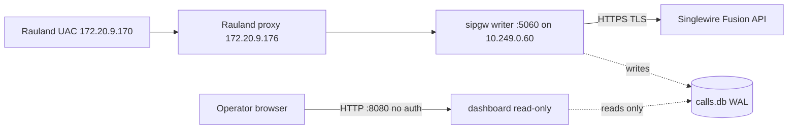

# Security & Hardening

This section documents the security posture of the **RedEye sip2api Gateway** as
deployed in the current production build (`c23f3eb`, the v1.7 line) on host
`sip2apibridge`. It is written for BOTH the Tift Regional IT/telecom team and
RedEye support: it states plainly what is protected today, what is **not** yet
protected, and gives concrete hardening recommendations. Nothing is withheld.

Because this gateway sits on the **life-safety paging path** (Rauland nurse-call
SIP INVITE → InformaCast Fusion Code Blue / RRT overhead page), the security
model deliberately favors *availability* over lockdown: a control that could
silently drop or delay a page is treated as a hazard, not a feature. Several
choices below (no start-rate limiting, informational-only health degrade, wide
SIP allowlist) follow directly from that priority.

---

## 1. Security posture at a glance

| Control | Status today | Where enforced |
|---|---|---|
| Credential masking in logs (client_id **and** client_secret, bearer tokens, access_token) | **Enforced** | `webhook.py` `_log_request()` |
| SIP source-IP allowlist | **Enforced** (application layer) | `sip_server.py` `_is_allowed()` |
| systemd sandboxing on **both** units | **Enforced** | `sipgw.service`, `sipgw-dashboard.service` |
| Egress TLS to Singlewire Fusion | **Enforced** (HTTPS) | `fusion.base_url` / `token_url` |
| Background OAuth token refresh (token off the critical path) | **Enforced** | `webhook.py` refresh loop |
| Dry-run / test-mode no-send guarantee | **Enforced** (structural) | `safety.py` `NoSendGuardTransport` |
| Config file permissions (`0640`), data/log dirs (`0750`) | **Enforced** at install | `install.sh` |
| **Host firewall (nftables) on :5060 / :8080** | **NOT PRESENT** — flagged below | — |
| **Dashboard authentication on :8080** | **NONE** — flagged below | — |
| **Coordinated OS auto-restart of the paging service** | **NOT enforced** — lesson #20 | — |

The three highlighted rows are the open gaps. They are addressed in
[§8 Known gaps & hardening recommendations](#8-known-gaps--hardening-recommendations).

---

## 2. Trust boundaries



Three boundaries matter:

1. **Ingress (Rauland → :5060).** Untrusted at the packet level (UDP/TCP 5060 is
   bound on `0.0.0.0`). The only gate today is the **application allowlist**
   (§3). There is **no host firewall** in front of it.
2. **Egress (gateway → Fusion).** Outbound HTTPS to
   `https://api.icmobile.singlewire.com/api`. TLS-protected; OAuth2
   client-credentials. Secrets never leave the host in cleartext and are masked
   in logs (§4).
3. **Management (operator → :8080).** The dashboard is a **read-only,
   unauthenticated** web UI. Anyone who can reach TCP 8080 on `10.249.0.60` can
   view call history, room/area, and diagnostic bundles (§6, §7).

---

## 3. Network ingress: SIP source-IP allowlist

The writer (`sipgw.service`) binds SIP on `0.0.0.0:5060` (UDP + TCP) and gates
every inbound message by **source IP** against `sip.allowed_networks`.

Current production allowlist (`config.yaml`):

```yaml
sip:
  bind_ip: "0.0.0.0"
  bind_port: 5060
  allowed_networks:
    - "172.16.0.0/12"   # Rauland / hospital RFC1918 range (UAC + proxy live here)
    - "127.0.0.0/8"     # loopback (local drills / mock server)
    - "10.0.0.0/8"      # gateway's own subnet (10.249.0.60) and adjacent infra
```

Enforcement (`sip_server.py`):

```python
def _is_allowed(self, addr: str) -> bool:
    try:
        ip = ip_address(addr)
        return any(ip in net for net in self.allowed_networks)
    except ValueError:
        return False
```

A message from a non-allowlisted source is answered `403 Forbidden` and dropped
before any parse, TTS, dedupe, or delivery work is done. Importantly, the
**inbound-liveness timestamp is stamped only AFTER the allowlist check**, so
stray or hostile traffic on :5060 cannot mask a real Rauland-side outage in the
`/health` liveness signal.

**Posture note — this is application-layer, not packet-layer.** The allowlist
runs inside the Python process; a packet still reaches the socket and the app
before it is rejected. The allowlist is also **wide** (three large RFC1918
blocks) because the Rauland call path spans multiple hospital subnets and must
never be accidentally excluded. It is *not* a substitute for a firewall — see
§8. Tightening the allowlist to just the Rauland UAC/proxy hosts
(`172.20.9.170`, `172.20.9.176`) plus loopback and the gateway subnet is a
reasonable defense-in-depth step, but must be coordinated with telecom so no
legitimate call source is dropped.

---

## 4. Credential handling & log masking

### 4.1 Secrets at rest

The Fusion OAuth2 client credentials (`fusion.client_id`, `fusion.client_secret`)
live only in `/opt/sipgw/config.yaml`. That file is installed mode **`0640`**,
owned by the `sipgw` service account — readable by the service, not
world-readable. The data and log directories are **`0750`**.

```bash
# install.sh
chmod 640 "$INSTALL_DIR/config.yaml"
chmod 750 "$LOG_DIR" "$DATA_DIR"
```

> **Operational rule:** never widen `config.yaml` to world-readable, and never
> commit a filled-in `config.yaml` to source control. The repository ships
> `config.yaml.example` with placeholders (`YOUR_CLIENT_ID`,
> `YOUR_CLIENT_SECRET`) only.

### 4.2 Secrets in logs — masking is enforced

The four log streams (`sipgw.log`, `sipgw_api_debug.log`, `sipgw_sip_debug.log`,
`sipgw_dashboard.log`) capture full request/response traces for
troubleshooting. `webhook.py` `_log_request()` masks every credential-bearing
field **by default** (`mask_secrets=True`):

- **`Authorization: Bearer …`** request header → truncated to the first 27
  characters + `...`.
- **`client_secret=…`** in the form-encoded token request body → replaced with
  `***`.
- **`client_id=…`** in the token request body → replaced with `***`. *(This
  client_id masking was added in the v1.7 line; previously the client_id VALUE
  could appear in `sipgw_api_debug.log`.)*
- **`access_token`** in JSON token responses → truncated to the first 20
  characters + `...`.

```python
body_text = re.sub(r"(client_secret=)([^&]+)", _mask, body_text)
body_text = re.sub(r"(client_id=)([^&]+)",     _mask, body_text)
```

Net effect: neither the client_id value nor the client_secret value nor a full
bearer/access token is ever written to disk in the shipped configuration.

### 4.3 OAuth token off the critical path

A **background refresh loop** (`webhook.py`) renews the Fusion OAuth token
~`token_refresh_margin_seconds` (default 300s) before expiry, guarded by an
`asyncio.Lock`. This is both a reliability and a security property: the token is
never fetched *inline* during a Code Blue page (which is exactly what caused the
2026-06-12 lost page), and the token is cached in memory only, never persisted.
Egress to the token endpoint and the scenario endpoint is HTTPS/TLS.

---

## 5. Host & service sandboxing (systemd)

Both units run as the unprivileged `sipgw` user/group and carry matching
sandbox directives. This is the primary OS-level containment today.

| Directive | `sipgw.service` (writer) | `sipgw-dashboard.service` (UI) | Effect |
|---|---|---|---|
| `User` / `Group` | `sipgw` / `sipgw` | `sipgw` / `sipgw` | No root. |
| `NoNewPrivileges` | `true` | `true` | No setuid escalation. |
| `ProtectSystem` | `strict` | `strict` | Whole FS read-only except allowlisted paths. |
| `ReadWritePaths` | `/var/log/sipgw /var/lib/sipgw /opt/sipgw` | `/var/lib/sipgw /var/log/sipgw` | Only its own data/log dirs are writable. |
| `ProtectHome` | `true` | `true` | `/home`, `/root` hidden. |
| `PrivateTmp` | `true` | `true` | Private `/tmp`. |
| Capabilities | `CAP_NET_BIND_SERVICE` (ambient + bounding) | *none* | Writer may bind privileged :5060; dashboard binds unprivileged :8080 and holds no caps. |
| `MemoryMax` / `CPUQuota` | — | `256M` / `50%` | Dashboard cannot starve the life-safety writer. |
| `LimitNOFILE` | `65535` | `65535` | FD headroom. |

Design intent worth noting:

- The writer holds **exactly one** capability (`CAP_NET_BIND_SERVICE`) and no
  more — the capability bounding set is pinned to it.
- The dashboard holds **no** capabilities and is boxed by a memory/CPU cgroup so
  a runaway UI request cannot degrade paging. (These cgroup limits are enforced
  only under real systemd with the relevant controllers; they are inert in
  containers/CI.)
- `StartLimitIntervalSec=0` on both units: start-rate limiting is deliberately
  disabled so systemd can **never** wedge the life-safety pager in the `failed`
  state after repeated restarts. This is an availability choice, called out here
  because it interacts with the OS-patching lesson in §8.

---

## 6. The dashboard: read-only, but unauthenticated

`sipgw-dashboard.service` runs `dashboard_app.py` on `:8080` (bound `0.0.0.0`).
Its integrity story is strong; its confidentiality/access story is the main gap.

**What protects it:**

- It opens `calls.db` **read-only** (`query_only=ON` after connect) and only
  *reads* the writer's heartbeat row. It cannot write call state, cannot fire a
  page, and cannot corrupt the outbox. Restarting or crashing the dashboard has
  **zero** effect on paging — the two services are fully decoupled.
- It is memory/CPU-capped (§5) and holds no capabilities.

**What does NOT protect it:**

- **There is no authentication and no authorization on `:8080`.** Any host that
  can reach TCP 8080 on `10.249.0.60` can browse the full call table, the 90-day
  charts, the `/call/{id}` correlated detail view, the date-picker log viewer,
  and can export **per-call plain-text diagnostic bundles**. Those bundles and
  views include room/area/bed and TTS message text (§7).

> **Stated assumption (documented, not assumed-safe):** the current design
> assumes `:8080` is reachable **only** from a trusted management network/VLAN.
> That assumption is **not currently enforced by any control on the host** —
> there is no firewall (§8) and no app auth. Treat network reachability to
> `:8080` as equivalent to full read access to call history.

Recommendation: restrict `:8080` at the network layer (management VLAN /
firewall rule, see §8) and/or place an authenticating reverse proxy in front of
the dashboard. Until then, do not route `:8080` onto any general-access subnet.

---

## 7. Data sensitivity: PHI-adjacency

The gateway does not store patient names or MRNs, but the data it *does* handle
is **PHI-adjacent** and should be treated as sensitive under the hospital's HIPAA
posture:

- **Room / area / bed** identifiers parsed from the SIP INVITE (and resolved via
  `lookups.yaml`).
- **TTS message text** (`customTTS`) — e.g. "Code Blue, ICU room 4" — which is
  what gets announced overhead and is stored/displayed for correlation.
- These appear in `calls.db`, in the log streams, in the dashboard detail views,
  and in exported diagnostic bundles.

Handling controls in force:

- Data at rest is under `/var/lib/sipgw` (`0750`) and `/var/log/sipgw`
  (`0750`), owned by `sipgw`.
- **90-day retention** with async rotation (#6) bounds how long room/TTS data
  persists.
- Diagnostic bundles are plain text — when shared with RedEye support, treat
  them as PHI-adjacent: transfer over an encrypted channel and delete local
  copies after use.
- The `/call/{id}` and log views are gated only by network reachability to
  `:8080` (§6) — which is exactly why restricting that port matters here.

---

## 8. Known gaps & hardening recommendations

These are the deployed build's real weaknesses. Fixing the first two is the
highest-value security work available today.

### 8.1 No host firewall (HIGH) — add nftables for :5060 and :8080

Per the 2026-07-07 host inventory, `sip2apibridge` runs with **empty nftables
(no active host firewall)**. All ingress protection currently rests on the
application allowlist (§3, which only covers :5060) and on the *assumption* that
:8080 is on a trusted network (§6, unenforced).

**Recommendation:** add an nftables ruleset that:

- Permits **UDP/TCP 5060** only from the Rauland source ranges (ideally the
  UAC/proxy hosts `172.20.9.170` / `172.20.9.176`, or the `172.16.0.0/12` block
  if per-host is too brittle) plus loopback.
- Permits **TCP 8080** only from the designated management VLAN / jump host.
- Permits established/related and drops everything else inbound by default.

This gives packet-layer defense in depth **in front of** the app allowlist and,
critically, provides the *only* access control the dashboard would otherwise
have. Stage and test any ruleset against a live drill before enabling — a
mis-scoped rule that blocks Rauland would silently break paging.

### 8.2 Dashboard has no auth (HIGH) — restrict the network path

See §6. Until authentication exists in the product, keep `:8080` on a management
network and firewall it (§8.1). Do not expose it broadly.

### 8.3 Uncoordinated OS auto-restart of the paging service (HIGH) — lesson #20

On **2026-07-07**, an **unattended-upgrades / needrestart auto-restart** bounced
`sipgw.service` *uncoordinated* (issue **#20**). Because the gateway is currently
a **single paging node**, an OS-driven restart at the wrong moment is a direct
availability risk to Code Blue delivery — the OS took a life-safety action with
no operational coordination.

**Recommendations:**

- **Coordinate or disable unattended restarts of `sipgw.service`.** On Ubuntu
  24.04, prevent `needrestart` from auto-restarting the paging unit and schedule
  any required restart into a maintenance window with clinical/telecom
  awareness. Keep security patching, but take the *service restart* decision out
  of the OS's hands for this unit.
- Treat any restart of the writer as a paging outage window, however brief. The
  durable outbox (WAL) means an in-flight call survives a clean restart, but an
  INVITE arriving during the socket-down instant is not yet protected.
- **Durable fix — issue #19 (planned, roadmap):** zero-downtime writer restarts
  via **systemd socket activation**, so the SIP socket stays up across a writer
  restart and no inbound INVITE is dropped during a bounce. This is the
  structural remedy for #20 and is tracked as roadmap, not shipped.

### 8.4 Wide SIP allowlist (MEDIUM)

The `172.16.0.0/12` + `10.0.0.0/8` allowlist is broad (§3). Once §8.1 provides a
firewall, consider narrowing the app allowlist toward the specific Rauland hosts
for defense in depth. Change only with telecom sign-off.

---

## 9. Safe-by-default: dry-run / test mode never pages

`safety.py` provides a **structural** no-send guarantee for development,
staging, and drills — it is not discipline at each call site, it is enforced at
the transport layer so it cannot be bypassed by forgetting a flag.

- **Effective dry-run** = config `dry_run: true` **OR** env `SIPGW_DRY_RUN=1`.
  The environment can only *enable* dry-run; there is deliberately **no** code
  path by which any env value forces real sending. (`effective_dry_run()`.)
- In dry-run the shared httpx client is built with **`NoSendGuardTransport`**,
  which refuses any request whose host is not `127.0.0.1`: it records the
  attempt and returns a synthetic response instead of touching the network.
  Because every Fusion origin (token fetch, field resolve, scenario trigger,
  the Fusion reachability keepalive) **and** the escalation webhook share this
  one client, none of them can reach a real host in dry-run.

```python
ALLOWED_HOSTS = frozenset({"127.0.0.1"})  # the ONLY host that may receive traffic in dry-run
```

- **Production-DB barrier** (`assert_safe_database_path`): if dry-run/test is
  active and `database.path` resolves to the production DB
  (`/var/lib/sipgw/calls.db`), startup **aborts** (`ProdDatabaseBarrier`). Test
  runs must point at a staging DB — no test artifact can land in production.
- **`[TEST]` log marker** (`TestMarkerFilter`): while dry-run/test is active,
  every log line across all three writer streams is prefixed `[TEST] `,
  including every physical line of multi-line SIP/API dumps, so no test line is
  ever mistaken for a real page.
- **`is_test` marking:** test traffic marked `is_test` **never fires a real
  page, never counts in stats, and is hidden from the dashboard** — test drills
  cannot pollute clinical metrics.

Security relevance: this is what lets RedEye and Tift run realistic paging drills
and staging tests *safely* — a misconfigured test cannot emit a real overhead
page, cannot hit the escalation channel, and cannot write to the production
database.

---

## 10. Operator security checklist

- [ ] `config.yaml` is mode `0640`, owned by `sipgw`; never world-readable, never
      committed with real secrets.
- [ ] Confirm log masking is active (grep the api-debug log for `client_secret`
      / `client_id` values — you should see `***`, and never a real token).
- [ ] **Add nftables** restricting :5060 to Rauland sources and :8080 to the
      management VLAN (§8.1).
- [ ] Keep `:8080` off any general-access subnet until authentication exists
      (§6, §8.2).
- [ ] **Disable/coordinate unattended-upgrades restarts of `sipgw.service`**;
      restart only in a maintenance window (§8.3, #20).
- [ ] Treat exported diagnostic bundles and dashboard views as PHI-adjacent;
      transfer encrypted, delete after use (§7).
- [ ] Verify both units still run as `sipgw` with `NoNewPrivileges` and
      `ProtectSystem=strict` after any change (§5).
- [ ] For any staging/drill, confirm `SIPGW_DRY_RUN=1` (or config `dry_run`) and
      a **staging** `database.path` before starting (§9).
