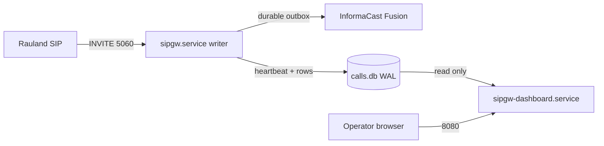

# Operations Runbook

> **Scope.** Day-2 operations for the deployed production build (`c23f3eb`, the
> v1.7 line) on host **`sip2apibridge`** (Ubuntu 24.04.4, Python 3.12.3). This
> section is command-level: how to start, stop, restart, upgrade, reconfigure,
> and read the running system, and how to drive **Dashboard v2**. Everything
> here documents what is deployed **today**. Planned features (zero-downtime
> restarts, HA) live only in the Reliability / Roadmap sections and are labeled
> planned there.

---

## 1. The two-service model — the one fact that governs every restart

The gateway runs as **two independent systemd units**. Understanding which one
you are touching is the single most important operational rule, because they
have very different blast radii.

| Unit | Role | Type / watchdog | Port(s) | Restart impact on paging |
| --- | --- | --- | --- | --- |
| `sipgw.service` | **The call path** — SIP ingress, parse, TTS, durable delivery, heartbeat | `Type=notify`, `WatchdogSec=30` | 5060 udp+tcp | **Interrupts paging** for the restart window (~0.3 s SIP blip). **Coordinate.** |
| `sipgw-dashboard.service` | **Read-only web UI + `/health`** | `Type=simple` (no watchdog) | 8080 tcp | **None.** Paging continues uninterrupted. |



**Why this split matters (issue #14).** The dashboard opens the shared SQLite
database **read-only** (`query_only=ON`) and only *reads* the writer's
heartbeat. It never writes a page and never touches the SIP path. That means:

- You can **restart, upgrade, or debug the dashboard freely** — during a busy
  shift, mid-incident, anytime — **without any paging outage.**
- A restart of **`sipgw.service`** briefly drops the SIP listeners. Rauland only
  sends SIP on a real Code Blue / RRT event, so the practical risk is small, but
  the rule stands: **treat every `sipgw.service` restart as a (very short)
  planned paging outage** and coordinate it (see §5 and the OS-patching lesson
  from issue #20).

> **Golden rule.** *Dashboard down ≠ paging down.* If `/health` or the web UI is
> unreachable but `sipgw.service` is `active (running)`, **paging is still
> working.** Verify the writer before you ever touch it.

---

## 2. Status — check before you act

Always check both units. Do the writer first; it is the life-safety process.

```bash
# One-line status of both units
systemctl status sipgw.service sipgw-dashboard.service --no-pager

# Just the active/failed state, scriptable
systemctl is-active sipgw.service          # -> active
systemctl is-active sipgw-dashboard.service # -> active

# Are they enabled to start on boot? (both should be 'enabled')
systemctl is-enabled sipgw.service sipgw-dashboard.service
```

What a healthy writer looks like:

```
● sipgw.service - sipgw - SIP-to-Webhook Gateway for Informacast Fusion
     Loaded: loaded (/etc/systemd/system/sipgw.service; enabled; preset: enabled)
     Active: active (running) since ...
   Watchdog: 30s
     Status: "READY=1"            <- sd_notify: listeners are up
```

Two extra signals that the writer is truly *alive* (not just "process exists"):

- **Watchdog.** `Type=notify` + `WatchdogSec=30` means the writer must ping
  systemd from its event loop (every ~15 s). A hung event loop is detected and
  the pager is auto-restarted. `systemctl show sipgw -p WatchdogUSec` shows the
  armed value.
- **`/health` heartbeat.** The writer stamps a heartbeat every ~10 s; the
  dashboard's `/health` returns `503 stale` if it ages past 30 s. This is the
  authoritative external liveness check (see §7.6).

```bash
# Fast end-to-end liveness (writer heartbeat, via the read-only dashboard)
curl -s http://localhost:8080/health | python3 -m json.tool
```

---

## 3. Start / stop / restart — per unit

All commands are `root` / `sudo`. Substitute the unit name deliberately.

### 3.1 The dashboard (safe — no paging impact)

Restart the dashboard any time. This is the whole point of the #14 split.

```bash
sudo systemctl restart sipgw-dashboard.service     # safe, anytime
sudo systemctl stop    sipgw-dashboard.service     # UI + /health go dark; PAGING UNAFFECTED
sudo systemctl start   sipgw-dashboard.service
```

While the dashboard is stopped: the web UI and `/health` are unavailable, so any
**external monitor watching `/health` will alarm** — expected, and it does *not*
mean paging is down. Confirm with `systemctl is-active sipgw.service`.

### 3.2 The writer (coordinate — brief paging interruption)

A writer restart drops the SIP listeners for the restart window (a ~0.3 s SIP
blip in normal operation). Do it as a **coordinated, announced** action.

```bash
sudo systemctl restart sipgw.service               # COORDINATE: brief paging interruption
```

Pre-flight checklist before restarting the writer:

1. **Announce** to clinical/telecom that overhead paging is briefly interrupted.
2. **Check the backlog first** — do not restart on top of undelivered pages if
   avoidable:
   ```bash
   curl -s http://localhost:8080/health | python3 -c \
     "import sys,json; d=json.load(sys.stdin); print('backlog:', d.get('backlog'))"
   ```
   Durable delivery means an in-flight page **survives a restart** (it is a WAL
   row in state `pending`/`retrying` and the delivery worker resumes it on
   start-up) — but a clean, low-backlog moment is still the right time.
3. Restart, then **immediately re-verify**:
   ```bash
   systemctl is-active sipgw.service && \
     curl -s http://localhost:8080/health | python3 -m json.tool
   ```
   Expect `active` and `status: ok` with a small `heartbeat_age_s`.

**Never disable the writer's auto-restart.** `Restart=always`, `RestartSec=5`,
and `StartLimitIntervalSec=0` are deliberate: the pager must never get wedged in
`failed` by start-rate limiting. If you must take it down for maintenance, use
`stop` (not a config edit) and `start` when done.

> **Do NOT let the OS restart the writer uncoordinated (issue #20).** On
> 2026-07-07 an `unattended-upgrades` / `needrestart` pass bounced the paging
> service on its own schedule. Coordinate OS patching with a maintenance window;
> the permanent fix (zero-downtime writer restarts via socket activation, #19)
> is planned — see Reliability / Roadmap. Until then, **you** own restart timing.

### 3.3 Enable / disable on boot

Both units are installed `enabled` (start on boot). Leave them enabled.

```bash
systemctl is-enabled sipgw.service sipgw-dashboard.service   # expect: enabled / enabled
# Only if ever needed:
sudo systemctl enable  sipgw.service sipgw-dashboard.service
```

### 3.4 After editing a `.service` unit file

systemd caches unit files. If you edit `/etc/systemd/system/sipgw*.service`,
reload the daemon before restarting:

```bash
sudo systemctl daemon-reload
sudo systemctl restart sipgw-dashboard.service   # or sipgw.service (coordinate)
```

---

## 4. Configuration changes — what needs a restart and what doesn't

| Change | File | Applies via |
| --- | --- | --- |
| **Lookups** (area / room / purpose names, defaults) | `/opt/sipgw/lookups.yaml` | **Hot reload — NO restart** (see §4.1) |
| Gateway config (SIP, Fusion, delivery, dedupe, health, logging) | `/opt/sipgw/config.yaml` | **Writer restart** (coordinate) |
| Dashboard-only config (port, `page_size`, `auto_refresh_seconds`) | `config.yaml` `dashboard:` block | **Dashboard restart only** (safe) |
| systemd unit file | `/etc/systemd/system/sipgw*.service` | `daemon-reload` + restart |

### 4.1 lookups.yaml hot reload (no restart)

`lookups.yaml` maps SIP area/room IDs and call-purpose keywords to the
speech-ready phrases that go into the TTS page. It is **hot-reloaded on
change — no service restart, no paging interruption.**

Mechanism (`sipgw/lookups.py`): every lookup call checks the file's mtime; when
it changes, the table is reloaded on the next event. If the file is malformed or
mid-write, **the previous good table keeps serving** (the load is exception-safe
and never blanks the maps) — a bad edit degrades gracefully rather than breaking
paging.

Procedure:

```bash
sudo -u sipgw nano /opt/sipgw/lookups.yaml          # edit as the sipgw user
# (optional but recommended) validate YAML before it goes live:
python3 -c "import yaml,sys; yaml.safe_load(open('/opt/sipgw/lookups.yaml')); print('YAML OK')"
```

Then **verify the reload took**, without waiting for a real Code Blue:

1. In the dashboard, open **Verify lookups** (§7.5) — it re-reads the file from
   disk and reports counts + any errors.
2. Or watch the writer log for the reload line:
   ```bash
   journalctl -u sipgw -f | grep -i lookups
   # -> "lookups.yaml changed on disk, reloading..."
   # -> "Loaded N area, M purpose, ... mappings from /opt/sipgw/lookups.yaml"
   ```

> **Caution.** Because the reload is silent and automatic, an accidental save of
> a syntactically-valid-but-wrong table takes effect on the next page. Always
> confirm with **Verify lookups** after editing. Keep a backup:
> `cp /opt/sipgw/lookups.yaml /opt/sipgw/lookups.yaml.bak-$(date +%F)`.

---

## 5. Upgrade procedure (deploy a new build)

The gateway is deployed from a Git checkout under `/opt/sipgw` with a venv at
`/opt/sipgw/venv`. Upgrades follow the same shape the installer sets up
(`install.sh`). The **writer restart at the end is the only paging-affecting
step**, so it is done last, coordinated, and verified.

**Pre-flight**

```bash
# 1. Announce a short paging-maintenance window (writer restart at the end).
# 2. Snapshot the current state so rollback is trivial.
cd /opt/sipgw
git rev-parse --short HEAD                                  # record current build (e.g. c23f3eb)
sudo cp config.yaml   /opt/sipgw/config.yaml.bak-$(date +%F)
sudo cp lookups.yaml  /opt/sipgw/lookups.yaml.bak-$(date +%F)
sudo cp /var/lib/sipgw/calls.db /var/lib/sipgw/calls.db.bak-$(date +%F)   # WAL DB backup
```

**Apply**

```bash
cd /opt/sipgw
sudo -u sipgw git fetch --all
sudo -u sipgw git checkout <new-tag-or-commit>             # the new build

# Update Python deps into the existing venv (idempotent)
sudo /opt/sipgw/venv/bin/pip install --upgrade -r requirements.txt

# If any .service file changed in the new build, reinstall + reload:
sudo cp sipgw.service           /etc/systemd/system/sipgw.service
sudo cp sipgw-dashboard.service /etc/systemd/system/sipgw-dashboard.service
sudo systemctl daemon-reload
```

**Restart order — dashboard first (safe), writer last (coordinated)**

```bash
# 1. Dashboard first — zero paging impact; confirms the new build parses/starts.
sudo systemctl restart sipgw-dashboard.service
curl -s http://localhost:8080/health >/dev/null && echo "dashboard up"

# 2. Writer last — the brief paging interruption. Coordinate + verify.
sudo systemctl restart sipgw.service
systemctl is-active sipgw.service
curl -s http://localhost:8080/health | python3 -m json.tool     # expect status: ok
```

Both processes **fail-fast on a bad config** (`validate_config` refuses to start
on a fatal problem and exits non-zero), so a misconfigured upgrade surfaces
immediately in `systemctl status` / journal rather than silently.

**Post-upgrade verification**

```bash
git -C /opt/sipgw rev-parse --short HEAD           # confirm the new build hash
journalctl -u sipgw -n 40 --no-pager               # look for "READY=1", clean start, no tracebacks
curl -s http://localhost:8080/health | python3 -m json.tool
```

Then run the relevant host **drills** documented in `docs/TESTING.md` (e.g. the
SIP dialog drill and the dedupe drill) in dry-run/test mode so the exercise
never fires a real page.

**Rollback**

```bash
cd /opt/sipgw
sudo -u sipgw git checkout <previous-commit>       # the hash recorded in pre-flight
sudo /opt/sipgw/venv/bin/pip install -r requirements.txt
sudo systemctl restart sipgw-dashboard.service     # safe
sudo systemctl restart sipgw.service               # coordinated
```

The database schema is backward-tolerant across the v1.6.x/v1.7 line, but a DB
backup was taken in pre-flight if a restore is ever needed.

---

## 6. Reading the logs

There are **two complementary lenses**: journald (per unit) and the four log
files on disk. All file timestamps are **UTC RFC3339** (`...Z`), UTC-sortable and
directly string-matchable against Fusion's `Date`/`createdAt` fields.

> **Timezone note.** `logging.timezone: America/New_York` may appear in config,
> but the **log-file stamps are always UTC-Z** by design. The dashboard renders
> wall-clock local for humans; the raw files stay UTC. Do not be surprised that a
> 20:00 ET event shows `00:00Z` in the files.

### 6.1 journalctl — per unit (live, no file access needed)

```bash
# Live tail the writer (the call path)
journalctl -u sipgw.service -f

# Live tail the dashboard
journalctl -u sipgw-dashboard.service -f

# Last N lines / since a time
journalctl -u sipgw.service -n 200 --no-pager
journalctl -u sipgw.service --since "2026-07-07 12:00" --until "2026-07-07 13:00"

# Errors only, this boot
journalctl -u sipgw.service -p err -b --no-pager
```

### 6.2 The four log files (`/var/log/sipgw`, 90-day retention)

Each rotates daily at UTC midnight and is compressed to `.tgz`; files older than
90 days are purged. Rotation runs **off the event loop** (async, issue #6) so it
never stalls the SIP path.

| File | Written by | Contents |
| --- | --- | --- |
| `sipgw.log` | writer | Main application log — call lifecycle, delivery, retries, escalation, watchdog |
| `sipgw_api_debug.log` | writer | Northbound Fusion/API traces (OAuth, webhook POSTs, responses) — `api_debug_log: true` |
| `sipgw_sip_debug.log` | writer | Raw SIP/SDP message traces (INVITE, 200 OK, ACK, BYE) — `sip_debug_log: true` |
| `sipgw_dashboard.log` | **dashboard** | The dashboard process's own log — a **distinct file** the writer never touches |

> **Why the dashboard has its own file.** Two processes each owning a rotating
> handler on the *same* file would race at midnight `doRollover()` and corrupt
> logs. `setup_dashboard_logging` deliberately writes only `sipgw_dashboard.log`
> plus stdout (captured by journald). This is part of the #14 isolation.

Common file reads:

```bash
# Follow the main writer log
tail -f /var/log/sipgw/sipgw.log

# Grep a Call-ID across the SIP + main logs (correlation by hand)
grep "<sip-call-id>" /var/log/sipgw/sipgw_sip_debug.log /var/log/sipgw/sipgw.log

# Read yesterday's rotated, compressed main log without extracting it
zcat /var/log/sipgw/sipgw.log.2026-07-06.tgz | less
# (For the dashboard's date-picker, which does this decompression for you, see §7.4.)
```

For **per-call correlation**, prefer the dashboard's `/call/{id}` view (§7.3) and
its diagnostic bundle export (§7.3) — they join the SIP-debug, main, and
api-debug streams by the exact Call-ID for you.

---

## 7. Dashboard v2 — operator user guide

Open `http://<host>:8080/` (deployed at **`http://10.249.0.60:8080/`**). The
dashboard is **read-only** — nothing you click can send a page or mutate a
record. It hides `is_test` rows everywhere (test traffic never appears in the
operator UI, stats, chart, or exports).

> **No authentication.** The dashboard has **no login** and binds `0.0.0.0:8080`
> with **no host firewall active**. Treat the URL as sensitive and restrict
> network access to it (see the Security section; adding nftables for :8080 is a
> standing recommendation).

### 7.1 The call table (home page `/`)

The landing page shows the calls for the **selected day** (default: today) with:

- **Stat cards** — success / failed / pending / suppressed counts, plus a
  **"Last call from Rauland"** banner (the durable last real page, with a
  relative age like "3 h ago"). The banner survives a writer restart.
- **Call rows** — time (local wall-clock, click-through to the detail view),
  caller/bed, derived purpose, and a plain-language delivery status glyph
  (delivered / failed / pending). Paginated (`page_size`, default 20).
- **Auto-refresh** — 10/30/60/120/300 s, live view only. Historical days do not
  auto-refresh.

The **date picker drives both the table and the log viewer together** — pick a
day and the calls table, the day's stats, and the log panels all move to that
same local day.

### 7.2 90-day call-type chart

A stacked bar chart of **calls by type over the last 90 days** (Code Blue, RRT,
etc.). Purpose is derived live from each call's SIP display-name via
`lookups.yaml`, so **all rows are covered** (including legacy rows) and any new
call type appears automatically. Chart build failures are swallowed — the chart
simply hides, the dashboard never errors on it.

### 7.3 `/call/{id}` — correlated call-detail view + diagnostic bundle

Click any call's time to open **`/call/{id}`**, the single most useful
troubleshooting screen. It joins three sources for one event, keyed on the
call's authoritative **`sip_call_id`** (written on the SIP path):

- **SIP blocks** — the exact INVITE / 200 / ACK / BYE for this Call-ID from
  `sipgw_sip_debug.log`.
- **Main-log lines** — the matching lifecycle/delivery lines from `sipgw.log`.
- **API-debug candidates** — the likely Fusion/API traces (clearly labeled a
  heuristic, since the API log has no Call-ID).

Unknown id → clean 404 (never a 500); a test row is treated as not-found.

**Per-call diagnostic bundle export.** On the detail view, the bundle link
downloads a **plain-text file** (`/call/{id}/bundle.txt`, saved as
`sipgw-call-<id>.txt`) containing the same correlated SIP + main + API context
as one copy/paste blob. This is the artifact to attach to a support ticket or
paste to RedEye — it captures everything about one event with a single click.

```bash
# Grab a bundle from the CLI (e.g. for call #482)
curl -s -OJ http://10.249.0.60:8080/call/482/bundle.txt
```

### 7.4 Date-picker log viewer

Below the table, the page shows the **log lines for the selected day**, in up to
three panels: main (`sipgw.log`), SIP debug, and API debug (the debug panels
appear only when those streams are enabled). "A day" is the configured display
zone's local day; the viewer transparently reads across the overlapping UTC log
files and **decompresses `.tgz` rotated files for you**, so you can browse
history without shelling into the host. The zone label is shown so you always
know which wall-clock the lines are rendered in.

### 7.5 Verify lookups

The **Verify lookups** action (backed by `/api/verify-lookups`) re-reads
`lookups.yaml` **from disk** and reports the parsed area / room / purpose counts
and any validation errors. Use it:

- After **any lookups edit** (§4.1) to confirm the hot reload picked up a valid
  table before the next real page relies on it.
- During onboarding of new areas/beds to sanity-check the mapping.

There is also `/api/sample-lookups`, which downloads a fully-commented sample
`lookups.yaml` you can use as an editing reference.

### 7.6 `/health` — the machine-readable liveness endpoint

`GET http://<host>:8080/health` is the endpoint for external monitors and for
your own quick checks. Its **status code is keyed solely on writer-heartbeat
freshness**:

| Response | Meaning |
| --- | --- |
| `200 {"status":"ok", "heartbeat_age_s": …}` | Writer heartbeat is fresh → **paging path alive** |
| `503 {"status":"stale", "heartbeat_age_s": …}` | Heartbeat older than 30 s → writer stalled/hung |
| `503 {"status":"no-heartbeat"}` | Writer has never stamped a heartbeat (not started) |

The 200 body also carries **informational fields that never change the status
code** (a Fusion blip or a delivery backlog must never 503 the sole node and get
it restarted):

- `backlog`, `last_delivered_at`, `last_failed_at`, `last_error` — delivery
  health.
- `fusion_reachable`, `fusion_detail`, `fusion_checked_age_s` — the read-only
  Fusion reachability probe (a GET of the scenario; it **never** sends a page).
- `last_inbound_sip_at`, `last_inbound_sip_age_s` — age of the last inbound SIP
  from Rauland (link-liveness; Rauland is silent between real events, so this is
  informational, not an alarm).

```bash
# Human-readable snapshot
curl -s http://10.249.0.60:8080/health | python3 -m json.tool

# Scriptable up/down (exit non-zero if not 200)
curl -sf http://10.249.0.60:8080/health >/dev/null && echo UP || echo DOWN
```

> There are two **opt-in, default-off** degrade behaviors (`health:` block):
> `fail_on_fusion_unreachable` (let a fresh Fusion-unreachable probe 503 the
> node) and `inbound_escalate_after_seconds` (fire the escalation webhook after
> a long inbound silence). Both are **off in production** by design — enabling
> the first on a single node can get the node pulled on a transient Fusion blip.
> See the Configuration and Reliability sections before touching them.

---

## 8. Quick command reference

```bash
# --- Status (do this first, always) ---
systemctl status sipgw.service sipgw-dashboard.service --no-pager
curl -s http://localhost:8080/health | python3 -m json.tool

# --- Dashboard (SAFE — no paging impact) ---
sudo systemctl restart sipgw-dashboard.service

# --- Writer (COORDINATE — brief paging interruption) ---
curl -s http://localhost:8080/health | python3 -c "import sys,json;print('backlog:',json.load(sys.stdin).get('backlog'))"
sudo systemctl restart sipgw.service
systemctl is-active sipgw.service

# --- Logs ---
journalctl -u sipgw.service -f
journalctl -u sipgw-dashboard.service -f
tail -f /var/log/sipgw/sipgw.log

# --- Lookups hot reload (NO restart) ---
sudo -u sipgw nano /opt/sipgw/lookups.yaml
# then: dashboard -> Verify lookups, or:
journalctl -u sipgw -f | grep -i lookups

# --- Unit-file edit ---
sudo systemctl daemon-reload && sudo systemctl restart sipgw-dashboard.service
```

**The one rule to remember:** restart the **dashboard** freely; restart the
**writer** only as a coordinated, announced, verified action.
