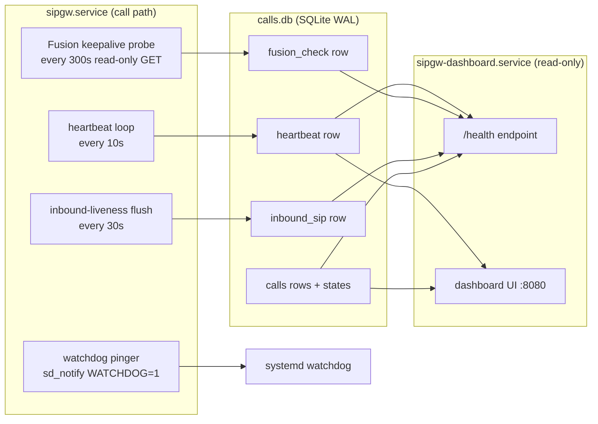
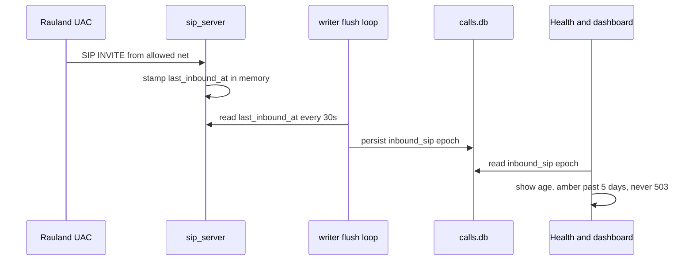

# Monitoring, Health & Backup/DR

> **Product:** RedEye sip2api Gateway — *SIP in. Page out. Every time.*
> **Applies to:** production build `c23f3eb` (branch `main`, the v1.7 line = v1.6.5 + 6 commits) on host `sip2apibridge`.
> **Audience:** Tift Regional IT + clinical/telecom, and RedEye support. Identical content for both.

This section covers how you know the gateway is alive and delivering pages, how it distinguishes a **silent-dead node** from a **genuinely-quiet** night, and how to back up, restore, and pull diagnostics for a support ticket.

Everything here documents what is **deployed today**. Planned high-availability work (LB active/active, socket-activation zero-downtime restart) lives only in the "HA Plan" and "Roadmap" sections and is not described here.

---

## 1. The two things that must always be true

The gateway's job is life-safety: a Rauland Code Blue / RRT SIP INVITE must become an InformaCast Fusion overhead page **every time**. Monitoring exists to answer two questions continuously:

1. **Is the paging writer alive?** — the `sipgw.service` process that ingests SIP and delivers pages.
2. **Is the end-to-end path healthy?** — can we still hear Rauland (inbound), and can we still reach Fusion (outbound), and is the durable outbox draining?

The design deliberately keeps these **separate**. Only question 1 controls the `/health` **status code**. Everything from question 2 is surfaced as **informational** telemetry so that a Fusion blip, a delivery backlog, or a quiet night can **never** trip an external monitor into killing or pulling the sole paging node.



The writer and the dashboard are **two independent systemd services**. The dashboard reads the shared database over a **read-only** (`query_only=ON`) connection and never mutates it, so the dashboard can be restarted at any time without interrupting paging.

---

## 2. The `/health` endpoint

`/health` is served by the **dashboard** process at `http://10.249.0.60:8080/health`. It is the single machine-readable liveness signal. (Code: `dashboard.py`, `health()` and `_health_info()`; snapshot query in `database.py:delivery_health_snapshot`.)

### 2.1 What sets the status code

The HTTP **status code is keyed solely on the writer heartbeat.** The writer stamps a heartbeat row every `heartbeat_interval_seconds` (default **10 s**). The dashboard reads it:

| Condition | HTTP | `status` |
|---|---|---|
| Heartbeat fresher than `stale_after_seconds` (default **30 s**) | `200` | `ok` |
| Heartbeat older than `stale_after_seconds` | `503` | `stale` (includes `heartbeat_age_s`) |
| No heartbeat row at all | `503` | `no-heartbeat` |

This is the "silent-dead" detector: if the writer process wedges, crashes, or is killed, its heartbeat goes stale within ~30 s and `/health` returns `503`. A monitor or a human sees the node is down even though **no page has failed yet**.

> **Design guarantee.** A Fusion outage, a delivery backlog, or a quiet Rauland link **do not** change the status code by default. Only the heartbeat does. This prevents an external monitor from pulling or restarting the only paging node over a transient upstream problem.

### 2.2 Informational fields (never flip the code)

When the heartbeat gate passes, `/health` adds a body of informational fields read from the shared DB. Any read failure here is swallowed — `/health` can never `500` on an info read.

```json
{
  "status": "ok",
  "heartbeat_age_s": 3.2,
  "backlog": 0,
  "last_delivered_at": 1751894400.0,
  "last_failed_at": null,
  "last_error": null,
  "fusion_reachable": true,
  "fusion_detail": "HTTP 200",
  "fusion_checked_age_s": 41.7,
  "last_inbound_sip_at": 1751890000.0,
  "last_inbound_sip_age_s": 4400.0
}
```

| Field | Meaning | Source |
|---|---|---|
| `backlog` | Real (non-test) calls still `pending` + `delivering` — the outbox depth | `count_by_state` |
| `last_delivered_at` | Epoch of the most recent successful delivery | `calls` |
| `last_failed_at` / `last_error` | Most recent `failed`/`expired` call + its truncated error | `calls` |
| `fusion_reachable` | Result of the last outbound reachability probe (`true`/`false`/`null`=unknown) | `fusion_check` |
| `fusion_detail` | Short human string, e.g. `HTTP 200` | `fusion_check` |
| `fusion_checked_age_s` | Age of that probe | `fusion_check` |
| `last_inbound_sip_at` / `last_inbound_sip_age_s` | When we last heard SIP from Rauland | `inbound_sip` |

Test/dry-run rows (`is_test=1`) are excluded from `backlog`, `last_delivered_at`, and `last_failed_at`, so drills never pollute health.

### 2.3 Outbound: the Fusion reachability keepalive

The writer runs a **read-only** reachability probe every `keepalive_interval_seconds` (default **300 s**): a short-timeout `GET` of the scenario definition through the same no-send-guarded HTTP client used for delivery. (`main.py:_keepalive_loop` → `webhook.py:check_reachable` → `database.py:write_fusion_check`.)

- It is **not a page path**. It never triggers the scenario and never sends an overhead page. In dry-run the no-send guard makes it reach no real host and return a synthetic 200.
- It never holds the OAuth token lock across the network call, so the probe can never delay a real page (the background token refresher keeps the token warm — see the Reliability section).
- The result (`ok` + `checked_at` + short `detail`) is stamped to the `fusion_check` DB row and surfaced as the `fusion_*` fields above.

**Optional degrade (opt-in, default OFF).** Set `health.fail_on_fusion_unreachable: true` to make a **present + fresh** `ok=false` probe return `503 status="fusion-unreachable"`. `null` (never probed / older writer) and **stale** checks are treated as unknown and stay `200` (fail-safe). Freshness bound = `fusion_unreachable_max_age_seconds`, or `0.0` to auto-derive it from the probe cadence (`keepalive_interval_seconds × 2 + stale_after_seconds`).

> **Caution — this is a foot-gun by design.** With `fail_on_fusion_unreachable: true`, a Fusion blip will `503` the node. On the current **single-node** deployment there is nothing to fail over to, so a monitor wired to restart/pull on `503` would take the pager offline over an upstream problem. Leave it **OFF** on the single node; it exists for the future LB active/active topology (Roadmap #17). The config validator will warn if you enable the flag while the keepalive is disabled.

### 2.4 Inbound: solving "silent-dead vs genuinely-quiet"

Rauland sends SIP **only on real clinical events** — there are no keepalives — and roughly a quarter of days have **zero** calls, with an observed maximum quiet gap of about **4.27 days**. So "no calls for hours" is normal and must never look like a fault. But a broken inbound link (proxy down, allowlist wrong, network cut) also looks like silence. The **inbound-liveness monitor** separates the two:

- The SIP server records the wall-clock time of the last request received from an **allowed** (Rauland) network, in memory (`sip_server.py:last_inbound_at`).
- The writer flushes that timestamp to the DB every `inbound_flush_interval_seconds` (default **30 s**), and **never** overwrites the persisted value with `now`/`None` when it has seen no datagram since boot — so a writer restart during a real silence cannot clobber the last-real value (`main.py:_inbound_flush_loop`, `database.py:write_inbound_seen`).
- `/health` and the dashboard surface `last_inbound_sip_age_s`. The dashboard turns this **amber** once it exceeds `inbound_stale_after_seconds` (default **432000 s = 5 days**, deliberately longer than the observed max quiet gap). This is **informational only** — it never flips the `/health` code.



**Optional silence escalation (opt-in, default OFF).** Set `health.inbound_escalate_after_seconds` > 0 to fire an escalation **once per silence episode** via the escalation webhook when inbound age exceeds the threshold (`main.py:_maybe_escalate_inbound_silence`). It de-duplicates on the reference epoch so you get **one** alert per episode, and it resets when inbound resumes. Because a 4-plus-day quiet stretch is normal, set the threshold generously (well above ~4.3 days) if you enable it. It never sends a page and never gates `/health`.

### 2.5 Health config reference

From `config.yaml.example` (block `health:`):

```yaml
health:
  heartbeat_interval_seconds: 10.0        # writer stamps liveness this often
  stale_after_seconds: 30.0               # /health 503 once heartbeat older than this
  keepalive_interval_seconds: 300.0       # read-only Fusion reachability GET cadence
  fail_on_fusion_unreachable: false       # opt-in: fresh ok=false -> 503 (see caution)
  fusion_unreachable_max_age_seconds: 0.0 # 0 = auto (keepalive*2 + stale_after)
  inbound_flush_interval_seconds: 30.0    # persist last-inbound-SIP time this often
  inbound_stale_after_seconds: 432000.0   # 5 days -> dashboard shows amber
  inbound_escalate_after_seconds: 0.0     # 0 = OFF; >0 = once-per-episode alert
```

### 2.6 Probing `/health` operationally

```bash
# Simple up/down (exit non-zero on 503):
curl -fsS http://10.249.0.60:8080/health >/dev/null && echo UP || echo DOWN

# Full body, human-readable:
curl -s http://10.249.0.60:8080/health | python3 -m json.tool
```

A good external monitor polls `/health` and alerts on `503` (status `stale`/`no-heartbeat`). On the single node, **do not** auto-restart the writer from an external monitor over a `503` — investigate first (see the Troubleshooting section); an unsupervised auto-restart already caused incident **#20**.

---

## 3. The systemd watchdog

`sipgw.service` runs `Type=notify` with `WatchdogSec=30`. The writer proves **event-loop liveness** to systemd with a pure-Python `sd_notify` implementation (`watchdog.py`).

- On startup the writer sends `READY=1`; on clean shutdown it sends `STOPPING=1`.
- A background pinger sends `WATCHDOG=1` on a cadence of **half** of systemd's `WATCHDOG_USEC` (so ~15 s for a 30 s window). If the event loop stalls and misses pings, systemd restarts the service per its unit policy.
- The pinger is **completely inert** when not under systemd (`WATCHDOG_USEC`/`NOTIFY_SOCKET` unset) — tests, dry-run runs, and non-systemd invocations behave exactly as before.

> **Why event-loop liveness, not DB writes.** The watchdog proves the async loop is turning, deliberately **decoupled** from database writes. Transient DB slowness must never restart the life-safety pager. The heartbeat (which does touch the DB) is the separate signal that feeds `/health`.

Check it:

```bash
systemctl status sipgw.service            # look for WATCHDOG=1 / Notify state
journalctl -u sipgw.service -b | grep -i watchdog
```

---

## 4. Dashboard: state-aware stats and the 90-day chart

The dashboard (`dashboard.py`, ~2155 lines) is a **read-only** UI on `:8080`. It hides `is_test` rows everywhere so drills never appear in customer-facing counts.

### 4.1 State-aware stats

Stats are computed from the durable **call state** (the `calls.state` column), not from guessing at a raw HTTP code. `_stats_from_rows` (and its live-day twin `get_today_stats`) classify each call identically:

| Bucket | States counted |
|---|---|
| **success** | `delivered` (+ legacy rows with a 2xx `fusion_status`) |
| **failed** | `failed` + `expired` (+ legacy rows with a non-2xx/NULL `fusion_status`) |
| **pending** | `pending` + `delivering` |
| **suppressed** | `duplicate` (dedupe suppression) |

Legacy rows (pre-outbox, `state = legacy`) are back-classified by their stored `fusion_status` so historical days and the live day report the same semantics. Per-call delivery state is shown with a glyph + plain-language label (e.g. `✓ Delivered`, `✗ NOT SENT - rejected`, `○ Pending`) so status is never signalled by colour alone (WCAG).

### 4.2 90-day calls-by-type stacked chart

A self-contained inline-SVG stacked bar chart buckets the last **90 days** of real calls by **type** (call purpose, derived from the display name), one bar per day. It is rendered server-side from data already fetched, is read-only, and has zero SIP impact.

### 4.3 Correlated call-detail view and log viewer

- **`/call/{id}`** — a correlated call-detail view joining the `calls` row to the SIP messages (exact `sip_call_id` join), the application-log lines that reference the Call-ID, and a **heuristic** Fusion API exchange (matched by TTS body + time window, since the API debug log carries no Call-ID; ambiguous matches are shown, never silently picked).
- **Date-picker log viewer** — one picker drives both the call table and the on-page log viewer for a chosen day.
- **verify-lookups** — validates `lookups.yaml` and reports results.

All dashboard timestamps display in the configured local timezone via `display_local`, while the underlying stored/log timestamps are UTC (see §6).

---

## 5. Backup & Disaster Recovery

Three things constitute the gateway's recoverable state:

1. **The call database** — `/var/lib/sipgw/calls.db` (SQLite, **WAL** mode).
2. **Configuration** — `/opt/sipgw/config.yaml`.
3. **Lookups** — `/opt/sipgw/lookups.yaml` (area/room → page mappings).

The code itself lives in git and on the host at `/opt/sipgw`; the venv is reproducible. The **irreplaceable** artifacts are the three above.

### 5.1 WAL-safe database backup (do this, not `cp`)

The database runs in **WAL** mode (`PRAGMA journal_mode=WAL`, `synchronous=NORMAL`, `busy_timeout=5000`). That means at any instant the on-disk state is spread across **three** files:

| File | Role |
|---|---|
| `calls.db` | main database |
| `calls.db-wal` | write-ahead log (may hold committed pages not yet checkpointed) |
| `calls.db-shm` | shared-memory index for the WAL |

**A plain `cp calls.db backup.db` is unsafe** — it can capture the main file without the committed pages still in `-wal`, producing a torn/stale copy. Always use SQLite's online backup API, which produces a **single consistent** file while the writer keeps running:

```bash
# Consistent, hot backup — safe while sipgw.service is live:
sqlite3 /var/lib/sipgw/calls.db ".backup '/var/backups/sipgw/calls-$(date -u +%Y%m%dT%H%M%SZ).db'"
```

`.backup` walks the live database under SQLite's locking and folds in the `-wal` contents, so the output is a self-contained `.db` with **no sidecars needed**. Notes:

- Run it as a user that can read the DB (root, or the service user). It is read-only against the source.
- The output is a normal DB file; it does not need `-wal`/`-shm` alongside it to restore.
- If you must copy raw files instead (not recommended), you **must** copy all three (`calls.db`, `calls.db-wal`, `calls.db-shm`) together, atomically — but prefer `.backup`.

A minimal daily backup job (cron/systemd timer), keeping 30 days:

```bash
#!/usr/bin/env bash
set -euo pipefail
DEST=/var/backups/sipgw
mkdir -p "$DEST"
STAMP=$(date -u +%Y%m%dT%H%M%SZ)
sqlite3 /var/lib/sipgw/calls.db ".backup '$DEST/calls-$STAMP.db'"
cp /opt/sipgw/config.yaml   "$DEST/config-$STAMP.yaml"
cp /opt/sipgw/lookups.yaml  "$DEST/lookups-$STAMP.yaml"
# integrity-check the backup we just took:
sqlite3 "$DEST/calls-$STAMP.db" 'PRAGMA integrity_check;'
find "$DEST" -type f -mtime +30 -delete
```

Store backups off-host (the same off-host store used for the log bundles). The DB holds the audit trail of every page; treat it as clinical record-adjacent.

### 5.2 Restore

The call DB is an **audit/history** store — the live paging path does **not** need it pre-populated to function (a fresh DB is created and migrated on first start). Restore it to recover history and in-flight outbox state.

```bash
# 1. Stop the writer so nothing is mid-write:
sudo systemctl stop sipgw.service

# 2. (Optional) move the current DB + sidecars aside:
sudo mv /var/lib/sipgw/calls.db      /var/lib/sipgw/calls.db.old      2>/dev/null || true
sudo mv /var/lib/sipgw/calls.db-wal  /var/lib/sipgw/calls.db-wal.old  2>/dev/null || true
sudo mv /var/lib/sipgw/calls.db-shm  /var/lib/sipgw/calls.db-shm.old  2>/dev/null || true

# 3. Put the backup in place (a .backup output is a single file — no sidecars):
sudo cp /var/backups/sipgw/calls-YYYYMMDDTHHMMSSZ.db /var/lib/sipgw/calls.db
sudo chown sipgw:sipgw /var/lib/sipgw/calls.db      # match service user/perms

# 4. Verify, then start:
sqlite3 /var/lib/sipgw/calls.db 'PRAGMA integrity_check; PRAGMA journal_mode;'
sudo systemctl start sipgw.service
curl -fsS http://10.249.0.60:8080/health >/dev/null && echo UP
```

On start the writer re-applies WAL mode and runs migrations, so a backup taken from any recent build re-opens cleanly. To restore **config**/**lookups**, drop the saved files back into `/opt/sipgw` and restart the affected service (a lookups/config change requires a writer restart to take effect — coordinate per incident #20's lesson, §6).

### 5.3 Bare-host rebuild (DR)

To rebuild `sip2apibridge` from nothing: reinstall Ubuntu 24.04, redeploy `/opt/sipgw` from git (`c23f3eb`), recreate the venv, restore `config.yaml` + `lookups.yaml` + `calls.db` from backup, reinstall both systemd units, then confirm SIP ingress on **5060 udp+tcp** and `/health` on **8080**. Full step-by-step is in the deployment/cutover runbook; the DR-critical inputs are the three backed-up artifacts above.

---

## 6. Log management

### 6.1 The four log streams

Logging is configured in `logging_config.py`. There are **four** files under `/var/log/sipgw`:

| File | Contents | Logger | Toggle |
|---|---|---|---|
| `sipgw.log` | Main application log (call path, delivery, escalation) | `sipgw` | always on |
| `sipgw_api_debug.log` | Northbound Fusion API traces (no Call-ID) | `sipgw.api_debug` | `logging.api_debug_log` |
| `sipgw_sip_debug.log` | Detailed SIP message traces | `sipgw.sip_debug` | `logging.sip_debug_log` |
| `sipgw_dashboard.log` | Dashboard process log | `sipgw` (dashboard proc) | dashboard |

The debug streams are **enabled** in the deployed config (`api_debug_log: true`, `sip_debug_log: true`).

> **Two processes, no shared rotating handler.** The writer owns `sipgw.log` / `sipgw_api_debug.log` / `sipgw_sip_debug.log`. The dashboard process writes only its **own** `sipgw_dashboard.log`. This is deliberate (`setup_dashboard_logging`): two processes each owning a rotating handler on the same file would race at midnight rotation and corrupt logs. The dashboard therefore never attaches to the writer's files.

### 6.2 Rotation, compression, retention

- **Daily rotation at UTC midnight** (`when="midnight"`), one file per calendar day, suffix `%Y-%m-%d`.
- Rotated files are compressed to **`.tgz`** and files older than **90 days** are purged (`retention_days: 90`).
- **Rotation and compression run off the event loop** on a background thread (async `QueueHandler`/`QueueListener`), so a logging call from the call path only enqueues and never blocks on disk I/O or a rotation (issue #6). The queue is flushed at interpreter exit.

### 6.3 UTC timestamps

Every log line is stamped in **canonical UTC RFC3339 milliseconds-Z**, e.g. `2026-07-01T18:23:45.007Z`, regardless of host timezone (`ISO8601Formatter`). This makes all four streams byte-for-byte zone-consistent, UTC-sortable, and directly string-matchable against Singlewire's `Date`/`createdAt` fields for far-end correlation.

> **Known nuance.** The host clock is `Etc/UTC` and the config declares `logging.timezone: America/New_York` (or empty), but that setting is **not applied to log stamps** — log-file timestamps are hard-coded **UTC-Z**. The dashboard and CSV export render **local** wall-clock via `display_local`; only the raw log files are UTC. When reading raw logs alongside the dashboard, remember the log is UTC and the UI is local.

Because rotation rolls at 00:00 UTC and stamps are UTC-Z, each day-file's boundary and its internal timestamps are self-consistent.

### 6.4 Operational lesson: coordinate OS patching (#20)

On 2026-07-07 an `unattended-upgrades`/`needrestart` auto-restart bounced the paging service uncoordinated (issue **#20**, remediated). The monitoring takeaway: an external monitor or an OS patch job that restarts `sipgw.service` on its own can drop the paging path with no coordination. Patch during a maintenance window and confirm `/health` is `UP` afterward. Zero-downtime writer restarts via socket activation (#19) are the planned fix (Roadmap).

---

## 7. Exporting a support bundle

There are two complementary ways to hand RedEye support (or a vendor) the evidence for one event.

### 7.1 Per-call diagnostic bundle (one click, one event)

From the call-detail page, export a **plain-text diagnostic bundle** at:

```
http://10.249.0.60:8080/call/{id}/bundle.txt
```

`_render_bundle_text` (`dashboard.py`) assembles a copy/paste-friendly `text/plain` report with these sections:

1. **CALL RECORD** — the full `calls` row: id, created_at (local + epoch), caller, area/room, TTS string, `fusion_status`, `response_time_ms`, `state`, `attempts`, `last_error`, `sip_call_id`, `event_id`.
2. **SIP MESSAGES** — the SIP debug blocks joined by **exact Call-ID** (or a clear note if SIP debug is off / no match / a pre-outbox legacy row with no `sip_call_id`).
3. **APPLICATION LOG** — main-log lines that reference the Call-ID.
4. **FUSION API EXCHANGE** — the heuristic TTS/time-matched API block(s), explicitly flagged **provisional**; if more than one matched, all are shown and labelled ambiguous (nothing is silently suppressed).

This is the fastest way to attach "everything about page X" to a ticket without leaking anything beyond that one call. Grab it from a terminal too:

```bash
curl -s "http://10.249.0.60:8080/call/1234/bundle.txt" -o call-1234-bundle.txt
```

### 7.2 Raw logs for a time range

For a broader window (an incident spanning many events), collect the raw streams for the affected UTC day(s) directly:

```bash
# Today's live files:
sudo tar czf /var/backups/sipgw/logs-$(date -u +%Y%m%d).tgz \
  -C /var/log/sipgw sipgw.log sipgw_api_debug.log sipgw_sip_debug.log sipgw_dashboard.log

# A specific past day (rotated files are already .tgz):
ls /var/log/sipgw/*.2026-06-12.tgz
```

Pair the raw-log bundle with the DB backup (`.backup`, §5.1) for a complete forensic snapshot. Because all four streams are UTC-Z stamped, they line up on a single UTC timeline and correlate against Singlewire's records without timezone math.

---

## 8. Quick reference

| Task | Command / URL |
|---|---|
| Liveness (up/down) | `curl -fsS http://10.249.0.60:8080/health` |
| Full health JSON | `curl -s http://10.249.0.60:8080/health \| python3 -m json.tool` |
| Watchdog / notify state | `systemctl status sipgw.service` |
| Writer logs (live) | `journalctl -u sipgw.service -f` |
| Dashboard logs (live) | `journalctl -u sipgw-dashboard.service -f` |
| Hot DB backup | `sqlite3 /var/lib/sipgw/calls.db ".backup '/var/backups/sipgw/calls-$(date -u +%Y%m%dT%H%M%SZ).db'"` |
| DB integrity check | `sqlite3 <backup.db> 'PRAGMA integrity_check;'` |
| Per-call bundle | `http://10.249.0.60:8080/call/{id}/bundle.txt` |
| Log dir | `/var/log/sipgw` (4 streams, 90-day `.tgz` retention, UTC-Z) |
| DB path | `/var/lib/sipgw/calls.db` (WAL: `.db` + `.db-wal` + `.db-shm`) |
| Config / lookups | `/opt/sipgw/config.yaml`, `/opt/sipgw/lookups.yaml` |

**Golden rules**
- `/health` `503` means the **writer** is dead/stale — investigate, don't reflexively auto-restart on the single node (#20).
- A quiet Rauland link is **normal**; inbound-liveness is amber-after-5-days and informational — it never `503`s.
- Back up the DB with **`sqlite3 .backup`**, never a bare `cp` (WAL sidecars).
- Raw logs are **UTC**; the dashboard is **local**.
