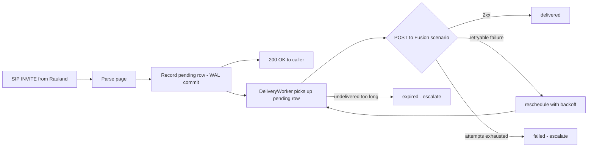
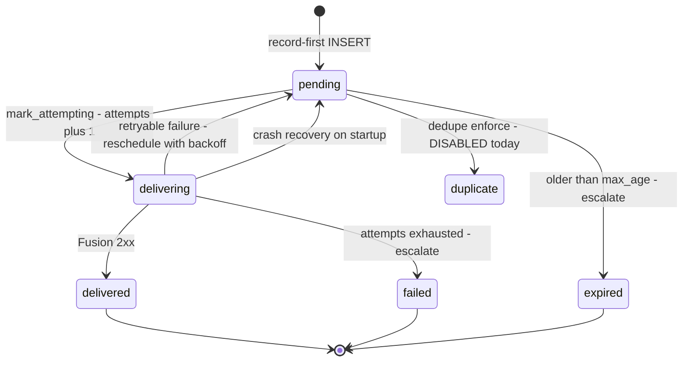

# Reliability, Delivery Guarantees & Known Limitations

> **Applies to:** RedEye sip2api Gateway production build `c23f3eb` (branch `main`, the v1.7 line = v1.6.5 + 6 commits), deployed on host `sip2apibridge`.
>
> This section documents the **durable delivery model as it works today** — the transactional outbox, the delivery worker, the state machine, escalation, and background token refresh — then states plainly what the design does and does **not** guarantee, and which remaining limitations the roadmap addresses.

---

## 1. The core promise: "Duplicate OK, missed never"

A Code Blue or RRT page is a life-safety signal. The single design rule that shapes every reliability decision in this product is:

> **It is acceptable to deliver a page twice. It is never acceptable to miss one.**

Everything in this section — recording the page before we try to send it, retrying on failure, expiring only after a long deadline and escalating when we do, keeping the OAuth token off the critical path, gating the SIP teardown behind the ACK — exists to honor that rule. Where the design has to choose, it chooses **at-least-once delivery** (a possible duplicate) over any risk of **at-most-once** (a possible miss).

This is why clinical **suppression of duplicates ships DISABLED** (see [§7](#7-duplicate-invites-and-clinical-dedupe-shadow-mode-today)): dropping a page is the one thing the gateway must never do by accident, so it is gated behind explicit clinical sign-off that has not been given.

---

## 2. Durable delivery model (transactional outbox)

Older builds sent the page **inline**, on the SIP thread, at the moment the INVITE arrived. If that single HTTP call to Fusion failed, the page was gone — there was nothing to retry from and nothing that recorded the intent to page. That is exactly the failure that lost a Code Blue on 2026-06-12 ([§6](#6-the-2026-06-12-lost-code-blue-what-happened-and-how-this-build-prevents-it)).

The current build uses a **transactional outbox**. Delivery is split into two phases with a durable boundary in between:

1. **Record first.** The instant a valid page is parsed, the SIP path writes a durable `pending` row to SQLite (`create_pending_call`, [`database.py`](../../sipgw/database.py)) and commits it — **before any attempt to reach Fusion**. The page now survives a crash, a restart, or a Fusion outage.
2. **Deliver asynchronously.** A separate background worker (`DeliveryWorker`, [`delivery.py`](../../sipgw/delivery.py)) polls for `pending` rows and delivers them with bounded retries and backoff, driving the Fusion webhook client. The SIP thread never blocks on the network.

The database runs in **SQLite WAL mode** (`PRAGMA journal_mode=WAL`, `synchronous=NORMAL`) at `/var/lib/sipgw/calls.db`. WAL is what makes "record-first" a real durability guarantee (the commit is on disk before delivery is attempted) **and** lets the read-only dashboard read the same file concurrently without blocking the writer.



**Why this is durable.** The critical guarantee is the ordering `record -> commit -> attempt`. If the process dies at *any* point after the commit — power loss, `SIGKILL`, an OS-triggered restart — the `pending` (or crash-orphaned `delivering`) row is still on disk and is re-driven on the next startup ([§4](#4-crash-recovery-and-graceful-drain)). No page is ever "in flight only in memory."

### Delivery tuning (defaults, from `delivery.py` / `config.py`)

| Setting | Default | Meaning |
|---|---|---|
| `max_attempts` | `6` | Delivery attempts before a page is marked `failed` and escalated. |
| `base_backoff_seconds` | `2.0` | First retry delay; doubles each attempt (exponential backoff). |
| `max_backoff_seconds` | `60.0` | Ceiling on any single backoff interval. |
| `max_age_seconds` | `900.0` | A page still undelivered after 15 min is marked `expired` and escalated. |
| `poll_interval_seconds` | `1.0` | How often the worker sweeps for deliverable rows. |
| `batch_size` | `20` | Rows examined per sweep. |

Backoff is **exponential** (`base * 2^(attempt-1)`, capped at `max_backoff_seconds`), but if Fusion returns a `Retry-After` header with a delta-seconds value, the worker **honors that instead** (capped at the same ceiling). The `Retry-After` HTTP-date form is intentionally *not* honored — it falls back to exponential backoff (see [`webhook.py` `_parse_retry_after`](../../sipgw/webhook.py)).

---

## 3. The delivery state machine

Every call row carries a `state` column. The `DeliveryWorker` and the DB helpers move a row through these states. This is the single source of truth for "did this page get out?" and it is what the dashboard's stats and `/call/{id}` view read.



| State | Meaning | Terminal? |
|---|---|---|
| `pending` | Recorded durably, awaiting a delivery attempt (or waiting out a backoff cooldown before the next one). This is the state a page sits in between retries. | No |
| `delivering` | The worker has claimed the row and is mid-attempt (`attempts` was just incremented). A crash here is recovered back to `pending` on startup. | No |
| `delivered` | Fusion returned **2xx**. The page is out; `delivered_at`, `fusion_status`, and `response_time_ms` are stamped and `last_error` cleared. | **Yes (success)** |
| `retrying` | Conceptual label for a page that has failed at least once and is scheduled for another attempt. On disk this is represented as `pending` with `attempts > 0` and a non-null `last_error`; the worker holds an in-memory cooldown until the backoff elapses. | No |
| `failed` | Delivery **exhausted** `max_attempts` without a 2xx. `last_error` records the last status; **escalation fires**. Requires human attention. | **Yes (failure)** |
| `expired` | The page stayed undelivered past `max_age_seconds` (15 min default). Marked `expired`, **escalation fires**. A very stale page is retired rather than paged out minutes late. | **Yes (failure)** |
| `duplicate` | A page suppressed as a clinical duplicate. **Not used in production today** — dedupe enforcement ships disabled ([§7](#7-duplicate-invites-and-clinical-dedupe-shadow-mode-today)). Reserved for the enforcement path; when it exists, the row is recorded but deliberately not delivered. | **Yes (suppressed)** |
| `legacy` | Pre-outbox rows that predate the state machine (the ~300 historical prod rows the migration back-filled). Classified for stats by their stored `fusion_status`, not re-delivered. | **Yes (historical)** |

**Notes on the "retrying" state.** It is a *reporting* state, not a distinct on-disk value: the retry path calls `reschedule()`, which returns the row to `pending` with an updated `last_error` and `fusion_status`, while the worker keeps a per-row cooldown (`_next_before`) in memory. That cooldown is intentionally in memory only — if it is lost to a restart, the row is simply re-attempted sooner, which is the safe direction (we would rather retry early than late).

---

## 4. Crash recovery and graceful drain

- **Startup recovery.** On boot, `recover()` calls `recover_inflight()`, which flips every crash-orphaned `delivering` row back to `pending`. A page that was mid-attempt when the process died is re-queued and delivered. This is the mechanism that turns "record-first" into genuine **at-least-once** delivery across restarts.
- **Graceful drain.** On a clean shutdown the worker runs `drain()` (best-effort, deadline-bounded) to flush any `pending` rows before exiting. Durability does **not** depend on drain succeeding — record-first plus startup recovery already cover a hard stop; drain is purely an optimization to empty the queue on a coordinated stop.
- **Systemd watchdog.** `sipgw.service` runs `Type=notify` with `WatchdogSec=30s` ([`watchdog.py`](../../sipgw/watchdog.py)). If the writer wedges, systemd restarts it and startup recovery re-drives the queue.

---

## 5. Background OAuth token refresh (token off the critical path)

Fusion's Scenarios API requires an OAuth2 bearer token. In the old inline model, if the cached token was expired **at the moment a page arrived**, the page's own delivery had to stop and fetch a fresh token first — a network round-trip on the critical path, and precisely the kind of transient failure that lost the 2026-06-12 page.

The current build runs a **background refresh loop** (`start_token_refresh` / `_refresh_loop` in [`webhook.py`](../../sipgw/webhook.py)):

- A dedicated task keeps a valid token cached at all times, renewing it roughly `token_refresh_margin_seconds` (default **300s**) **before** expiry.
- When a page is delivered, the token is almost always already warm — no fetch on the paging path.
- If a delivery ever does hit a `401` (token revoked/rotated mid-flight), `trigger_scenario` clears the cache, re-authenticates, and retries the POST **once** inline — and any remaining failure still falls through to the durable retry loop rather than being lost.
- Token refresh takes the token lock only while actually refreshing; the reachability probe and the delivery path never block each other on it.

The net effect: **token acquisition is no longer a single point of failure on the paging path.** A transient token-endpoint hiccup is absorbed by the background loop and the outbox retries, not paid for by a live Code Blue.

---

## 6. The 2026-06-12 lost Code Blue: what happened, and how this build prevents it

**What happened.** A Code Blue INVITE arrived and was processed on the old **inline** delivery path. Delivering the page required an OAuth token fetch, and that fetch hit a transient `httpx.ConnectTimeout`. Because delivery was inline and **there was no durable record and no retry**, the exception propagated, the call was recorded with `fusion_status = -1`, and **the page was never sent**. One transient network timeout on the critical path lost a life-safety notification with no second chance.

**How the current build prevents it.** Every contributing factor has been removed:

| 2026-06-12 failure factor | Current-build mitigation |
|---|---|
| Delivery was inline on the SIP thread. | **Record-first outbox** — the page is durably committed before any network attempt ([§2](#2-durable-delivery-model-transactional-outbox)). |
| A single transient timeout was fatal. | **Bounded retries with backoff** — up to `max_attempts` (6) attempts before failure ([§3](#3-the-delivery-state-machine)). |
| Token fetch happened on the paging path. | **Background token refresh** keeps the token warm off the critical path ([§5](#5-background-oauth-token-refresh-token-off-the-critical-path)). |
| A lost page was silent (just `fusion_status=-1`). | On permanent failure/expiry, **escalation fires** to a human channel ([§8](#8-escalation-on-permanent-failure)). |
| A crash mid-send lost the page entirely. | **Startup recovery** re-drives crash-orphaned rows ([§4](#4-crash-recovery-and-graceful-drain)). |

Under today's build, that exact scenario would land the page in `pending`, retry it within seconds as the transient timeout cleared, and deliver it — or, in a genuine sustained outage, escalate it loudly rather than dropping it silently.

---

## 7. Duplicate INVITEs and clinical dedupe (SHADOW mode today)

**The upstream behavior.** Rauland's nurse-call source emits **two INVITEs per event** for a meaningful fraction (~1/3) of events. Left unhandled, this means some events would produce two overhead pages.

**What ships in production today — accuracy note.** The clinical dedupe module (`dedupe.py`) is present but ships **DISABLED / SHADOW-only**. The shipped config is:

```yaml
dedupe:
  enforce: false        # never suppresses a page
  window_seconds: 0     # the duplicate-lookup query never even runs
  match_bed: true
  match_purpose: true
```

With these defaults:

- `evaluate()` computes a stable **clinical fingerprint** (`cf-v1:` — normalized `area / room / bed / purpose`) but, because `window_seconds` is 0, **never queries the database and never suppresses anything**.
- Setting `window_seconds > 0` with `enforce: false` turns on **shadow telemetry only**: each clinical duplicate is logged as `WOULD suppress ... gap=<seconds> ...` and annotated in `duplicate_of`, so the real duplicate rate can be measured — but **the page is still delivered**.
- `enforce: true` is treated as an **out-of-policy configuration**. `validate_config` warns loudly (`*** DEDUPE SUPPRESSION ACTIVE ***`), and even in that state the main paging path never gates delivery on the decision. Suppression that actually drops a page requires clinical sign-off that has **not** been given.

> **Why disabled?** Suppressing a duplicate is indistinguishable, in code, from dropping a real second Code Blue for the same room. Per the "missed never" rule ([§1](#1-the-core-promise-duplicate-ok-missed-never)), that trade is gated behind explicit clinical approval. Until then the gateway **delivers both INVITEs** — a duplicate page is the accepted, safe outcome.

Two identities are kept strictly separate and must never be conflated:

- **SIP transaction identity** (`v1:` `invite_fingerprint`, #15) — a *retransmit of the same INVITE* (same Call-ID/From/CSeq).
- **Clinical identity** (`cf-v1:` fingerprint, #5) — *who/where/why* (area/room/bed/purpose).

The upstream **event-id** (extracted from the SIP Call-ID, stored in the indexed `event_id` column) is recorded on every page as telemetry and is a prerequisite for the future HA "one-call-one-host" work, but today it is annotation only — never a match key, never a delivery gate.

---

## 8. Escalation on permanent failure

When a page reaches a terminal failure state, the gateway makes the failure **loud** rather than silent (`on_escalate` callback -> [`escalation.py`](../../sipgw/escalation.py)):

- **`failed`** (retries exhausted) and **`expired`** (undelivered past the deadline) both trigger escalation.
- The escalator POSTs a JSON summary (reason, call id, caller, area/room, attempts, `fusion_status`, `last_error`) to the configured `escalation.webhook_url` (Teams / Slack / PagerDuty / NOC).
- If **no** webhook is configured, the failure is still logged at `ERROR` (`ESCALATION (no webhook configured) — ...`) so it is visible in `sipgw.log`.
- Escalation is **robust by contract**: any failure inside the escalator is logged and swallowed, never raised — a broken alert channel can never disrupt delivery of the *next* page.
- In dry-run/test the escalation client carries the same **no-send guard** as the Fusion client, so drills cannot page a real human channel.

> **Operational recommendation:** set `escalation.webhook_url` in production. Without it, a `failed`/`expired` page is recorded and logged but will not actively alert anyone.

---

## 9. SIP correctness: ACK-gated BYE (the 481 race, fixed)

The gateway answers each INVITE (`200 OK`), then in **immediate-BYE** mode tears the call back down so the RTP port is freed promptly. An older build could send the gateway's `BYE` **before** the caller's `ACK` had arrived, drawing a `481 Call/Transaction Does Not Exist` from the far end and leaving the SIP dialog in an inconsistent teardown.

The current build ([`sip_server.py`](../../sipgw/sip_server.py), #11) makes teardown **ACK-gated**:

- After sending `200 OK`, the gateway **keeps the call and defers its BYE** until the caller's `ACK` confirms the three-way handshake. This guarantees `INVITE -> 200 -> ACK -> BYE` ordering — the BYE never outruns the ACK, so no 481 is drawn.
- A **lost-ACK fallback timer** (`immediate_bye_ack_timeout_seconds`) tears the call down anyway if the ACK never arrives, so a dropped ACK can't leak a call or an RTP port.
- The teardown funnel is a **single-fire, idempotent** path — whichever of {ACK arrives, fallback fires, peer BYE, shutdown} happens first sends the deferred BYE exactly once.

**Crucially, the page does not depend on any of this.** The durable page is recorded from the INVITE handler; ACK/BYE/fallback are the SIP-hygiene layer and never gate whether the page goes out.

---

## 10. What the design guarantees (and what it does not)

**Guaranteed (as deployed):**

- **At-least-once delivery** of every accepted page, across process crashes, restarts, Fusion outages, and transient token/network failures — via record-first + WAL durability + bounded retries + startup recovery.
- **No silent loss** — a page that ultimately can't be delivered ends in `failed` or `expired` and is escalated (and always logged).
- **Token acquisition is not on the critical path.**
- **SIP teardown is spec-correct** (no 481 race) and independent of the paging guarantee.
- **Duplicate pages are tolerated, never dropped by accident** — clinical suppression is off by default.

**Explicitly NOT guaranteed:**

- **Exactly-once delivery.** The design is at-least-once by choice. A retry after an ambiguous response (e.g., a 2xx that was lost in transit) can produce a duplicate page. This is accepted under the "duplicate OK" rule.
- **Ordering across pages.** The worker delivers oldest-first per sweep, but retries and backoff mean a retried page can be delivered after a newer one. Each page is independent; there is no cross-page sequencing contract.
- **Delivery within a hard latency bound.** Normal delivery is sub-second, but a page under retry/backoff can take up to `max_age_seconds` (15 min) before it is retired as `expired`. There is no faster hard SLA than "delivered as soon as Fusion accepts it, or escalated."
- **Automatic de-duplication of Rauland's double-INVITEs** — suppression is disabled ([§7](#7-duplicate-invites-and-clinical-dedupe-shadow-mode-today)).

---

## 11. Known limitations (and the roadmap that addresses them)

These are real, current limitations of build `c23f3eb`. The fixes live in the **[Roadmap](70-roadmap.md)** and are **not** deployed today.

### 11.1 Single node — no automatic failover (roadmap #17)

The gateway runs on a **single host** (`sip2apibridge`). Durability protects against process crashes and transient failures, but **not against loss of the host itself** (hardware failure, network partition, a long OS outage). While the node is down, no pages are delivered; a stale page resumes when the node returns and startup recovery re-drives the queue, but there is no *live* second node.

> **Roadmap #17 (HA epic):** NetScaler load-balanced active/active with autonomous durable nodes, one-call-one-host via Call-ID persistence, a delivery-aware `/health` monitor, and failover-without-failback. Planned; not built.

### 11.2 Uncoordinated OS-triggered restarts (issues #20, #19)

On 2026-07-07, an `unattended-upgrades`/`needrestart` auto-restart bounced the paging service uncoordinated (**issue #20**). Because delivery is durable, no page was lost — the outbox and startup recovery covered it — but the restart was **uncoordinated**, i.e., it could interrupt an in-flight attempt at an arbitrary moment rather than during a drained, quiescent window.

> **Roadmap #20:** coordinate OS patching / auto-restarts with the paging service.
> **Roadmap #19:** zero-downtime writer restarts via systemd **socket activation**, so the SIP listener survives a writer restart with no dropped datagrams.

This is an **operational lesson**, not a delivery-durability gap: the durable outbox already prevented data loss; #19/#20 close the *availability* window during patching.

### 11.3 Timestamp timezone (documented quirk)

The host clock is `Etc/UTC` and stored timestamps are canonical **UTC RFC3339**. The config declares `logging.timezone: America/New_York`, but that value is **not applied to stored timestamps** — on-disk timestamps are UTC. The dashboard renders local wall-clock for humans; day-boundary bucketing keys off the numeric `created_at` epoch, so mixed legacy-local and new-UTC rows still classify correctly. This is a cosmetic/config-clarity item, not a reliability defect.

### 11.4 No host firewall on the paging ports (security-adjacent, see Security section)

There is currently **no host firewall** (empty nftables) on `:5060` and `:8080`; ingress relies on the application-level SIP allowlist, and the dashboard has no authentication. This does not affect delivery guarantees but is a hardening gap — see the **Security** section for the recommended nftables rules.

---

## 12. Reliability at a glance

| Concern | Mechanism | Module |
|---|---|---|
| Don't lose a page on a transient failure | Record-first outbox + bounded retries + backoff | `delivery.py`, `database.py` |
| Survive a crash mid-delivery | WAL durability + startup `recover_inflight()` | `database.py` |
| Keep auth off the critical path | Background token refresh | `webhook.py` |
| Make permanent failures loud | Escalation on `failed` / `expired` | `escalation.py` |
| Don't drop a real duplicate Code Blue | Clinical dedupe ships **disabled** (shadow) | `dedupe.py` |
| No 481 on SIP teardown | ACK-gated deferred BYE + lost-ACK fallback | `sip_server.py` |
| Detect a wedged writer | systemd `Type=notify` watchdog | `watchdog.py` |
| Report true delivery state | `state` column + state-aware stats | `database.py`, dashboard |

**Bottom line:** as deployed, the gateway is a durable, single-node, at-least-once paging system that will not silently lose a Code Blue. Its remaining gaps are *availability during host loss and OS patching* — addressed by the HA and restart-coordination roadmap items, which are planned and not yet in production.
