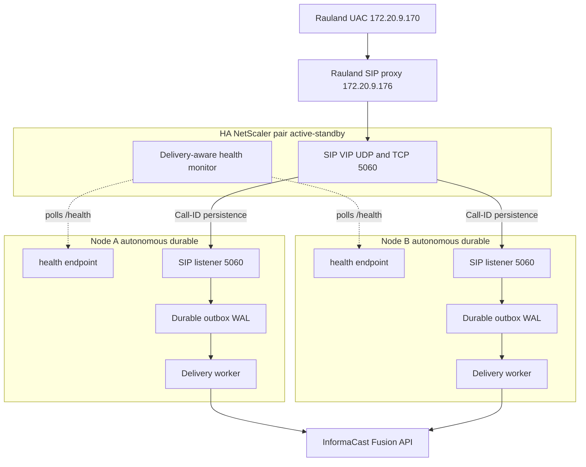

# High-Availability Plan (Next Iteration)

> **Status: PLANNED — not deployed.** Everything in this section describes the
> *next* iteration of the RedEye sip2api Gateway. The **current production build
> (`c23f3eb`, the v1.7 line)** runs a **single autonomous durable node**
> (`sip2apibridge`, 10.249.0.60). The single node is already hardened for
> reliability — record-first durable outbox, bounded retries with backoff,
> background OAuth refresh, watchdog, and a delivery-aware `/health` — so the HA
> work below adds **node-level redundancy**, not a rewrite. It is tracked as the
> open **HA epic #17**, with **#19 (zero-downtime writer restarts)** as its
> near-term companion. Nothing here should be read as a description of what is
> live today.

This section documents the target HA architecture, the design decisions behind
it, the companion zero-downtime-restart work, and the concrete open requirements
(NetScaler, Singlewire, Rauland) that must be satisfied before HA can be cut in.

---

## 1. Why HA, and why now

The gateway is on the life-safety path: a real Code Blue or RRT INVITE from
Rauland must become an InformaCast Fusion overhead page **every time**. The
current single node already survives the failure modes that used to lose a page
*within* one host:

- a Fusion outage or transient `httpx.ConnectTimeout` (the 2026-06-12 loss) — now
  absorbed by the durable outbox + bounded retries + background token refresh;
- a process crash between "page received" and "page delivered" — now recovered on
  restart (`recover_inflight()` returns orphaned `delivering` rows to `pending`);
- duplicate upstream INVITEs — now collapsed by enforcing dedupe.

What a single node **cannot** survive is the loss of the **host itself**: a
kernel panic, a hypervisor failure, a NIC/link failure on ens34, an OS patch
that wedges the box, or a botched maintenance window. During any of those, there
is no second node to answer the SIP INVITE, and a page can be lost at the front
door before the durable outbox ever sees it.

The 2026-07-07 **unattended-upgrades / `needrestart` incident (#20)** made the
gap concrete: an OS auto-restart bounced the paging service uncoordinated, with
no second node to carry traffic during the blip. That incident motivates **both**
tracks below — node redundancy (#17) *and* zero-downtime restarts (#19).

**HA goal:** no single host failure — planned or unplanned — can drop, delay past
the retry budget, or duplicate a Code Blue.

---

## 2. Target topology (planned)

Two or more **autonomous durable nodes** sit behind an **HA NetScaler load
balancer** that fronts the SIP virtual IP. Rauland points at the NetScaler SIP
VIP instead of directly at the gateway. Each node is a full, independent copy of
today's production node: its own SIP listener, its own record-first durable
outbox (SQLite WAL), its own delivery worker, escalation, and dashboard. Nodes
are **shared-nothing** — there is no shared database, no cross-node lock, and no
leader election on the paging path.

Key properties:

| Property | Design choice |
|---|---|
| Load balancer | HA NetScaler pair fronting a single SIP VIP (UDP **and** TCP 5060) |
| Node model | 2+ **autonomous, shared-nothing** nodes; each a full durable gateway |
| Call affinity | One call to one node via **SIP Call-ID persistence** (not source IP) |
| Durability | **Per-node** durable outbox (record-first WAL) — no shared DB |
| Health | **Delivery-aware** `/health` monitored by the LB; unhealthy nodes drained |
| Failover | Automatic failover **on**, automatic **failback off** (see §5) |
| Maintenance | Native **drain** of a node (stop new calls, finish in-flight) |

---

## 3. Call affinity: SIP Call-ID persistence (not source IP)

The single most important LB decision is **how a call is pinned to a node**.

A SIP call is a multi-message dialog — `INVITE`, `ACK`, and `BYE` for the same
call must all reach the **same** node, because that node holds the in-memory
dialog state keyed on the Call-ID. In the current code the SIP server stores
every live call in `self.calls[call_id]` and matches the follow-up `ACK` and
`BYE` back to it by Call-ID; a message that lands on the wrong node is an "ACK
for unknown call" and the ACK-gated immediate-BYE teardown cannot complete
cleanly.

The obvious LB persistence method — **source-IP affinity — does not work here.**
Every INVITE arrives from the **single Rauland proxy source `172.20.9.176`**
(Rauland UAC `172.20.9.170` → proxy `172.20.9.176` → gateway). Source-IP
persistence would therefore pin **all** traffic to **one** node and defeat the
entire purpose of HA: the "balancer" would never balance, and losing that one
node would lose everything.

**The persistence key must be the SIP `Call-ID` header.** The NetScaler must
parse the SIP message, extract `Call-ID`, and hash it to a node, so that:

- every INVITE for a *new* Call-ID is balanced across the healthy node set;
- every subsequent ACK / BYE for that *same* Call-ID lands on the *same* node
  that answered its INVITE.

This is a hard NetScaler requirement (see §6). The gateway already emits the
retransmit-stable transaction fingerprint (`v1:…`, keyed on Call-ID + From +
CSeq) and persists the upstream `event_id` derived from the Call-ID, so the
node-side correlation needed to reason about "one call → one host" is already in
place; the missing piece is **Call-ID-based persistence on the balancer**.

---

## 4. Autonomous durable nodes — no shared state

Each node keeps the **per-node durable outbox** exactly as it works today. There
is deliberately **no shared database** and **no cross-node coordination** on the
paging path:

- A node that answers an INVITE **records the page first** (state `pending`, WAL)
  on its **own** disk before any Fusion send, then its **own** delivery worker
  drives `pending → delivering → delivered | failed | expired` with bounded
  retries and backoff, escalating on permanent failure.
- Because a whole call (INVITE + ACK + BYE) is pinned to one node by Call-ID
  persistence, that node owns the page end-to-end. There is never a hand-off of
  a half-delivered page between nodes, so there is nothing to replicate and no
  split-brain to resolve on the delivery path.
- If a node dies **after** recording a page but **before** delivering it, that
  page lives in *that node's* WAL. On restart the node's `recover_inflight()`
  re-queues it and delivery resumes. HA does not change this contract — it just
  means the *rest* of the cluster keeps answering **new** calls while the dead
  node is down or recovering.

This shared-nothing model is what makes the nodes "autonomous": each is
independently correct and independently durable. The LB adds availability for
**new** calls; the per-node outbox continues to guarantee durability for calls a
node has already accepted.

> **Duplicate suppression is per-node.** Enforcing dedupe (window 2s, event-id /
> clinical-key based) runs against each node's **own** WAL. Rauland's ~1-in-3
> double-INVITE is collapsed correctly **as long as both INVITEs of one event
> land on the same node** — which Call-ID persistence guarantees when both
> INVITEs share a Call-ID. See §6 for the Singlewire idempotency-key backstop
> that covers the residual cross-node case.

---

## 5. Failover with no automatic failback

Failover is **automatic**; failback is **not**.

- **Failover (automatic).** When the LB's delivery-aware monitor marks a node
  unhealthy (see below), the NetScaler stops sending it **new** calls and
  distributes them across the remaining healthy node(s). In-flight calls already
  pinned to a surviving node are unaffected.
- **No automatic failback.** When a previously-failed node comes back healthy,
  the LB does **not** automatically resume steering new calls to it. A node is
  returned to rotation only by a **deliberate operator action**.

The reason is life-safety stability. A node that is *flapping* — healthy, then
unhealthy, then healthy again on a short cycle (e.g. a partial network fault, an
OOM loop, or a half-finished OS patch) — would, under automatic failback, be
handed live Code Blue traffic during a window when it is not actually trustworthy.
"No automatic failback" makes recovery an explicit, observed, human-gated step:
an operator confirms the node is genuinely healthy (its outbox has drained, its
`/health` has been solidly green, logs are clean) and only then returns it to the
active set. We prefer a brief period running on fewer-but-known-good nodes over
auto-rejoining a flapping node onto the paging path.

### Delivery-aware health as the failover signal

Failover is only as good as the health signal driving it. The LB must **not**
rely on a bare TCP-connect or "the web server answered" check — a node can accept
TCP on 5060 while its delivery pipeline is stuck. The monitor polls each node's
existing **delivery-aware `/health`**, which already reflects:

- **writer heartbeat freshness** — `/health` returns `200 {"status":"ok"}` only
  when the writer's heartbeat is fresher than `stale_after_seconds` (default 30s);
  a dead or hung writer returns `503 stale` / `503 no-heartbeat`. This is genuine
  cross-process writer liveness, not just "the HTTP server is up";
- **delivery backlog and last-delivered** telemetry (`backlog`,
  `last_delivered_at`);
- **Fusion reachability** (`fusion_reachable`, `fusion_checked_age_s`) — optional
  degrade available;
- **inbound-liveness / Rauland-reachability** (`last_inbound_sip_age_s`) — "is the
  Rauland link up, or just quiet?".

For HA, the LB monitor should key failover on the **`/health` status code**
(heartbeat-driven, the current authoritative liveness signal), with a **fast poll
interval** so a dead node is drained from the SIP VIP within a small number of
seconds rather than the current single-node self-restart timeframe. The
informational fields (`backlog`, `fusion_reachable`, `last_inbound_sip_age_s`)
feed operator dashboards and the failback decision; whether any of them should
also gate LB removal is an open policy question (see §6). Today, deliberately, a
Fusion blip or a delivery backlog **does not** flip the single node's `/health`
status code — because on a lone node, self-evicting on a transient Fusion issue
would take the *only* pager offline. In a multi-node cluster that trade-off can be
revisited: with peers available, a node with a genuinely stuck delivery pipeline
*could* be drained. That is a config decision to make at HA cut-in, not a code
change already shipped.

---

## 6. Companion: zero-downtime writer restarts (#19)

HA across hosts does not, by itself, make a **single node** restart gracefully.
The #20 incident was a *writer restart* problem: bouncing `sipgw.service`
tears down the SIP listener, so INVITEs that arrive during the restart window hit
a closed socket. On a single node that is a brief SIP blip; even in a cluster,
every node still needs to restart cleanly for routine patching and upgrades.

**Issue #19 — systemd socket activation** is the fix, and the natural companion
to the HA epic:

- systemd owns the listening sockets for **UDP and TCP 5060** (and, if desired,
  the dashboard's 8080) via a `.socket` unit. The kernel keeps the socket open
  and **queues** inbound datagrams/connections across a writer restart.
- When the writer process restarts, it **inherits** the already-open sockets from
  systemd instead of binding them itself. The socket never closes, so INVITEs
  that arrive mid-restart are buffered by the kernel and serviced the moment the
  new writer is ready — **no dropped INVITE, no reset connection, no SIP blip.**
- This composes cleanly with the record-first outbox: a page is still recorded
  before any send, and `recover_inflight()` still re-queues anything caught
  in-flight by the restart. Socket activation removes the *front-door* gap;
  the outbox already covers the *delivery* gap.

Paired with **#20's operational lesson** (coordinate OS patching; never let
unattended-upgrades bounce the paging service unannounced), socket activation
turns a writer restart from a "brief outage" into a "non-event." In the HA
cluster, restarts are further covered by draining one node at a time (§7) so the
VIP always has a live node — socket activation and node drain are
complementary, not redundant.

---

## 7. Native maintenance drain

The planned build supports a first-class **drain** of a single node for
maintenance without any paging gap:

1. Operator marks Node A for drain (a maintenance flag the LB monitor honors, or
   an admin action on the NetScaler).
2. The LB stops steering **new** Call-IDs to Node A; new calls go to the
   remaining healthy node(s).
3. Node A **finishes in-flight work**: it completes the ACK/BYE teardown for
   calls it already answered, and its delivery worker drains its outbox
   (`pending → delivered`) with the normal retry/backoff budget.
4. Once Node A's outbox is empty and no dialogs are live, it can be patched,
   rebooted, or upgraded (ideally with #19 socket activation so even its own
   restart is seamless).
5. Because **failback is not automatic** (§5), Node A rejoins the active set only
   when the operator explicitly returns it.

This is the supported answer to the #20 class of problem: OS patching and
gateway upgrades become a rolling, one-node-at-a-time operation with the SIP VIP
continuously served by at least one healthy durable node.

---

## 8. Open requirements before HA can be cut in

HA is a **plan**, and it depends on capabilities outside the gateway code. These
are the concrete gates:

### 8.1 NetScaler (load balancer)

- **SIP load balancing for UDP *and* TCP on 5060** across the node set behind a
  single VIP.
- **SIP Call-ID persistence** — parse the SIP `Call-ID` header and pin all
  messages of a dialog (INVITE/ACK/BYE) to the node that answered the INVITE.
  **Source-IP persistence is explicitly unusable** because all traffic shares the
  single proxy source `172.16.…`/`172.20.9.176` (§3).
- **Fast, delivery-aware `/health` monitoring** — an HTTP monitor against each
  node's `/health`, keyed on the status code, at a poll interval short enough to
  drain a dead node from the VIP within a few seconds. Open policy question:
  whether the monitor should *also* consider `/health` informational fields
  (`backlog`, `fusion_reachable`) for LB removal, or leave those to operators and
  the failback decision (§5).
- **Automatic failover, manual failback** semantics configured on the service
  group (§5), plus a **maintenance-drain** action (§7).

### 8.2 Singlewire / InformaCast Fusion

- **Idempotency key on the scenario trigger.** Per-node dedupe collapses Rauland's
  double-INVITE **when both INVITEs land on the same node** (Call-ID persistence
  makes that the normal case). A Singlewire-honored **idempotency key** on the
  Fusion trigger — derived from the upstream `event_id` the gateway already
  persists — is the cluster-wide backstop that guarantees **one event → one
  overhead page** even in the residual case where two related INVITEs are answered
  by two different nodes (each with its own outbox and no shared dedupe view).
  Without an upstream idempotency key, cross-node duplicate suppression cannot be
  fully guaranteed by the gateway alone.

### 8.3 Rauland (upstream)

- **Dual-target / VIP awareness.** Rauland's UAC/proxy must send INVITEs to the
  **NetScaler SIP VIP** (not directly to a single gateway host at 10.249.0.60), so
  the LB can distribute and persist calls. Confirm Rauland can be pointed at the
  VIP and, where applicable, be configured with the VIP as its notification
  target so failover is transparent to the source.

### 8.4 Gateway (this product)

The gateway is already largely HA-ready: shared-nothing per-node durable outbox,
record-first persistence, Call-ID-keyed dialog state, persisted `event_id`, and a
delivery-aware `/health`. The remaining gateway-side work for the epic is
**#19 socket activation** (§6) and the small amount of glue needed to expose a
**drain** state the LB monitor can observe (§7). No change to the durability
contract is required — HA is additive.

---

## 9. Summary

| Concern | Current build (`c23f3eb`, live) | Planned HA build (#17 + #19) |
|---|---|---|
| Nodes | Single autonomous durable node | 2+ autonomous durable nodes behind NetScaler VIP |
| Host failure | Page path down until host recovers | Surviving node(s) keep answering new calls |
| Call affinity | N/A (one node) | SIP **Call-ID** persistence (never source IP) |
| Durability | Per-node record-first WAL outbox | **Unchanged** — per-node, shared-nothing |
| Restart | Brief SIP blip on writer restart (#20) | **#19 socket activation** — no dropped INVITE |
| Health/failover | Self-restart on hung writer (watchdog) | LB drains unhealthy node via delivery-aware `/health` |
| Failback | N/A | **Manual only** — no auto-failback of a flapping node |
| Maintenance | Coordinated restart window | Native one-node-at-a-time **drain** |
| Duplicate control | Per-node enforcing dedupe (event-id keyed) | Per-node dedupe **+** Singlewire idempotency key backstop |

**Bottom line:** the HA plan adds node-level redundancy *around* the reliability
guarantees the single node already provides, without weakening any of them. It is
gated on three external capabilities — **NetScaler SIP LB with Call-ID
persistence and fast delivery-aware health monitoring**, a **Singlewire
idempotency key**, and **Rauland targeting the SIP VIP** — plus the gateway-side
**#19 zero-downtime-restart** companion. Until those gates are cleared, this
remains the documented target for the next iteration, not the deployed build.
