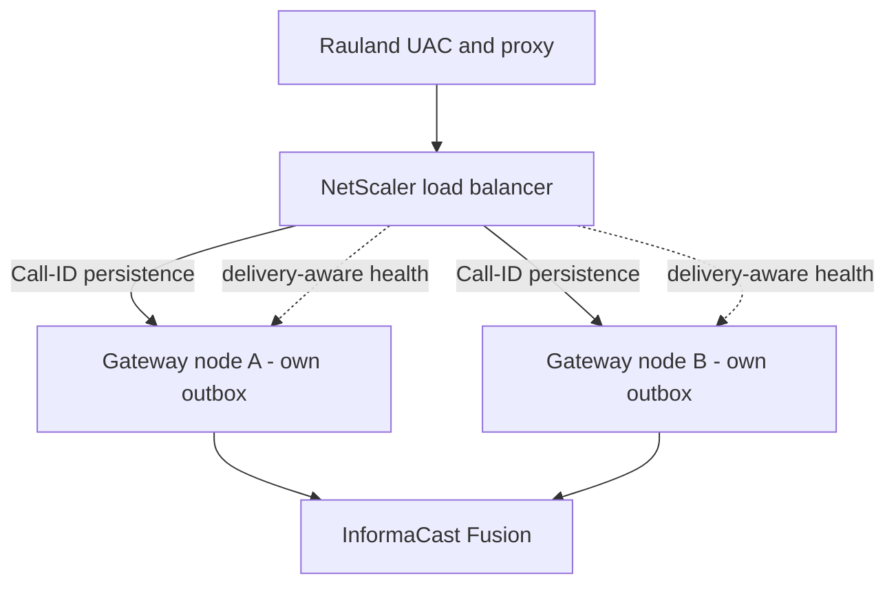

# Roadmap

> **Applies to:** RedEye sip2api Gateway production build `c23f3eb` (branch `main`, the v1.7 line = v1.6.5 + 6 commits), deployed on host `sip2apibridge`.
>
> This section describes **direction, not dated commitments**. It states what has already shipped (so the roadmap is read against an honest baseline), then the concrete open work that remains, then the upstream asks we are pursuing with our vendors. Anything listed here as planned is **not deployed today** — the current build is exactly what the rest of this manual documents.

---

## 1. What has already shipped (the reliability + observability program)

Most of the hard reliability and observability work is **done and in production**. It is easy, reading a roadmap, to assume everything below is still aspirational — it is not. The following all shipped across the **v1.6.x** line and are the deployed build today:

| Capability | What it does | Shipped |
|---|---|---|
| **Durable delivery** (transactional outbox) | Record-first `pending` row in SQLite WAL before any Fusion attempt; a background `DeliveryWorker` delivers with bounded retries + exponential backoff | v1.6.0 |
| **Escalation** | Permanent (`failed` / `expired`) pages post to a human alert channel | v1.6.0 |
| **Background OAuth token refresh** | Token refreshed proactively, off the critical path — a page never blocks on a token round-trip | v1.6.0 |
| **Async logging** | Non-blocking queue handler moves file writes / rotation / gzip off the event loop | v1.6.0 |
| **Real `/health` + watchdog** | Writer heartbeat backs `/health`; systemd `Type=notify` + `WatchdogSec` restarts a hung writer | v1.6.0 |
| **Config validation** | Fatal on invalid production config; loud warnings on soft issues; unknown-key typo warnings | v1.6.0 / v1.6.1 |
| **State-aware stats** | Dashboard stats derive from the delivery state machine and exclude test rows | v1.6.0 |
| **Canonical UTC timestamps** | RFC3339 `…Z` stamps in DB and all four log streams; UTC-sortable, string-matchable against Singlewire | v1.6.0 / v1.6.1 |
| **Two-service split** | Read-only dashboard is a separate process; it can be restarted without interrupting paging | v1.6.0 |
| **INVITE fingerprint + event_id** | Stable transaction fingerprint and persisted upstream `event_id` column | v1.6.0 / v1.6.1 / v1.6.3 |
| **Dashboard v2 core** | Date-picker log viewer, 90-day stacked call-type chart, `/call/{id}` correlated detail, per-call diagnostic bundle | v1.6.2 – v1.6.5 / v1.7 |
| **Fusion reachability + inbound-liveness on `/health`** | Optional Fusion-unreachable signal; last-inbound-SIP-age (Rauland reachability) card | v1.6.1 / v1.6.3 |
| **Enforcing dedupe** | Clinical duplicate suppression, signed off and enabled: window 2s, bed-level, purpose-keyed, record-first, fail-safe | v1.7 |
| **ACK-gated immediate-BYE** | Page fires immediately; gateway BYE deferred until the ACK confirms the dialog (closes the 481 race), with a lost-ACK fallback | v1.7 |

The single lost Code Blue of 2026-06-12 — a transient `httpx.ConnectTimeout` during an inline OAuth fetch, with no retry — is **prevented** by the durable outbox, bounded retries, and background token refresh above. See the **Reliability** section for the full account.

Everything from here down is what is **not** yet built.

---

## 2. Open work — the six tracked issues

These are the only open issues at build `c23f3eb`. Everything else in the reliability/observability program shipped in v1.6.x. They are listed roughly in the order they matter for a **single-node** deployment; the two availability items (#20, #19) are the near-term focus, the HA epic (#17) is the larger-horizon effort.

### #20 — OS auto-restart coordination *(near-term)*

**Problem.** On 2026-07-07 an `unattended-upgrades` / `needrestart` auto-restart bounced the paging service **uncoordinated**. No page was lost — the durable outbox and startup recovery covered it — but the restart landed at an arbitrary moment rather than during a drained, quiescent window.

**Direction.** Coordinate OS patching and automatic service restarts with the paging service so restarts happen in controlled windows, not whenever the package manager decides. This is an operational-safety item; the data-loss risk was already closed by durability. Interim mitigation (documented in **Operations**): scope `needrestart`/`unattended-upgrades` away from the paging unit and patch in a planned window.

### #19 — Zero-downtime writer restarts (systemd socket activation) *(near-term)*

**Problem.** A writer restart today drops a brief (~0.3 s) SIP window: while the process is down, inbound UDP datagrams to `:5060` have no listener.

**Direction.** Move the SIP listening socket to **systemd socket activation**, so the socket is owned by systemd and **survives** a writer restart. Datagrams that arrive during the swap are buffered by the kernel and handed to the new process, so a planned (or unplanned) writer restart no longer drops a packet. This is the clean fix underneath #20 — with it, coordinated restarts become genuinely seamless.

### #17 — High-availability epic (NetScaler active/active) *(larger horizon)*

**Problem.** The gateway runs on a **single host**. Durability protects against process crashes and transient failures, but **not against loss of the host itself** (hardware, network partition, long OS outage). While the node is down, no pages are delivered.

**Direction — a shared-nothing, active/active pair behind the site NetScaler:**

- **Two autonomous durable nodes.** Each node is a complete, self-sufficient gateway (its own outbox, its own delivery worker) — no shared database, no shared state, nothing for one node to wait on. Either node can deliver any page on its own.
- **One call → one host, via Call-ID persistence.** The NetScaler pins each SIP dialog to a single node by **Call-ID**, so the INVITE / ACK / BYE of one call all land on the same gateway and the SIP state machine stays coherent.
- **Delivery-aware `/health` monitor.** The load balancer health check reflects real **delivery** health (not just "the web server answered"), so a node that can accept SIP but cannot reach Fusion is taken out of rotation. This is why the `health.fail_on_fusion_unreachable` foot-gun exists and ships **OFF** today — it is built for this topology, where there is a second node to fail over to.
- **Failover without failback.** On failover, traffic moves to the healthy node and **stays** there until an operator deliberately returns it — no automatic flapping back to a node that just proved unreliable.

**Prerequisites already in place.** Two design decisions in the shipped build exist specifically to enable this epic: the persisted upstream **`event_id`** (the cross-node merge key that lets two nodes recognize the same clinical event), and the **shared-nothing** node design (each node's outbox is already fully independent). #17 builds on those; it does not require rearchitecting them.

### #13 — Dashboard-v2 remaining phases *(incremental)*

The dashboard-v2 **core** shipped (date-picker log viewer, 90-day stacked call-type chart, `/call/{id}` correlated detail view, per-call diagnostic bundle, verify-lookups). The remaining phases are the incremental tail of that epic — further correlation, filtering, and reporting refinements. Dashboard-only work: it deploys by restarting **only** `sipgw-dashboard.service`, with zero SIP-path impact.

### #5 — Dedupe tail *(cleanup)*

Enforcing clinical duplicate suppression **shipped** (signed off, enabled in production: 2 s window, bed-level, purpose-keyed, record-first, fail-safe toward delivery). The **#5 tail** is follow-up hardening and telemetry on top of the live feature — e.g. tightening the event-id keying and continued monitoring of the suppress/deliver split — not the core capability, which is done.

### #11 — Logging-hygiene tail *(cleanup)*

The load-bearing logging-hygiene work **shipped**: full `client_id` / `client_secret` / bearer-token redaction, UTC RFC3339 stamps across all four streams, the ACK-gated / spec-correct BYE. The **#11 tail** is the residual cleanup on top — minor formatter and log-content polish, no behavior change to the call path.

---

## 3. Upstream asks (dependencies on our vendors)

Two items are **not ours to build** — they depend on Singlewire and Rauland. We are pursuing both; neither blocks the current build, which already compensates for both defensively.

### Singlewire — idempotency key on the scenario trigger

**Ask.** An **idempotency key** on the InformaCast Fusion scenario-trigger API, so a retried POST that Fusion actually received (but whose response we lost) cannot fan out a **second** overhead page.

**Why.** Our delivery model is deliberately **at-least-once** ("duplicate OK, missed never"), so on an ambiguous failure we retry — and a retry can produce a duplicate page. A server-side idempotency key would let Fusion collapse a retried-but-already-accepted request, giving us *effectively-once* delivery **without** ever weakening the retry that guarantees we never miss a page. Until Singlewire offers this, our own record-first + clinical dedupe reduce (but cannot fully eliminate) duplicate fan-out on retry.

### Rauland — duplicate-origination investigation

**Ask.** Investigation of why the Rauland source **double-emits** — roughly one in three events arrives as **two** INVITEs — and, ideally, a fix at origin.

**Why.** We already suppress these downstream (enforcing dedupe, 2 s window, event-id keyed). That is robust, but it is a **compensating control**: it collapses duplicates *after* they cross the wire. Fixing the double-emission at the Rauland origin would remove the duplicate class entirely and reduce the load our dedupe path carries. Our suppression stays in place regardless — it is fail-safe and clinically signed off — so this ask is an improvement at the source, not a dependency for correct operation.

---

## 4. Guiding principles (how the roadmap is prioritized)

Every item above is weighed against the product's one non-negotiable rule:

> **It is acceptable to deliver a page twice. It is never acceptable to miss one.**

That ordering explains the roadmap's shape: durability and delivery guarantees shipped **first** (a missed page is the unacceptable failure), availability of the node (#20, #19, #17) comes next (a down node delays but — thanks to durability — does not silently lose pages), and the duplicate-reduction asks (Singlewire idempotency, Rauland origination) come as *refinements* — because a duplicate is the tolerable side of that trade, never the dangerous one. No roadmap item will be accepted if it trades away the "never miss" guarantee to reduce duplicates.

---

*See the **Reliability** section for the delivery guarantees and known limitations these roadmap items address, and the **Architecture** and **Operations** sections for the current single-node build the roadmap builds upon.*
