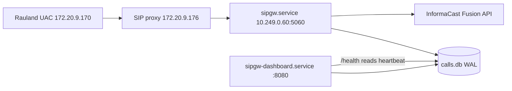

# Troubleshooting Guide

This guide is symptom-first. Find the symptom, read the likely cause, apply the
resolution. Everything here describes the **current production build**
(`c23f3eb`, the v1.7 line) as deployed on host `sip2apibridge`. Where behavior
changed from earlier builds, the change is called out so you are not chasing a
bug that a current release already fixed.

Two facts frame almost every diagnosis:

1. **The paging path and the dashboard are two independent services.** A dead or
   blank dashboard does **not** mean paging is down, and restarting the
   dashboard never interrupts a page. See [Service map](#service-map).
2. **A page is durably recorded before it is delivered.** Once the SIP INVITE is
   accepted, the call is written to SQLite (WAL) as `state='pending'` and then
   delivered by a background worker with bounded retries. A transient Fusion
   failure no longer loses the page — it retries, and if it can never be
   delivered it **escalates** to a human channel. See [Page did not
   arrive](#symptom-a-page-was-expected-but-did-not-come-over-the-overhead).

---

## Service map

| Service | Type | What it does | Restart impact |
|---|---|---|---|
| `sipgw.service` | `Type=notify`, `WatchdogSec=30` | SIP ingress + parse + TTS + durable delivery (the call path) | Restarting this **interrupts paging** briefly. Coordinate. |
| `sipgw-dashboard.service` | `Type=simple` | Read-only web UI on `:8080` (`dashboard_app.py`) | Safe to restart any time. Does **not** touch paging. |

Both processes open the **same** SQLite database at `/var/lib/sipgw/calls.db`
(WAL mode). The writer (`sipgw.service`) stamps a heartbeat row; the dashboard
reads it to answer `/health`. This is why `/health` can report the *writer's*
liveness even though it is served by the *dashboard* process.



### Where to look — files and ports

| Thing | Location |
|---|---|
| Install root | `/opt/sipgw` |
| Virtualenv | `/opt/sipgw/venv` |
| Database (WAL) | `/var/lib/sipgw/calls.db` |
| Logs | `/var/log/sipgw/` |
| Main service log | `/var/log/sipgw/sipgw.log` |
| Fusion/API debug (full HTTP) | `/var/log/sipgw/sipgw_api_debug.log` |
| SIP wire debug | `/var/log/sipgw/sipgw_sip_debug.log` |
| Dashboard log | `/var/log/sipgw/sipgw_dashboard.log` |
| SIP port | `5060/udp` **and** `5060/tcp` |
| Dashboard port | `8080/tcp` |
| Health endpoint | `http://10.249.0.60:8080/health` |

Log retention is **90 days**. All timestamps are **UTC** (the host clock is
`Etc/UTC`; note `logging.timezone: America/New_York` is declared in config but is
**not** applied — do not expect Eastern time in the log files).

### First-response triage (run these three)

```bash
# 1. Are both services up?
systemctl status sipgw.service sipgw-dashboard.service --no-pager

# 2. Is the writer alive and is Rauland reaching us? (JSON)
curl -s http://10.249.0.60:8080/health | python3 -m json.tool

# 3. What has the call path logged in the last few minutes?
tail -n 100 /var/log/sipgw/sipgw.log
```

---

## Symptom: a page was expected but did not come over the overhead

This is the highest-stakes symptom. Work it in this order; the goal is to find
**which stage** the event reached: never arrived (SIP), arrived but rejected
(allowlist / parse), or arrived and is stuck/failed in delivery (Fusion).

### Step 1 — Did the call reach the gateway at all?

Open the dashboard call table (`http://10.249.0.60:8080/`) or query the DB. If
there is **no row** for the expected time, the INVITE never reached us or was
rejected before it was recorded. Go to [No calls appearing at
all](#symptom-no-calls-appearing-at-all-dashboard-table-empty-or-not-growing).

If there **is** a row, click the timestamp to open the **`/call/{id}` detail
view**. That page correlates, for this one call, the SIP wire block, the main
service log lines, and the Fusion API exchange. It is the fastest way to see
where the event stopped.

### Step 2 — Read the call's delivery state

Every recorded call carries a `state`. The states you will see:

| `state` | Meaning | What it tells you |
|---|---|---|
| `pending` | Recorded, not yet delivered (or between retry attempts) | Delivery is in flight or waiting on a backoff cooldown. Momentary is normal. |
| `delivering` | A delivery attempt is in progress right now | Transient. If a row is stuck here after a crash, startup recovery returns it to `pending`. |
| `delivered` | Fusion returned 2xx — the page fired | Success. |
| `failed` | Retries exhausted (`max_attempts`) — permanently not delivered | **Escalation fired.** See [Fusion errors](#symptom-fusion-rejects-or-cannot-be-reached-4xx-5xx-401-connect-timeout). |
| `expired` | Undelivered past `max_age_seconds` and given up | **Escalation fired.** The page was too old to still be clinically useful. |
| `legacy` | Row predates the durable-delivery state machine | Classified by its `fusion_status`, not by state. Old rows only. |
| `duplicate` | Recorded but suppressed by clinical dedupe | **Not seen in production today** — clinical dedupe ships inert. See [Duplicate pages](#symptom-the-same-code-blue-paged-twice-duplicate-overhead-announcements). |

> **Important — "retrying" is a behavior, not a stored state.** When an attempt
> fails retryably, the worker records the error and returns the row to
> **`pending`**, then holds an in-memory cooldown before the next attempt. So a
> call that is mid-retry shows `state='pending'` with a non-empty `last_error`
> and `attempts > 0`. Do not expect a literal `retrying` value in the DB.

Quick DB reads (read-only; safe while the service runs):

```bash
# State breakdown of recent, real (non-test) calls
sqlite3 /var/lib/sipgw/calls.db \
  "SELECT state, COUNT(*) FROM calls WHERE is_test=0 GROUP BY state;"

# Anything not yet delivered, newest first
sqlite3 -header -column /var/lib/sipgw/calls.db \
  "SELECT id, datetime(created_at,'unixepoch') AS created_utc, state, attempts, \
          fusion_status, substr(last_error,1,60) AS last_error \
   FROM calls WHERE state IN ('pending','delivering','failed','expired') \
   ORDER BY created_at DESC LIMIT 20;"
```

### Step 3 — Interpret and act

- **`state='delivered'` but staff say they heard nothing.** The gateway did its
  job — Fusion accepted the notification (2xx). The problem is downstream of
  this gateway: InformaCast scenario/audience configuration, speaker zones, or
  volume. Confirm the TTS text was correct on the `/call/{id}` view, then hand
  off to the InformaCast/overhead side. (If the TTS text is wrong, see [Wrong
  or garbled TTS](#symptom-the-page-played-but-said-the-wrong-thing-wrong-tts).)

- **`state='pending'` and it is not moving.** Either delivery is actively
  retrying (check `last_error`/`attempts`) or the delivery worker is not
  running. Confirm the worker started:

  ```bash
  grep "delivery worker started" /var/log/sipgw/sipgw.log | tail -1
  grep -E "call [0-9]+ (DELIVERED|retry|FAILED|EXPIRED)" /var/log/sipgw/sipgw.log | tail -20
  ```

  A healthy retry looks like:
  `call 4213 retry #2 in 4.0s (status 503, Retry-After=4)`.
  If you see repeated retries, this is Fusion-side — go to [Fusion
  errors](#symptom-fusion-rejects-or-cannot-be-reached-4xx-5xx-401-connect-timeout).

- **`state='failed'` or `state='expired'`.** The page was **not** delivered and
  the system **escalated** (posted to the configured escalation channel, or —
  if no channel is configured — logged a loud `ESCALATION` line). This is the
  designed loud-failure path, not a silent loss. Grep the escalation trail:

  ```bash
  grep -E "ESCALATION|call [0-9]+ (FAILED|EXPIRED)" /var/log/sipgw/sipgw.log | tail -20
  ```

  Then treat the underlying cause as a Fusion problem (below), fix it, and note
  that expired/failed pages are **not** auto-resent — the clinical event is over.

### The June 2026 loss is now prevented

On **2026-06-12** a Code Blue was lost to a transient `httpx.ConnectTimeout`
during an **inline** OAuth token fetch (recorded as `fusion_status=-1`, with no
retry). That failure mode is now structurally prevented in this build:

- **Durable outbox + bounded retries** — a connect timeout returns
  `status=-1`, the worker reschedules with backoff instead of dropping the page,
  and escalates only after `max_attempts`.
- **Background OAuth token refresh** — the token is renewed off the critical
  path (`webhook.py` refresh loop), so a page almost never blocks on a fresh
  token fetch in the first place.

If you ever see a **modern** row at `fusion_status=-1` that is *not* retrying,
that is a real incident — capture the diagnostic bundle (below) and escalate.

### Capture a diagnostic bundle for any hard case

Every call detail page offers a **plain-text diagnostic bundle**:

```
http://10.249.0.60:8080/call/<id>/bundle.txt
```

It assembles, for that one call, the correlated SIP block, main-log lines, and
Fusion API exchange into copy/paste text for a ticket. Grab this before you
restart anything — it is the single best artifact for RedEye support.

---

## Symptom: no calls appearing at all (dashboard table empty or not growing)

No new rows for a stretch where you expected activity. The question is whether
**Rauland is reaching us** or **our services are down**. Do not assume a dead
gateway — a genuinely quiet period looks identical in the table.

### Step 1 — Check inbound liveness on `/health`

```bash
curl -s http://10.249.0.60:8080/health | python3 -m json.tool
```

Look at `last_inbound_sip_age_s` — the seconds since the **last allowlisted SIP
datagram from Rauland** was seen. This is your Rauland-reachability signal.

- **Small / recently updated age** → Rauland *is* reaching the gateway. A quiet
  table just means no clinical events fired. This is normal and not a fault.
- **Large / growing age** (hours where you expected traffic) → the upstream SIP
  path is the suspect: Rauland UAC `172.20.9.170`, the proxy `172.20.9.176`,
  network/VLAN, or the far side simply not emitting. Escalate to the Rauland /
  network side.
- **Field is `null`** → no allowlisted inbound SIP has been seen since the last
  writer start. Combined with a fresh service start, that is expected; combined
  with a long-running service, it points to an upstream break.

> `last_inbound_sip_age_s` is **informational** — it never changes the `/health`
> status code. A long quiet Rauland stretch must not make an external monitor
> think the node is unhealthy, so a silent Rauland does **not** return 503.
> Optionally, silence-escalation can be enabled
> (`health.inbound_escalate_after_seconds > 0`) to alert a human once per
> silence episode; it is **off by default**.

### Step 2 — Confirm the services are actually up

```bash
systemctl status sipgw.service --no-pager
systemctl is-active sipgw.service sipgw-dashboard.service
```

If `/health` itself returns **503**:

| `/health` body | Meaning | Action |
|---|---|---|
| `{"status":"no-heartbeat"}` | The writer has never stamped a heartbeat | `sipgw.service` is not running or failed at startup. `systemctl status`, check `sipgw.log`. |
| `{"status":"stale","heartbeat_age_s":N}` | Writer heartbeat is older than the stale bound (~30s) | The call-path process is hung or dead. This is a real paging outage — restart `sipgw.service` and investigate the hang. |
| `{"status":"fusion-unreachable"}` | (Only if opt-in fusion-degrade is enabled) heartbeat is fine but Fusion probe is failing | Paging ingress is fine; Fusion is unreachable. Go to [Fusion errors](#symptom-fusion-rejects-or-cannot-be-reached-4xx-5xx-401-connect-timeout). |

### Step 3 — Watch the SIP wire

If liveness is stale but you believe Rauland is sending, watch the SIP debug log
live while a test is placed:

```bash
tail -f /var/log/sipgw/sipgw_sip_debug.log
```

You should see `INVITE fingerprint=... call_id=... from=<ip>:<port>` lines as
INVITEs land. If nothing appears here even though the far side claims to be
sending, the traffic is not reaching the socket — suspect network/firewall/VLAN
between the proxy and `10.249.0.60:5060`.

> **Firewall note.** There is currently **no host firewall** (nftables is empty)
> on `sip2apibridge`. Ingress protection relies entirely on the application
> **allowlist** (`172.16.0.0/12, 127.0.0.0/8, 10.0.0.0/8`). This means a missing
> `/health` or blank table is *not* caused by a host firewall rule — but it also
> means adding nftables for `:5060`/`:8080` is a recommended hardening step (and
> the dashboard has no authentication). See the Security section of this manual.

---

## Symptom: SIP requests are rejected with 403 Forbidden

The gateway answered the far side with **`403 Forbidden`** and the log shows:

```
Rejected INVITE from unauthorized IP 203.0.113.9
```

**Cause.** The source IP is **not** inside the SIP allowlist
(`sip.allowed_networks` = `172.16.0.0/12, 127.0.0.0/8, 10.0.0.0/8`). Every
request from outside those ranges is rejected *before* it is parsed or recorded,
and the source clock (inbound-liveness) is **not** reset by it — so internet
scan noise on UDP 5060 cannot mask a real Rauland outage.

**Resolution.**

- If the rejected IP is **internet noise / a scanner**, this is working as
  intended. No action beyond the recommended nftables hardening.
- If the rejected IP is a **legitimate Rauland/proxy source** that changed
  (re-IP, new proxy, added leg), add its network to `sip.allowed_networks` in
  `config.yaml` and restart `sipgw.service`. Confirm the current expected path is
  `172.20.9.170 → 172.20.9.176 → gateway`.

```bash
# Who is being rejected, and how often?
grep "Rejected" /var/log/sipgw/sipgw.log | tail -30
```

---

## Symptom: SIP 481 Call/Transaction Does Not Exist

**This should no longer occur in the current build.** The old race — the gateway
sending BYE before the caller's ACK, drawing a `481` — is fixed. In
immediate-BYE mode the gateway now **waits for the ACK** before sending BYE
(`sip_server.py`, ACK-gated teardown), guaranteeing `INVITE → 200 OK → ACK →
BYE` ordering. A lost ACK is covered by a per-call fallback timer that tears the
dialog down cleanly instead of racing.

Critically, **the page never depends on ACK/BYE/teardown** — the durable page is
recorded when the INVITE is answered, so even a messy teardown cannot cost you a
page.

**If you still see 481 in the wire log:** you are almost certainly looking at
historical lines, or a peer is sending BYE/requests for a dialog the gateway
already tore down (benign). Confirm the timestamp and confirm you are on build
`c23f3eb`+. If a *new* 481 correlates with a *missing page*, capture the
diagnostic bundle and escalate — that would be a regression.

```bash
grep -i "481\|awaiting ACK\|ACK-timeout fallback" /var/log/sipgw/sipgw_sip_debug.log | tail -20
```

---

## Symptom: the same Code Blue paged twice (duplicate overhead announcements)

Rauland is known to emit **two INVITEs per event** for roughly a third of
events. There are **two different** de-duplication mechanisms in this codebase,
and only one of them is active in production today. Getting this distinction
right is essential to a correct diagnosis.

### What IS active: SIP transaction de-duplication (re-INVITE handling)

If the second INVITE is a **retransmit of the same SIP dialog** — same
`Call-ID` — the gateway recognizes it as a **re-INVITE**, simply re-sends the
`200 OK`, and does **not** fire a second page. The `on_call` page callback is
invoked only for the first INVITE of a Call-ID. Every INVITE (including
retransmits) still gets a `#15` **correlation fingerprint** line for audit:

```
INVITE fingerprint=v1:abcd1234 call_id=... from=172.20.9.170:5060
Re-INVITE for existing call <call_id>
```

So: **true SIP retransmits do not double-page.**

### What is NOT active: clinical dedupe (`dedupe.py`)

Clinical dedupe collapses two INVITEs that are the *same clinical event but
different SIP dialogs* (different Call-IDs), keyed on the normalized clinical
identity `(area, room, bed, purpose)`. **In the current production build this
ships inert / shadow-disabled:**

- `dedupe.enforce: false` and `dedupe.window_seconds: 0` — with these shipped
  defaults `evaluate()` does not even query the database and **never** suppresses
  a page.
- Setting `enforce: true` is a **fatal config error** (fail-fast validation
  refuses it) because suppression requires clinical sign-off.

**Consequence to state plainly:** if Rauland double-emits an event as **two
separate SIP dialogs** (two Call-IDs), the current build **will page twice** —
that is expected behavior today, not a bug. The clinical-dedupe machinery is
present and can run in *shadow* mode (`window_seconds > 0`, `enforce` still
`false`) to *measure* duplicates — it logs `WOULD suppress ...` and delivers
anyway — but it does not drop pages.

```bash
# Shadow evidence (only present if a shadow window was enabled for measurement)
grep "WOULD suppress" /var/log/sipgw/sipgw.log | tail -20

# Confirm the deployed dedupe posture
grep -A3 "^dedupe:" /opt/sipgw/config.yaml
```

### Resolution / tuning

- If duplicate pages are true **SIP retransmits** (same Call-ID) and you *still*
  see two pages, that is a real defect — capture bundles for both call rows and
  escalate.
- If duplicates are **distinct dialogs** (two Call-IDs for one event), collapsing
  them requires enabling enforcing clinical dedupe, which is a **clinical
  decision** (a legitimate second same-bed page within the window would also be
  suppressed) and is currently out of policy. Until then, the double-page is
  expected. Tuning parameters, when clinically approved, are `window_seconds`
  (how close in time), `match_bed`, and `match_purpose` (RRT vs Code Blue never
  merge regardless).

> Note: the `state='duplicate'` value and the `duplicate_of` column exist in the
> schema for the enforcing path, but because enforcement is off, **you will not
> see `duplicate` rows in production**.

---

## Symptom: Fusion rejects or cannot be reached (4xx / 5xx / 401 / connect timeout)

The gateway accepted the SIP call and recorded the page, but delivery to
InformaCast Fusion is failing. All of this surfaces in **`state`**,
**`fusion_status`**, **`last_error`**, and the **`sipgw_api_debug.log`** (which
logs the full HTTP exchange, with `client_id`/`client_secret`/tokens masked).

| Symptom / status | Cause | What the build does | Your action |
|---|---|---|---|
| **401 Unauthorized** | Access token expired or rejected | The client **clears the token cache and retries once** automatically. Background refresh normally prevents this. | Persistent 401s → the Fusion **credentials** (`<CLIENT_ID>`/`<CLIENT_SECRET>`) or `audience` are wrong/revoked. Verify in config; check token-exchange lines in api_debug. |
| **4xx (e.g. 400/403/404)** | Bad request, wrong scenario/field/audience ID, or Fusion-side permission | Non-2xx → counts as a failed attempt; worker **retries with backoff** up to `max_attempts`, then `failed` + escalate. | Check `scenario_id`, `variable_name`/`scenario_field_id`, `audience`, `base_url` against Fusion. Read the response body in api_debug. |
| **5xx (500/502/503)** | Fusion transient/server-side outage | **Retries with exponential backoff**; honors a numeric `Retry-After` (delta-seconds) when present. | Usually self-heals. If sustained, Fusion is down — the page will `expire` and escalate if the outage outlasts `max_age_seconds`. |
| **`fusion_status=-1`** | Client-side exception (e.g. `ConnectTimeout`, DNS, TLS) — no HTTP response | Treated as a retryable failure and **rescheduled** (this is exactly the 2026-06-12 failure mode, now retried instead of dropped). | Check network path to `api.icmobile.singlewire.com`, DNS, and TLS. Inspect the exception in api_debug. |

Log recipes:

```bash
# Every Fusion delivery outcome from the call path
grep -E "Fusion webhook (response|retry|error)" /var/log/sipgw/sipgw.log | tail -30

# 401 auto-retry trail
grep -i "Got 401" /var/log/sipgw/sipgw_api_debug.log | tail

# Full, masked HTTP exchanges (token exchange + scenario trigger)
tail -n 200 /var/log/sipgw/sipgw_api_debug.log
```

### Is Fusion reachable at all right now?

`/health` carries **informational** Fusion fields from a periodic **read-only**
reachability probe (a short GET of the scenario definition — it never triggers a
page):

```bash
curl -s http://10.249.0.60:8080/health | python3 -m json.tool
# fusion_reachable: true|false|null   fusion_detail: "HTTP 200" | "<exc>"
# fusion_checked_age_s: seconds since the probe ran
```

By default a failing probe **does not** flip `/health` to 503 (a Fusion blip must
not make an external monitor pull the only node). If the opt-in
`health.fail_on_fusion_unreachable` is enabled, a **fresh** `false` probe returns
`{"status":"fusion-unreachable"}` — but only *after* the writer-heartbeat gate
passes, so a dead writer is never mislabeled as a Fusion problem.

---

## Symptom: the page played but said the wrong thing (wrong TTS)

Fusion delivered (`state='delivered'`) but the spoken announcement named the
wrong area/room or the wrong code type.

**Cause.** The TTS string is built from the SIP INVITE fields resolved through
`lookups.yaml`:

- **Area** — `areas` map (with `default_area` = `Unknown Area.` when unmatched).
- **Room** — resolved in priority order: `area_rooms` combo override
  (`"<area>*<room>"`) → `rooms` room-only map → `default_room_format`
  (`Room {room}.`). The combo override exists precisely because the same room
  number can mean different rooms in different areas.
- **Purpose** — `call_purposes` keyword match on the SIP **display name**
  (e.g. `Blue → Code Blue`, `RRT → Rapid Response Team`), else `default_purpose`.

Common failure shapes:

| You hear | Likely cause | Fix |
|---|---|---|
| "Unknown Area" | Area ID has no `areas` entry | Add the area to `lookups.yaml`. |
| "Room 2201" instead of a name | No `rooms`/`area_rooms` mapping for that room | Add the mapping (use `area_rooms` if the number collides across areas). |
| Wrong / generic code ("Code") | Display name didn't match a `call_purposes` keyword | Add/adjust the keyword. Check the actual display name in the SIP block on `/call/{id}`. |
| Right name, wrong room | An `area_rooms` combo override is masking (or missing) | Reconcile the combo key `"<area>*<room>"`. |

**`lookups.yaml` reloads without a restart.** The gateway watches the file's
mtime and reloads on change — no service bounce needed. A malformed edit is
**not** applied destructively: on a load error the previous good table is kept
and the failure is logged.

**Validate before trusting an edit** using the dashboard's built-in checker:

- Click **"Verify lookups.yaml"** on the dashboard, or hit `GET /api/verify-lookups`.
- Confirm the correct area/room in the `/call/{id}` detail view, which shows the
  raw SIP fields next to the resolved TTS.

```bash
# Confirm the reload actually happened after you saved the file
grep -E "lookups.yaml changed|Loaded .* area" /var/log/sipgw/sipgw.log | tail
```

---

## Symptom: the dashboard is blank, won't load, or `/health` won't answer

**First, confirm this is a *dashboard* problem, not a paging problem.** They are
separate services. Paging can be perfectly healthy while the dashboard is down.

```bash
systemctl status sipgw-dashboard.service --no-pager
curl -sI http://10.249.0.60:8080/            # dashboard root
tail -n 50 /var/log/sipgw/sipgw_dashboard.log
```

| Symptom | Cause | Resolution |
|---|---|---|
| Connection refused on `:8080` | Dashboard service down | `systemctl restart sipgw-dashboard.service` — **safe, does not interrupt paging.** |
| Page loads but table empty | No non-test calls in range, or DB read issue | Check the date filter; confirm `calls.db` is readable; check dashboard log. Remember **test rows are hidden** by design. |
| `/health` 503 but dashboard HTML loads | Dashboard is up; the **writer** heartbeat is stale/absent | This is a **paging** problem surfaced by the dashboard — go to [No calls appearing](#symptom-no-calls-appearing-at-all-dashboard-table-empty-or-not-growing). Do **not** just restart the dashboard. |
| A recent test doesn't show | Test traffic is intentionally hidden | Test/dry-run calls are marked `is_test=1`, never fire a real page, and are excluded from the table and stats. This is correct. |

Because the dashboard is read-only and decoupled, when in doubt you can restart
it freely to clear a transient UI issue without any paging risk.

---

## Symptom: paging blipped after an unexpected service restart (the #20 pattern)

You see a short paging interruption that lines up with an OS/package activity
window rather than a crash or a deliberate restart.

**Cause.** On **2026-07-07**, an **unattended-upgrades / `needrestart`
auto-restart** bounced `sipgw.service` uncoordinated (tracked as issue **#20**,
remediated). An OS patch cycle decided a dependent library changed and restarted
the service on its own schedule — with no coordination with clinical timing.

**How to recognize it in the logs.** Look for a service stop/start that is
adjacent to apt/dpkg/needrestart activity and is *not* preceded by a crash trace
or an operator command:

```bash
# Service lifecycle around the event
journalctl -u sipgw.service --since "-1 day" --no-pager | grep -Ei "Stopped|Started|Stopping|Starting"

# Correlate with unattended-upgrades / needrestart
journalctl --since "-1 day" --no-pager | grep -Ei "unattended-upgrade|needrestart|dpkg|systemd.*sipgw"

# The clean shutdown/startup markers from the app itself
grep -E "delivery worker (started|stopped)|writer .*heartbeat" /var/log/sipgw/sipgw.log | tail
```

**Why it did not lose a page (usually).** Durability is designed to survive a
hard stop: pages are recorded before delivery, a graceful stop **drains** the
queue best-effort, and on the next startup **recovery** returns any
crash-orphaned `delivering` rows to `pending` so they are retried
(at-least-once). The risk is a page arriving in the exact restart window, which
is why coordination matters.

**Resolution / prevention.**

- Operationally: **coordinate OS patching** — do not let unattended-upgrades
  restart the paging service on its own. Schedule patch windows and drain first.
- The engineering fix is **roadmap #19** (zero-downtime writer restarts via
  systemd socket activation) and **#20** (OS auto-restart coordination). Both are
  in the Roadmap section, labeled planned — not yet in this build.

---

## Symptom: the watchdog restarted the service / `WatchdogSec` trips

`sipgw.service` runs `Type=notify` with `WatchdogSec=30`. If the process stops
sending its watchdog keepalive to systemd within the window, systemd restarts it.

**Cause.** The event loop stalled long enough that the watchdog notify
(`watchdog.py`) missed its deadline — typically a hang or a pathological block,
not a normal Fusion slowdown (delivery is off the SIP hot path).

**What to check.**

```bash
journalctl -u sipgw.service --no-pager | grep -Ei "watchdog|WATCHDOG|Killing|restart" | tail
grep -Ei "watchdog" /var/log/sipgw/sipgw.log | tail
```

If watchdog restarts recur, capture the logs around each restart and escalate to
RedEye — a recurring watchdog trip indicates a real stall to diagnose, not
something to paper over by widening `WatchdogSec`.

---

## Quick reference — grep cheat sheet

```bash
# --- Paging path (sipgw.log) ---
grep -E "call [0-9]+ (DELIVERED|retry|FAILED|EXPIRED)" /var/log/sipgw/sipgw.log
grep "ESCALATION" /var/log/sipgw/sipgw.log
grep "delivery worker started" /var/log/sipgw/sipgw.log
grep -E "Fusion webhook (response|retry|error)" /var/log/sipgw/sipgw.log
grep "Rejected" /var/log/sipgw/sipgw.log                 # 403 allowlist rejects
grep -E "lookups.yaml changed|Loaded .* area" /var/log/sipgw/sipgw.log

# --- SIP wire (sipgw_sip_debug.log) ---
grep "INVITE fingerprint=" /var/log/sipgw/sipgw_sip_debug.log
grep -i "481\|awaiting ACK\|ACK-timeout" /var/log/sipgw/sipgw_sip_debug.log

# --- Fusion/API (sipgw_api_debug.log; secrets masked) ---
grep -i "Got 401" /var/log/sipgw/sipgw_api_debug.log
tail -n 200 /var/log/sipgw/sipgw_api_debug.log

# --- Dashboard (sipgw_dashboard.log) ---
tail -n 50 /var/log/sipgw/sipgw_dashboard.log

# --- Health + state ---
curl -s http://10.249.0.60:8080/health | python3 -m json.tool
sqlite3 /var/lib/sipgw/calls.db \
  "SELECT state, COUNT(*) FROM calls WHERE is_test=0 GROUP BY state;"
```

## When to escalate to RedEye support

Open a ticket (attach the **`/call/{id}/bundle.txt`** diagnostic bundle) when:

- A **modern** call is `failed`/`expired`, or shows `fusion_status=-1` **without**
  retries, and staff report a missed page.
- A **true SIP retransmit** (same Call-ID) double-pages.
- A `481` correlates with a *missing* page (possible regression of the ACK-gated
  fix).
- Watchdog restarts recur, or you see uncoordinated auto-restarts (the #20
  pattern) affecting paging.
- `/health` is persistently `stale`/`no-heartbeat` and a restart does not clear
  it.

Always grab the bundle **before** restarting anything — it is the highest-value
artifact for diagnosis.
