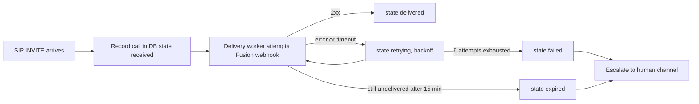
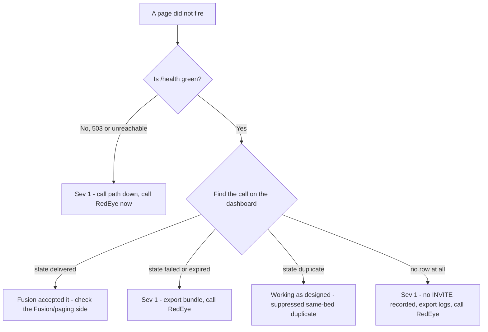

# FAQ & Support / Escalation

This section answers the questions RedEye support and Tift Regional staff ask most
often about the **RedEye sip2api Gateway** as it runs in production today
(build `c23f3eb`, the v1.7 line), then explains how to open a support case, how
severities are triaged, and — most importantly — **what to collect before you
call** so the first response is a fix and not a request for more data.

> **The one-line escalation rule:** if a real Code Blue or RRT did **not** result
> in an overhead page, treat it as **Severity 1** and contact RedEye immediately
> (see [Contacting RedEye Support](#contacting-redeye-support)). Grab the
> **per-call diagnostic bundle** on the way — it is one click and it is exactly
> what support needs.

---

## Frequently Asked Questions

### 1. We saw two identical pages (or two rows) for one event. Is something broken?

Almost certainly **not** — and in the current build you should rarely see a
duplicate *page* at all. Rauland emits **two SIP INVITEs for a single event**
(this is a source-side behavior, observed on roughly one third of events). The
gateway now runs **enforcing duplicate suppression** (`dedupe.py`): the second
INVITE that arrives within a **2-second window** for the **same bed and same
purpose** is recorded as a `duplicate` audit row and is **not** delivered a
second time. You will see the original page fire once and a `duplicate` row on
the dashboard pointing back at the original.

What is deliberately **not** suppressed:

- A re-page for the same room/bed **more than 2 seconds later** — that is treated
  as a legitimate new event and is **always delivered**.
- A different **bed** in the same room (two patients coding at once are never
  merged — `match_bed: true`).
- A different **purpose** (an RRT and a Code Blue never collapse into each other).

If you see two *delivered* pages seconds apart for the same bed, that is worth a
ticket. Two *rows* where one is marked `duplicate` is the system working as
designed. See [Q5](#5-what-do-the-call-states-mean-received-delivered-retrying-failed-expired-duplicate-legacy)
for the state column.

### 2. Why are the log and database timestamps in UTC, not Eastern time?

The **stored** call `timestamp` is canonical **UTC, RFC3339 milliseconds**
(`...Z`). The host clock (`sip2apibridge`) is set to `Etc/UTC`, and although the
config declares `logging.timezone: America/New_York`, that setting is **not
currently applied to the log files** — so the four log streams and the DB are
UTC. The **dashboard** renders wall-clock times for readability, but when you
read a raw log line or a diagnostic bundle, read it as UTC (Eastern is UTC minus
4 hours during daylight time, minus 5 in winter). This is called out here because
correlating a clinical timeline against the logs is the single most common source
of confusion — the log is not "an hour off," it is a different zone.

### 3. What happens now if Singlewire / InformaCast Fusion is unreachable when a page fires?

The page is **not lost.** This is the central reliability guarantee of the
current build and the direct fix for the 2026-06-12 incident
([Q10](#10-what-was-the-2026-06-12-incident-and-is-it-actually-fixed)). The flow is
**record-first**:

1. The call is written durably to the database (SQLite **WAL**) in state
   `received` **before any delivery is attempted**.
2. A background **delivery worker** (`delivery.py`) attempts the Fusion webhook.
   If Fusion is unreachable, returns an error, or times out, the worker
   **retries with exponential backoff** (starting ~2s, doubling to a 60s cap,
   honoring a `Retry-After` header if Fusion sends one).
3. Retries continue up to **6 attempts**. A page still undelivered after
   **15 minutes** is marked `expired`.
4. If a page ends in `failed` (attempts exhausted) or `expired`, the gateway
   **escalates** to a human alert channel (`escalation.py` → Teams/Slack/PagerDuty/NOC
   webhook), so a human is notified rather than the failure being silent.

Separately, the OAuth token is refreshed **in the background** (`webhook.py`),
~5 minutes before it expires, so a page never blocks on a token round-trip — the
exact failure mode that dropped the 2026-06-12 page.



### 4. Does a retry or an escalation mean a page was missed?

Not by itself. A `retrying` state means the first attempt did not succeed and the
worker is trying again — most transient blips deliver on a later attempt and end
as `delivered`. An **escalation** is different: it fires only when a page ended
`failed` or `expired`, meaning it was **not** delivered to Fusion after all
retries. An escalation is a **real signal** — treat it as Severity 1 and confirm
whether the clinical event still needs a manual overhead announcement.

### 5. What do the call "states" mean (received, delivered, retrying, failed, expired, duplicate, legacy)?

The `state` column tracks each call through the durable delivery pipeline:

| State       | Meaning                                                                 |
|-------------|-------------------------------------------------------------------------|
| `received`  | Recorded durably, delivery not yet completed (the record-first insert). |
| `retrying`  | An attempt failed; the worker is backing off and will try again.        |
| `delivered` | Fusion accepted the page (HTTP 2xx). **This is the success state.**     |
| `failed`    | All retry attempts exhausted without a 2xx. Escalated.                  |
| `expired`   | Still undelivered past the 15-minute age limit. Escalated.              |
| `duplicate` | Suppressed as a same-bed/same-purpose duplicate within the 2s window; points at the original via `duplicate_of`. Never delivered (by design). |
| `legacy`    | A row that predates the durable pipeline; migrated in place, no data loss. It was handled by the older best-effort path. |

A healthy day is almost entirely `delivered` (plus some `duplicate` rows from
Rauland's double-emit). Any `failed` or `expired` row warrants a look.

### 6. Can we change the TTS voice, the announcement wording, or the dedupe window?

- **Wording / repetition:** yes. The announcement is assembled from lookup tables
  plus `tts.message_preamble` (currently "Attention! Attention! ") and
  `tts.play_count` (currently 3 repeats) in `config.yaml`. Changing wording is a
  config edit plus a coordinated **writer restart**.
- **Voice:** the spoken voice is chosen by **InformaCast Fusion**, not by the
  gateway — the gateway sends text (the `customTTS` field). Voice changes are made
  on the Fusion side.
- **Dedupe window:** yes, `dedupe.window_seconds` (currently `2`) is configurable,
  as are `match_bed` and `match_purpose`. **Do not** widen this without clinical
  sign-off — a wider window risks suppressing a legitimate re-page. `validate_config`
  will warn loudly if the window is set inert (`<= 0`) or wide (`> 10s`).

All of the above are **config changes on the writer** and take effect on a
coordinated restart. RedEye should make dedupe/wording changes with you, not
around you.

### 7. How do we add a new area, unit, or room so it announces correctly?

Room/area/purpose text comes from the **lookup tables** (`lookups.yaml`) — this
maps the numbers Rauland sends into the human-readable location and call-type the
page speaks. Adding a unit or fixing a room name is a **lookups edit** followed by
a writer restart. The dashboard has a **Verify Lookups** view so you can confirm a
given area/room resolves the way you expect **before** it is needed in an
emergency. RedEye maintains lookups jointly with Tift telecom; send the
Rauland-side identifier and the exact spoken text you want and it will be added
and verified.

### 8. Is the dashboard password-protected?

**No.** The dashboard (`sipgw-dashboard.service` on port **8080**) currently has
**no authentication** and is **read-only**. It exposes call history, logs, and
diagnostics to anyone who can reach the port. Today the only protection is network
reach — and note the host currently has **no active firewall** (empty nftables),
so ingress relies on the application-level SIP allowlist, which does **not** cover
the dashboard port. **Recommendation:** restrict :8080 (and :5060) with nftables
and/or place the dashboard behind an authenticated reverse proxy. Treat the
dashboard URL as sensitive until that is in place. (Dashboard authentication is a
known gap, not a shipped feature.)

### 9. Can we restart the dashboard without interrupting paging? What about restarting the paging service?

**Restarting the dashboard is safe** and does **not** affect paging. The two are
**independent systemd services**:

- `sipgw.service` — the **call path** (SIP ingress, parsing, TTS, durable
  delivery). This is the life-safety service.
- `sipgw-dashboard.service` — the **read-only web UI**. It opens the database
  read-only and can be restarted, upgraded, or crash **without touching the paging
  path**.

So `sudo systemctl restart sipgw-dashboard` is a routine, no-page-impact
operation. Restarting `sipgw.service`, by contrast, is a **brief SIP blip**
(~0.3s) and should be **coordinated** — see [Q11](#11-a-patch-or-auto-restart-bounced-the-service-how-do-we-avoid-that).
Durability protects you across a writer restart (record-first plus crash
recovery re-queues anything in flight), but you still want to avoid restarting
during a known event.

### 10. What was the 2026-06-12 incident, and is it actually fixed?

**Yes, it is fixed.** On 2026-06-12 a Code Blue was **lost**: the page fired an
**inline OAuth token fetch** on the critical path, that fetch hit a transient
`httpx.ConnectTimeout`, the delivery recorded `fusion_status=-1`, and — in the old
best-effort design — **there was no retry**. The page silently did not go out.

The current build removes every leg of that failure:

- **Record-first durability:** the call is persisted **before** delivery, so a
  failure after recording cannot erase it.
- **Bounded retries with backoff:** a transient timeout is retried, not dropped.
- **Background token refresh:** the OAuth token is kept warm off the page path, so
  a page never blocks on — or fails because of — a token fetch.
- **Escalation:** if delivery genuinely cannot complete, a human is paged.

That specific incident's root cause is now structurally impossible to lose
silently.

### 11. A patch (or auto-restart) bounced the service. How do we avoid that?

On 2026-07-07, an **unattended-upgrades / needrestart auto-restart** bounced the
paging service **uncoordinated** (issue **#20**, since remediated). The lesson:
**coordinate OS patching** with paging, and prefer maintenance windows. The
durable design means an unplanned bounce does not lose recorded pages, but an
uncoordinated restart is still an availability risk during a live event.
Zero-downtime writer restarts via systemd socket activation (**#19**) are on the
roadmap; until then, patch on a schedule and confirm `/health` after any restart.

### 12. How do we know the Rauland link is actually up, versus just quiet?

Rauland only sends SIP on a **real event** — there are no keepalives — so a quiet
gateway could mean "no emergencies" **or** "the link is down." The gateway stamps
the time of the **last inbound SIP from an allowed network** and surfaces it as
**"Last inbound from Rauland"** on the dashboard and as `last_inbound_sip_age_s`
in `/health`. The card turns **amber** after ~5 days of silence. This is
**informational** — a normal quiet stretch does **not** flip `/health` to 503, and
optional silence-escalation is **off** by default. If the card is amber and you
expected traffic, that is worth investigating with RedEye.

### 13. What does `/health` actually check, and when does it go red (503)?

`/health` returns **503** only when the **writer heartbeat is stale** (the writer
stamps a heartbeat every 10s; `/health` goes stale after 30s) or missing — i.e.
the call-path process is not alive. It **additionally reports** (as informational
fields, **not** as 503 triggers by default) **Fusion reachability**, delivery
backlog, last delivered/failed, and the last-inbound-SIP age. By design a **Fusion
blip does not 503 the node** (that default protects a single node behind a monitor
from being pulled for a transient upstream hiccup). So: **red `/health` = the
pager process itself is in trouble** — that is a page-now condition.

### 14. Is any test traffic mixed into our stats or pages?

No. The gateway has a **safety layer** (`safety.py`): dry-run / test-mode traffic
is marked `is_test=1`, **never fires a real page**, and is **excluded** from
dashboard stats, charts, and the call table. When you read the dashboard you are
seeing real clinical traffic only.

---

## Support & Escalation

### Contacting RedEye Support

> **Contact details are environment-specific — fill these in for your deployment.**

| Channel                         | Detail                                    |
|---------------------------------|-------------------------------------------|
| Support email                   | `<REDEYE_SUPPORT_EMAIL>`                   |
| Support phone / on-call         | `<REDEYE_SUPPORT_PHONE>`                   |
| After-hours / Sev-1 escalation  | `<REDEYE_ONCALL_ESCALATION>`              |
| Ticket portal                   | `<REDEYE_TICKET_PORTAL_URL>`              |
| Escalation webhook (auto-alert) | configured in `escalation.webhook_url`    |
| Provider              | RedEye Network Solutions LLC, in conjunction with Claude Code |

For a **missed real page (Severity 1)**, use the phone / on-call path — do not wait
on email.

### Severity levels

| Severity | Definition | Examples | Target first response |
|----------|------------|----------|-----------------------|
| **Sev 1 — Critical** | A real Code Blue / RRT did not page, or the call path is down. Life-safety impact. | An escalation alert for a `failed`/`expired` page; a clinical event with no overhead page; `/health` red (heartbeat stale/missing); `sipgw.service` down. | `<SEV1_RESPONSE_TARGET>` (immediate / on-call) |
| **Sev 2 — Major** | Paging works but is degraded or at risk. | Repeated `retrying` then `delivered`; Fusion intermittently unreachable; dashboard down (paging unaffected); "Last inbound from Rauland" unexpectedly amber. | `<SEV2_RESPONSE_TARGET>` |
| **Sev 3 — Minor** | Cosmetic, informational, or config request. | Wrong room/area spoken text (lookups fix); wording/repetition change; a duplicate-row question. | `<SEV3_RESPONSE_TARGET>` |
| **Sev 4 — Request** | Planned change or enhancement. | Add a unit, adjust dedupe window (with sign-off), roadmap questions. | `<SEV4_RESPONSE_TARGET>` |

A **duplicate row** by itself is **not** an incident (see
[Q1](#1-we-saw-two-identical-pages-or-two-rows-for-one-event-is-something-broken)).
A **missed delivery** always is.

### What to collect first (before you call)

Collecting these three things up front turns most cases into a single round-trip.

1. **The per-call diagnostic bundle** — this is the single most useful artifact.
   On the dashboard, open the call (`/call/{id}`) and use **Export diagnostic
   bundle**, or fetch it directly:

   ```
   http://<dashboard-host>:8080/call/<CALL_ID>/bundle.txt
   ```

   The bundle is a plain-text, copy/paste-friendly file that correlates, for that
   one call:
   - the **call record** (id, timestamps, caller/display name, area/room, the
     exact `tts_string`, `fusion_status`, response time, **`state`**, `attempts`,
     `last_error`, `sip_call_id`, `event_id`);
   - the **SIP messages** joined by exact **Call-ID**;
   - the **application-log** lines referencing that Call-ID;
   - the best-match **Fusion API exchange** (marked provisional/heuristic).

   Attach the `.txt` to the ticket verbatim. It contains no secrets (credentials
   are never logged), so it is safe to send.

2. **The As-Built / host inventory** — the deployment facts for `sip2apibridge`
   (host, IPs, ports, paths, Fusion scenario/audience, allowlist). This lets
   support reason about your specific environment without a discovery round-trip.
   Reference: `<AS_BUILT_DOC_LOCATION>`.

3. **The relevant log window** — from `/var/log/sipgw`, the slice around the
   event, remembering the logs are **UTC**
   ([Q2](#2-why-are-the-log-and-database-timestamps-in-utc-not-eastern-time)).
   There are **four streams**:
   - `sipgw.log` — main application log (start here);
   - `sipgw_sip_debug.log` — raw SIP messages;
   - `sipgw_api_debug.log` — Fusion API exchange;
   - `sipgw_dashboard.log` — dashboard process (only for dashboard issues).

   The dashboard's **date-picker log viewer** can pull the right day directly if
   you cannot reach the host.

Also state, in one line: **the clinical time of the event** (wall clock),
**what was expected** (e.g. "Code Blue, 3 West, room 312"), and **what happened**
(no page / wrong text / late page).

### What to expect

- **Sev 1:** immediate triage on the on-call path. Support will confirm the call
  path is alive (`/health`), locate the call by `state`, determine whether it was
  `failed`/`expired`/never-recorded, and advise whether a manual overhead
  announcement is needed **now** while the root cause is worked.
- **Sev 2–4:** worked to the response target above. Config/lookups changes are
  applied by RedEye **with** Tift telecom and, for dedupe or wording, only with
  the appropriate sign-off, on a coordinated writer restart.

### Quick self-triage before escalating



For anything in a red box, grab the **diagnostic bundle** and the **log window**
first, then escalate — you will have handed support everything it needs.
